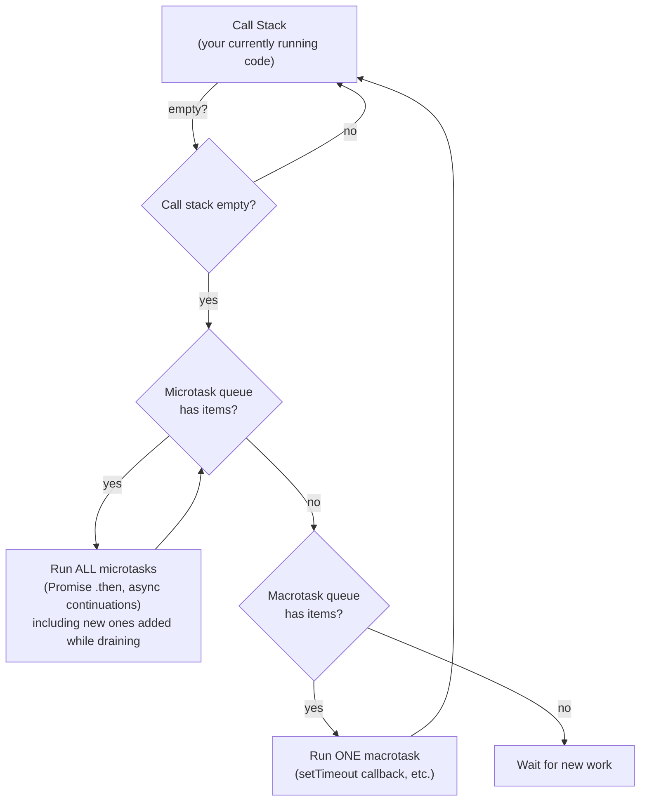
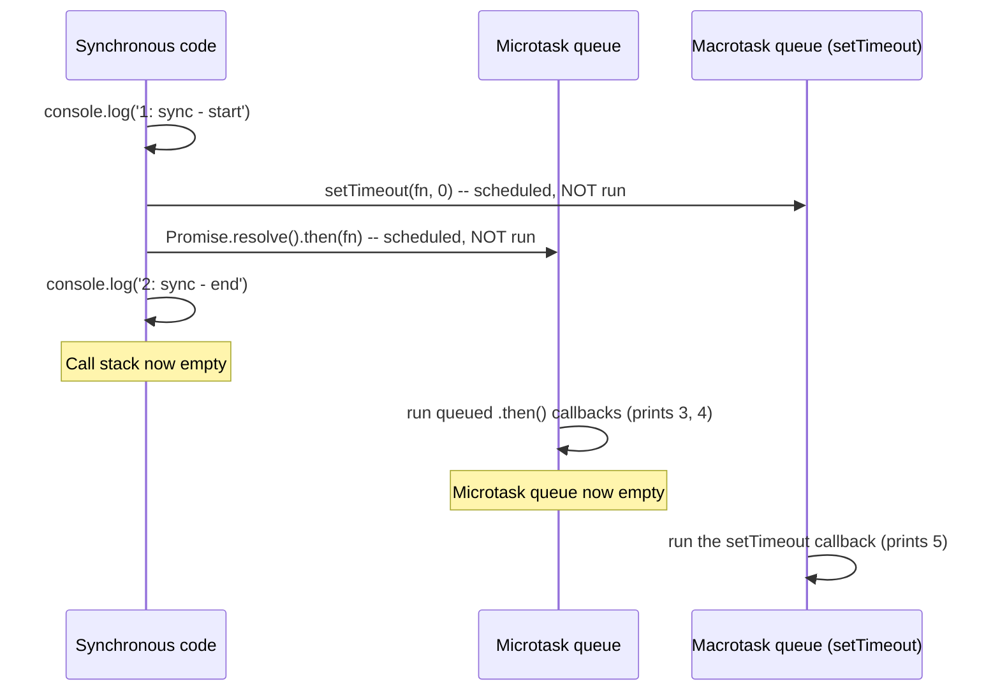

# JavaScript Fundamentals: Variables, Functions, Objects, Closures, and Asynchrony

> **Topic register:** F-002, new "Web & Language Fundamentals" section (D-F0) of `00-project/frontend-topic-register.md` · Beginner tier — a true entry point, prerequisite to everything else in this domain.
> **Scope note:** a 2026-09-08 audit found that this domain's existing "Beginner tier" chapters — including [`react-fundamentals-jsx-components-props-and-state.md`](react-fundamentals-jsx-components-props-and-state.md), which teaches `useState`, event handlers, `&&` for conditional rendering, array `.map()`, and destructuring props without ever explaining any of that JavaScript syntax first — silently assume the reader already knows JavaScript. This chapter is the true floor beneath that one and every other chapter in this domain: it exists specifically because "Beginner tier" in this domain's original register meant "beginner at React," not "beginner at programming," and that gap is now closed. `react-fundamentals-jsx-components-props-and-state.md` is this chapter's direct successor in the reading order.
> **Provenance:** every behavioral claim in this chapter (closures, `this` binding, event-loop ordering, `==` vs `===` surprises) is verified against real scripts actually executed with Node.js v24.18.0 at [`practice/frontend/javascript-fundamentals/`](../../practice/frontend/javascript-fundamentals/) — see [`output.txt`](../../practice/frontend/javascript-fundamentals/output.txt) for the full captured transcript of every script run, not a described or predicted one.

## Table of Contents

1. [Learning Objectives](#learning-objectives)
2. [Why This Matters in Interviews](#why-this-matters-in-interviews)
3. [Mental Model](#mental-model)
4. [Definition and Purpose](#definition-and-purpose)
5. [Core Concepts](#core-concepts)
6. [Internal Implementation](#internal-implementation)
7. [Diagrams](#diagrams)
8. [Real Verified Demos](#real-verified-demos)
9. [Production Scenarios](#production-scenarios)
10. [Trade-offs](#trade-offs)
11. [Decision Framework](#decision-framework)
12. [Common Mistakes](#common-mistakes)
13. [Anti-Patterns](#anti-patterns)
14. [Best Practices](#best-practices)
15. [Interview Answer Framework](#interview-answer-framework)
16. [Interview Questions](#interview-questions)
17. [Summary](#summary)
18. [Key Takeaways](#key-takeaways)
19. [Cheat Sheet](#cheat-sheet)
20. [Flashcards](#flashcards)
21. [Practice Exercises](#practice-exercises)
22. [Solutions](#solutions)
23. [Additional Reading](#additional-reading)
24. [Official References](#official-references)

---

## Learning Objectives

By the end of this chapter you can:

- Declare variables correctly with `let`/`const` (and explain why this repository never recommends `var`), and explain block scope, function scope, and the temporal dead zone in your own words.
- Write functions three ways (declaration, expression, arrow) and state, from memory, the one behavioral difference between arrow and regular functions that causes real bugs: how each determines its own `this`.
- Use `map`/`filter`/`reduce`/`forEach`, destructuring, and spread/rest syntax on arrays and objects without looking up the syntax.
- Explain what a closure actually is, reproduce a real closure bug (and its fix) from memory, and connect that mechanism directly to how React's `useState` works.
- Explain the event loop well enough to correctly predict — not guess — the print order of a mix of synchronous code, `.then()` callbacks, and `setTimeout(fn, 0)`.
- State why `===` is preferred over `==`, with a real example of `==` silently doing the wrong thing.

## Why This Matters in Interviews

Every frontend interview, no matter how "React-focused" it claims to be, is secretly a JavaScript interview first. The most common way a candidate fails a live-coding round isn't a wrong algorithm — it's confidently writing `this.setState` inside a `setTimeout` callback that isn't an arrow function, or being unable to explain why a `console.log` inside a `.then()` printed after three other lines that appear later in the source. Interviewers use these small, syntax-shaped questions specifically because they cannot be memorized without genuine understanding — "why does `this` do that" and "why did that print in that order" both require having internalized a model, not a rule.

## Mental Model

**JavaScript runs your code on a single thread, one function call at a time, and everything that looks "parallel" — a network request, a timer, a `Promise` — is actually just a note left for later, picked up only once the current work is completely finished.** Once that clicks, closures stop being mysterious ("a function just remembers the variables it was born next to"), `this` stops being random ("a regular function's `this` is decided by how it's called; an arrow function's `this` is decided by where it's written"), and async code stops being confusing ("synchronous code always finishes first, no matter where a `Promise` or `setTimeout` appears in the source").

## Definition and Purpose

**JavaScript** is a dynamically-typed, single-threaded, garbage-collected programming language, originally created in 1995 to make static HTML pages interactive in the browser, and now also the runtime for React, Next.js, and (via Node.js) a large share of backend services. "Dynamically typed" means a variable's type is determined at runtime by whatever value it currently holds, not declared up front and checked at compile time — this is the single biggest adjustment for a reader coming from a statically-typed language like Java, and it is exactly the gap `syllabus/21-frontend-web`'s planned TypeScript Fundamentals chapter (F-003) exists to close on top of this one. "Single-threaded" means JavaScript can only execute one piece of your code at a time — there is no true parallelism for your own logic, which is precisely why the event loop (Section 5 and 6) has to exist: it's how a single-threaded language still handles things that take time (network requests, timers) without freezing.

## Core Concepts

### Variables: `let`, `const`, and why `var` is avoided

`var` is function-scoped (visible anywhere inside the function it's declared in, even inside a nested `if` block) and is "hoisted" with an initial value of `undefined`, meaning it can be read (as `undefined`, not an error) before its declaration line runs. `let` and `const` are block-scoped (visible only inside the nearest `{ }`) and are hoisted into a **temporal dead zone** — the variable technically exists but cannot be read or written until its declaration line actually executes, throwing a real `ReferenceError` if you try. `const` additionally forbids reassigning the binding itself, but — this is a very common misunderstanding — does **not** make the value immutable: a `const` object's properties can still be freely mutated, only `const objectName = anotherObject` is forbidden. This repository defaults to `const` everywhere, falling back to `let` only when a variable genuinely needs reassignment, and treats `var` as legacy syntax to recognize in old code, not to write.

### Primitive types, `typeof`, and truthy/falsy

JavaScript has seven primitive types: `string`, `number`, `boolean`, `undefined`, `null`, `bigint`, and `symbol` — everything else (objects, arrays, functions) is an `object` under `typeof` (with the single, famous historical exception that `typeof null === 'object'`, a decades-old bug now permanently frozen into the language). Every value in JavaScript is either **truthy** or **falsy** when used in a boolean context (an `if` condition, `&&`, `||`); there are exactly six falsy values — `0`, `''` (empty string), `null`, `undefined`, `NaN`, and `false` — and everything else is truthy, including values that surprise new JavaScript developers precisely because they look "empty": `'0'` (a non-empty string), `[]` (an empty array), and `{}` (an empty object) are all truthy.

### `==` vs `===`, and why this repository always recommends `===`

`==` (loose equality) coerces both operands to a common type before comparing, following a specific, memorizable-but-rarely-memorized set of rules; `===` (strict equality) never coerces — it compares type and value directly, and two values of different types are simply never equal. The coercion rules behind `==` produce real, surprising results: `[] == false` is `true` (both sides coerce toward the number `0`), and `'0' == false` is also `true`, even though `'0'` is a non-empty, truthy string. `===` returns `false` for both. This is not a stylistic preference — coercion rules are genuinely difficult to hold in your head correctly under pressure, and `===` removes the entire question.

### Functions: declarations, expressions, arrow functions, and `this`

A **function declaration** (`function greet() {}`) is hoisted entirely — callable even before its line of code runs. A **function expression** (`const greet = function() {}`) is not — the variable is hoisted (per its `var`/`let`/`const` rules) but the function itself isn't assigned until that line executes. An **arrow function** (`const greet = () => {}`) is a function expression with two behavioral differences that matter constantly: it does not get its own `this` (see below), and it cannot be used as a constructor (`new (() => {})()` is a `TypeError`).

**The single most important practical difference:** a regular function's `this` is determined by *how it is called* — as a method (`obj.method()`, `this` is `obj`), as a plain function (`this` is `undefined` in strict-mode code, which every ES module is), or via `.call()`/`.apply()`/`.bind()` (`this` is whatever you pass). An arrow function has no `this` of its own at all — it looks up `this` in its enclosing lexical scope, exactly like it looks up any other outer variable. This is why a regular function passed as a callback (an event handler, a `setTimeout` callback) loses its intended `this`, while an arrow function used the same way keeps it — [`practice/frontend/javascript-fundamentals/src/thisBinding.js`](../../practice/frontend/javascript-fundamentals/src/thisBinding.js) demonstrates all three shapes this bug takes in real, executed code.

Functions also support **default parameters** (`function greet(name = 'friend')`) and **rest parameters** (`function sum(...numbers)`, collecting any number of trailing arguments into a real array).

### Arrays and objects: literals, methods, destructuring, spread/rest

Array literals (`[1, 2, 3]`) and object literals (`{ name: 'Ana', age: 29 }`) are the two structures nearly all JavaScript data is built from. Four array methods appear constantly: `.map()` (transform every element into a new array of the same length), `.filter()` (keep only elements matching a condition, into a new, possibly shorter array), `.reduce()` (fold an array down to a single accumulated value), and `.forEach()` (run a side effect per element, returning nothing). **Destructuring** pulls values out of arrays or objects by position (array) or name (object) directly into named variables, including nested destructuring and default values for missing properties. **Spread** (`...`) expands an array or object's contents in place — most commonly to copy-and-extend one immutably (`{ ...original, updatedField: value }`) rather than mutating it directly. **Rest** (`...`, same syntax, opposite direction) collects remaining array elements or function arguments into one real array. [`practice/frontend/javascript-fundamentals/src/arraysObjectsDestructuring.js`](../../practice/frontend/javascript-fundamentals/src/arraysObjectsDestructuring.js) demonstrates all of these together.

### Closures: a function that remembers where it was created

A **closure** is what you get any time a function is created inside another function and keeps access to that outer function's variables even after the outer function has already returned. This isn't a special syntax to opt into — it's simply how JavaScript scoping works; "closure" is the name for the *consequence* of that scoping. `practice/frontend/javascript-fundamentals/src/closures.js`'s `makeCounter` function demonstrates this directly: calling `makeCounter(0)` twice produces two completely independent counters, each with its own private `count` variable that nothing outside can reach except through the functions returned alongside it. This is the exact mechanism — a private variable, plus functions that can read and update it, surviving after the function that created them has returned — that React's `useState` is built on internally.

### Asynchrony: callbacks, Promises, and `async`/`await`

A **callback** is simply a function passed as an argument to be called later — the original async pattern, still used by APIs like `setTimeout`. A **Promise** represents a value that isn't available yet but will be (or will fail) — it has three states (pending, fulfilled, rejected), and `.then()` schedules a function to run once it settles. `async`/`await` is syntax sugar over Promises: an `async` function always returns a Promise, and `await` pauses that function's execution (without blocking the rest of the program) until the awaited Promise settles. None of this is truly "parallel" — Section 6's event loop explains exactly what "later" means and why it's never immediate, even for `setTimeout(fn, 0)`.

### Modules: `import`/`export`

Every later chapter in this domain writes `import { useState } from 'react'` or similar without explaining it — this is the **ES Module (ESM)** system: `export` marks a value, function, or class as available to other files (as a **named export**, or as the file's single **default export**); `import` pulls named or default exports from another file into the current one. [`practice/frontend/javascript-fundamentals/src/mathUtils.js`](../../practice/frontend/javascript-fundamentals/src/mathUtils.js) and [`moduleDemo.js`](../../practice/frontend/javascript-fundamentals/src/moduleDemo.js) demonstrate both forms with real, executed imports.

## Internal Implementation

JavaScript's runtime (in a browser, or in Node.js) has four pieces that matter for predicting execution order: the **call stack** (tracks which function is currently running — a strictly synchronous, last-in-first-out structure), the **Web APIs / Node APIs** (where `setTimeout`, network requests, and file I/O actually happen, outside your JavaScript code entirely, in the host environment), the **microtask queue** (where settled Promise `.then()`/`.catch()` callbacks and `async` function continuations after `await` are placed), and the **macrotask (or "task") queue** (where `setTimeout`/`setInterval` callbacks, among others, are placed). The **event loop** is the mechanism that ties these together, and it follows one rule with no exceptions: it never pulls anything from either queue while the call stack is non-empty, and when the call stack does empty, it drains the **entire** microtask queue — including any new microtasks added while draining it — before running even a single macrotask. This is the exact mechanism behind `setTimeout(fn, 0)` never running "immediately": `fn` is placed on the macrotask queue, which is only checked once the call stack is empty **and** the microtask queue is completely empty, and any code still running synchronously, plus any pending Promise `.then()` callbacks, both come first.

## Diagrams





## Real Verified Demos

All seven scripts are real, executed Node.js v24.18.0 code — [`practice/frontend/javascript-fundamentals/`](../../practice/frontend/javascript-fundamentals/), with the complete real captured transcript at [`output.txt`](../../practice/frontend/javascript-fundamentals/output.txt):

- [`variablesAndScope.js`](../../practice/frontend/javascript-fundamentals/src/variablesAndScope.js) — `var` vs `let`/`const` scoping, a real `ReferenceError` from the temporal dead zone, `const` mutation vs. reassignment, `typeof`, and truthy/falsy.
- [`thisBinding.js`](../../practice/frontend/javascript-fundamentals/src/thisBinding.js) — the `this` footgun in three real shapes (object method, `setTimeout` callback, detached class method).
- [`closures.js`](../../practice/frontend/javascript-fundamentals/src/closures.js) — the counter-factory closure, the `var`-vs-`let` loop bug (`[3, 3, 3]` vs `[0, 1, 2]`, both real captured results), and a minimal fake `useState`.
- [`eventLoop.js`](../../practice/frontend/javascript-fundamentals/src/eventLoop.js) — the real captured print order `1, 2, 3, 4, 5` for sync/microtask/macrotask code, plus `async`/`await` ordering.
- [`equality.js`](../../practice/frontend/javascript-fundamentals/src/equality.js) — a real table of `==` vs `===` results for a dozen cases.
- [`arraysObjectsDestructuring.js`](../../practice/frontend/javascript-fundamentals/src/arraysObjectsDestructuring.js) — array methods, destructuring, spread/rest.
- [`mathUtils.js`](../../practice/frontend/javascript-fundamentals/src/mathUtils.js) / [`moduleDemo.js`](../../practice/frontend/javascript-fundamentals/src/moduleDemo.js) — real two-file ESM `import`/`export`.

**The real captured event-loop ordering** (from `output.txt`, `eventLoop.js`'s first demo):

```
1: sync - start
2: sync - end
3: microtask - first .then()
4: microtask - second .then()
5: macrotask - setTimeout(fn, 0) callback
```

Note that `1` and `2` (both synchronous) print before either scheduled callback, even though `setTimeout(..., 0)` appears in the source *before* the two `.then()` calls — and both microtasks (`3`, `4`) still print before the macrotask (`5`), regardless of source order, exactly as Section 6 predicts.

## Production Scenarios

**Scenario: a "Save" button appears to silently do nothing after a refactor.** A team extracts a class component's `handleSave` method (a regular method, using `this.formData`) and passes it directly as an `onClick` prop: `<button onClick={this.handleSave}>`. The button visibly does nothing, with no console error in production (because minified error messages are easy to miss) and a cryptic "Cannot read properties of undefined" in development. The root cause is exactly [`thisBinding.js`](../../practice/frontend/javascript-fundamentals/src/thisBinding.js)'s "detached class method" demo: passing `this.handleSave` as a value strips away the `this` context the method needs, because it's no longer being called as `object.method()`. The fix is one of three real options — convert `handleSave` to an arrow-function class field (captures `this` at construction, as demonstrated), bind it explicitly in the constructor (`this.handleSave = this.handleSave.bind(this)`), or pass an inline arrow function as the prop (`onClick={() => this.handleSave()}`). This exact bug class is also why modern React function components with hooks avoid the whole problem structurally — there is no `this` to lose when state lives in `useState` closures instead of on an instance.

## Trade-offs

| Concern | Regular function | Arrow function |
|---|---|---|
| Own `this` | Yes — determined by how it's called | No — inherited lexically from enclosing scope |
| Usable as a constructor (`new fn()`) | Yes | No — throws a `TypeError` |
| Has its own `arguments` object | Yes | No — inherits the enclosing scope's `arguments`, if any |
| Best for | Object methods, constructors, anywhere `this` should reflect the caller | Callbacks that need the *enclosing* `this` (event handlers, `setTimeout`, array-method callbacks inside a method) |

| Concern | `==` (loose equality) | `===` (strict equality) |
|---|---|---|
| Type coercion | Yes, following memorizable-but-error-prone rules | Never |
| Risk | Silent, surprising `true` results (`[] == false`) | None from coercion — a type mismatch is simply `false` |
| This repository's default | Avoid | Always prefer |

## Decision Framework

1. **Writing a callback that needs access to the surrounding method's `this` (an event handler inside a class, a `setTimeout` inside an object method)?** → arrow function.
2. **Writing a standalone function, a constructor, or an object method meant to be called as `obj.method()`?** → regular function (declaration or method shorthand) — its `this` is supposed to depend on the call site.
3. **Comparing two values for equality, in any context?** → `===`/`!==`, always, unless you have a specific, deliberate, documented reason to want coercion (rare enough that it should be commented when it happens).
4. **Need a value that "isn't ready yet"?** → a Promise if you're calling an API that returns one; `async`/`await` at the call site for readability, reserving raw `.then()` chains for cases needing genuinely parallel awaiting (`Promise.all`).
5. **Declaring any variable?** → `const` by default; `let` only when you know it will be reassigned; never `var` in new code.

## Common Mistakes

- Using a regular `function` as a `setTimeout` or event-handler callback inside a method, then being surprised `this` isn't what was expected — [`thisBinding.js`](../../practice/frontend/javascript-fundamentals/src/thisBinding.js) reproduces this exact failure.
- Using `==` instead of `===` and getting a coercion surprise (`'0' == false` is `true`) instead of a clear type mismatch.
- Believing `const` makes an object or array fully immutable — it only prevents reassigning the binding itself; `const arr = []; arr.push(1);` is completely legal.
- Assuming `setTimeout(fn, 0)` runs "right away" — it never does; it waits for the call stack and the entire microtask queue to empty first.
- Declaring a loop variable with `var` and capturing it in a closure per iteration, expecting each captured value to differ (it doesn't — all captured closures see the same final value, as `closures.js`'s `[3, 3, 3]` result shows).

## Anti-Patterns

- **Mixing `var` into new code out of habit** — its function-scoping and hoisting behavior actively causes bugs that `let`/`const`'s block scoping and temporal dead zone were specifically designed to prevent; there is no remaining reason to write `var` in new JavaScript.
- **Relying on `==` "because it's shorter"** — the keystrokes saved are never worth the coercion-rule risk; every style guide and linter default in modern JavaScript flags this for a reason.
- **Deeply nested callback chains ("callback hell")** for sequential async steps, instead of `async`/`await` — functionally equivalent, but a real, measurable readability and error-handling cost (a `try`/`catch` around `await` calls is far easier to reason about than a chain of `.then(..., errorHandler)` pairs).

## Best Practices

- Default to `const`; reach for `let` only when reassignment is genuinely needed; treat `var` as legacy syntax to read, not write.
- Always use `===`/`!==` unless you have a specific, commented reason to want coercion.
- Prefer arrow functions for callbacks that should inherit the surrounding `this`; prefer regular functions/methods where `this` should reflect the caller.
- Prefer `async`/`await` over raw `.then()` chains for sequential logic; reserve `.then()`/`Promise.all` for genuinely concurrent awaiting.
- Destructure function parameters and return values where it improves readability, rather than repeatedly indexing into objects/arrays by hand.

## Interview Answer Framework

### 30-Second Answer

JavaScript is single-threaded and event-loop driven: synchronous code always runs to completion first, then all pending microtasks (Promise callbacks), then one macrotask (like a `setTimeout` callback) at a time. Closures let a function retain access to variables from its enclosing scope even after that scope has returned — this is exactly how React's `useState` works. Arrow functions inherit `this` lexically; regular functions get `this` from how they're called — mixing these up in a callback is one of the most common real JavaScript bugs. `===` is preferred over `==` because `==`'s type coercion produces genuinely surprising results.

### 2-Minute Answer

Start with the single-threaded/event-loop mental model, then walk the ordering rule concretely: the call stack must empty, then the entire microtask queue drains, then one macrotask runs — using the real `1, 2, 3, 4, 5` example. Connect this to why `async`/`await` is sugar over the same microtask mechanism, not a separate system. Then pivot to closures: a function created inside another function keeps access to that outer scope's variables after the outer function returns — demonstrated by a counter factory producing two truly independent counters — and note this is the literal mechanism behind `useState`. Close with the `this` distinction between regular and arrow functions, and why `===` beats `==`.

### 10-Minute Deep Dive

Cover: the four runtime pieces (call stack, Web/Node APIs, microtask queue, macrotask queue) and the event loop's exact draining rule (including that new microtasks added while draining the queue are also processed before any macrotask runs); the temporal dead zone and why `let`/`const` were introduced despite `var` already existing; the mechanics of closures via the `makeCounter` example and the `var`-vs-`let` loop bug as a second, contrasting closure example; the three concrete shapes the `this` footgun takes (object method, timer callback, detached method) with the actual fixes for each; and the coercion rules behind `==`'s specific surprising results, not just "avoid it."

### Whiteboard Explanation

Draw three boxes side by side, labeled "Call Stack," "Microtask Queue," and "Macrotask Queue," with an arrow looping from the empty Call Stack down to Microtask Queue and back up, and a second, separate arrow from an empty Microtask Queue over to Macrotask Queue. Below it, write out the real 5-line ordering (`1: sync-start`, `2: sync-end`, `3: microtask`, `4: microtask`, `5: macrotask`) and connect each line to which box produced it — circle that `5` (the `setTimeout`) was scheduled *before* `3` and `4` in the source but still prints last, because it's on a different queue that's only checked once the microtask queue is fully empty.

### Production Example

A class component's `handleSave` regular method, passed directly as `onClick={this.handleSave}`, loses its `this` binding the moment it's passed as a bare value instead of called as `object.method()` — the button silently fails. Fixed by converting `handleSave` to an arrow-function class field, which captures `this` lexically at construction time instead of depending on the call site.

### Trade-offs to Mention

Arrow functions solve the `this`-in-callbacks problem cleanly but can't be used as constructors and don't get their own `arguments`; regular functions/methods are the right choice whenever `this` is supposed to depend on the caller. `async`/`await` reads more like synchronous code (a real readability win) but still requires understanding the underlying microtask queue to correctly reason about ordering relative to other async work.

### Common Candidate Mistakes

Confidently asserting `setTimeout(fn, 0)` runs "immediately" or "right after the current line"; describing `this` as "always the object the method belongs to" without qualifying that this only holds for regular functions called as methods; treating `==` and `===` as interchangeable "just different syntax"; describing a closure as "a function inside another function" without the actual defining property — that it retains access to the outer scope's variables after the outer function has returned.

### Typical Follow-Ups

"What would print if the `setTimeout` in that example had a delay of `1000` instead of `0`? Does the order of the microtasks change?" (no — microtasks still fully drain before any macrotask, regardless of the macrotask's declared delay, since the delay is a minimum, not a guarantee, and the microtask/macrotask ordering rule doesn't depend on it at all). "What happens if you `.bind(this)` a regular function versus using an arrow function — are they equivalent?" (functionally very similar for a fixed `this`, but `.bind()` permanently locks `this` on a regular function that still has its own `arguments` and can still technically be re-bound again with a second `.bind()`, though that second bind is ignored — an arrow function's `this` was never independently bindable in the first place). "Why does `[] == false` evaluate to `true`?" (both operands coerce toward the number `0` under `==`'s rules: `[]` → `''` → `0`, and `false` → `0`).

### Senior-Level Expectations

Not the primary target of this foundational chapter — see the Scope Addendum in `CLAUDE.md`. A reader progressing toward Senior JavaScript/React depth should be able to explain the event loop's exact draining rule unprompted (not just "microtasks go first"), and correctly reason about `this` in a `.bind()`/`.call()`/`.apply()` context, not only the plain-call and arrow-function cases this chapter covers directly.

### Staff-Level Discussion

Not the focus of this chapter, but briefly: a codebase-wide ESLint rule banning `==` in favor of `===` (`eqeqeq`) and banning `var` (`no-var`) are exactly the kind of low-stakes-individually, high-cost-in-aggregate consistency decisions a Staff engineer enforces once via shared lint configuration rather than relying on code review to catch case by case — mirroring this domain's own `react-fundamentals-jsx-components-props-and-state.md`'s identical Staff-level observation about `eslint-plugin-react`'s index-key rule.

## Interview Questions

### Question 1

**Question:** "What will this code print, and why?"

```js
console.log('A');
setTimeout(() => console.log('B'), 0);
Promise.resolve().then(() => console.log('C'));
console.log('D');
```

**Expected answer:** `A`, `D`, `C`, `B` — synchronous code (`A`, `D`) always runs first; the resolved Promise's `.then()` callback is a microtask and runs next, once the call stack is empty; the `setTimeout` callback is a macrotask and only runs after the microtask queue is completely drained, regardless of its `0`ms delay.

**Common mistakes:** Answering `A, B, C, D` (source order) or `A, D, B, C` (treating both async mechanisms as equally deferred without distinguishing microtask vs. macrotask priority).

**Follow-up questions:** "Would the order change if the `setTimeout` delay were `100` instead of `0`?" (no — it would just take longer to run relative to wall-clock time, but it still runs after the microtask queue drains). "What if there were a second `.then()` chained onto the first one — where does it fit?"

**Senior-level expectations:** States the microtask-before-macrotask rule unprompted, and correctly explains that this holds regardless of the macrotask's declared delay.

**Staff-level expectations:** Not the focus of this chapter's scope.

### Question 2

**Question:** "Why does this fail, and how would you fix it?"

```js
const timer = {
  seconds: 0,
  start() {
    setInterval(function () {
      this.seconds++;
      console.log(this.seconds);
    }, 1000);
  },
};
timer.start();
```

**Expected answer:** The function passed to `setInterval` is a regular function, so its `this` is determined by how *it* is called — by the timer mechanism, not as `timer.method()` — meaning `this` inside the callback is not `timer` (it prints `NaN` after incrementing `undefined`, or throws, depending on strictness). The fix is to use an arrow function instead, which inherits `this` from `start()`'s own `this` (correctly `timer`, since `start()` was called as `timer.start()`).

**Common mistakes:** Saying "it's a scope problem" without identifying that the specific issue is `this` binding, not variable scope; proposing to fix it by renaming the variable rather than changing the function type or binding `this`.

**Follow-up questions:** "Name two other ways to fix this besides switching to an arrow function." (`.bind(timer)` on the regular function, or capturing `const self = this;` outside the callback and using `self` inside it — an older, pre-arrow-function idiom worth recognizing in legacy code).

**Senior-level expectations:** Names multiple valid fixes, not just one, and can explain why each works mechanically.

**Staff-level expectations:** Not the focus of this chapter's scope.

## Summary

JavaScript's behavior around timing, `this`, and equality all follow from a small number of real mechanical rules — a single-threaded call stack with two separate deferred-work queues, `this` decided by call-site (for regular functions) or lexical position (for arrow functions), and `==` performing real, specific type coercion that `===` skips entirely. None of this is "gotchas to memorize" — every example in this chapter was actually run and printed the stated real output specifically because these are consistent, learnable mechanisms, not JavaScript being arbitrary.

## Key Takeaways

- `let`/`const` are block-scoped with a temporal dead zone; `var` is function-scoped, hoisted to `undefined`, and has no place in new code.
- A regular function's `this` depends on how it's called; an arrow function's `this` is inherited lexically from where it's written — mixing these up in callbacks is one of the most common real JavaScript bugs.
- A closure is a function that retains access to its enclosing scope's variables after that scope has returned — the exact mechanism behind React's `useState`.
- The event loop always fully empties the call stack, then fully drains the microtask queue, before running even one macrotask — proven by the real captured `1, 2, 3, 4, 5` ordering in this chapter's own demo.
- `===` never coerces types; `==` does, producing real surprises like `[] == false` being `true`.

## Cheat Sheet

- **Variables**: `const` by default, `let` when reassignment is needed, never `var`.
- **`this`**: regular function → determined by call site; arrow function → inherited lexically from enclosing scope.
- **Closures**: a function + the outer variables it still has access to after the outer function returned.
- **Event loop order**: synchronous code → all microtasks (Promises) → one macrotask (`setTimeout`) → repeat.
- **Equality**: always `===`/`!==`; `==`/`!=` coerce types and produce real surprises (`[] == false` → `true`).
- **Modules**: `export`/`export default` in the source file, `import { name }`/`import defaultName` in the consumer.

## Flashcards

## Card: this in arrow vs. regular functions

**Prompt:**
Why does a regular function passed as a `setTimeout` callback inside an object method lose access to the object as `this`, while an arrow function doesn't?

**Answer:**
A regular function's `this` is determined by how it's called — `setTimeout` calls the callback as a plain function, not as `object.method()`, so `this` is not the object. An arrow function has no `this` of its own; it inherits `this` lexically from the enclosing method, which was correctly called as `object.method()`.

**Why it matters:**
One of the most common real JavaScript bugs, and a frequent live-coding interview trap.

**Common trap:**
Believing `this` "belongs to" the object a method is defined on, rather than being determined by the call site for regular functions.

**Related:**
[[javascript-fundamentals-variables-functions-and-asynchrony]]

## Card: Event loop ordering

**Prompt:**
Given synchronous code, a `.then()` callback, and a `setTimeout(fn, 0)`, all written in that source order interleaved, what actually prints first?

**Answer:**
All synchronous code first, then the `.then()` callback (a microtask), then the `setTimeout` callback (a macrotask) — regardless of source order, because the event loop always fully drains the microtask queue before running even one macrotask.

**Why it matters:**
Explains why `setTimeout(fn, 0)` never runs "immediately," and is the mechanical basis for understanding `async`/`await` ordering.

**Common trap:**
Assuming source order determines execution order for anything asynchronous.

**Related:**
[[javascript-fundamentals-variables-functions-and-asynchrony]]

## Card: What a closure actually is

**Prompt:**
What is a closure, precisely — not just "a function inside a function"?

**Answer:**
A function that retains access to variables from its enclosing scope even after that enclosing function has already returned. The defining property is that access, not the nesting itself.

**Why it matters:**
This is the literal mechanism behind React's `useState` and any factory function that returns multiple functions sharing private state.

**Common trap:**
Defining a closure only by its shape ("a nested function") without the actual behavior (surviving access after the outer scope returns).

**Related:**
[[javascript-fundamentals-variables-functions-and-asynchrony]]

## Card: == vs === and [] == false

**Prompt:**
Why does `[] == false` evaluate to `true` in JavaScript?

**Answer:**
`==` coerces both operands toward a common type before comparing. `[]` coerces to `''` (empty string) and then to the number `0`; `false` coerces to `0`. `0 == 0` is `true`. `===` never coerces, so `[] === false` is `false`.

**Why it matters:**
A concrete, memorable justification for why this repository always recommends `===`.

**Common trap:**
Treating `==` and `===` as stylistically interchangeable.

**Related:**
[[javascript-fundamentals-variables-functions-and-asynchrony]]

## Card: const does not mean immutable

**Prompt:**
Does `const` prevent an object's properties from being changed?

**Answer:**
No — `const` only prevents reassigning the binding itself (`obj = somethingElse` is an error). Mutating the object's properties (`obj.field = newValue`, or `arr.push(x)`) is completely legal.

**Why it matters:**
A very common early misunderstanding that leads to confusion about why "immutable" `const` data still appears to change.

**Common trap:**
Believing `const` provides deep immutability rather than binding-only immutability.

**Related:**
[[javascript-fundamentals-variables-functions-and-asynchrony]]

## Practice Exercises

1. In [`thisBinding.js`](../../practice/frontend/javascript-fundamentals/src/thisBinding.js), add a third fix to the `timerObject` example: use `.bind(timerObject)` on the regular-function callback instead of switching to an arrow function, and confirm it produces the same correct output.
2. Modify [`eventLoop.js`](../../practice/frontend/javascript-fundamentals/src/eventLoop.js) to add a *second* `setTimeout(fn, 0)` and a *third* `.then()`, predict the full print order on paper first, then run it and compare.
3. In [`closures.js`](../../practice/frontend/javascript-fundamentals/src/closures.js), write a `makeToggle()` closure factory (no arguments) that returns a single function which alternates between returning `true` and `false` on successive calls, using a private closed-over boolean.
4. Using [`equality.js`](../../practice/frontend/javascript-fundamentals/src/equality.js) as a model, add three more `==` cases involving `NaN` (including `NaN == NaN`) and explain each result.

## Solutions

Exercise 1: `setTimeout(runWithRegularCallback.bind(timerObject), 0)`-style binding (or wrapping the original named function with `.bind(timerObject)` before passing it to `setTimeout`) locks `this` to `timerObject` regardless of how the callback is later invoked, producing the same `this.name` result as the arrow-function version — because `.bind()` and lexical arrow-function capture solve the identical problem through different mechanisms (an explicitly locked `this` vs. no independent `this` to lose in the first place).

Exercise 2: with a second `setTimeout(fn, 0)` and a third `.then()`, every microtask (all three `.then()` callbacks) still prints before either macrotask — the two `setTimeout` callbacks then run in the order they were scheduled, since same-delay macrotasks are processed in scheduling order.

Exercise 3:

```js
function makeToggle() {
  let value = false;
  return function () {
    value = !value;
    return value;
  };
}
```

Each call flips and returns the private `value`, independent of any other `makeToggle()` instance — the same closure pattern as `makeCounter`, with a boolean instead of a number.

Exercise 4: `NaN == NaN` is `false` — this is the one case `==` does not coerce its way around, because `NaN` is specified to never equal anything, including itself, under either `==` or `===` (this is why `Number.isNaN()` exists, rather than comparing a value to `NaN` directly). `NaN == 'not a number'` is `false` (the string doesn't coerce to `NaN`, since it isn't numeric). `NaN == undefined` is `false`.

## Additional Reading

- [00-project/frontend-topic-register.md](../../00-project/frontend-topic-register.md) — the frontend topic register this chapter is F-002 of, under the new D-F0 "Web & Language Fundamentals" section.
- [react-fundamentals-jsx-components-props-and-state.md](react-fundamentals-jsx-components-props-and-state.md) — this chapter's direct successor; every JavaScript construct used there without explanation (destructuring, `&&`, `.map()`, closures via `useState`) is taught here first.

## Official References

- [MDN: JavaScript Guide](https://developer.mozilla.org/en-US/docs/Web/JavaScript/Guide)
- [MDN: Equality comparisons and sameness](https://developer.mozilla.org/en-US/docs/Web/JavaScript/Reference/Operators/Equality)
- [MDN: Closures](https://developer.mozilla.org/en-US/docs/Web/JavaScript/Guide/Closures)
- [MDN: Using Promises](https://developer.mozilla.org/en-US/docs/Web/JavaScript/Guide/Using_promises)
- [MDN: async function](https://developer.mozilla.org/en-US/docs/Web/JavaScript/Reference/Statements/async_function)
- [MDN: JavaScript modules](https://developer.mozilla.org/en-US/docs/Web/JavaScript/Guide/Modules)
