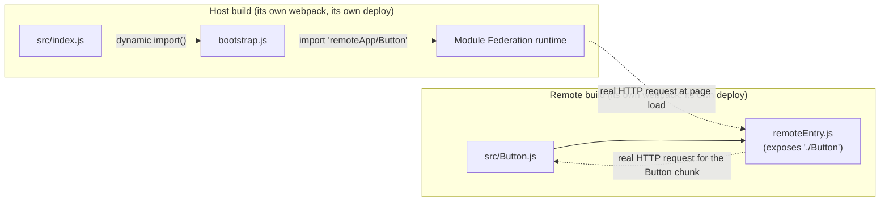

# Micro-Frontends and Module Federation

> **Topic register:** F-403 (Micro-Frontends and Module Federation) · Advanced tier · `00-project/frontend-topic-register.md`'s "D-F4 · Advanced Frontend Architecture & Security" tier — the third and last entry, added 2026-09-11, closing this domain's full `21-frontend-web` gap-audit finding (frontend security F-401, WebSocket/real-time F-402, micro-frontends F-403 — all three now closed).
> **Provenance:** every claim in this chapter is verified against two genuinely separate, real Webpack 5 builds (a `remote` and a `host`) composed at runtime over real HTTP requests, driven by real headless Chromium (Playwright), at [`practice/frontend/microfrontends-module-federation/`](../../practice/frontend/microfrontends-module-federation/README.md) — a real rebuild-one-without-the-other test, not a description of what the pattern is supposed to allow.

## Table of Contents

1. [Learning Objectives](#learning-objectives)
2. [Why This Matters in Interviews](#why-this-matters-in-interviews)
3. [Mental Model](#mental-model)
4. [Definition and Purpose](#definition-and-purpose)
5. [Core Concepts](#core-concepts)
6. [Internal Implementation](#internal-implementation)
7. [Diagrams](#diagrams)
8. [Real Verified Demos](#real-verified-demos)
9. [Production Scenarios](#production-scenarios)
10. [Trade-offs](#trade-offs)
11. [Decision Framework](#decision-framework)
12. [Common Mistakes](#common-mistakes)
13. [Anti-Patterns](#anti-patterns)
14. [Best Practices](#best-practices)
15. [Interview Answer Framework](#interview-answer-framework)
16. [Interview Questions](#interview-questions)
17. [Summary](#summary)
18. [Key Takeaways](#key-takeaways)
19. [Cheat Sheet](#cheat-sheet)
20. [Flashcards](#flashcards)
21. [Practice Exercises](#practice-exercises)
22. [Solutions](#solutions)
23. [Additional Reading](#additional-reading)
24. [Official References](#official-references)

---

## Learning Objectives

By the end of this chapter you can:

- Explain what a micro-frontend architecture actually is, and why it's the frontend analogue of microservice decomposition.
- Explain what Webpack Module Federation actually does at build and runtime, and why it's the current standard mechanism for composing independently-owned frontend code without a shared build.
- Prove — not just claim — that two teams' apps built with Module Federation can each deploy independently, without the other rebuilding anything.
- Choose correctly between micro-frontends and a single, unified frontend for a given organizational and technical situation, and defend that choice with real, named trade-offs.

## Why This Matters in Interviews

Micro-frontends questions show up at Staff-level frontend and platform-architecture interviews specifically because the pattern's value is organizational, not purely technical — a candidate who can only describe Module Federation's config options without connecting it to the actual problem (multiple teams needing to ship independently to one product) is answering a different, shallower question. This chapter closes that gap with a real, measured proof of the one property that actually matters: rebuilding one team's app, with the other team's app never rebuilt, still changes what users see.

## Mental Model

**A micro-frontend architecture is what happens when "one team, one deployable service" — the reasoning behind microservices — gets applied to the frontend instead of stopping at the backend.** The hard part isn't drawing boxes on an architecture diagram; it's the same hard part microservices have: how do genuinely separate, independently-built, independently-deployed pieces of code end up composed into one coherent product at runtime, without knowing about each other's internals or release schedules. Webpack Module Federation is one real, concrete answer to that "how," and this chapter's own demo proves it does what it claims, not just that the claim exists.

## Definition and Purpose

**Micro-frontends** are, per Martin Fowler's own widely-cited definition, "an architectural style where independently deliverable frontend applications are composed into a greater whole" — the explicit goal being team autonomy (each team owns a complete vertical slice, from idea to production, without needing another team's coordination) and independent deployability (each piece ships on its own release cadence). **Webpack Module Federation** is a real, specific mechanism for achieving this: a Webpack 5 feature (via `ModuleFederationPlugin`) that lets multiple, separately-built Webpack outputs expose modules to, and consume modules from, each other *at runtime*, over the network — not at any shared build step. A build acting as a **host** loads and initializes other containers; a build acting as a **remote** exposes specific modules a host (or another remote) can consume.

## Core Concepts

### The whole point is a runtime boundary, not a build-time one

The single fact that makes Module Federation actually solve the micro-frontend problem — rather than just being a fancy code-splitting feature — is that a host's bundle never contains a remote's code. It contains only the *address* of where to ask for it. This chapter's own real demo proves this directly: the host's `bundle.js` is built once, and every scenario captures the browser's actual network requests, showing real, live fetches to the remote's own server (`localhost:3001/remoteEntry.js`, `localhost:3001/src_Button_js.js`) at page-load time — not bytes already sitting inside the host's own file.

### Independent deployability is the property that actually matters, and it's provable

This chapter's own demo doesn't just build both apps once and call it done — it rebuilds *only* the remote (a real, separate `webpack --config remote/webpack.config.js` invocation) after changing the remote's exposed component, deliberately never touching or re-running the host's own build, then reloads the same host page. The rendered button's text changes (`Remote Button v1` → `Remote Button v2 -- deployed independently`) and its real, computed CSS `background-color` changes (the original blue to `rgb(197, 48, 48)`) — direct, measured proof that one team's deploy reached users through a page owned by a different team's build, with zero coordination at build time.

### `exposes`, `remotes`, and `shared` are the three real levers

Per Webpack's own documentation: `exposes` declares which of a build's own modules other builds may import at runtime (this chapter's demo exposes exactly one, `./Button`); `remotes` declares which other builds' containers this build may import from, and where to find them over HTTP (`remoteApp@http://localhost:3001/remoteEntry.js`); `shared` (not exercised in this chapter's minimal demo, but essential in any real multi-team deployment) declares dependencies — most critically UI-framework runtimes like React — that should be loaded once and reused across the host and every remote, rather than each build shipping its own duplicate copy.

### The async-boundary requirement is real, not incidental

Webpack's own documentation states directly that a host consuming a remote needs an async boundary — importing the module that actually uses a federated import from behind a dynamic `import()`, rather than at the top of a synchronous entry file — because the host's federation runtime needs to negotiate the shared dependency scope with the remote container before that code can run. This chapter's demo's `host/src/index.js` is exactly this pattern: a one-line `import('./bootstrap')`, with the actual `remoteApp/Button` import living inside `bootstrap.js`.

## Internal Implementation

Real, captured evidence from `practice/frontend/microfrontends-module-federation/output-transcript.txt`, from two genuinely separate Webpack 5 builds composed at runtime, driven by real headless Chromium:

**The host's rendered content is verifiably fetched from the remote, at runtime:**

```text
Host page label (host's own code): Host shell loaded a component from a separately built remote:
Rendered button text (came from remote): Remote Button v1
Host page fetched remote's remoteEntry.js at runtime: true
Host page fetched remote's Button chunk at runtime: true
```

**Rebuilding only the remote, with the host's own bundle never rebuilt or re-served, changes what the host renders:**

```text
Editing remote/src/Button.js and rebuilding ONLY the remote (no host rebuild)...
[a real, separate webpack invocation targeting only remote/webpack.config.js]
Rendered button text after remote-only rebuild (host bundle.js untouched): Remote Button v2 -- deployed independently
Rendered button background-color after remote-only rebuild: rgb(197, 48, 48)
```

The host's own `bundle.js` file is the identical file serving both the "before" and "after" requests in this transcript — only the remote's files changed on disk between them.

## Diagrams



## Real Verified Demos

Both results are real, executed output from two genuinely separate Webpack 5 builds composed at runtime, driven by real headless Chromium — [`practice/frontend/microfrontends-module-federation/`](../../practice/frontend/microfrontends-module-federation/README.md). Full transcript in that pack's own [README.md](../../practice/frontend/microfrontends-module-federation/README.md) and [`output-transcript.txt`](../../practice/frontend/microfrontends-module-federation/output-transcript.txt):

- [`remote/webpack.config.js`](../../practice/frontend/microfrontends-module-federation/remote/webpack.config.js), [`remote/src/Button.js`](../../practice/frontend/microfrontends-module-federation/remote/src/Button.js) — a real, independent build exposing one component.
- [`host/webpack.config.js`](../../practice/frontend/microfrontends-module-federation/host/webpack.config.js), [`host/src/bootstrap.js`](../../practice/frontend/microfrontends-module-federation/host/src/bootstrap.js) — a real, independent build consuming that component at runtime.
- [`run.js`](../../practice/frontend/microfrontends-module-federation/run.js) — drives real Chromium through both scenarios, including the real "rebuild only the remote" step.

## Production Scenarios

### Scenario: two teams keep colliding on release schedules for one product page

**Symptoms.** Team A (checkout) and Team B (product recommendations) both ship changes to the same page in a monolithic frontend bundle. Every release requires both teams' changes to be merged, tested, and deployed together — a change either team wants to ship urgently is blocked behind the other team's readiness, and a bug in either team's code can block both teams' releases.

**Impact.** Release velocity for both teams is capped by the slower of the two; a production incident in one team's code forces an emergency rollback of the entire shared bundle, including the other team's unrelated, working changes.

**Initial hypotheses.** Process/communication failure (checked — teams already coordinate deploy windows carefully; the constraint is structural, not a communication gap); a testing gap (checked — both teams have adequate test coverage for their own code); the real cause: both teams' code is compiled into one shared build artifact, so there is no way to deploy one team's change without redeploying the other's unchanged code (correct).

**Diagnosis.** Confirm that both teams' code lives in the same build pipeline producing a single deployable bundle — the structural signature of this problem, distinct from a process issue a retro could fix.

**Immediate mitigation.** Establish a stricter deploy-coordination schedule as a short-term relief valve, while accepting it doesn't fix the underlying coupling.

**Permanent remediation.** Split the shared page into a host (owned by whichever team owns the page's overall shell/layout) and one or more remotes (each team's own feature, e.g., Team B's recommendations widget exposed via its own `ModuleFederationPlugin`), each with its own independent build and deploy pipeline — the exact structural change this chapter's own demo proves actually decouples releases, not just reorganizes team communication.

**Alternatives considered.** A monorepo with better internal module boundaries but still one shared build and deploy — rejected as insufficient, since it improves code organization but doesn't remove the single-artifact deploy coupling that's the actual root cause here.

**Trade-offs.** Real, new operational costs apply once this split happens (per Martin Fowler's own named downsides): dependency duplication risk if shared libraries like the UI framework aren't configured as `shared`/`singleton`, and more infrastructure/tooling coordination across now-separate repos and pipelines — a real cost against the real, gained deploy independence.

**Prevention.** Treat "does this feature genuinely need to ship on another team's release schedule" as an explicit, early architectural question for any multi-team frontend product, not an afterthought once teams start blocking each other.

**Interview lesson.** The failure mode here is structural (a shared build artifact), and the fix is structural too (a real runtime composition boundary) — this chapter's own demo is exactly what "proving the fix actually works" looks like, not just naming Module Federation as a buzzword.

## Trade-offs

| Decision | Benefit | Cost |
|---|---|---|
| Micro-frontends (Module Federation or equivalent) | Real, provable independent deployability per team (proven directly in this chapter's own demo); team autonomy over a full vertical slice | Real operational complexity (more repos, more pipelines, more governance); real risk of shared-dependency duplication if `shared`/`singleton` isn't configured deliberately |
| A single, unified frontend build | Simpler tooling, one deploy pipeline, no dependency-duplication risk, no runtime-composition failure modes | Every team's release is coupled to every other team's readiness — exactly the constraint the production scenario above describes |

## Decision Framework

1. **Do genuinely separate teams need to ship changes to the same product surface on independent schedules?** If not, the coordination cost of micro-frontends has no matching benefit — a unified build is simpler and should be the default.
2. **If yes, has the shared-dependency question (React, a design system, routing) been explicitly answered** — via Module Federation's own `shared`/`singleton` configuration — rather than left to accidentally duplicate across every remote?
3. **Can the specific deploy-independence claim actually be demonstrated**, the way this chapter's own demo does (rebuild one piece, confirm the other was never touched, confirm the user-visible result still changed)? If the architecture can't produce that proof, the promised benefit may not actually be in place.

## Common Mistakes

- Adopting micro-frontends for a single-team product, importing real operational complexity (per Martin Fowler's own named downsides — payload bloat, environment mismatches, more infrastructure to run) with no corresponding organizational benefit.
- Skipping `shared`/`singleton` configuration for framework dependencies, causing every remote to ship its own duplicate copy of React (or similar) — a real, measurable payload-bloat cost, not a theoretical one.
- Treating "we use Module Federation" as proof of independent deployability without ever actually testing the "rebuild one, not the other" property this chapter's own demo verifies directly.

## Anti-Patterns

- **Splitting a frontend into micro-frontends along technical layers (e.g., "the header micro-frontend," "the footer micro-frontend") rather than along team/business-capability boundaries** — the resulting pieces still require lockstep coordination for most real changes, defeating the pattern's actual purpose.
- **Sharing no dependencies at all between host and remotes**, needlessly duplicating framework runtimes across every piece the user's browser has to download.
- **Never verifying deploy independence in practice**, treating the architecture diagram as the proof rather than an actual rebuild-one-without-the-other test.

## Best Practices

- Draw micro-frontend boundaries around team/business-capability ownership, matching the same reasoning behind microservice decomposition, not around arbitrary UI regions.
- Configure `shared`/`singleton` deliberately for framework-level dependencies to avoid real, measurable payload duplication across remotes.
- Periodically verify the actual deploy-independence property this chapter's own demo tests directly — a real rebuild of one piece, confirming the other was untouched, confirming the visible result still changed.

## Interview Answer Framework

### 30-Second Answer

Micro-frontends apply microservices' "one team, one independently-deployable unit" reasoning to the frontend. Webpack Module Federation is a real mechanism for it: separately-built apps expose and consume modules from each other at runtime, over HTTP, not through a shared build. This chapter's own demo proves the property that actually matters — rebuilding only one app changes what a page renders, with the other app's bundle never touched.

### 2-Minute Answer

Definition: micro-frontends compose independently deliverable frontend apps into one product (Fowler's own definition); Module Federation is Webpack 5's runtime mechanism for that composition via `exposes`/`remotes`/`shared`. Why it exists: the same organizational pressure behind microservices — teams blocked on each other's release schedules in a shared build. How it works: a host's bundle contains only the address of a remote's code, fetched at runtime — proven here by capturing the actual network requests. One important trade-off: real operational cost (more pipelines, dependency-duplication risk) against real, provable deploy independence. Production example: two teams colliding on release schedules in a monolithic frontend, fixed by splitting into a host and a remote per this chapter's own demonstrated pattern.

### 10-Minute Deep Dive

Cover, in order: the mental model — this is microservice decomposition applied to the frontend (mental model); the runtime-boundary mechanism that makes the pattern actually work, not just a config file (core concepts, internal implementation); the real, measured independent-deployability proof (internal implementation, real verified demos); and the production scenario, closing with a candid trade-off discussion (production scenarios, decision framework) about when the pattern is and isn't worth its real operational cost.

### Whiteboard Explanation

Draw the [§ Diagrams](#diagrams) flowchart, narrating: the remote's build produces a small manifest (`remoteEntry.js`) plus its exposed code, sitting on its own server; the host's build knows only the remote's address, and the actual code transfer happens as a real HTTP request at page-load time — the same boundary this chapter's own demo captures directly from the browser's network activity.

### Production Example

The two-teams-colliding-on-release-schedules scenario in [§ Production Scenarios](#production-scenarios): a shared build artifact coupling two teams' deploys, fixed by a real host/remote split, verified the same way this chapter's own demo verifies it.

### Trade-offs to Mention

State unprompted: micro-frontends buy real, provable deploy independence at the cost of real operational complexity and a real dependency-duplication risk if `shared`/`singleton` isn't configured — this is an organizational trade, not a free technical upgrade, and is only worth it when genuinely separate teams need genuinely independent release schedules.

### Common Candidate Mistakes

Describing Module Federation only in terms of its config keys without connecting it to the organizational problem it solves; failing to mention `shared`/`singleton` and the payload-duplication risk of skipping it; claiming deploy independence without being able to describe how they'd actually verify it.

### Typical Follow-Up Questions

1. "Two remotes both depend on React 18, and neither configures `shared`. What happens, and what's the fix?"
2. "How would you actually verify, in a real system, that two micro-frontends can be deployed independently — not just that the architecture diagram says they can?"

### Senior-Level Expectations

Correctly explains the runtime-vs-build-time distinction and can name `exposes`/`remotes`/`shared` and their roles.

### Staff-Level Discussion

The Staff-level move is treating micro-frontends as an organizational-design decision wearing a technical implementation, not the other way around — the same discipline this chapter's own [§ Decision Framework](#decision-framework) applies, starting from "do genuinely separate teams need genuinely independent release schedules" rather than "which composition library should we use." A Staff engineer proposing this architecture for a product should be able to name which specific team boundaries justify each remote, what the `shared`/`singleton` configuration is for the framework runtime, and how deploy independence will actually be verified in production — not just cite Module Federation as a modern best practice.

## Interview Questions

### Question 1 — Two remotes both depend on React 18, and neither configures `shared`. What happens, and what's the fix?

**Why interviewers ask it.** Tests whether the candidate understands the real, concrete cost of skipping `shared`/`singleton` configuration — Fowler's own named "payload bloat" downside, made specific.

**Expected answer.** Without `shared`, each remote bundles its own complete, separate copy of React, and the user's browser downloads React multiple times across the composed page — real wasted bytes, and potentially multiple independent React instances that can behave incorrectly if they ever need to share state or context. The fix is declaring `react`/`react-dom` under `shared` (with `singleton: true`) in every build's `ModuleFederationPlugin` configuration, so Webpack's federation runtime resolves to one shared instance across the whole composed page.

**Minimum acceptable answer.** States that skipping `shared` duplicates the framework across remotes, even without the `singleton` detail.

**Strong Senior answer.** Names `shared` and `singleton: true` specifically and explains the version-resolution behavior (the highest version satisfying every build's `requiredVersion` is used).

**Staff-level extension.** Discusses the organizational process needed to keep every team's `shared` configuration consistent over time as remotes are added or upgraded independently — a real, ongoing coordination cost this pattern doesn't eliminate, only relocates.

**Common mistakes.** Assuming Module Federation automatically dedupes shared dependencies without any configuration — it does not; `shared` is an explicit, deliberate declaration.

**Likely follow-ups.** "What happens if two remotes require genuinely incompatible major versions of the same shared dependency?"

**Evaluation criteria (1–5).** 1: unaware of the duplication risk. 3: correctly identifies `shared`/`singleton` as the fix. 5: also discusses the ongoing cross-team coordination this still requires.

**Related references.** [§ Core Concepts](#core-concepts); [§ Trade-offs](#trade-offs).

---

### Question 2 — How would you actually verify, in a real system, that two micro-frontends can be deployed independently — not just that the architecture diagram says they can?

**Why interviewers ask it.** Tests whether the candidate treats independent deployability as a provable, testable property or an assumed byproduct of using the right library — exactly the distinction this chapter's own demo is built around.

**Expected answer.** Deploy a change to one micro-frontend's build/artifact in isolation, deliberately without touching or redeploying the other, and confirm the composed page's user-visible behavior actually reflects the change — the same structure as this chapter's own demo (rebuild only the remote, host bundle untouched, host page's rendered output changes). In a real CI/CD pipeline, this maps to each micro-frontend having its own independent pipeline that can run end-to-end without triggering or depending on the other's pipeline.

**Minimum acceptable answer.** States that deploying one piece without the other and observing the change is the real test, even without the CI/CD framing.

**Strong Senior answer.** Connects this directly to independent CI/CD pipelines per micro-frontend as the production-scale version of the same test.

**Staff-level extension.** Notes that this test should be a standing, repeatable verification (e.g., a scheduled or pre-release check), not a one-time proof-of-concept, since a later, accidental shared-build-step regression could quietly reintroduce coupling between teams that were previously independent.

**Common mistakes.** Treating "we use Module Federation" itself as sufficient proof, without ever actually testing the deploy-independence claim.

**Likely follow-ups.** "What would make this test fail even with Module Federation correctly configured?"

**Evaluation criteria (1–5).** 1: has no concrete verification method. 3: describes the rebuild-one-without-the-other test. 5: also proposes making it a standing, repeatable check.

**Related references.** [§ Internal Implementation](#internal-implementation); [§ Real Verified Demos](#real-verified-demos).

## Summary

Micro-frontends apply microservice-style independent deployability to the frontend; Webpack Module Federation is a real, current mechanism for it, composing separately-built apps at runtime over HTTP rather than at a shared build step. This chapter's own demo proves both halves of the claim directly: the host's rendered content is verifiably fetched from the remote at runtime (real captured network requests), and rebuilding only the remote — with the host's own bundle never touched — genuinely changes what the composed page renders. The real cost is operational complexity and a dependency-duplication risk that `shared`/`singleton` configuration exists specifically to manage.

## Key Takeaways

- Micro-frontends are Fowler's own defined pattern: independently deliverable frontend applications composed into one product, for team autonomy and independent deployability.
- Webpack Module Federation composes separately-built apps at runtime, over HTTP — proven directly here via real captured network requests to a genuinely separate remote server.
- Independent deployability is a provable property, not an assumed one — this chapter's own demo rebuilds only the remote and confirms the host's untouched bundle still renders the change.
- `shared`/`singleton` configuration is the real, deliberate answer to framework-duplication cost across remotes — not automatic, and not optional at any real scale.

## Cheat Sheet

| Need | Mechanism |
|---|---|
| Expose a module for other builds to consume at runtime | `ModuleFederationPlugin`'s `exposes` |
| Consume another build's exposed module at runtime | `ModuleFederationPlugin`'s `remotes` |
| Avoid every remote shipping its own copy of a shared library | `ModuleFederationPlugin`'s `shared`, with `singleton: true` for framework runtimes |
| Avoid the "shared module not available for eager consumption" error | Wrap the code that imports a remote behind a dynamic `import()` (an async boundary) |
| Verify deploy independence is real, not assumed | Rebuild one piece only, confirm the other's artifact is untouched, confirm the composed result still changed — as this chapter's own demo does |

## Flashcards

### Card: What Module Federation's host/remote boundary actually is

**Prompt:**
What does a host's bundle actually contain for a module it imports from a remote — the remote's code, or something else?

**Answer:**
Something else: only the address of where to fetch it at runtime (the remote's `remoteEntry.js` URL). This chapter's own demo proves this directly — the host's `bundle.js` is built once, and the browser's real, captured network requests show it fetching the remote's code live, at page load, from a genuinely separate server.

**Why it matters:**
This runtime boundary, not any config syntax, is what actually makes Module Federation solve the micro-frontend problem.

**Common trap:**
Assuming Module Federation is just a fancier code-splitting feature within one build, rather than a runtime composition boundary across genuinely separate builds.

**Related:**
[Core Concepts](#core-concepts)

### Card: Proving independent deployability

**Prompt:**
What's the concrete test for whether two micro-frontends can actually deploy independently, as opposed to just being organized into separate folders?

**Answer:**
Rebuild and redeploy one piece in isolation, deliberately never touching or rebuilding the other, and confirm the composed page's user-visible behavior still reflects the change. This chapter's own demo does exactly this — a real, separate `webpack` rebuild of only the remote changes the host page's rendered button text and color, with the host's own `bundle.js` never rebuilt or re-served.

**Why it matters:**
Independent deployability is the entire organizational point of the pattern — an architecture that can't pass this test hasn't actually achieved it, regardless of what tooling it uses.

**Common trap:**
Treating "we use Module Federation" as sufficient proof of independent deployability without ever testing it.

**Related:**
[Production Scenarios](#production-scenarios)

## Practice Exercises

1. Run the [existing practice demo](../../practice/frontend/microfrontends-module-federation/README.md) yourself and confirm the same real rebuild-one-without-the-other result reproduces.
2. Add a second exposed module to the remote (e.g., `./Badge`), consume it from the host alongside `./Button`, and confirm both render correctly without any change to the remote's existing `./Button` export.
3. Add `react` (or any small shared library) to both configs' `shared` option with `singleton: true`, and describe what change in the built output would confirm it's genuinely being shared rather than duplicated.

## Solutions

**Exercise 1.** Reproducing the demo should show the identical real results: the host page's real captured network requests to the remote's server, and the rendered button's text/color both changing after a remote-only rebuild while the host's `bundle.js` file is never regenerated.

**Exercise 2.** Adding a second `exposes` entry and a second dynamic import in the host's bootstrap file should let both components render side by side; the existing `./Button` export requires no changes at all, since each exposed module is independent.

**Exercise 3.** With `shared`/`singleton` correctly configured, only one copy of the shared library's code should appear across the network requests captured for a full page load (verifiable the same way this chapter's own demo captures requests — via a real `page.on('request', ...)` listener) — confirming deduplication is actually happening, not just configured.

## Additional Reading

- Webpack's own Module Federation concept page, for the complete real plugin API this chapter exercises a minimal, working subset of.
- Martin Fowler's own micro-frontends article, for the complete real taxonomy of integration approaches (build-time, run-time via iframes, run-time via JavaScript) this chapter covers one specific run-time mechanism from.

## Official References

- [webpack.js.org — Module Federation](https://webpack.js.org/concepts/module-federation/)
- [martinfowler.com — Micro Frontends](https://martinfowler.com/articles/micro-frontends.html)
