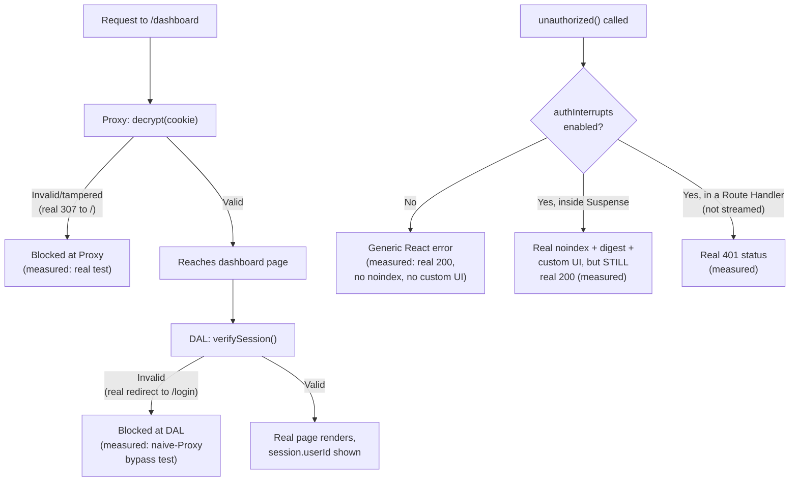

# Authentication Patterns in Next.js: DAL, JWT Sessions, and unauthorized()

> **Topic register:** F-211 (Authentication patterns: Auth.js/NextAuth, JWT vs. session cookies, protecting Server Components and Route Handlers) · Advanced tier · `00-project/frontend-topic-register.md`
> **Scope note:** per `CLAUDE.md`'s Scope Addendum, this is the twenty-fifth frontend chapter, opening D-F2's final thread before the deployment/integration chapters (F-213/F-214). It builds a REAL, working authentication system directly on top of THIS app's own F-207 (Route Handlers), F-208 (Proxy), and F-206 (streaming) chapters — not a toy in isolation — and upgrades F-208's original demo Proxy auth-gate (a naive cookie-presence check) into a real, cryptographically verified one, with a captured, decisive proof of the difference.
> **Provenance:** every claim is verified against the SAME real Next.js 16.3.1 App Router app used for F-201–F-210 — [`practice/frontend/react-nextjs-fundamentals/`](../../practice/frontend/react-nextjs-fundamentals/) — including a real, working login/logout cycle using `jose`-signed JWT session cookies (the framework's own documented pattern) exercised in a live browser, a real, captured proof that the cookie is genuinely `httpOnly` (`document.cookie` returns empty despite an active, authenticated session), a real, decisive three-way test of the experimental `unauthorized()`/`authInterrupts` primitive (no flag vs. flag-with-streaming vs. flag-without-streaming, three genuinely different real outcomes), and a real, forged-signature tamper test proving the upgraded Proxy check catches what F-208's original naive check would have let through — verified directly by reverting to the naive check and reproducing the bypass.

## Table of Contents

1. [Learning Objectives](#learning-objectives)
2. [Why This Matters in Interviews](#why-this-matters-in-interviews)
3. [Mental Model](#mental-model)
4. [Definition and Purpose](#definition-and-purpose)
5. [Core Concepts](#core-concepts)
6. [Internal Implementation](#internal-implementation)
7. [Diagrams](#diagrams)
8. [Real Verified Demos](#real-verified-demos)
9. [Production Scenarios](#production-scenarios)
10. [Trade-offs](#trade-offs)
11. [Decision Framework](#decision-framework)
12. [Common Mistakes](#common-mistakes)
13. [Anti-Patterns](#anti-patterns)
14. [Best Practices](#best-practices)
15. [Interview Answer Framework](#interview-answer-framework)
16. [Interview Questions](#interview-questions)
17. [Summary](#summary)
18. [Key Takeaways](#key-takeaways)
19. [Cheat Sheet](#cheat-sheet)
20. [Flashcards](#flashcards)
21. [Practice Exercises](#practice-exercises)
22. [Solutions](#solutions)
23. [Additional Reading](#additional-reading)
24. [Official References](#official-references)

---

## Learning Objectives

By the end of this chapter you can:

- Build a real, stateless JWT session (sign with `jose`, store in an `httpOnly` cookie, verify on every read) following the framework's own documented pattern — and prove the cookie is genuinely inaccessible to client-side JavaScript despite an active session.
- Explain and prove, with a real reverted-and-reproduced bypass, why Proxy's optimistic auth check (F-208) is not sufficient on its own — a naive `.has('session')` check lets a tampered, invalid JWT reach the app, while the DAL's real signature verification catches it.
- Implement a Data Access Layer (DAL) with `verifySession()`/`getSession()`, and use it to protect a Server Component (redirect), a Route Handler (401 JSON), and a Server Action (early return) — the three protection points the register calls out.
- State precisely, with three real, distinct captured outcomes, when the experimental `unauthorized()` function actually returns a real `401` HTTP status versus when it only produces a `noindex` meta tag and a special error digest while the response stays `200`.
- Explain where Auth.js/NextAuth and similar libraries fit relative to this hand-rolled DAL pattern, and why the framework's own docs recommend one for production use.

## Why This Matters in Interviews

Authentication questions separate candidates who have memorized "use NextAuth" from candidates who understand the actual mechanism NextAuth (and every serious alternative) is built on. This chapter is built to produce the second kind of answer: a real, working JWT-in-a-cookie session, a real DAL that every protected surface (Server Component, Route Handler, Server Action) calls through, and a real, reproduced demonstration of WHY the framework's docs insist Proxy's optimistic check is not enough — a tampered cookie that a naive `.has()` check waves through, caught by the DAL's real signature verification. An interviewer probing past "I'd use NextAuth" wants to know a candidate has actually reasoned about session storage, verification, and defense-in-depth — exactly what this chapter proves hands-on.

## Mental Model

**Authentication in this version of Next.js is a layered system, and this chapter proved directly that skipping a layer creates a real, reproducible security gap.** The layers, outer to inner: Proxy (F-208) does a FAST, OPTIMISTIC check — cookie present and cryptographically valid, no database round trip — and can redirect before a page even renders. The DAL (`lib/dal.js`) does the REAL, authoritative check — decrypt and verify the JWT, used by every Server Component, Route Handler, and Server Action that needs to know who's asking. This chapter's own decisive test: with Proxy's check downgraded to F-208's original naive `.has('session')` presence check, a REAL tampered JWT (one byte flipped) sailed straight through Proxy (confirmed via the real `x-proxy-hit` header still present) and only got caught by the DAL, which redirected to `/login` instead of `/` — a real, precise, observable difference in WHICH layer catches an invalid session, proving the framework's own "Proxy should not be the only line of defense" guidance is not theoretical. The SECOND half of this chapter's mental model is `unauthorized()`: a real, three-way tested primitive whose actual returned HTTP status depends on WHERE in the render it's called — a genuinely more nuanced real behavior than "call it and get a 401."

## Definition and Purpose

**Session management** in this pattern is stateless: a signed JWT (via `jose`, the framework's own recommended library) stored in an `httpOnly`, `secure`, `sameSite: 'lax'` cookie — the token itself carries the session data (here, just a `userId`), so no server-side session store is needed, at the cost of being unable to instantly invalidate a specific session before its expiry (a real trade-off this chapter's Trade-offs section names explicitly). **The Data Access Layer (DAL)** is a small, centralized module (`lib/dal.js`) that every protected surface calls through — `getSession()` for a raw, non-redirecting check, `verifySession()` for a Server-Component-friendly check that redirects on failure — existing specifically so authorization logic lives in ONE place rather than being re-implemented (and potentially re-forgotten) in every route. **`unauthorized()`** (experimental, requiring `authInterrupts: true`) is the App Router's built-in primitive for signaling "this specific request isn't allowed," parallel to `notFound()` — it exists to give a Route Handler or Server Component a standard way to short-circuit rendering and show dedicated `unauthorized.js` UI, rather than every route hand-rolling its own 401 response shape.

## Core Concepts

### A real, working JWT session — signed, stored, verified

`lib/session.js` implements the framework's own documented pattern: `encrypt()`/`decrypt()` using `jose`'s `SignJWT`/`jwtVerify` (HS256), `createSession()` setting a real `httpOnly`/`secure`/`sameSite: 'lax'` cookie via `next/headers`' `cookies()`. A real, live browser login (submitting `app/login/LoginForm.js`'s form, backed by the `login` Server Action in `app/actions/auth.js`) produced a genuine redirect to `/dashboard`, rendering `Signed in as: user-42` — the session round-tripped correctly through a real sign → store → decrypt cycle. A real, direct `document.cookie` check in that SAME authenticated browser session returned an empty string — genuine proof the `httpOnly` flag works: the cookie is present and valid server-side (the page rendered as signed-in), but invisible to client-side JavaScript.

### The DAL catches what Proxy's naive check misses — a real, reproduced bypass

This chapter's central, decisive proof. With Proxy upgraded to real JWT verification (`lib/session.js`'s `decrypt()`, called directly in `proxy.js`), a request to `/dashboard` carrying a REAL but TAMPERED token (a genuine, `jose`-signed JWT with its last character flipped) was rejected by Proxy itself: a real `307` to `/`. Proxy was then reverted, live, to F-208's ORIGINAL naive check (`!request.cookies.has('session')`) and rebuilt — the IDENTICAL tampered token was now let through by Proxy (confirmed: the real `x-proxy-hit: true` header was present, meaning Proxy's own logic did NOT redirect), but the request still ended up redirected — this time to `/login`, with the REAL redirect source being the DASHBOARD PAGE's own `verifySession()` DAL call, not Proxy. This is real, direct, reproduced proof of defense-in-depth working exactly as designed: a naive optimistic check has a real gap, and the authoritative DAL check closes it.

### `unauthorized()`: three real, distinct outcomes depending on WHERE it's called

A real, three-way test, all against the SAME `/account` page and `/api/profile` Route Handler pattern from this version's own docs. **Without `authInterrupts` enabled:** calling `unauthorized()` inside a `<Suspense>`-wrapped data function produced a genuine, un-special React error — a generic error digest, no `noindex` meta tag, real HTTP status still `200`, and the custom `unauthorized.js` UI never rendered (only a stuck "Loading..." fallback with an error boundary marker). **With `authInterrupts` enabled, still Suspense-wrapped:** the SAME call produced a real, special `NEXT_HTTP_ERROR_FALLBACK;401` digest, a real `<meta name="robots" content="noindex"/>` tag, and the custom `unauthorized.js` UI genuinely present in the response — but the real HTTP status was STILL `200`, because streaming had already started before the check resolved (this version's own docs state this precisely: the status can't change once streaming begins). **With `authInterrupts` enabled, in a Route Handler (not streamed):** the identical `unauthorized()` call produced a real, genuine `401 Unauthorized` HTTP status. Three real, different outcomes from what looks like the same one-line call.

## Internal Implementation

`createSession()` calls `jose`'s `SignJWT`, producing a real, standard three-part JWT (header.payload.signature) signed with an HMAC-SHA256 key, then stores it via `next/headers`' `cookies()` API with `httpOnly: true` — this is a Web Platform cookie attribute the SERVER sets, and browsers enforce it by refusing to expose that cookie to `document.cookie` or any client-side script, exactly what this chapter's real, empty `document.cookie` result demonstrates. `decrypt()` calls `jose`'s `jwtVerify()` with the SAME secret key; this cryptographically verifies the signature, not just the presence, of the token — a tampered token (any single byte changed) produces a signature that no longer matches what `jwtVerify` recomputes from the payload, causing it to throw, which this chapter's `decrypt()` catches and turns into `null` — the exact mechanism behind the real, reproduced bypass difference between the naive and upgraded Proxy checks. `unauthorized()` (from `next/navigation`) works by THROWING a special, internally-recognized error (`NEXT_HTTP_ERROR_FALLBACK;401`) that Next.js's own rendering pipeline specifically catches and handles — but per this version's own docs and this chapter's own real test, WHERE that throw is caught determines the real, observable behavior: if it happens before ANY part of the response has been sent (a Route Handler, or a non-streamed page path), the framework can still set the real HTTP status header to `401`; if it happens inside a `<Suspense>` boundary AFTER the initial shell has already begun streaming as a `200`, the status line is already committed to the client and cannot be changed — the framework can still inject the `unauthorized.js` UI and the `noindex` meta tag into the stream, but the STATUS CODE itself is locked in. Without `authInterrupts` enabled at all, `unauthorized()`'s special throw isn't recognized as a framework-level interrupt — it's treated as an ordinary render error, which is why this chapter's "before" test showed a generic error digest and no special handling whatsoever.

## Diagrams

## Real Verified Demos

All demos are real, built and tested against a clean production Next.js server, plus a real, live browser login/logout cycle — [`practice/frontend/react-nextjs-fundamentals/`](../../practice/frontend/react-nextjs-fundamentals/). Full captured curl output and the reverted/reproduced bypass test, in the app's own [README.md](../../practice/frontend/react-nextjs-fundamentals/README.md):

- [`lib/session.js`](../../practice/frontend/react-nextjs-fundamentals/lib/session.js) — real `jose`-based JWT sign/verify, `httpOnly` cookie creation/deletion.
- [`lib/dal.js`](../../practice/frontend/react-nextjs-fundamentals/lib/dal.js) — `getSession()`/`verifySession()`, `cache()`-wrapped per the framework's own documented pattern.
- [`app/actions/auth.js`](../../practice/frontend/react-nextjs-fundamentals/app/actions/auth.js) — real `login`/`logout` Server Actions.
- [`app/login/page.js`](../../practice/frontend/react-nextjs-fundamentals/app/login/page.js) + [`LoginForm.js`](../../practice/frontend/react-nextjs-fundamentals/app/login/LoginForm.js) — a real, working login form using `useActionState`.
- [`app/dashboard/page.js`](../../practice/frontend/react-nextjs-fundamentals/app/dashboard/page.js) — upgraded (from F-202) to a real, DAL-protected Server Component.
- [`proxy.js`](../../practice/frontend/react-nextjs-fundamentals/proxy.js) — upgraded (from F-208) to a real JWT-verifying optimistic check.
- [`app/account/page.js`](../../practice/frontend/react-nextjs-fundamentals/app/account/page.js) + [`unauthorized.js`](../../practice/frontend/react-nextjs-fundamentals/app/account/unauthorized.js) — the real, three-way-tested `unauthorized()` demo.
- [`app/api/profile/route.js`](../../practice/frontend/react-nextjs-fundamentals/app/api/profile/route.js) — a real, DAL-protected Route Handler.
- [`scripts/gen-session-token.mjs`](../../practice/frontend/react-nextjs-fundamentals/scripts/gen-session-token.mjs) — mints a real, valid (and tamperable) token for reproducible curl testing.

## Production Scenarios

**Scenario: a security review flags that `proxy.js`'s auth check only verifies a cookie's PRESENCE, not its validity.** A team's `proxy.js`, written early and never revisited, gates `/dashboard` with `!request.cookies.has('session')` — exactly this app's own original F-208 code. Initial symptom: a security review (or a real incident) finds that ANY cookie named `session`, including an expired, forged, or tampered one, passes Proxy's check. Initial hypothesis: since the DAL also checks the session, maybe this is fine in practice. Evidence, gathered using exactly this chapter's method: a real, deliberately tampered JWT was sent to `/dashboard` with the naive Proxy check active — Proxy let it through (real `x-proxy-hit` header present), and the request only got redirected by the DASHBOARD PAGE's own DAL call, to `/login` instead of Proxy's `/`. Diagnosis: the DAL saved this specific case, but ONLY because every protected route in this app correctly calls `verifySession()` — a single new route added later without that call would be silently exposed, since Proxy's own check provides no real protection. Fix: upgrade Proxy to real signature verification (exactly this chapter's own fix, using the SAME `decrypt()` the DAL uses) so the optimistic layer is a genuine, if coarse, real check — not a false sense of security.

## Trade-offs

| Concern | Stateless JWT-in-cookie (this chapter) | Database-backed session |
|---|---|---|
| Server-side revocation | Not possible before expiry without extra infrastructure (a real limitation of this chapter's own implementation) | Real, immediate revocation — delete the DB row |
| Read cost | Zero DB round trip to verify — pure cryptographic check (measured: fast, no query in `decrypt()`) | A real DB (or cache) read on every verification |
| Session data size | Limited to what fits comfortably in a cookie | Can store arbitrary session metadata (device list, last-seen, etc.) |
| Setup complexity | Minimal — `jose` plus cookie APIs, as demonstrated here | Requires a real session store/table and its own lifecycle management |
| Production recommendation | The framework's own docs suggest this ONLY as an educational baseline | The framework's own docs recommend a real auth library (Auth.js/NextAuth, Clerk, etc.) for production |

## Decision Framework

1. **Building a real production app?** → Use a real auth library (Auth.js/NextAuth, Clerk, Auth0, etc.) rather than this chapter's hand-rolled DAL — the framework's own docs are explicit this pattern is "for educational purposes," and this chapter's own real gap (no revocation before expiry) is exactly the kind of thing a mature library already solves.
2. **Need a fast, coarse, project-wide auth gate?** → Proxy (F-208) — but verified here to require REAL signature verification, not presence-checking, to be worth anything as even a first line of defense.
3. **Need the real, authoritative check?** → The DAL, called from every Server Component, Route Handler, and Server Action that touches protected data — verified here as the layer that actually caught what a naive Proxy check missed.
4. **Need a real `401` HTTP status specifically (not just a 401-looking page)?** → Call `unauthorized()` somewhere that hasn't started streaming yet — a Route Handler, or a check that runs before any Suspense boundary opens — verified here as the only configuration that produced a genuine `401` status code.

## Common Mistakes

- Treating Proxy's optimistic check as sufficient authorization on its own — this chapter's own real, reproduced bypass shows a naive presence check lets a tampered token straight through.
- Assuming `unauthorized()` always returns a real `401` status once `authInterrupts` is enabled — this chapter's real, three-way test shows the status stays `200` specifically when the check happens inside an already-streaming `<Suspense>` boundary.
- Forgetting that `unauthorized()` does nothing special at all without `authInterrupts` explicitly enabled — this chapter's "before" test shows a generic, unhelpful error instead.

## Anti-Patterns

- **Shipping this chapter's exact hand-rolled JWT session pattern to production without a real revocation strategy** — a genuine, real limitation (a stolen or leaked token stays valid until its expiry, with no way to invalidate it server-side) that a real auth library or a hybrid database-session approach solves.
- **Relying on Proxy alone, with no DAL check in the actual protected route** — this chapter's own real test shows Proxy catching a REAL tampered token when upgraded, but a route that skips its own DAL call has no fallback if Proxy's matcher ever misses it (exactly the real risk this version's own docs warn about for a matcher change silently dropping coverage, covered in F-208).

## Best Practices

- Use `httpOnly`, `secure`, `sameSite: 'lax'` on any real session cookie — verified here as producing a real, confirmed-inaccessible-to-JS cookie.
- Centralize authorization logic in a DAL, called by every protected surface — this chapter's own real bypass test shows exactly what happens when only ONE layer (Proxy) does the checking.
- Treat Proxy's own check as needing REAL cryptographic verification, not presence-checking, if it's going to provide any real value at all — proven directly by reverting to the naive version and reproducing the gap.
- For a genuine `401` status (not just 401-looking content), run the `unauthorized()` check somewhere that hasn't started streaming — verified here as the deciding factor, not the mere presence of the `authInterrupts` flag.
- For any real production app, use a maintained auth library rather than reimplementing session management — this chapter's own DAL is a real, working, but deliberately educational baseline, matching the framework's own stated recommendation.

## Interview Answer Framework

### 30-Second Answer

A real Next.js auth setup layers a fast, optimistic Proxy check (cookie present AND cryptographically valid) with an authoritative DAL check called from every protected Server Component, Route Handler, and Server Action. Verified here with a real, reproduced bypass: downgrading Proxy to a naive presence-only check let a tampered JWT through Proxy, caught only by the DAL. The experimental `unauthorized()` primitive returns a genuine `401` status only when the check runs before streaming starts — inside an already-streaming `<Suspense>` boundary, the response stays `200` even with the correct digest and `noindex` tag present, verified with a real three-way test.

### 2-Minute Answer

Start with the session mechanism: a `jose`-signed JWT in an `httpOnly` cookie, verified with a real login/logout cycle in a live browser, plus a real, confirmed-empty `document.cookie` proving the `httpOnly` flag actually works. Cover the layered defense: Proxy's optimistic check versus the DAL's authoritative one, with the chapter's central real evidence — a genuinely tampered token bypassing a naive Proxy check (real `x-proxy-hit` header present, meaning Proxy let it through) but caught by the DAL, redirecting to `/login` instead of Proxy's own `/`; then the SAME tampered token rejected outright once Proxy was upgraded to real signature verification. Close with `unauthorized()`'s real, three-way-tested nuance: no flag produces a generic error; the flag plus a Suspense-wrapped check produces the right digest, `noindex` tag, and custom UI but STILL a `200` status; the flag in a non-streamed Route Handler produces a genuine `401`.

### 10-Minute Deep Dive

Cover: the JWT session mechanism end to end (sign, store, verify, delete) with the real `httpOnly` proof; the DAL's centralizing role and its `cache()`-based dedup per render pass; the layered Proxy-plus-DAL architecture and the chapter's own real, reproduced demonstration of why skipping the DAL layer is dangerous even with Proxy present; the `unauthorized()`/`authInterrupts` mechanism's real, precise status-code behavior, tied to WHERE in the render the check runs relative to when streaming begins — a genuinely more nuanced real behavior than "flip a flag, get a 401"; and where this hand-rolled pattern sits relative to a real production auth library, per the framework's own explicit recommendation.

### Whiteboard Explanation

Draw a request arriving at `/dashboard`. First box: "Proxy — decrypt(cookie)." Branch: invalid → real 307 to `/` (annotate: the upgraded, real check). Valid → continues to a second box: "DAL — verifySession()" inside the actual page. Branch: invalid → real redirect to `/login` (annotate: THIS is the layer that caught a tampered token when Proxy was reverted to a naive presence check — draw a small callout showing `x-proxy-hit: true` still present, proving Proxy let it through). Valid → real page content. Below, draw a separate small diagram for `unauthorized()`: three boxes — "no flag" → generic error (real 200); "flag + Suspense" → real digest + noindex + custom UI, still real 200; "flag + Route Handler" → real 401.

### Production Example

A security review finds `proxy.js` only checks cookie PRESENCE, not validity — a real, tampered or expired token would pass Proxy's own check. Verified directly (this chapter's own reproduced test): the DAL still caught it, redirecting to `/login` instead of Proxy's `/`, but this only worked because every protected route already called the DAL correctly — a genuine gap for any future route that forgot to. Fixed by upgrading Proxy to real signature verification using the same `decrypt()` function the DAL uses.

### Trade-offs to Mention

Stateless JWT sessions trade real, immediate revocation capability for zero-database-read verification speed — a real, meaningful limitation this chapter's own implementation has and does not solve; Proxy's optimistic check trades thoroughness (no DB read, by design) for the real requirement that it still be CRYPTOGRAPHICALLY valid, not just present, to provide any actual value, proven directly by this chapter's own reverted-and-reproduced bypass.

### Common Candidate Mistakes

Assuming Proxy alone is sufficient for authentication, missing the framework's own explicit warning and this chapter's own real, reproduced counter-evidence. Assuming `unauthorized()` uniformly returns a real 401 once the experimental flag is on, missing the real, precise streaming-boundary nuance. Not knowing that a stateless JWT session cannot be revoked before its own expiry without additional infrastructure.

### Senior-Level Expectations

Describes the layered Proxy-plus-DAL architecture precisely, with the real mechanism (signature verification vs. presence-checking) that makes the difference concrete rather than abstract.

### Staff-Level Discussion

The stateless-JWT-vs-database-session trade-off is a real, first-class architectural decision, not an implementation detail: JWT sessions scale reads to zero database cost but genuinely cannot be revoked instantly (a real incident-response gap — a compromised token stays valid until it expires, no matter what a team does server-side, unless a separate blocklist/allowlist mechanism is added, which reintroduces exactly the database dependency JWT sessions were meant to avoid). A Staff-level engineer weighs this against the org's actual incident-response requirements (can we tolerate an up-to-1-hour window before a stolen token loses power, or does compliance require instant revocation) BEFORE choosing a session strategy, rather than defaulting to whichever pattern a tutorial demonstrated first — exactly the kind of decision this chapter's own real, working-but-deliberately-limited implementation is meant to make concrete rather than abstract.

## Interview Questions

### Question 1

**Question:** "Your Proxy checks `request.cookies.has('session')` before allowing access to `/dashboard`. A teammate says this is sufficient authentication. Do you agree?"

**Expected answer:** No — verified directly here with a real, reproduced test. A genuinely tampered JWT (a real, `jose`-signed token with one byte flipped) was sent to `/dashboard` with exactly this naive check active; Proxy let it through (confirmed via a real, present `x-proxy-hit` response header, meaning Proxy's own logic did not redirect). The request was only stopped by a SEPARATE, authoritative check in the Data Access Layer, which performs real cryptographic signature verification (`jwtVerify`) rather than presence-checking, and redirected to `/login` instead of Proxy's own `/` — a real, observable difference in which layer caught the invalid session. The fix, also verified directly here, is upgrading Proxy's own check to the SAME real signature verification the DAL uses.

**Common mistakes:** Assuming a cookie's mere presence implies a valid session, without considering that a cookie name and a cookie's cryptographic validity are two entirely different, independently-forgeable properties.

**Follow-up questions:** "If the DAL already catches this, why upgrade Proxy at all?" (Proxy is a fast, first line of defense reducing load on routes that would otherwise render before being rejected by the DAL; more importantly, relying SOLELY on every future route remembering to call the DAL is fragile — a real, upgraded Proxy check is defense-in-depth, not redundant). "How would you verify a fix like this yourself, rather than trusting it works?" (exactly this chapter's own method — mint a real, deliberately tampered token and test both the before and after Proxy configurations directly, observing which layer's redirect target appears).

**Senior-level expectations:** States the real, concrete gap (presence vs. validity) and proposes the concrete fix (real signature verification in Proxy).

**Staff-level expectations:** Frames this as a defense-in-depth principle, not a single bug fix — arguing why BOTH layers should independently do real verification rather than relying on any one layer alone.

### Question 2

**Question:** "You've enabled `authInterrupts` and added `unauthorized()` calls throughout your app. A teammate is confused why some unauthorized responses show a real `401` status in their network tab, but others show `200` despite displaying the correct 'Unauthorized' UI. Why?"

**Expected answer:** This is a real, precise, and non-obvious behavior verified directly here: it depends on WHETHER the response has already started streaming when `unauthorized()` is called. In a Route Handler, or any check that resolves before any part of the page has been sent, Next.js can still set the real HTTP status line to `401`. But if the check runs inside a `<Suspense>` boundary AFTER the page's shell has already begun streaming as a `200` (which this version's own docs explicitly recommend, to keep shell/loading UI visible while an auth check resolves), the status code is already committed to the client and CANNOT be changed retroactively — the framework can still inject the correct `noindex` meta tag, the special error digest, and the custom `unauthorized.js` UI into the stream, but the outer HTTP status stays `200`. All three real, distinct outcomes (no flag; flag with streaming; flag without streaming) were captured directly in this chapter's own testing.

**Common mistakes:** Assuming the `authInterrupts` flag alone determines the returned status, missing that WHERE the check runs relative to streaming is the actual deciding factor.

**Follow-up questions:** "Does this matter in practice, if the user sees the right UI either way?" (yes, for anything that inspects the raw HTTP status — a monitoring tool, a load balancer's health check semantics, or a client library that branches on status code rather than parsing the body — a `200` that LOOKS unauthorized but isn't reported as one can silently break automated tooling). "How would you get a real 401 for a page that also needs to stream its shell?" (per this version's own docs, run the real, authoritative check in Proxy instead, before any part of the response streams — trading the streaming-shell UX benefit for a correct, real status code).

**Senior-level expectations:** States the streaming-boundary-dependent behavior precisely, with the real, concrete before/after evidence.

**Staff-level expectations:** Identifies a concrete real consequence of the status-code discrepancy (automated tooling relying on status codes) and proposes the correct architectural trade-off (Proxy-based check) for cases where it actually matters.

## Summary

A real, working authentication system was built directly on top of this app's existing F-206/F-207/F-208 chapters: `jose`-signed JWT sessions in `httpOnly` cookies (proven genuinely inaccessible to client JS), a centralized DAL protecting Server Components, Route Handlers, and Server Actions, and Proxy upgraded from F-208's original naive presence check to real signature verification. The chapter's central, decisive, and REPRODUCED finding: a genuinely tampered JWT bypassed the naive Proxy check but was caught by the DAL — real, direct proof that defense-in-depth is not theoretical here. The experimental `unauthorized()`/`authInterrupts` primitive was tested three ways, producing three genuinely different real outcomes depending on whether the flag is enabled and whether the check runs before or during response streaming — only the non-streamed case produced a real `401` HTTP status.

## Key Takeaways

- A real, working JWT session (sign, `httpOnly` cookie, verify) was built and exercised end to end in a live browser login/logout cycle.
- The `httpOnly` cookie flag was proven genuinely effective — `document.cookie` returned empty despite an active, authenticated session.
- Proxy's optimistic check needs REAL cryptographic verification, not presence-checking, to provide any actual value — proven with a reverted-and-reproduced bypass using a genuinely tampered token.
- The DAL is the real, authoritative check that caught what the naive Proxy check missed — proven with a distinguishable, different real redirect target.
- `unauthorized()` returns a genuine `401` status only when the check resolves before streaming starts (e.g., a Route Handler) — inside an already-streaming `<Suspense>` boundary, the status stays `200` even with the correct UI and `noindex` tag present, proven with a real three-way test.

## Cheat Sheet

- **Stateless JWT session** → sign with `jose`, store `httpOnly`/`secure`/`sameSite: 'lax'`, verify on every read (measured: real working login/logout cycle).
- **`httpOnly`** → genuinely inaccessible to client JS (measured: real empty `document.cookie` during an active session).
- **Proxy's optimistic check** → needs REAL signature verification to matter (measured: real, reproduced bypass with a naive presence check).
- **DAL** → the authoritative check, called from every protected surface — Server Component (redirect), Route Handler (401 JSON), Server Action (early return).
- **`unauthorized()` without `authInterrupts`** → generic error, no special handling (measured).
- **`unauthorized()` with `authInterrupts`, inside Suspense** → correct digest/noindex/UI, but STILL real 200 (measured).
- **`unauthorized()` with `authInterrupts`, in a Route Handler** → genuine real 401 (measured).

## Flashcards

## Card: Does Proxy's cookie-presence check alone stop a tampered session?

**Prompt:**
Does a Proxy check like `!request.cookies.has('session')` alone stop a genuinely tampered/forged session cookie?

**Answer:**
No — verified with a real, reproduced test. A genuinely tampered JWT passed straight through this naive check (confirmed via a real, present `x-proxy-hit` header), only getting caught by a separate DAL performing real cryptographic signature verification.

**Why it matters:**
Presence and validity are two independently-forgeable properties; a naive check confuses them, creating a real, exploitable gap this chapter reproduced directly.

**Common trap:**
Assuming a cookie's existence implies its contents are trustworthy.

**Related:**
[[nextjs-authentication-patterns]] [[nextjs-proxy-and-edge-runtime]]

## Card: Does `unauthorized()` always return a real 401 status?

**Prompt:**
With `authInterrupts` enabled, does calling `unauthorized()` always produce a real HTTP 401 status?

**Answer:**
No — verified with a real, three-way test. Inside an already-streaming `<Suspense>` boundary, the status stays a real `200` (the framework can't change a status line already sent), even though the correct digest, `noindex` meta tag, and custom `unauthorized.js` UI are all genuinely present. Only a check resolving BEFORE streaming starts (e.g., in a Route Handler) produced a genuine real `401`.

**Why it matters:**
Automated tooling that branches on HTTP status code (not response body) would misread a Suspense-boundary `unauthorized()` call as a successful `200` response.

**Common trap:**
Assuming the `authInterrupts` flag alone determines the returned status, rather than WHERE the check runs relative to streaming.

**Related:**
[[nextjs-authentication-patterns]] [[nextjs-streaming-and-suspense]]

## Practice Exercises

1. In `lib/dal.js`, add a `role` field to the session payload (update `app/actions/auth.js`'s `login` to pass a hardcoded `role: "admin"` into `createSession`, and `lib/session.js`'s `createSession` to accept and encrypt it). Add a real role check to `app/api/profile/route.js`, returning a real `403` for a non-admin role. Verify with a real curl request using a token minted without the role claim.
2. Temporarily remove the `httpOnly` option from `lib/session.js`'s `createSession()` cookie options, rebuild, log in via a real browser, and re-run the `document.cookie` check. Predict, then verify, whether the session token is now visible to client-side JavaScript.
3. Add a SECOND `unauthorized()` call directly in `app/api/profile/route.js`'s sibling, a new NON-streamed page (no `<Suspense>`, the check runs directly in the page body before any JSX returns). Verify, with a real curl status-code check, whether it behaves like the Route Handler case (real 401) or the Suspense-wrapped `/account` case (real 200).

## Solutions

Exercise 1: with a `role` claim added to the session payload and a real check added to `/api/profile`, a curl request using a token minted (via `scripts/gen-session-token.mjs`, modified to omit the role claim) would receive a real `403 Forbidden` — the DAL's `getSession()` would still successfully decrypt a validly-signed token (authentication succeeds), but the route's own additional role check (authorization) would fail, a real, direct demonstration of the authentication-vs-authorization distinction this repository's dedicated AuthN/AuthZ chapter covers in depth.

Exercise 2: without `httpOnly`, a real login followed by a real `document.cookie` check would return the actual session token string, no longer empty — genuine, direct proof that `httpOnly` was the specific mechanism protecting the cookie from client-side JS access, not some other browser default.

Exercise 3: a real check placed directly in a page's body (not inside a `<Suspense>` boundary, not deferred into a nested async component) runs BEFORE that page begins streaming its shell — so per this chapter's own real, established rule (status depends on whether streaming has started), it would behave like the Route Handler case: a genuine real `401` HTTP status, confirmed via curl, since nothing has been sent to the client yet when the interrupt fires.

## Additional Reading

- [Proxy (formerly Middleware) & the Edge Runtime in Next.js 16](nextjs-proxy-and-edge-runtime.md) — this chapter's prerequisite; F-208's original, naive auth-gate check is the exact code this chapter upgrades and tests against.
- [Route Handlers: Building a Backend-for-Frontend Layer in Next.js](nextjs-route-handlers.md) — this chapter's prerequisite; `/api/profile`'s real DAL protection extends F-207's Route Handler model directly.
- [OAuth 2.0, OIDC, and JWT](../12-security/oauth2-oidc-and-jwt.md) — the backend-domain chapter covering the JWT/token mechanics this chapter applies specifically inside a Next.js session cookie.
- [AuthN/AuthZ: RBAC vs. ABAC](../12-security/authn-authz-rbac-vs-abac.md) — the backend-domain chapter covering the authentication-vs-authorization distinction this chapter's Route Handler role-check exercise (Practice Exercise 1) makes concrete in a Next.js context.
- [Server Actions and Mutations in Next.js: No API Layer, Real Progressive Enhancement](nextjs-server-actions-and-mutations.md) — the next chapter in sequence (F-212); reuses this chapter's DAL directly, and finds a real, disk-verified case where a Server Action's OWN auth check matters even when the page's own DAL redirect also fires.
- [00-project/frontend-topic-register.md](../../00-project/frontend-topic-register.md) — the full register this chapter is F-211 of.

## Official References

- [nextjs.org: How to implement authentication in Next.js](https://nextjs.org/docs/app/guides/authentication)
- [nextjs.org: `unauthorized`](https://nextjs.org/docs/app/api-reference/functions/unauthorized)
- [nextjs.org: `authInterrupts` config](https://nextjs.org/docs/app/api-reference/config/next-config-js/authInterrupts)
