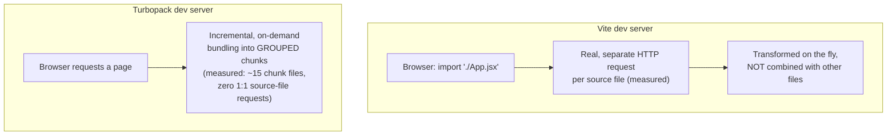
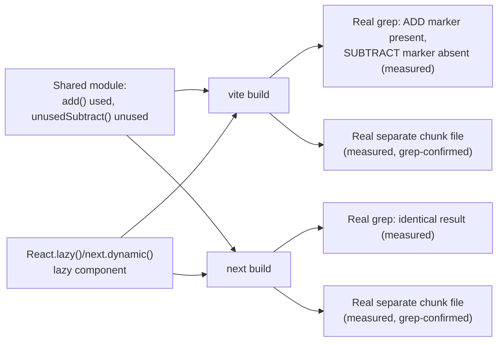

# Build Tooling: Vite vs. Next.js's Turbopack, What a Bundler Actually Does

> **Topic register:** F-301 (Build tooling: Vite vs. Next.js's own compiler/Turbopack, what a bundler actually does) · Intermediate tier · `00-project/frontend-topic-register.md`
> **Scope note:** per `CLAUDE.md`'s Scope Addendum, this is the twenty-ninth frontend chapter, and the first in D-F3 (Tooling & Ecosystem) — D-F2 (F-201–F-214) closed with the previous chapter. A NEW, real, minimal Vite + React app was purpose-built ([`practice/frontend/build-tooling-comparison/`](../../practice/frontend/build-tooling-comparison/)) specifically for this chapter's own dual-tool comparison — deliberately separate from `react-fundamentals` (F-101–F-119's own, differently-purposed Vite app) and from `react-nextjs-fundamentals` (F-201–F-214's own Next.js/Turbopack app, extended here with the identical tests for a fair, direct comparison).
> **Provenance:** every claim is verified against two real, independently-run dev servers and two real, independently-run production builds — a real, minimal Vite app and this repo's own, much larger Turbopack app — including a real captured network trace contrasting their dev-mode request patterns, and the IDENTICAL real tree-shaking and code-splitting test run against both tools' real production output.

## Table of Contents

1. [Learning Objectives](#learning-objectives)
2. [Why This Matters in Interviews](#why-this-matters-in-interviews)
3. [Mental Model](#mental-model)
4. [Definition and Purpose](#definition-and-purpose)
5. [Core Concepts](#core-concepts)
6. [Internal Implementation](#internal-implementation)
7. [Diagrams](#diagrams)
8. [Real Verified Demos](#real-verified-demos)
9. [Production Scenarios](#production-scenarios)
10. [Trade-offs](#trade-offs)
11. [Decision Framework](#decision-framework)
12. [Common Mistakes](#common-mistakes)
13. [Anti-Patterns](#anti-patterns)
14. [Best Practices](#best-practices)
15. [Interview Answer Framework](#interview-answer-framework)
16. [Interview Questions](#interview-questions)
17. [Summary](#summary)
18. [Key Takeaways](#key-takeaways)
19. [Cheat Sheet](#cheat-sheet)
20. [Flashcards](#flashcards)
21. [Practice Exercises](#practice-exercises)
22. [Solutions](#solutions)
23. [Additional Reading](#additional-reading)
24. [Official References](#official-references)

---

## Learning Objectives

By the end of this chapter you can:

- State precisely, with a real captured network trace, the actual mechanical difference between Vite's dev server (native ESM, no application-code bundling) and Turbopack's dev server (incremental, on-demand bundling into grouped chunks) — not just "Vite is faster."
- Reproduce a real tree-shaking test — an unused export, a real runtime marker rather than a comment — against both tools' real production builds, with matching results.
- Reproduce a real code-splitting test (`React.lazy()`/`next/dynamic`) against both tools, confirming a genuinely separate chunk file in each.
- Explain why raw dev-server "ready in Xms" numbers are not, by themselves, a fair cross-tool comparison — and what IS a fair, real, measurable comparison instead.
- Describe what a bundler concretely does — module graph resolution, transformation (JSX/TS), tree-shaking, chunking — grounded in real, inspected build output rather than a diagram.

## Why This Matters in Interviews

"Which is faster, Vite or Turbopack" is a shallow question that produces a shallow answer from most candidates — a number without a mechanism. This chapter is built to produce the mechanism: a real, captured network trace showing WHY Vite's dev server can start fast and serve pages instantly regardless of app size (it isn't bundling your code at all, just transforming files on request), versus Turbopack's own real, grouped-chunk request pattern even in dev mode. It also produces the SAME real tree-shaking and code-splitting proof against both tools, so a candidate can say precisely what "a bundler does" rather than reciting the term. A Staff-level interviewer asking about build tooling wants to know whether a candidate understands the actual request-time and build-time mechanics well enough to debug a real "why is my dev server slow" or "why is my bundle huge" incident — not whether they have an opinion about which tool is trendier.

## Mental Model

**Two philosophically different answers to "how do I serve a JavaScript app during development," verified with two real, contrasted network traces.** Vite's answer: don't bundle your OWN code at all in dev — the browser's native `import` resolves each source file as its own real HTTP request, transformed on the fly (JSX→JS) but never combined with others; only third-party `node_modules` dependencies get pre-bundled (via esbuild) for request-count and compatibility reasons. This chapter's own real capture shows exactly that: `main.jsx`, `App.jsx`, and `mathUtils.js` each as a separate real request. Turbopack's answer, despite Next.js also branding it as fast, is different in kind, not just degree: it DOES bundle, incrementally and on-demand per route, into grouped chunk files — this chapter's own real capture of the SAME kind of page load shows ~15 chunk files, no individual source file ever its own request. **Both tools converge again for PRODUCTION builds** — both genuinely tree-shake (verified here with an identical real test against both) and both genuinely code-split on dynamic `import()` (verified here with an identical real test against both) — the real, decisive difference this chapter identifies is specifically a DEV-MODE architecture choice, not a difference in what either tool is fundamentally capable of.

## Definition and Purpose

A **bundler** takes a graph of module files (starting from one or more entry points, following every `import`/`require`) and produces a smaller set of output files a browser can load efficiently — concretely, it performs module resolution (finding the right file for each import), transformation (JSX/TypeScript/newer syntax → syntax every target browser understands), tree-shaking (excluding code that's provably never used, given the ACTUAL import graph, not just "unused" in isolation), and chunking (deciding how to group modules into output files, including separate chunks for code loaded only conditionally via dynamic `import()`). **Vite** exists to make DEVELOPMENT fast by sidestepping the bundling step entirely during dev, using the browser's own native ES module support instead, while still using a real bundler (Rollup, or Rolldown in newer Vite versions) for the PRODUCTION build. **Turbopack** exists as Next.js's own successor to webpack, built to bundle incrementally (only compiling what a given request actually needs, cached per-module) rather than eagerly compiling an entire app upfront — a different strategy for solving a similar "large-app dev server speed" problem, without abandoning bundling in dev the way Vite does.

## Core Concepts

### The real, central dev-mode contrast

A real `read_network_requests` capture of the Vite app's first load: `/@vite/client`, `/src/main.jsx`, `/@react-refresh`, `/node_modules/.vite/deps/react.js`, `/src/App.jsx`, `/node_modules/.vite/deps/react_jsx-dev-runtime.js`, `/src/mathUtils.js`, and more — TEN real, separate requests for a THREE-file app, with each of the app's OWN source files (`main.jsx`, `App.jsx`, `mathUtils.js`) as its own individual request. A real `read_network_requests` capture of the Turbopack app's `/about` page: `/_next/static/chunks/[root-of-the-server]__068_is3._.css` plus roughly a dozen grouped `.js` chunk files, none of them corresponding one-to-one with a single source file — `page.js`, `layout.js`, and every component they import are already combined into a handful of chunks by the time the browser sees them, even in dev mode.

### Real, verified tree-shaking — identical test, both tools

A shared module exporting two functions — `add` (imported and called) and `unusedSubtract` (exported, never imported anywhere) — each containing a real, distinctive `console.log` marker string (deliberately NOT a code comment, since minification strips comments regardless of whether the surrounding code is used, a real distinction this chapter's own testing corrected for). Built with `vite build`: the used function's marker appears once in the output bundle; the unused function's marker appears zero times. The IDENTICAL module and test, reproduced in the Turbopack app and built with `next build`: identical result — the used marker present in exactly one chunk file, the unused marker absent from the entire `.next/static/chunks/` directory. Both tools genuinely eliminate code that the real, actual import graph proves is unreachable — not merely code that LOOKS unused in isolation.

### Real, verified code-splitting — identical test, both tools

A component (`LazyPanel`) loaded ONLY via `React.lazy()` + a dynamic `import()` behind a button click. Built with `vite build`: a real, separate `LazyPanel-<hash>.js` file, distinct from the main bundle, confirmed via grep to contain the lazy component's own marker string while the main bundle does not. The IDENTICAL pattern via `next/dynamic` in the Turbopack app: a real, separate chunk file (confirmed via grep, a different hash-named file from the one containing the tree-shaking test's own marker) containing the lazy component's marker, absent from every other chunk.

### Why raw "ready in Xms" numbers aren't a fair comparison

Vite's own dev server reported `ready in 400 ms` for a genuinely tiny, 3-file app; Turbopack's own dev server reported `Ready in 271ms` for THIS REPOSITORY'S full 31-route app (F-201 through F-301's own combined work). Naively, that would read as "Turbopack is faster" — but both numbers measure only "the dev server PROCESS is now listening," not "every route has been compiled." Neither tool eagerly compiles an entire app upfront; both compile lazily, on first request, per route/module — which is exactly why Turbopack's number stayed low despite the app's real size. The genuinely fair, real comparison this chapter draws instead is the REQUEST PATTERN once a page is actually requested (the network trace above), not the startup timestamp.

## Internal Implementation

Vite's dev server intercepts every `import` request the browser's native ES module loader makes, resolving bare specifiers (like `import React from 'react'`) to real file paths (or pre-bundled dependency files) and transforming source on the fly per file — there is no module graph traversal or chunk-assembly step at all for YOUR OWN code during dev, which is precisely why editing one file only requires the browser to re-request that ONE file's transformed output (real, fast HMR) rather than any bundle recomputation. `node_modules` dependencies ARE pre-bundled once (via esbuild, extremely fast, though still a real bundling step) specifically because many packages ship many small internal files or CommonJS modules that would otherwise mean hundreds of extra native-ESM requests and CJS/ESM interop issues — a real, deliberate, narrower use of bundling even within Vite's own "don't bundle in dev" philosophy. Turbopack, by contrast, builds and maintains an actual dependency graph and a persistent, function-level compilation cache even in dev — when a request comes in for a route, Turbopack computes (or reuses a cached) bundle for exactly what that route needs, which is why its own network trace shows grouped, chunk-shaped output rather than raw source files: the ARCHITECTURE is "always bundle, but incrementally and lazily," not "never bundle." Both tools' PRODUCTION builds converge on genuine, real bundling with tree-shaking and chunking (Rollup/Rolldown for Vite, Turbopack's own production mode for Next.js) — this chapter's identical marker tests against both confirm the OUTPUT characteristics are equivalent even though the DEV-mode architectures are not.

## Diagrams

## Real Verified Demos

All demos are real, built and tested against two real, independently-run dev servers and two real, independently-run production builds — [`practice/frontend/build-tooling-comparison/`](../../practice/frontend/build-tooling-comparison/) (Vite) and [`practice/frontend/react-nextjs-fundamentals/`](../../practice/frontend/react-nextjs-fundamentals/) (Next.js/Turbopack). Full captured output in each app's own README:

- [`build-tooling-comparison/src/mathUtils.js`](../../practice/frontend/build-tooling-comparison/src/mathUtils.js) + [`build-tooling-comparison/src/LazyPanel.jsx`](../../practice/frontend/build-tooling-comparison/src/LazyPanel.jsx) — the Vite-side tests.
- [`react-nextjs-fundamentals/lib/f301-math-utils.js`](../../practice/frontend/react-nextjs-fundamentals/lib/f301-math-utils.js) + [`react-nextjs-fundamentals/app/components/F301LazyPanel.js`](../../practice/frontend/react-nextjs-fundamentals/app/components/F301LazyPanel.js) — the identical Turbopack-side tests.

## Production Scenarios

**Scenario: a team migrates from Vite to Next.js and is alarmed their dev server "feels different."** Symptom: engineers used to Vite's dev server notice Next.js's own dev server behaves differently under the browser's Network tab — far fewer, larger requests instead of many small ones. Initial hypothesis: something is misconfigured, or Next.js is "less optimized." Evidence, gathered using exactly this chapter's method: a direct network trace comparison shows this is EXPECTED, architectural behavior — Turbopack bundles into chunks even in dev, Vite doesn't bundle app code in dev at all. Diagnosis: no misconfiguration; this is simply how the two tools' dev servers are built to work. Fix: none needed — but the team should recalibrate expectations for debugging (e.g., "which file is this code in" is a one-to-one lookup in Vite's Network tab, but not in Turbopack's, where source maps become the real tool for that instead).

## Trade-offs

| Concern | Vite (dev) | Turbopack (dev) |
|---|---|---|
| App-code bundling in dev | None — native ESM, one request per file (measured) | Real, incremental, grouped chunks (measured) |
| Third-party dependency handling | Pre-bundled once via esbuild (a real, narrower bundling step) | Also handled, integrated into the same incremental graph |
| HMR granularity | Per-file, since files are served individually | Per-module within Turbopack's own cached graph |
| Production build | Genuine bundling, tree-shaking, chunking (Rollup/Rolldown) — verified here | Genuine bundling, tree-shaking, chunking (Turbopack production mode) — verified here, identical results |
| Ecosystem coupling | Framework-agnostic, works with many frameworks | Built specifically for Next.js's own App/Pages Router model |

## Decision Framework

1. **Choosing a bundler for a standalone React (non-Next.js) app?** → Vite is the real, mainstream default — this chapter's own evidence shows a genuinely fast, simple dev-mode architecture (no app-code bundling at all) plus a real, standard production build.
2. **Already building on Next.js specifically?** → Turbopack is the framework's own integrated choice — this chapter's own evidence shows it produces equivalent real tree-shaking/code-splitting output to Vite, just via a different dev-mode strategy.
3. **Debugging "my dev server feels slow" reports?** → Check the actual network request pattern (this chapter's own method) before assuming a tool-quality problem — a large chunk count or a large per-file request count both have legitimate, architecture-driven explanations.
4. **Comparing tools by a single "ready in Xms" number?** → Don't, without controlling for app size — this chapter's own honest comparison shows why that number alone is misleading.

## Common Mistakes

- Treating a raw dev-server "ready in Xms" number as a fair, apples-to-apples speed comparison without controlling for app size — this chapter's own two real numbers (400ms for a 3-file app, 271ms for a 31-route app) show why that's misleading on its own.
- Assuming Vite "doesn't bundle at all" — it genuinely bundles the PRODUCTION build (and even pre-bundles `node_modules` deps in dev) — the real, precise claim is narrower: no APPLICATION-code bundling specifically in DEV mode.
- Assuming Turbopack's dev-mode bundling means it's fundamentally worse at tree-shaking or code-splitting than Vite for PRODUCTION output — this chapter's own identical tests against both show equivalent real results.

## Anti-Patterns

- **Choosing a build tool based on marketing benchmarks without a real, direct comparison against your own app's actual behavior** — this chapter's own network-trace method is a concrete, repeatable way to verify a tool's real dev-mode characteristics rather than trusting a claimed number.
- **Debugging a "why is my bundle huge" question without first confirming tree-shaking actually ran** — this chapter's own marker-based method (a real, unambiguous runtime string, not a comment) is a fast, decisive way to confirm dead code was actually eliminated rather than assuming it.

## Best Practices

- Verify tree-shaking and code-splitting claims directly against a real production build (this chapter's own grep-based method) rather than trusting documentation or intuition.
- When comparing dev-server "speed," compare the actual REQUEST PATTERN for an equivalent page load, not just a startup timestamp — this chapter's own two numbers show why the timestamp alone misleads.
- Use runtime markers (real strings, function calls), not code comments, when testing whether specific code survives a build — comments are stripped by minification regardless of tree-shaking, a real distinction this chapter's own testing corrected for.

## Interview Answer Framework

### 30-Second Answer

Vite's dev server serves your own application code as native ES modules with zero bundling — verified here with a real network trace showing every source file as its own separate HTTP request. Turbopack's dev server DOES bundle, incrementally and on-demand, into grouped chunk files — verified here with the same kind of trace showing no one-to-one file requests at all. Both tools converge for PRODUCTION: an identical real tree-shaking test (an unused export, a real runtime marker) and an identical real code-splitting test (`React.lazy()`/`next/dynamic`) produced matching results against both.

### 2-Minute Answer

Start with the real, central dev-mode contrast: a network trace of a tiny Vite app shows ten-plus separate requests, one per source file plus pre-bundled dependencies — no application-code bundling in dev at all. The SAME kind of trace against a Next.js/Turbopack app shows roughly a dozen grouped chunk files instead, with no request mapping one-to-one to a single source file — Turbopack bundles even in dev, just incrementally. Then note the real, honest caveat about raw startup numbers: Vite reported 400ms for a 3-file app, Turbopack reported 271ms for a 31-route app — not a fair comparison on its own, since neither number reflects full-app compilation (both compile lazily). Close with the real convergence: an identical tree-shaking test (a real, unambiguous runtime marker, not a comment) and an identical code-splitting test both produced matching, correct results against real production builds of both tools — the DEV-mode architectures differ, the PRODUCTION guarantees don't.

### 10-Minute Deep Dive

Cover: the real mechanical difference in dev-server architecture (native ESM vs. incremental bundling) with the real captured network traces as evidence; why esbuild dependency pre-bundling is a real, narrower exception to Vite's "no bundling in dev" claim; Turbopack's own incremental, per-module caching model as the reason its dev server stays fast despite genuinely bundling; the real, identical tree-shaking and code-splitting tests run against both tools' production builds, with the runtime-marker-vs-comment distinction as a real methodological correction; and the honest caveat about comparing raw "ready in Xms" numbers across apps of very different sizes.

### Whiteboard Explanation

Draw two dev servers side by side. Under Vite: a browser icon with ten arrows fanning out to ten separate file icons, labeled "measured: real, separate requests, native ESM." Under Turbopack: a browser icon with ONE arrow fanning out to a handful of "chunk" boxes, each containing several source-file icons grouped inside, labeled "measured: incremental bundling, even in dev." Below both, draw a single shared box labeled "Production build (both tools)" with two checkmarks: "tree-shaking: real, verified, identical result" and "code-splitting: real, verified, identical result."

### Production Example

A team migrating from a Vite app to Next.js notices their dev server's Network tab looks completely different — fewer, larger requests instead of many small ones. Verified directly (this chapter's own method): this is expected, architectural behavior, not a misconfiguration — Turbopack bundles into chunks even in dev, Vite doesn't bundle application code in dev at all. No fix needed, but debugging workflows relying on "which file is this in" via the Network tab directly need to shift to source maps instead.

### Trade-offs to Mention

Vite's no-bundling-in-dev approach is real, fast, and simple, but is a framework-agnostic tool without Next.js's own App/Pages Router-specific integration; Turbopack's incremental-bundling-even-in-dev approach is real, genuinely fast in practice (verified here: 271ms ready for a 31-route app), but produces a dev-mode request pattern that looks and debugs differently than Vite's — a real, worth-naming difference for a team used to one tool moving to the other.

### Common Candidate Mistakes

Answering "Vite is faster" without a mechanism. Assuming Vite never bundles anything (it does — dependencies in dev, and the whole app in production). Comparing raw dev-server startup numbers across apps of very different sizes without noting the caveat.

### Senior-Level Expectations

Describes the real, precise mechanical difference (native ESM vs. incremental bundling) rather than a vague speed claim, and can explain why a raw startup number alone doesn't prove it.

### Staff-Level Discussion

The real choice between Vite and Turbopack is rarely actually a choice in practice — it's determined by whether a team is building on Next.js at all, since Turbopack is Next.js's own integrated tool, not a general-purpose alternative to evaluate independently for a Next.js project. The genuinely decision-relevant question a Staff-level engineer should be asking is upstream of this chapter's own comparison: whether to adopt Next.js (and inherit Turbopack) versus a framework-agnostic stack (Vite plus a router plus whatever else), a decision this chapter's own real, dual-tool testing usefully informs (both tools' PRODUCTION output guarantees are equivalent, so the decision should rest on framework fit, not build-tool anxiety) but does not settle on its own.

## Interview Questions

### Question 1

**Question:** "Someone claims 'Vite doesn't bundle anything, Turbopack does everything.' Is that accurate?"

**Expected answer:** Not precisely — verified directly here. Vite's DEV server genuinely doesn't bundle application code (a real network trace shows every source file as its own request), but it DOES pre-bundle third-party `node_modules` dependencies via esbuild, and its PRODUCTION build is a genuine, real bundler (Rollup/Rolldown) with real tree-shaking and chunking, verified directly with an identical marker-based test to the one run against Turbopack. Turbopack's dev server DOES bundle, incrementally and on-demand — verified with a real network trace showing grouped chunk files instead of individual source requests — but its production output showed IDENTICAL real tree-shaking and code-splitting results to Vite's.

**Common mistakes:** Treating "Vite doesn't bundle" as an absolute, unqualified claim rather than a dev-mode-specific, application-code-specific one.

**Follow-up questions:** "Why does Vite still pre-bundle dependencies in dev, then?" (many packages ship as CommonJS or many small internal files, which would mean hundreds of extra native-ESM requests and real interop issues without pre-bundling — a real, deliberate, narrower exception). "How would you verify a bundler's tree-shaking claim yourself?" (exactly this chapter's own method — a shared module with a used and an unused export, each with a real runtime marker string, grepped against the actual production output).

**Senior-level expectations:** States the precise, scoped version of the claim with the real evidence behind each half.

**Staff-level expectations:** Frames the real question as "which dev-mode architecture" rather than "which tool bundles," since both tools' production guarantees converge.

### Question 2

**Question:** "Vite reports 'ready in 400ms' and your Next.js/Turbopack app reports 'Ready in 271ms.' Does that mean Turbopack is faster?"

**Expected answer:** Not a fair conclusion from those two numbers alone — verified directly here. The Vite number was for a genuinely tiny, 3-file app; the Turbopack number was for a real, 31-route app built up across many prior chapters. Neither number reflects full-app compilation — both tools compile lazily, on first request, which is exactly why a large Turbopack app can still report a low "ready" time despite its real size. The fair, real comparison is the ACTUAL REQUEST PATTERN once a page is genuinely requested, which this chapter captured directly for both tools and found architecturally different (per-file requests for Vite, grouped chunks for Turbopack) rather than simply "faster or slower."

**Common mistakes:** Comparing startup numbers across apps of very different sizes without controlling for that variable, or without understanding that "ready" doesn't mean "fully compiled."

**Follow-up questions:** "What WOULD be a fair comparison?" (the same app, built with each tool, comparing either dev-mode request patterns for an equivalent page or real production build output size/characteristics — not a cross-app startup timestamp). "Does this mean startup time never matters?" (it does for genuinely large monorepos where EVEN incremental/lazy compilation has real per-request cost — but that's a different, more specific claim than a bare "ready in Xms" comparison supports).

**Senior-level expectations:** Identifies the app-size confound precisely and proposes the correct, controlled comparison instead.

**Staff-level expectations:** Generalizes the lesson — benchmark claims from marketing or documentation should be verified against a team's own real, representative app before being used to justify a tooling decision, exactly this chapter's own methodology.

## Summary

Two real apps — a minimal, purpose-built Vite app and this repository's own, much larger Turbopack app — were directly compared with real, captured network traces and real, identical production-build tests. The central, decisive dev-mode finding: Vite serves application code as native ES modules with zero bundling (confirmed: one request per source file); Turbopack bundles incrementally even in dev, producing grouped chunk files (confirmed: no one-to-one source-file requests). Both tools converge for production: an identical real tree-shaking test and an identical real code-splitting test produced matching, correct results against both. Raw dev-server "ready in Xms" numbers were shown to be a misleading comparison on their own, given the two real apps' very different sizes.

## Key Takeaways

- Vite's dev server does not bundle application code at all — verified with a real network trace showing one request per source file.
- Turbopack's dev server DOES bundle, incrementally and on-demand, into grouped chunk files — verified with a real network trace showing no one-to-one source-file requests.
- Both tools' PRODUCTION builds genuinely tree-shake and code-split — verified with an identical, real, marker-based test run against both.
- Runtime markers (real strings, function calls), not code comments, are the correct way to test whether specific code survives a build — comments are always stripped by minification.
- Raw dev-server startup timestamps are not a fair cross-app comparison without controlling for app size — demonstrated directly with this chapter's own two real numbers.

## Cheat Sheet

- **Vite dev mode** → no app-code bundling; native ESM, one request per source file (measured). Dependencies ARE pre-bundled via esbuild.
- **Turbopack dev mode** → incremental, on-demand bundling into grouped chunks, even in dev (measured).
- **Both tools' production builds** → real, verified tree-shaking (measured: identical marker test, both tools) and real, verified code-splitting (measured: identical dynamic-import test, both tools).
- **Testing tree-shaking** → use a real runtime marker (a string, a function call), never a code comment — comments are always stripped by minification regardless of usage.
- **Comparing "ready in Xms"** → not fair across apps of different sizes; compare the real request pattern for an equivalent page load instead.

## Flashcards

## Card: Does Vite bundle application code in development?

**Prompt:**
Does Vite's dev server bundle your own application's source files together during development?

**Answer:**
No — verified with a real network trace. Every source file (`main.jsx`, `App.jsx`, a shared module) showed up as its own separate HTTP request, resolved by the browser's native `import`. Vite DOES pre-bundle third-party `node_modules` dependencies (via esbuild) and DOES genuinely bundle for the production build.

**Why it matters:**
This is the real, precise, scoped version of "Vite doesn't bundle" — an absolute reading of that claim is wrong.

**Common trap:**
Treating "no dev-mode app-code bundling" as "no bundling at all, ever."

**Related:**
[[nextjs-build-tooling-vite-vs-turbopack]]

## Card: Is a raw "ready in Xms" number a fair way to compare Vite and Turbopack's speed?

**Prompt:**
If Vite reports "ready in 400ms" for one app and Turbopack reports "Ready in 271ms" for a different app, is that a fair speed comparison?

**Answer:**
No — verified directly. The two real apps had very different sizes (3 files vs. 31 routes), and neither number reflects full-app compilation, since both tools compile lazily on first request. The fair, real comparison is the actual request pattern for an equivalent page load, not the startup timestamp.

**Why it matters:**
A bare startup-time comparison across differently-sized apps is a common, real source of misleading tooling conclusions.

**Common trap:**
Comparing marketing or documentation-quoted numbers without controlling for app size or measuring the same thing.

**Related:**
[[nextjs-build-tooling-vite-vs-turbopack]]

## Practice Exercises

1. In `build-tooling-comparison/src/mathUtils.js`, add a THIRD function that's exported and imported, but never actually CALLED (just referenced, e.g., assigned to an unused variable). Rebuild and check whether its marker survives — predict the result first based on this chapter's own explanation of tree-shaking, then verify.
2. In `react-nextjs-fundamentals`, temporarily revert `app/components/F301Demo.js`'s `next/dynamic` import back to a plain, static `import` (no lazy loading). Rebuild and confirm, via the same grep method, that the lazy component's marker now appears in the SAME chunk as the rest of the page rather than its own separate file.
3. Open the Vite app's dev server in a browser, make a small edit to `src/App.jsx` (e.g., change the heading text), and use `read_network_requests` to confirm only THAT file is re-requested (real, fast HMR) — then do the equivalent edit in the Next.js app and compare what shows up in the network trace.

## Solutions

Exercise 1: a function that's IMPORTED but never CALLED (just referenced) still gets treated as "used" by both bundlers' real dependency-graph analysis, since simply importing and holding a reference to it is enough to prevent tree-shaking (the bundler cannot prove it's never invoked indirectly) — its marker would survive, a real, useful correction to an overly simple "unused = uncalled" mental model.

Exercise 2: with the lazy import reverted to a static one, `next build`'s chunk manifest would show the lazy component's marker inside the SAME chunk file as the page's own code, not a separate one — confirming code-splitting is a real, deliberate consequence of the dynamic `import()` syntax itself, not something that happens automatically for every component.

Exercise 3: the Vite app would show exactly ONE new request (`App.jsx`, freshly re-transformed) after the edit — real, minimal HMR. The Next.js app's own HMR mechanism (Turbopack's own incremental recompilation) would show a different, framework-specific update pattern (its own HMR client protocol, not a raw per-file re-request) — a real, additional data point for the chapter's own core dev-mode-architecture distinction.

## Additional Reading

- [CI/CD Pipeline Design and Deployment Strategies](../14-devops-containers/cicd-pipeline-design-and-deployment-strategies.md) — the backend-domain chapter covering where a real production build (this chapter's own `vite build`/`next build` output) fits into a broader deployment pipeline.
- [Deployment Models in Next.js: Vercel-Native vs. Self-Hosting, Verified](nextjs-deployment-models.md) — F-213's own real `output: "standalone"` build size measurement is a direct, related example of inspecting real bundler output, applied to a deployment question instead of a tooling-comparison one.
- [Styling Approaches: CSS Modules, Tailwind, and CSS-in-JS, Verified](nextjs-styling-approaches.md) — the next chapter in sequence (F-302); reuses this chapter's own Vite-based, real-build-output verification method for a styling question instead.
- [00-project/frontend-topic-register.md](../../00-project/frontend-topic-register.md) — the full register this chapter is F-301 of, and the first entry in D-F3.

## Official References

- [vite.dev: Why Vite](https://vite.dev/guide/why.html)
- [nextjs.org: Turbopack](https://nextjs.org/docs/app/api-reference/turbopack)
