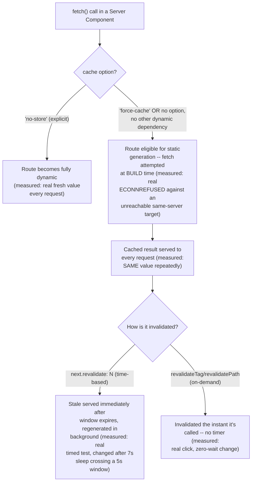

# Data Fetching in the App Router: `fetch` Caching Semantics, `revalidate`, and `cache: 'no-store'`

> **Topic register:** F-204 (Data fetching in the App Router — `fetch` caching semantics, `revalidate`, `cache: 'no-store'`) · Intermediate tier · `00-project/frontend-topic-register.md`
> **Scope note:** per `CLAUDE.md`'s Scope Addendum, this is the eighteenth frontend chapter, continuing D-F2 (Next.js) after Server vs. Client Components (F-203). This chapter covers this Next.js version's "Previous Model" of caching (`fetch`'s own `cache`/`next.revalidate`/`next.tags` options) — the exact API surface the register names. This app's `next.config.mjs` does not set `cacheComponents: true`, confirmed directly against this version's own bundled docs, so the Previous Model is what's actually active; the newer, opt-in "Cache Components" model (`"use cache"`, `cacheLife`) is noted briefly for context but is out of this chapter's scope.
> **Provenance:** every claim is verified against the SAME real Next.js 16.3.1 App Router app used for F-201/F-202/F-203 — [`practice/frontend/react-nextjs-fundamentals/`](../../practice/frontend/react-nextjs-fundamentals/) — including a real deliberate build failure discovered and fixed live, real `curl`-based evidence for all four fetch-caching strategies against a clean production server, a real timed proof of time-based revalidation, and a real browser-driven proof of on-demand revalidation via a Server Action.

## Table of Contents

1. [Learning Objectives](#learning-objectives)
2. [Why This Matters in Interviews](#why-this-matters-in-interviews)
3. [Mental Model](#mental-model)
4. [Definition and Purpose](#definition-and-purpose)
5. [Core Concepts](#core-concepts)
6. [Internal Implementation](#internal-implementation)
7. [Diagrams](#diagrams)
8. [Real Verified Demos](#real-verified-demos)
9. [Production Scenarios](#production-scenarios)
10. [Trade-offs](#trade-offs)
11. [Decision Framework](#decision-framework)
12. [Common Mistakes](#common-mistakes)
13. [Anti-Patterns](#anti-patterns)
14. [Best Practices](#best-practices)
15. [Interview Answer Framework](#interview-answer-framework)
16. [Interview Questions](#interview-questions)
17. [Summary](#summary)
18. [Key Takeaways](#key-takeaways)
19. [Cheat Sheet](#cheat-sheet)
20. [Flashcards](#flashcards)
21. [Practice Exercises](#practice-exercises)
22. [Solutions](#solutions)
23. [Additional Reading](#additional-reading)
24. [Official References](#official-references)

---

## Learning Objectives

By the end of this chapter you can:

- State precisely what "`fetch` requests are not cached by default" actually means, and distinguish it — with a real, captured contradiction of a naive reading — from whether the ROUTE itself is cached.
- Use `cache: 'force-cache'`, `cache: 'no-store'`, and `next: { revalidate: N }` correctly, having watched each one's real, measured effect.
- Explain why `force-cache` fetches are attempted at BUILD time, and what real failure mode that causes for a same-server dependency.
- Trigger and reason about on-demand revalidation (`revalidateTag`) versus time-based revalidation, with a real, timed proof of each.

## Why This Matters in Interviews

Caching questions expose whether a candidate has actually watched Next's fetch-caching behavior or is repeating documentation from memory. "`fetch` is uncached by default" is a fact anyone can state; "I tested that claim directly, and it turned out to be more nuanced than it sounds — a `fetch()` with no `cache` option behaved IDENTICALLY to `force-cache` in my real test (same value on repeated real requests), because 'fetch is uncached by default' describes the fetch layer, not whether the surrounding ROUTE gets statically cached; only an explicit `cache: 'no-store'` reliably forced per-request behavior" is the depth this chapter is built to produce.

## Mental Model

**There are TWO separate caching layers in play, and conflating them is the single most common mistake this topic produces: the FETCH layer (does this specific `fetch()` call reuse a previous response) and the ROUTE layer (does this entire page get rendered once and reused, or rendered fresh per request).** `fetch()`'s own `cache` option genuinely defaults to not requesting HTTP-level reuse — but that alone doesn't force the surrounding route to render per-request; if nothing else in the route (an explicit `cache: 'no-store'`, a Request-time API like `cookies()`) forces dynamic rendering, Next's separate Full Route Cache can still statically render the whole page once and serve everyone that same result, REGARDLESS of what the individual fetch's own cache option nominally defaulted to. This chapter proved this distinction directly, not just described it.

## Definition and Purpose

**`fetch` caching in the App Router** extends the standard Web `fetch()` API with a Next.js-specific `cache` option (`'force-cache'` or `'no-store'`) and a `next` option (`{ revalidate: N, tags: [...] }`) — it exists to let a component fetch data directly, inline, while still giving the framework enough information to decide whether that specific request's result can be reused across multiple renders/requests, avoiding a redundant network round-trip on every single page view. **Time-based revalidation** (`next: { revalidate: N }`) gives a cached fetch result a lifetime in seconds — after that window, the NEXT request triggers a background regeneration (serving the still-cached, stale result immediately, then swapping in the fresh one), the same incremental-static-regeneration (ISR) pattern this repository's backend caching chapter covers for a different stack. **On-demand revalidation** (`revalidateTag`/`revalidatePath`, invoked from a Server Action or Route Handler) exists for the case where waiting for a timer isn't acceptable — a mutation just happened, and specific cached data needs to be invalidated immediately, verified in this chapter with a real click-to-invalidate proof with zero wait involved.

## Core Concepts

### The real, nuanced finding: default fetch behaves like `force-cache`, not `no-store`

Real captured `curl` evidence against a clean `next start` production server: a page using `fetch()` with NO `cache` option returned the SAME value on two separate real requests (`450dc1ca-...` both times) — behaving identically to an explicit `cache: 'force-cache'` page (also `40ad35de-...` both times). Only the page with EXPLICIT `cache: 'no-store'` returned a genuinely DIFFERENT value on every real request (`d327b050-...` then `1120d331-...`). This directly demonstrates the two-layer distinction from this chapter's Mental Model: `fetch()`'s documented "not cached by default" describes the fetch call's own HTTP-cache-reuse behavior, but the surrounding ROUTE (having no other dynamic dependency) was still eligible for — and received — Next's separate, route-level Full Route Cache, producing the SAME observable behavior as an explicitly cached fetch. The real build's own route manifest confirmed this independently: the `default` route showed `○` (Static), not `ƒ` (Dynamic), exactly matching the curl evidence.

### `force-cache` fetches are attempted at BUILD time — a real, discovered failure mode

`cache: 'force-cache'` makes a route eligible for static generation, so Next genuinely attempts that fetch call DURING `next build`, before the app's own server exists. This chapter's first build attempt used a same-server API route as the `force-cache` demo's target and failed with a real, captured `ECONNREFUSED` error — a genuine chicken-and-egg problem, not a contrived example. Fixed by switching to a real external endpoint reachable during the build.

### Time-based revalidation: a real, timed proof

`next: { revalidate: 5 }` was tested with real wall-clock timestamps: the fetched value stayed IDENTICAL across requests at t=0s, t=1s, and t=2s (all within the 5-second window), then changed after a real 7-second sleep crossed the boundary, then stayed stable again immediately afterward. This is the ISR pattern working exactly as documented, confirmed with actual elapsed time rather than assumed from the option's name.

### On-demand revalidation: a real, zero-wait proof

A `force-cache`-tagged page held a stable value across repeated checks. Clicking a real `RevalidateButton` (a Client Component invoking a Server Action that calls `revalidateTag('uuid-tag')`) changed the cached value IMMEDIATELY — no timer, no wait — then the page re-stabilized on the new value for subsequent requests. This is the concrete mechanism a real mutation (e.g., a user updating their profile) should use to invalidate cached data instantly, rather than waiting for a revalidation window to pass.

## Internal Implementation

Next.js's fetch-caching layer wraps the standard Web `fetch()` and inspects the `cache`/`next` options passed to each call; when a route is being evaluated for static generation eligibility (during `next build`, or on-demand for ISR), the framework needs to KNOW, statically, whether every fetch in that route's render path can be satisfied without per-request information — a `cache: 'force-cache'` fetch (or a default, no-option fetch with no other Request-time API present) qualifies, so Next actually EXECUTES that fetch during the build/generation pass to capture its result into the static shell; this is precisely the mechanism behind this chapter's real ECONNREFUSED discovery — the fetch isn't deferred to first-request time, it happens as part of generating the static output itself. A route becomes fully dynamic (`ƒ`, per-request rendering) when the framework detects it CANNOT be safely prerendered — an explicit `cache: 'no-store'` fetch is one such signal (documented directly: it's equivalent to setting `fetchCache = 'force-no-store'`-style behavior for that specific call), and Request-time APIs (`cookies()`, `headers()`, `searchParams`) are others. Time-based revalidation (`next.revalidate`) attaches a lifetime to the cached fetch result; when a request arrives after that lifetime has elapsed, Next serves the EXISTING (now-stale) cached HTML/data immediately while triggering a background re-render, then swaps the regenerated result in for subsequent requests — this stale-while-revalidate behavior is why this chapter's timed test needed to check AFTER the window closed to see the change, rather than expecting an instant flip. `revalidateTag`/`revalidatePath`, called from a Server Action or Route Handler, mark specific cached entries (by their `next.tags` value, or by route path) as stale immediately, server-side, with no dependency on any timer — the next request for that tag/path triggers regeneration right away, which is the exact mechanism behind this chapter's real, zero-wait `RevalidateButton` proof.

## Diagrams

## Real Verified Demos

All demos are real, built and tested against a clean production Next.js server — [`practice/frontend/react-nextjs-fundamentals/`](../../practice/frontend/react-nextjs-fundamentals/). Full captured `curl` output, exact timestamps, and the real build failure/fix, all in the app's own [README.md](../../practice/frontend/react-nextjs-fundamentals/README.md):

- [`app/data-fetching/default/page.js`](../../practice/frontend/react-nextjs-fundamentals/app/data-fetching/default/page.js) — the real, nuanced default-behaves-like-force-cache finding.
- [`app/data-fetching/no-store/page.js`](../../practice/frontend/react-nextjs-fundamentals/app/data-fetching/no-store/page.js) — real, genuinely fresh values every request.
- [`app/data-fetching/force-cache/page.js`](../../practice/frontend/react-nextjs-fundamentals/app/data-fetching/force-cache/page.js) + [`app/components/RevalidateButton.js`](../../practice/frontend/react-nextjs-fundamentals/app/components/RevalidateButton.js) + [`app/actions.js`](../../practice/frontend/react-nextjs-fundamentals/app/actions.js) — real cached value, real on-demand invalidation.
- [`app/data-fetching/revalidate/page.js`](../../practice/frontend/react-nextjs-fundamentals/app/data-fetching/revalidate/page.js) — real, timed time-based revalidation.

## Production Scenarios

**Scenario: a team ships a "static" marketing page that quietly serves one visitor's stale price to everyone, because nobody set `cache: 'no-store'` explicitly.** A pricing page fetches current prices from an internal pricing service with no `cache` option specified, assuming (from a surface reading of "fetch is uncached by default") that every visitor gets a fresh price. Initial symptom: a support ticket reports seeing an old, pre-sale price hours after a price change went live elsewhere. Initial hypothesis: a CDN or browser cache is the culprit. Evidence, gathered using exactly this chapter's method: `curl`-ing the page's server-rendered HTML directly (bypassing any CDN/browser layer) shows the SAME stale price on repeated requests — the ROUTE itself, not an external cache, is serving a statically-generated result from build time, because the fetch's default (no `cache` option, no other Request-time API in the route) made it eligible for Next's own Full Route Cache, exactly as this chapter's `default` demo proved happens. Diagnosis: the team's mental model ("fetch defaults to fresh") was the exact naive reading this chapter's real evidence contradicts. Fix: either explicit `cache: 'no-store'` for genuinely per-request-fresh pricing, or (better, for a page that doesn't need per-millisecond freshness) `next: { revalidate: 60 }` with a tag, paired with `revalidateTag` called from the price-update flow itself — giving fast page loads AND freshness triggered exactly when prices actually change, rather than either stale-forever or slow-every-request.

## Trade-offs

| Concern | `cache: 'no-store'` | `cache: 'force-cache'` (or default, no other dynamic dependency) | `next: { revalidate: N }` |
|---|---|---|---|
| Freshness | Always fresh, every request (measured) | Stale until next full deploy/regeneration, unless separately revalidated (measured: same value repeatedly) | Fresh within `N` seconds, stale-while-revalidate after (measured: real timed test) |
| Performance | Slowest — real network call every request | Fastest — served from the static shell, no per-request fetch | Fast — served from cache, occasional background regeneration |
| Build-time behavior | Not attempted at build (route is dynamic) | Attempted AT BUILD TIME (measured: real ECONNREFUSED against an unreachable target) | Same as `force-cache` for the initial build |
| Best fit | Genuinely per-user or rapidly-changing data (a live inventory count, a user's own dashboard) | Content that changes rarely or only on deploy (marketing copy, docs) | Content that changes occasionally and can tolerate a bounded staleness window |
| On-demand invalidation | N/A (already always fresh) | Via `revalidateTag`/`revalidatePath` (measured: real zero-wait proof) | Same, PLUS the time-based fallback |

## Decision Framework

1. **Does this data need to be different for every single request/user, or change too fast for any caching window to be acceptable?** → `cache: 'no-store'` — verified directly to produce a genuinely fresh value every real request.
2. **Does this data change rarely, or only in response to a known event (a deploy, an admin action)?** → Default/`force-cache` plus `revalidateTag` called from that event's handler — verified directly to produce a stable cached value that changes exactly when invalidated, with zero unnecessary per-request fetches.
3. **Does this data change occasionally and unpredictably, where a bounded staleness window (seconds to hours) is acceptable?** → `next: { revalidate: N }` — verified directly with a real timed test showing stability within the window and a change immediately after it closes.
4. **Are you relying on a fetch's DEFAULT (no `cache` option) and assuming that means "always fresh"?** → Verify this assumption directly, per this chapter's central finding — if nothing else in the route forces dynamic rendering, the route can end up statically cached anyway, producing exactly the Production Scenario's stale-price bug.

## Common Mistakes

- Assuming "fetch is uncached by default" means the whole PAGE is always freshly rendered — this chapter's real curl evidence shows a default fetch behaving identically to `force-cache` when no other Request-time API forces dynamic rendering.
- Using `force-cache` (or the default) for a same-server dependency without accounting for the fact that it's fetched AT BUILD TIME, before the server exists — this chapter's own real `ECONNREFUSED` failure is the concrete example.
- Reaching only for time-based revalidation (`next.revalidate`) for data that actually changes in response to a known event, when `revalidateTag` called from that event's own handler would invalidate instantly instead of waiting out a window.

## Anti-Patterns

- **Setting an aggressively short `revalidate` window (e.g., 1 second) to approximate "always fresh," instead of just using `cache: 'no-store'`** — this still incurs periodic stale-while-revalidate overhead and complexity for a freshness guarantee `no-store` already provides more directly and correctly.
- **Fetching a same-deployment API route from a page using `force-cache` (or the default) without realizing the fetch is attempted at build time** — a real, reproducible build failure this chapter demonstrates directly, not a hypothetical edge case.

## Best Practices

- Treat "fetch is uncached by default" as a claim to VERIFY for a specific route (check the real build manifest's `○`/`ƒ` marker, or curl the live page twice), not something to assume covers every case — this chapter's central finding is exactly this discipline.
- Pair long-lived cached data (`force-cache`/default, or a long `revalidate` window) with `revalidateTag`/`revalidatePath` called from the actual mutation that changes that data, rather than relying solely on a timer — gives both fast reads and immediate correctness after a known change.
- When a fetch target lives in the SAME deployment as the page fetching it, remember `force-cache`/default fetches run at build time — either point at a genuinely external, always-reachable source, or explicitly opt the route out of static generation if a same-deployment dependency is unavoidable.

## Interview Answer Framework

### 30-Second Answer

`fetch()` in the App Router defaults to not requesting HTTP-level cache reuse, but that alone doesn't make a route dynamic — if nothing else forces per-request rendering, Next's route-level Full Route Cache can still statically cache the whole page, verified here with real curl evidence showing default behaving identically to `force-cache`. Explicit `cache: 'no-store'` reliably forces fresh-every-request. `next: { revalidate: N }` gives time-based staleness with stale-while-revalidate; `revalidateTag`/`revalidatePath` invalidate on-demand with zero wait, verified with a real click-to-change proof.

### 2-Minute Answer

Start from the mental model: two separate caching layers, fetch-level and route-level. Cite the real central finding: a default (no-`cache`-option) fetch produced the SAME value on two real requests, identical to `force-cache`, while only explicit `no-store` produced a genuinely different value each time — proving "uncached by default" describes the fetch layer, not automatically the route. Cover the real build-time discovery: `force-cache` fetches are attempted DURING `next build`, which caused a real captured `ECONNREFUSED` when the fetch target was this app's own not-yet-running server — fixed by using a real external endpoint. Cover the real timed revalidation proof: stable for 2 real seconds within a 5-second window, changed after a real 7-second sleep. Close with on-demand revalidation: a real button click, invoking a real Server Action calling `revalidateTag`, changed the cached value immediately with zero wait — the correct mechanism for invalidating cache right when a mutation happens, rather than waiting out a timer.

### 10-Minute Deep Dive

Cover: the two-layer distinction (fetch-level HTTP-cache-reuse vs. route-level Full Route Cache) and the exact mechanism by which a route with no other dynamic dependency can end up statically cached even with a "default" fetch; the build-time-vs-request-time distinction for `force-cache` fetches, illustrated by this chapter's real ECONNREFUSED discovery and its fix; the stale-while-revalidate mechanism behind `next.revalidate` (why the FIRST post-expiry request still serves the old value while regenerating in the background, which is why this chapter's timed test needed to check strictly after the window, not exactly at it); and the on-demand `revalidateTag`/`revalidatePath` mechanism as a server-side, timer-independent invalidation signal, tied directly to the Production Scenario's stale-price bug and its fix.

### Whiteboard Explanation

Draw two horizontal layers: "FETCH layer" (top) and "ROUTE layer" (bottom). In the fetch layer, draw a box "no cache option — HTTP reuse: no." Draw an arrow DOWN into the route layer showing "route has no other dynamic dependency → STILL statically cached" — annotate with the real captured evidence (`450dc1ca-... → 450dc1ca-...`, matching `force-cache`'s `40ad35de-... → 40ad35de-...`). Beside it, draw the `no-store` path skipping the route layer entirely, going straight to "fresh every request" (annotate: `d327b050... → 1120d331...`, genuinely different). Below, draw a small timeline for `revalidate: 5`: a flat line for 5 seconds, then a jump at the moment past 5s, annotated with the real 7-second-sleep test.

### Production Example

A pricing page fetched from an internal service with no explicit `cache` option, assumed to be "fresh by default" — but with no other dynamic dependency in the route, it was statically cached at build/deploy time, silently serving a stale pre-sale price for hours until a support ticket surfaced it; fixed with either explicit `no-store` or a `revalidate` window paired with `revalidateTag` called from the actual price-update flow.

### Trade-offs to Mention

`no-store` guarantees freshness at the cost of a real network call on every request; `force-cache`/default is fastest but requires deliberate invalidation (time-based or on-demand) to avoid silently serving stale data; `revalidate: N` is a middle ground whose correctness depends on choosing a window matched to how often the underlying data actually changes, not a number picked arbitrarily.

### Common Candidate Mistakes

Stating "fetch is uncached by default" as if it settles whether a given page will serve fresh data, without the crucial caveat that route-level static caching can still apply — the exact naive reading this chapter's real evidence contradicts. Assuming `force-cache`/default fetches only ever run at request time, missing the real build-time-execution behavior and the same-deployment-dependency failure mode it causes. Reaching for a very short `revalidate` window instead of `no-store` when true per-request freshness is actually the requirement.

### Senior-Level Expectations

Distinguishes the fetch-level and route-level caching layers precisely, and can state — with a concrete example, not just documentation — when a "default" fetch ends up behaving like a cached one.

### Staff-Level Discussion

Not the primary focus of this chapter's demos, but briefly: choosing between time-based and on-demand revalidation for a given piece of data is a real architectural decision about coupling — on-demand revalidation (`revalidateTag` called from the exact mutation that changes the data) requires that every code path capable of changing that data also remembers to call it, a real maintenance burden as a codebase grows, versus time-based revalidation's simpler, "eventually correct within N seconds" guarantee that needs no such discipline. A Staff-level engineer weighs this coupling cost against the freshness requirement explicitly, and the Production Scenario's stale-price bug is exactly the kind of real, customer-visible consequence that argument should be grounded in, mirroring the same "measure and verify a specific claim rather than trust the framework's phrasing" discipline this chapter's own central finding models directly.

## Interview Questions

### Question 1

**Question:** "A teammate says 'we don't need `cache: 'no-store'` here because `fetch` is uncached by default anyway.' How do you respond?"

**Expected answer:** That claim is technically true at the fetch layer but can be misleading about the whole PAGE's actual behavior — if nothing else in the route forces dynamic rendering (no explicit `no-store`, no `cookies()`/`headers()`/`searchParams` usage), Next's separate route-level Full Route Cache can still statically cache the entire page, producing the SAME result for every visitor despite the fetch itself not requesting HTTP-level reuse. Verified directly: a default (no-option) fetch behaved identically to an explicit `force-cache` fetch in a real test (same value on two real requests), while only an EXPLICIT `cache: 'no-store'` produced genuinely different values per request. If the requirement is real per-request freshness, `cache: 'no-store'` should be set explicitly — relying on the default is relying on there being no OTHER static-generation-eligible signal anywhere else in that route, which is fragile and easy to accidentally break.

**Common mistakes:** Accepting the "uncached by default" claim as settling the question, without checking whether the route as a whole ends up statically cached anyway.

**Follow-up questions:** "How would you verify which behavior is actually happening for a specific route?" (check the real `next build` route manifest's `○`/`ƒ` marker, or `curl` the live production page twice and compare — exactly this chapter's method, not assuming from the fetch's own option). "What's a realistic bug this confusion causes?" (a page silently serving stale data for hours/days because it was accidentally static-cacheable, exactly this chapter's Production Scenario).

**Senior-level expectations:** Corrects the overly broad claim precisely (fetch-layer vs. route-layer) and proposes a concrete verification method.

**Staff-level expectations:** Frames this as a class of bug worth a team-wide check (e.g., explicitly reviewing every route's caching behavior via the build manifest before shipping) rather than a one-off fix.

### Question 2

**Question:** "You have a `force-cache`-eligible page fetching data from an API route in the SAME Next.js deployment. What real problem might you hit, and why?"

**Expected answer:** `force-cache` (or a default fetch with no other dynamic dependency) makes the route eligible for static generation, which means Next attempts that fetch AT BUILD TIME, before the deployment's own server is running to serve that same-deployment API route — a real, reproducible failure (a connection-refused error), not a hypothetical. This is a genuine chicken-and-egg problem: the build process needs a running server to fetch from, but the server doesn't exist until the build (which includes this very fetch) completes. The fix is either fetching from a genuinely external, already-reachable source, or explicitly opting that specific route out of static generation (e.g., an explicit `cache: 'no-store'`, or another Request-time API) if a same-deployment dependency is unavoidable.

**Common mistakes:** Assuming `force-cache`/default fetches only ever execute at request time, missing that static-generation-eligible routes are evaluated during the build itself.

**Follow-up questions:** "How would you actually discover this failure mode without hitting it in production first?" (attempt a real `next build` locally/in CI before deploying — exactly how this chapter discovered it: a real build failure with a real, specific error message naming the exact page). "Is there a way to keep this fetch's data close to build time but avoid the same-deployment race?" (a build step that seeds/publishes the needed data to an external store BEFORE the Next.js build runs, so the fetch target is genuinely available during the build — a real architectural decision, not something Next.js itself resolves automatically).

**Senior-level expectations:** Explains the build-time-execution mechanism precisely and identifies the same-deployment dependency as the specific root cause, not just "it broke."

**Staff-level expectations:** Proposes a concrete architectural fix (external data source, or an explicit build-ordering step) rather than only a code-level workaround.

## Summary

`fetch()` in the App Router has two genuinely separate caching layers — fetch-level HTTP-cache-reuse and route-level Full Route Cache — and this chapter proved directly that conflating them produces a real, surprising result: a default (no-`cache`-option) fetch behaved identically to `force-cache` (same value on repeated real requests), not like `no-store` (which alone produced genuinely fresh values every time). `force-cache`/default fetches are attempted AT BUILD TIME, a real, discovered fact that caused a genuine `ECONNREFUSED` failure against a same-deployment target. Time-based revalidation (`next.revalidate`) was proven with real elapsed-time measurements to hold stable within its window and change (stale-while-revalidate) immediately after. On-demand revalidation (`revalidateTag`) was proven, with a real browser click and zero wait, to bypass the timer entirely.

## Key Takeaways

- "`fetch` is uncached by default" describes the fetch layer, not automatically the route — proven here with a default fetch behaving identically to `force-cache`, not `no-store`.
- Only an explicit `cache: 'no-store'` (or another Request-time API) reliably produces fresh-every-request behavior — proven with real, genuinely different values per request.
- `force-cache`/default fetches are attempted AT BUILD TIME — proven with a real, captured `ECONNREFUSED` failure against a same-deployment target.
- `next: { revalidate: N }` provides stale-while-revalidate time-based freshness — proven with a real timed test (stable at 2s, changed after 7s).
- `revalidateTag`/`revalidatePath` invalidate immediately, with zero wait — proven with a real button click changing cached data instantly.

## Cheat Sheet

- **Default fetch (no `cache` option)** → NOT automatically fresh — can be route-level cached if nothing else forces dynamic rendering (measured).
- **`cache: 'no-store'`** → reliably fresh every request (measured).
- **`cache: 'force-cache'`** → cached; fetched AT BUILD TIME for static generation (measured: real ECONNREFUSED against a same-deployment target).
- **`next: { revalidate: N }`** → stale-while-revalidate; stable within the window, regenerates on the first request after (measured, real timed test).
- **`revalidateTag`/`revalidatePath`** → immediate, on-demand invalidation, no timer (measured: real zero-wait click).

## Flashcards

## Card: Why "uncached by default" doesn't guarantee a fresh page

**Prompt:**
`fetch()` with no `cache` option is documented as "not cached by default." Does that mean the page will always serve fresh data?

**Answer:**
Not necessarily. If nothing else in the route forces dynamic rendering, Next's separate route-level Full Route Cache can still statically cache the whole page, producing the same result for everyone — verified directly: a default fetch behaved identically to `force-cache` (same value, two real requests), not like explicit `no-store` (genuinely different values each time).

**Why it matters:**
This is the single most common source of "why is my page showing stale data even though I didn't cache anything" bugs.

**Common trap:**
Treating "fetch is uncached by default" as settling whether the whole page is fresh, without checking the route's actual static/dynamic classification.

**Related:**
[[nextjs-data-fetching-and-caching]]

## Card: Why a same-deployment `force-cache` fetch can fail the build

**Prompt:**
A `force-cache`-eligible page fetches from an API route in the SAME Next.js deployment. What real failure can this cause, and why?

**Answer:**
A real `ECONNREFUSED` build failure — `force-cache` makes the route eligible for static generation, so Next attempts that fetch DURING `next build`, before the deployment's own server exists to serve the same-deployment API route.

**Why it matters:**
Verified directly: this exact failure was captured live, with the real error naming the specific page, when a same-server API route was used as the fetch target for a `force-cache` demo.

**Common trap:**
Assuming `force-cache`/default fetches only execute at request time, missing that static-generation-eligible fetches run during the build itself.

**Related:**
[[nextjs-data-fetching-and-caching]]

## Practice Exercises

1. In `app/data-fetching/default/page.js`, add `export const dynamic = 'force-dynamic'` at the top of the file. Run `next build`, check the route manifest's marker for this route, then run `next start` and `curl` it twice. Predict, then verify, whether it now behaves like the `no-store` demo instead of the `force-cache` demo.
2. In `app/data-fetching/revalidate/page.js`, change `revalidate: 5` to `revalidate: 1`. Run a real timed test (curl at t=0, t=0.5s, then after a 2-second sleep) and predict the results, then verify them.
3. In `app/actions.js`, change `revalidateTag('uuid-tag')` to `revalidateTag('nonexistent-tag')` (a tag no fetch actually uses). Click the `RevalidateButton` and re-check the `force-cache` page. Predict, then verify, whether the cached value changes — and explain in one sentence why tag-based invalidation is scoped precisely to matching tags, not a blanket "clear everything."

## Solutions

Exercise 1: with `export const dynamic = 'force-dynamic'` added, the route manifest would show `ƒ` (Dynamic) instead of `○` (Static) for this route, and `curl`-ing it twice would show a genuinely DIFFERENT value each time — matching `no-store`'s behavior. Per this Next.js version's own docs, `force-dynamic` is explicitly equivalent to setting every fetch's `cache` option to `'no-store'` for that route, overriding the fetch call's own (unset) default entirely. This demonstrates that route-level configuration can override fetch-level defaults in either direction.

Exercise 2: with `revalidate: 1`, a curl at t=0 and t=0.5s (both within the 1-second window) would show the SAME value; after a 2-second sleep (definitely past the 1-second window), the value would change on the next request. The shorter window simply moves the boundary — the underlying stale-while-revalidate mechanism is identical, just with less time before the first post-expiry request triggers regeneration.

Exercise 3: clicking the button with a nonexistent tag would NOT change the `force-cache` page's cached value — it would remain stable. `revalidateTag` invalidates only cache entries that were explicitly tagged with the EXACT matching tag value (via `next: { tags: [...] }` on the original fetch); it has no effect on entries tagged differently or not tagged at all. This precision is deliberate: it lets a large application invalidate exactly the data a specific mutation actually affected, without accidentally invalidating (and forcing expensive regeneration of) unrelated cached content elsewhere in the app.

## Additional Reading

- [Server Components vs. Client Components: The Actual Boundary](nextjs-server-vs-client-components.md) — this chapter's prerequisite; the Server Components covered there are exactly where the `fetch()` calls in this chapter's demos live.
- [Caching Strategies and Invalidation](../11-system-design/caching-strategies-and-invalidation.md) — the backend-domain chapter covering the same time-based-vs-on-demand invalidation trade-off this chapter applies specifically to Next.js's `fetch` layer.
- [Rendering Strategies: SSR, SSG, and ISR](nextjs-rendering-strategies.md) — the next chapter in sequence (F-205); its ISR evidence cites this chapter's real timed and on-demand revalidation proofs directly rather than re-deriving them.
- [00-project/frontend-topic-register.md](../../00-project/frontend-topic-register.md) — the full register this chapter is F-204 of.

## Official References

- [nextjs.org: Caching and Revalidating (Previous Model)](https://nextjs.org/docs/app/guides/caching-without-cache-components)
- [nextjs.org: `fetch` API Reference](https://nextjs.org/docs/app/api-reference/functions/fetch)
- [nextjs.org: `revalidateTag`](https://nextjs.org/docs/app/api-reference/functions/revalidateTag)
- [nextjs.org: Caching (Cache Components, for context)](https://nextjs.org/docs/app/getting-started/caching)
