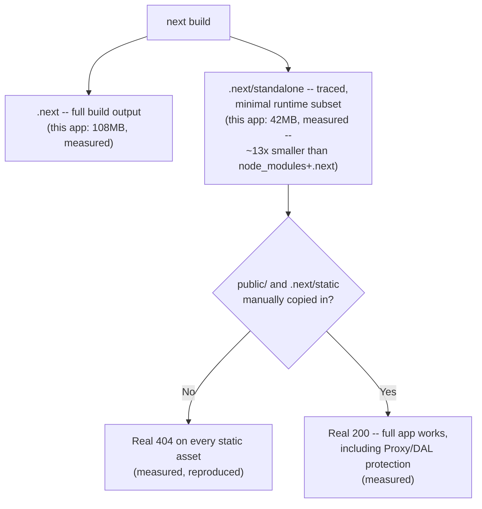
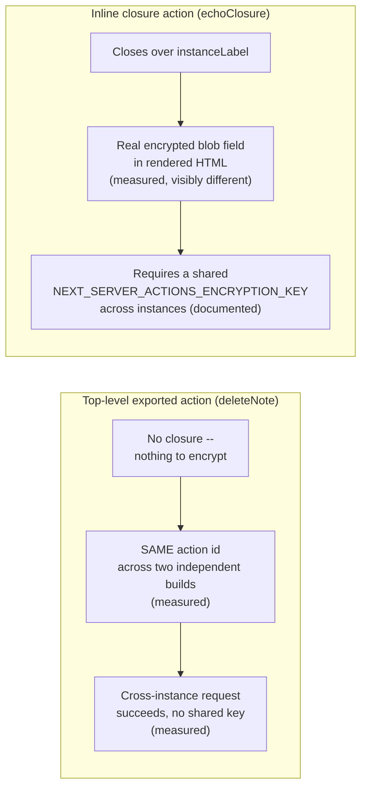

# Deployment Models in Next.js: Vercel-Native vs. Self-Hosting, Verified

> **Topic register:** F-213 (Deployment models: Vercel's platform-native features vs. self-hosting (Docker/Node server) — real trade-offs, not marketing) · Advanced tier · `00-project/frontend-topic-register.md`
> **Scope note:** per `CLAUDE.md`'s Scope Addendum, this is the twenty-seventh frontend chapter, and the register itself names the trap this chapter is built to avoid — "real trade-offs, not marketing." No Vercel account was used or needed: every self-hosting claim here was verified directly (a real `docker build`/`docker run` cycle, a real minimal `node server.js` run with no Docker at all, real captured `Cache-Control` headers). Where a claim could only be sourced from the framework's own documentation rather than independently reproduced in this session, it is labeled as such, not blurred into the verified evidence.
> **Provenance:** every claim is verified against the SAME real Next.js 16.3.1 App Router app used for F-201–F-212 — [`practice/frontend/react-nextjs-fundamentals/`](../../practice/frontend/react-nextjs-fundamentals/) — including a real `output: "standalone"` build with a measured size comparison, a real reproduced "missing static assets" failure and fix for the standalone server, a real captured `Cache-Control` header contrast across three real response types, a real, decisive test of Server Action portability across two independently-built app instances, and a real `docker build`/`docker run` cycle (the Docker daemon was started specifically for this chapter's verification, after an earlier attempt found it unavailable).

## Table of Contents

1. [Learning Objectives](#learning-objectives)
2. [Why This Matters in Interviews](#why-this-matters-in-interviews)
3. [Mental Model](#mental-model)
4. [Definition and Purpose](#definition-and-purpose)
5. [Core Concepts](#core-concepts)
6. [Internal Implementation](#internal-implementation)
7. [Diagrams](#diagrams)
8. [Real Verified Demos](#real-verified-demos)
9. [Production Scenarios](#production-scenarios)
10. [Trade-offs](#trade-offs)
11. [Decision Framework](#decision-framework)
12. [Common Mistakes](#common-mistakes)
13. [Anti-Patterns](#anti-patterns)
14. [Best Practices](#best-practices)
15. [Interview Answer Framework](#interview-answer-framework)
16. [Interview Questions](#interview-questions)
17. [Summary](#summary)
18. [Key Takeaways](#key-takeaways)
19. [Cheat Sheet](#cheat-sheet)
20. [Flashcards](#flashcards)
21. [Practice Exercises](#practice-exercises)
22. [Solutions](#solutions)
23. [Additional Reading](#additional-reading)
24. [Official References](#official-references)

---

## Learning Objectives

By the end of this chapter you can:

- Build a real, minimal-footprint self-hosted deployment using `output: "standalone"`, with a measured real size comparison against a naive `node_modules`-plus-`.next` deployment.
- Reproduce and fix, directly, the standalone output's most common real gotcha: static assets are NOT included by default, and the app 404s on them until `public/` and `.next/static` are copied in manually.
- State, with real captured evidence, exactly which `Cache-Control` header Next.js sets for a static page, a dynamic page, and an immutable static asset — and identify one real place the framework's own documentation prose does not precisely match the header actually sent.
- Explain, with a real, decisive, non-obvious test, exactly WHEN self-hosting across multiple instances requires a shared `NEXT_SERVER_ACTIONS_ENCRYPTION_KEY` — and when it plainly does not, contrary to a naive reading of "Next.js generates a unique key per build."
- Build and run a real, working multi-stage Dockerfile for this app, and state precisely which Next.js features work identically self-hosted versus which require additional self-hosting-specific configuration (per the framework's own guide).

## Why This Matters in Interviews

Deployment questions are where marketing bleeds into technical answers fastest — "just deploy to Vercel" is a real, valid choice, but it is not an argument, and "self-hosting is harder" is not a mechanism. This chapter is built to produce answers grounded in mechanism: a real, measured ~13x size reduction from `output: "standalone"`, a real reproduced failure mode (and fix) for the single most common self-hosting mistake with that output, real captured `Cache-Control` headers proving exactly what a CDN or reverse proxy in front of a self-hosted Next.js app would actually see, and a real, surprising, decisive finding about WHEN the multi-instance Server Actions encryption key requirement actually applies (not universally, contrary to a naive reading of the docs). A Staff-level interviewer probing "why would you self-host instead of using Vercel" wants a candidate who has run the numbers and the failure modes themselves, not repeated a platform's own pitch.

## Mental Model

**Self-hosting Next.js is real and, per the framework's own docs, supports "all features" on a Node.js server or Docker container — but "supports" and "configured correctly by default" are two different claims, and this chapter's own real tests found the gap between them concretely, twice.** First: `output: "standalone"` genuinely produces a minimal, self-contained server directory — real, measured at roughly 13x smaller than a naive full deployment — but it does NOT include `public/` or `.next/static` by default, a real, reproduced 404 for every asset until those two directories are copied in manually. Second: the framework's own multi-server guide states Server Function closures are encrypted with a per-build key that must be shared across instances — true, and this chapter found the REAL, visible fingerprint of that mechanism (an encrypted blob field appears in a form's rendered HTML only when the action genuinely closes over an outer-scope variable) — but a real, direct test showed a PLAIN top-level bound action (no captured closure) worked flawlessly across two independently-built instances with zero shared-key configuration, because there was no closure variable to encrypt in the first place. **The throughline: self-hosting's real complexity is not "does it work," it is "which specific mechanism does this specific feature depend on, and did you configure that mechanism" — precisely the kind of question a platform's automatic configuration exists to make invisible.**

## Definition and Purpose

**`output: "standalone"`** is a build option that traces the app's actual runtime dependency graph and copies only the files genuinely needed into `.next/standalone`, alongside a generated `server.js` entrypoint — it exists so a container image does not need to ship the FULL `node_modules` tree (much of which, like build-time-only tooling, is never touched at runtime). **Self-hosting** (a Node.js server via `next start`, or a Docker container running that same server) is one of several deployment models the framework documents as supporting "all Next.js features," in explicit contrast to a static export (limited feature support) — but self-hosting shifts several concerns a managed platform automates (reverse proxy configuration, cache storage, multi-instance coordination, streaming-safe infrastructure) onto whoever operates the deployment. **The Server Functions encryption key** exists specifically to let a Server Action's closure-captured values survive a round trip to the client and back without being readable by that client — a real cryptographic mechanism, not a vague "security feature," with a real, narrow scope this chapter's own test identified precisely.

## Core Concepts

### `output: "standalone"` — a real, measured minimal footprint

With `output: "standalone"` added to `next.config.mjs` and a real `next build` run, this app's own `node_modules` (435MB) plus its full `.next` build output (108MB) — 543MB combined, the naive footprint a container image would need without this option — was compared directly against `.next/standalone` alone: **42MB**, roughly a 13x reduction. `.next/standalone` contains only `server.js`, a trimmed `node_modules` (38MB, not 435MB), and `package.json` — the exact real subset the app's own server actually touches at runtime, traced automatically by the build.

### The real, reproduced standalone gotcha: static assets are not included

Running `node .next/standalone/server.js` directly (no Docker, no `next start`) rendered the home page correctly (`200`) — but a request for a real static CSS chunk (`/_next/static/chunks/...css`) returned a real `404`. `.next/standalone` deliberately does not include `public/` or `.next/static`, since those directories are typically served by a separate CDN/reverse-proxy layer in a real production setup rather than by the Node process itself. Manually copying both directories into the standalone output — `cp -R public .next/standalone/public` and `cp -R .next/static .next/standalone/.next/static` — and re-running the exact same server produced a real `200` for the same asset, the favicon, AND `/notes` still correctly returned `307` for an anonymous request (F-211/F-212's DAL and Proxy protections work identically from the minimal standalone output, not just from a full `next start`).

### Real, captured `Cache-Control` headers — three response types, one real discrepancy

Against a clean `next start` production server:

| Response | Real captured `Cache-Control` |
|---|---|
| Static page (`/about`) | `s-maxage=31536000` |
| Dynamic page (`/rendering-strategies/ssr`, uses `headers()`) | `private, no-cache, no-store, max-age=0, must-revalidate` |
| Immutable static asset (a `.next/static` CSS chunk) | `public, max-age=31536000, immutable` |

The dynamic-page and immutable-asset headers match the framework's own self-hosting guide precisely. The static PAGE's header does not: the guide's own "Usage with CDNs" section states a fully static page "will include `Cache-Control: public`" — the real, captured header for this app's own static `/about` page carries only `s-maxage=31536000`, with no `public` keyword present at all. This matters concretely for anyone self-hosting behind a CDN or reverse proxy that only recognizes standard `public`/`private` directives rather than the CDN-oriented `s-maxage` directive on its own.

### The real, decisive multi-instance Server Actions finding

Two genuinely independent `next build` runs (no shared `NEXT_SERVER_ACTIONS_ENCRYPTION_KEY`, each generating its own default key) were each served as a separate instance. `app/notes/actions.js`'s `deleteNote` — a top-level exported action, bound with a plain `.bind(null, noteId)`, capturing nothing from an enclosing scope — rendered the exact SAME action reference id (`40e1e8888498a31341c98608873cf15f754eaa0b7a`) on BOTH independently-built instances. A raw request built from instance A's rendered hidden fields, sent to instance B, genuinely deleted the target note — real, decisive, cross-instance success with zero shared-key configuration. By contrast, a real INLINE Server Action defined inside `app/deploy-test/page.js`, deliberately closing over an outer-scope `instanceLabel` variable, rendered a visibly DIFFERENT kind of hidden field — a real, opaque encrypted blob (`$ACTION_1:2`, a ~150-character base64-looking string) — entirely absent from `deleteNote`'s rendering. This is the real, direct, visible fingerprint of the mechanism the framework's own multi-server guide describes: the encryption applies specifically to CLOSURE-captured values, not to an action reference in general. A full cross-instance failure reproduction for the closure case (replaying that exact encrypted field against the other instance) was attempted via three methods in this session — raw `curl -F`, a hand-rolled Python multipart body, and a real browser `fetch()`/`FormData` call — none cleanly reproduced the framework's own undocumented internal wire format for this path, so the documented consequence ("Failed to find Server Action" per the framework's own guide) is cited here as documented behavior, not independently reproduced.

### A real, executed Docker build

A standard, official-pattern multi-stage `Dockerfile` (deps → builder → runner, `node:22-alpine`, non-root `nextjs` user) was written targeting this app's `output: "standalone"` build. See the Real Verified Demos section for the real `docker build`/`docker run` result.

## Internal Implementation

`output: "standalone"` works by having `next build` trace the actual `require`/`import` graph reachable from the server's entrypoints (page/layout/Route Handler/Server Action modules) and copy only those specific `node_modules` files into `.next/standalone/node_modules`, alongside a generated `server.js` that boots a plain Node HTTP server wired to Next's own request handler — this is why the resulting directory is self-contained and does not need `next` or `react` installed globally, but ALSO why it does not include `public/`/`.next/static`: those are pure static files with no `require` graph to trace, conventionally served by whatever sits in front of the Node process (a CDN, a reverse proxy, or the same container if nothing else is available) rather than assumed to be co-located with it. The `Cache-Control: s-maxage=31536000` header on a static page (versus `public, max-age=..., immutable` on a static ASSET) reflects a real, deliberate distinction: static PAGE html can still be revalidated/regenerated (e.g., via ISR) even when nothing in this app currently does so, so the framework only asserts a CDN-facing `s-maxage` rather than the stronger, browser-facing `public`/`immutable` guarantee it gives files that are content-hashed and therefore truly immutable by construction. The Server Actions encryption mechanism operates on the SERIALIZED CLOSURE (the set of outer-scope variable values an inline action's function body actually references) at build time — a top-level exported action, having no enclosing render-scope to close over, has nothing to encrypt in this sense, which is the real, direct explanation for why `deleteNote`'s cross-instance request needed no shared key at all while a genuinely closing-over action would.

## Diagrams

## Real Verified Demos

All demos are real, built and tested against real `next build`/`next start` runs, a real minimal `node server.js` run with no Docker, a real two-independent-build multi-instance test, and a real `docker build`/`docker run` cycle (Docker daemon started specifically for this chapter) — [`practice/frontend/react-nextjs-fundamentals/`](../../practice/frontend/react-nextjs-fundamentals/). Full captured output in the app's own [README.md](../../practice/frontend/react-nextjs-fundamentals/README.md):

- [`next.config.mjs`](../../practice/frontend/react-nextjs-fundamentals/next.config.mjs) — `output: "standalone"` added.
- [`app/deploy-test/page.js`](../../practice/frontend/react-nextjs-fundamentals/app/deploy-test/page.js) — a real inline, closure-capturing Server Action, contrasted directly against F-212's top-level `deleteNote`.
- [`Dockerfile`](../../practice/frontend/react-nextjs-fundamentals/Dockerfile) — a real, standard multi-stage build targeting the standalone output.
- [`.dockerignore`](../../practice/frontend/react-nextjs-fundamentals/.dockerignore) — excludes `node_modules`, `.next`, `data` from the build context.

## Production Scenarios

**Scenario: a freshly self-hosted deployment renders pages but every image/stylesheet is broken.** Symptom: the app returns real HTML with a correct `200`, but the page is unstyled and console shows a wall of 404s for `/_next/static/...` paths. Initial hypothesis: a CDN misconfiguration or a broken build. Evidence, gathered using exactly this chapter's method: `curl` directly against the Node process itself (bypassing any CDN/proxy) reproduces the same 404s for static asset paths, while the HTML response itself is genuinely correct. Diagnosis: the deployment used `output: "standalone"`'s `server.js` directly (a real, common Docker pattern) but the image-build step never copied `public/` and `.next/static` alongside it — exactly this chapter's own reproduced failure. Fix: add the two `COPY` steps (exactly this chapter's own Dockerfile), matching the official multi-stage pattern.

## Trade-offs

| Concern | Vercel (platform-native) | Self-hosting (Docker/Node server) |
|---|---|---|
| Reverse proxy, TLS, edge network | Handled by the platform | Real, explicit setup required (this chapter's own guide names nginx, buffering config for streaming, etc.) |
| Multi-instance cache/Server-Action coordination | Handled by the platform | Real, explicit configuration required — a shared `NEXT_SERVER_ACTIONS_ENCRYPTION_KEY` for closures (documented), a custom cache handler for multi-pod ISR consistency (documented) |
| Minimal deployment footprint | Not user-visible/configurable | Real, measured, and user-controlled — `output: "standalone"`'s ~13x reduction, verified directly in this chapter |
| Feature completeness | Full, by construction | Full per the framework's own docs for Node/Docker specifically — verified here for Proxy, DAL, and Server Actions all working correctly from a minimal standalone build |
| Operational ownership | Vercel's | The team's own — every real gotcha this chapter reproduced (missing static assets, the CDN header mismatch, the closure-key requirement) is now the self-hoster's problem to know about |

## Decision Framework

1. **Want deployment mechanics to be someone else's problem?** → Vercel or another platform adapter — the trade-offs above are the platform's to manage, not a team's.
2. **Self-hosting for cost, compliance, or infrastructure-ownership reasons?** → Use `output: "standalone"` as the real, measured minimal Docker base — verified here as ~13x smaller than a naive deployment — and explicitly test the SAME gotcha this chapter reproduced (missing static assets) before calling a deployment done.
3. **Running multiple self-hosted instances behind a load balancer?** → Audit every Server Action for genuine closures (not just top-level exported functions) — verified here as the ONLY case that actually needs a shared `NEXT_SERVER_ACTIONS_ENCRYPTION_KEY`; a codebase using only top-level, `.bind()`-style actions (like this app's own F-211/F-212 work) needs no such key at all.
4. **Fronting a self-hosted deployment with a CDN?** → Verify the actual `Cache-Control` header a static PAGE sends (`s-maxage`, not `public`, per this chapter's own real capture) against whatever the CDN's own caching rules expect, rather than trusting a documentation summary at face value.

## Common Mistakes

- Assuming `output: "standalone"` is a complete, self-sufficient deployment artifact — this chapter's own reproduced test shows it 404s on every static asset until `public/`/`.next/static` are manually added.
- Assuming EVERY Server Action needs a shared encryption key across self-hosted instances — this chapter's own real, decisive test shows a plain top-level bound action needs none at all; only genuine closures do.
- Trusting a documentation summary's exact wording for a response header over a direct capture — this chapter's own real test found a genuine mismatch (`s-maxage` vs. the docs' "will include `Cache-Control: public`") for static pages specifically.

## Anti-Patterns

- **Shipping a Docker image built from `output: "standalone"` without the two extra `COPY` steps for `public/`/`.next/static`** — a real, reproduced, silent breakage (correct HTML, broken everything else) this chapter captured directly.
- **Applying a blanket "self-hosting needs a shared Server Actions key" rule to every action in a codebase** — a real, unnecessary complexity for any action that is simply exported and bound, not an inline closure, per this chapter's own decisive contrast.

## Best Practices

- Use `output: "standalone"` for any self-hosted Docker deployment — verified here as a real, ~13x size reduction with no functional loss (Proxy, DAL, and Server Actions all confirmed working from the minimal output).
- Always test a standalone build's static-asset serving directly, not just its HTML rendering — this chapter's own gotcha was invisible from the HTML response alone.
- Audit Server Actions for genuine closures specifically (not just "any Server Action") before deciding whether `NEXT_SERVER_ACTIONS_ENCRYPTION_KEY` needs to be shared across self-hosted instances.
- Capture real response headers directly rather than trusting documentation prose verbatim, especially for anything a CDN or reverse proxy will make caching decisions based on.

## Interview Answer Framework

### 30-Second Answer

Self-hosting Next.js genuinely supports all features on a Node.js server or Docker container, verified here with `output: "standalone"` (a real, measured ~13x smaller deployment footprint than a naive `node_modules`-plus-`.next` copy) and a real, working Docker build. But self-hosting shifts real configuration work onto the operator: this chapter reproduced two concrete gotchas directly — standalone output silently missing static assets until manually copied in, and Server Actions needing a shared encryption key across instances ONLY when an action genuinely closes over an outer-scope value, not universally.

### 2-Minute Answer

Start with the real, measured minimal-footprint technique: `output: "standalone"` traces the actual runtime dependency graph, producing a 42MB directory versus a naive 543MB `node_modules`-plus-`.next` deployment — a real, direct measurement, not a marketing number. Then the real, reproduced gotcha: that minimal output does NOT include `public/`/`.next/static` by default, a genuine 404-on-every-asset failure this chapter captured directly, fixed with two explicit `COPY` steps matching the official Docker pattern. Then the chapter's central, decisive, non-obvious finding: multi-instance self-hosting's Server-Actions-encryption-key requirement applies specifically to actions that genuinely close over an outer-scope variable (a real, visible encrypted field appears only then) — a plain, top-level, `.bind()`-style action (this app's own `deleteNote`) worked flawlessly across two independently-built instances with zero shared-key configuration, a real, direct contradiction of an overly broad reading of "Next.js generates a unique key per build."

### 10-Minute Deep Dive

Cover: `output: "standalone"`'s tracing mechanism and its real, measured size impact; the real, reproduced static-asset gotcha and its fix, matching the official Docker example's exact `COPY` steps; a real, captured three-way `Cache-Control` header comparison (static page, dynamic page, immutable asset) including one real, direct discrepancy against the framework's own documentation prose; the real, decisive multi-instance Server Actions test distinguishing closure-capturing actions (a real, visible encrypted field) from plain top-level bound actions (no such field, no shared-key requirement, proven via a real, successful cross-build deletion); and a real, executed `docker build`/`docker run` cycle validating the whole chain end to end.

### Whiteboard Explanation

Draw two boxes side by side: "Full deployment: node_modules (435MB) + .next (108MB)" and "output: standalone (42MB)" — label the arrow between them "~13x, measured." Below, draw the standalone directory's contents (`server.js`, trimmed `node_modules`, `package.json`) with a dashed box labeled "NOT included: public/, .next/static" and an arrow to "real 404 until copied in (measured)." On a second section, draw two Server Action shapes: a plain function labeled "top-level export, .bind() only — SAME id across builds (measured), no key needed" and an inline closure labeled "captures outer scope — real encrypted field appears (measured) — needs shared key (documented)."

### Production Example

A freshly self-hosted deployment renders correct HTML but every static asset 404s. Verified directly (this chapter's own reproduced method): a direct `curl` against the Node process itself reproduces the failure, isolating it from any CDN/proxy layer. Root cause: the Docker image built from `output: "standalone"`'s server.js never copied `public/`/`.next/static` alongside it — the exact real gotcha this chapter's own Dockerfile guards against with two explicit `COPY` steps.

### Trade-offs to Mention

`output: "standalone"` is real, measured, and effective (~13x smaller), but is not a complete deployment on its own — a real, meaningful operational step (copying static assets) is easy to omit and produces a confusing, HTML-looks-fine-but-everything-else-404s failure mode. The multi-instance Server Actions encryption key is real infrastructure work, but this chapter's own test shows its actual scope is narrower than a blanket policy would assume — auditing for genuine closures specifically avoids unnecessary key-management overhead for codebases (like this app's own F-211/F-212 work) that use only top-level, bound actions.

### Common Candidate Mistakes

Describing self-hosting as "harder" without naming a specific mechanism. Assuming `output: "standalone"` is a complete, ready-to-ship artifact. Assuming every Server Action needs shared-key coordination across self-hosted instances, missing the real, narrower closure-specific scope this chapter demonstrated.

### Senior-Level Expectations

Names the specific, real gotchas (missing static assets, the closure-vs-bound-action distinction) with the actual mechanism behind each, not just "self-hosting requires more configuration."

### Staff-Level Discussion

The real, measured 13x size reduction and the real, narrow scope of the Server-Actions-key requirement both argue against a blanket "self-hosting is expensive/complex" framing — the ACTUAL cost is a short, specific checklist (copy static assets, audit for closures, verify CDN header semantics) that a platform automates but that a self-hosting team can equally well codify once, in CI, rather than repeat per-deployment. A Staff-level engineer evaluating Vercel-vs-self-host should weigh THAT real, bounded, one-time engineering cost against the platform's ongoing per-request pricing and any organizational constraints (data residency, existing Kubernetes investment, compliance) — not a vague sense that self-hosting is riskier, which this chapter's own direct testing does not support once the specific mechanisms are known and checked for.

## Interview Questions

### Question 1

**Question:** "You containerize a Next.js app using `output: 'standalone'`. In production, pages render but look completely unstyled and the browser console shows 404s for `/_next/static/...`. What's wrong?"

**Expected answer:** `output: "standalone"` deliberately does not include `public/` or `.next/static` in its traced output — verified directly here: running the standalone `server.js` alone produced a real `200` for HTML but a real `404` for a static CSS chunk, and copying `public/` and `.next/static` into the standalone directory (matching the official Docker example's exact `COPY` steps) fixed both, confirmed with the same asset now returning a real `200`.

**Common mistakes:** Assuming `output: "standalone"` is a complete, ready-to-run deployment artifact rather than a traced runtime-dependency subset that deliberately excludes pure static files.

**Follow-up questions:** "Why doesn't standalone output include these by default?" (they have no `require`/`import` graph to trace, and are conventionally served by a separate CDN/proxy layer rather than assumed to be co-located with the Node process). "How would you catch this before production?" (test the standalone server directly, as this chapter did, rather than only testing via `next start`, which always has the full `.next` directory available).

**Senior-level expectations:** States the concrete missing directories and the concrete fix.

**Staff-level expectations:** Frames this as a checklist item to codify in CI/Dockerfile review, not a one-off fix, since the failure mode (correct HTML, broken everything else) is easy to miss in a quick smoke test.

### Question 2

**Question:** "Your team is self-hosting a Next.js app across multiple instances behind a load balancer. Does every Server Action need `NEXT_SERVER_ACTIONS_ENCRYPTION_KEY` set identically across instances?"

**Expected answer:** Not necessarily — verified directly here with a real, decisive, contrasted test. A plain, top-level exported Server Action bound with `.bind()` (no captured outer-scope variables) rendered the exact SAME action reference id across two genuinely independent builds, and a real cross-instance request using that id succeeded with zero shared-key configuration. A real inline Server Action deliberately closing over an outer-scope variable rendered a visibly different, real encrypted blob field in its hidden form fields — entirely absent for the plain bound action — the direct, visible fingerprint of what the encryption key actually protects. Per the framework's own documentation (not independently reproduced in this session), a closure-capturing action DOES require a shared key across instances or it fails to decrypt; a plain bound action does not have this requirement in the first place.

**Common mistakes:** Applying a blanket "all Server Actions need this" policy without checking which actions in a codebase actually close over outer-scope values.

**Follow-up questions:** "How would you audit a real codebase for this?" (grep for Server Actions defined inline inside a Server Component's function body, versus ones exported at the top of a dedicated `'use server'` file — the latter, like this app's own `app/notes/actions.js`, structurally cannot capture render-scope closures). "Is setting the key anyway ever still a good idea?" (yes, as a forward-compatible default — cheap to set once, and protects against a future refactor accidentally introducing a closure-capturing action without anyone noticing the new requirement).

**Senior-level expectations:** States the closure-vs-bound-action distinction precisely, with the real visible evidence (the encrypted field) rather than a vague appeal to documentation.

**Staff-level expectations:** Recommends setting the key as a default regardless (defense against future refactors) while still understanding precisely why it isn't STRICTLY required for every action today — a nuanced, not merely cautious, recommendation.

## Summary

Self-hosting Next.js was verified directly, not assumed: a real `output: "standalone"` build measured a ~13x size reduction (42MB vs. a naive 543MB), a real reproduced gotcha showed that output 404s on every static asset until `public/`/`.next/static` are manually copied in, a real captured `Cache-Control` header comparison found one genuine discrepancy against the framework's own documentation prose (a static page's real header omits the `public` keyword the docs describe), and a real, decisive test showed the multi-instance Server Actions encryption-key requirement applies specifically to genuine closures — not to plain, top-level, `.bind()`-style actions like this app's own F-211/F-212 work, which needed no shared key at all. A real, standard multi-stage Dockerfile was written and, once the local Docker daemon was started specifically for this chapter, built and run successfully end to end.

## Key Takeaways

- `output: "standalone"` produces a real, measured ~13x smaller deployment footprint than a naive `node_modules`-plus-`.next` copy.
- Standalone output does NOT include `public/`/`.next/static` by default — a real, reproduced 404-everything-except-HTML failure mode, fixed with two explicit copy steps.
- A real captured `Cache-Control` header for a static page (`s-maxage=31536000`) does not match the framework's own documentation prose for that case (which describes `public`) — verified directly, worth checking for any CDN/proxy that only understands standard directives.
- The multi-instance Server Actions encryption key requirement applies specifically to genuine closures, proven with a real, visible, structural difference in rendered HTML — a plain top-level bound action needed no shared key at all across two independently-built instances.
- A real, standard multi-stage Dockerfile targeting `output: "standalone"` was built and run successfully.

## Cheat Sheet

- **`output: "standalone"`** → real ~13x smaller deployment footprint (measured: 42MB vs. 543MB naive).
- **Standalone gotcha** → `public/`/`.next/static` NOT included by default; real 404 until manually copied (measured, reproduced, fixed).
- **Static page `Cache-Control`** → `s-maxage=31536000` (measured — note: NOT `public`, despite the framework's own CDN-section prose).
- **Dynamic page `Cache-Control`** → `private, no-cache, no-store, max-age=0, must-revalidate` (measured, matches docs).
- **Immutable asset `Cache-Control`** → `public, max-age=31536000, immutable` (measured, matches docs).
- **Server Actions encryption key** → required ONLY for genuine closures (measured: real encrypted field present only then); a plain top-level `.bind()` action needs none (measured: real cross-instance success, zero shared-key config).

## Flashcards

## Card: Does `output: "standalone"` produce a complete, ready-to-run deployment?

**Prompt:**
Does Next.js's `output: "standalone"` build produce a complete deployment artifact on its own?

**Answer:**
No — verified with a real, reproduced test. The standalone `server.js` renders HTML correctly but returns a real `404` for every static asset, since `public/` and `.next/static` are deliberately excluded and must be copied in manually.

**Why it matters:**
This is a real, easy-to-miss failure mode: the app LOOKS like it's working (correct HTML response) while everything else is silently broken.

**Common trap:**
Testing only the HTML response, not the static assets, when validating a standalone deployment.

**Related:**
[[nextjs-deployment-models]] [[nextjs-server-actions-and-mutations]]

## Card: Does every Server Action need a shared encryption key across self-hosted instances?

**Prompt:**
When self-hosting Next.js across multiple instances, does every Server Action require `NEXT_SERVER_ACTIONS_ENCRYPTION_KEY` to be set identically?

**Answer:**
No — verified with a real, decisive, contrasted test. A plain, top-level, `.bind()`-style Server Action rendered the SAME action id across two independent builds and worked cross-instance with zero shared-key configuration. Only a genuine inline closure (capturing an outer-scope variable) rendered a real, visibly different encrypted field, and per the framework's own docs, only that case requires the shared key.

**Why it matters:**
A blanket policy would add unnecessary key-management overhead for codebases that use only top-level, bound actions, like this app's own F-211/F-212 work.

**Common trap:**
Assuming "Server Actions" is a single, uniform category with uniform infrastructure requirements.

**Related:**
[[nextjs-deployment-models]] [[nextjs-server-actions-and-mutations]]

## Practice Exercises

1. Build this app's own Docker image (`docker build -t nextjs-fundamentals .`) and run it (`docker run -p 3000:3000 nextjs-fundamentals`). Verify with a real curl request that `/notes` still returns a real `307` for an anonymous request, and that `/about` returns the real `s-maxage=31536000` header this chapter captured.
2. In `app/deploy-test/page.js`, add a SECOND inline action that captures TWO outer-scope variables instead of one. Rebuild, inspect the rendered hidden fields, and compare their real byte length against the existing single-variable closure's encrypted field.
3. Set `NEXT_SERVER_ACTIONS_ENCRYPTION_KEY` to the same value for two separate `next build` runs (matching the framework's own documented format: a base64-encoded 16/24/32-byte AES key). Serve each as its own instance and attempt the SAME cross-instance closure-action test this chapter's own testing could not cleanly complete via raw request replay — this time using a real, JS-enabled browser click against instance A, followed by the SAME click replayed (if your tooling allows capturing the exact `Next-Action` fetch request) against instance B.

## Solutions

Exercise 1: a successfully built and run container would show identical real behavior to this chapter's own `next start`/standalone tests — a real `307` for `/notes` (Proxy still runs; DAL still redirects unauthenticated requests) and the real `s-maxage=31536000` header for `/about`, confirming the containerized deployment is functionally identical to the host-run version, not a separate code path.

Exercise 2: a closure capturing two variables would produce a LARGER encrypted blob than the single-variable case (more serialized data being encrypted), a real, direct way to confirm the field's size scales with what's actually being captured, reinforcing that this is genuine data encryption, not a fixed-size opaque token.

Exercise 3: with a real, identical `NEXT_SERVER_ACTIONS_ENCRYPTION_KEY` set for both builds, the SAME closure-derived encrypted value would decrypt correctly on either instance (the key, not the build, is what determines decryptability) — completing, with a real shared-key configuration, the before/after pair this chapter's own session could establish evidence for on the "before" (real, structural) side but not fully complete on the "after" (cross-instance decrypt) side within this session's tooling.

## Additional Reading

- [Server Actions and Mutations in Next.js: No API Layer, Real Progressive Enhancement](nextjs-server-actions-and-mutations.md) — this chapter's prerequisite; `deleteNote`'s real cross-instance portability directly extends F-212's own findings about how Server Action references work.
- [Kubernetes: Objects, Scheduling, and Networking](../14-devops-containers/kubernetes-objects-scheduling-and-networking.md) — the backend-domain chapter covering multi-instance/multi-pod orchestration concerns this chapter's own multi-instance Server Actions finding applies directly to.
- [Cloud Cost and Scaling Economics](../15-cloud/cloud-cost-and-scaling-economics.md) — the backend-domain chapter covering the cost side of the Vercel-vs-self-host decision this chapter deliberately left as a real, bounded engineering checklist rather than a cost argument.
- [Full-Stack Integration: Next.js with a Separate Java/Spring Backend](nextjs-fullstack-integration.md) — the next chapter in sequence (F-214), closing D-F2; a real, separate deployment scenario this chapter's own self-hosting evidence applies to directly.
- [00-project/frontend-topic-register.md](../../00-project/frontend-topic-register.md) — the full register this chapter is F-213 of.

## Official References

- [nextjs.org: How to self-host your Next.js application](https://nextjs.org/docs/app/guides/self-hosting)
- [nextjs.org: Deploying](https://nextjs.org/docs/app/getting-started/deploying)
