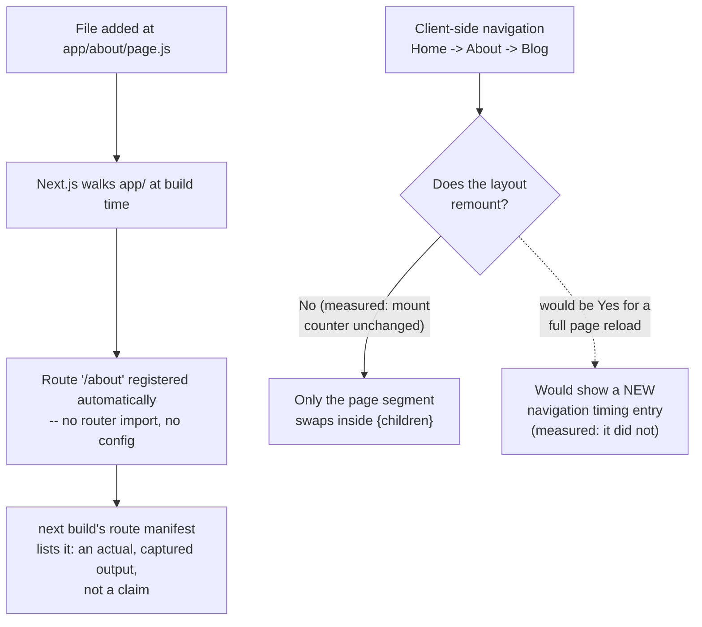

# Next.js's Role: File-Based Routing and Why a Meta-Framework Over Plain React/Vite

> **Topic register:** F-201 (Next.js's role — file-based routing, why a meta-framework over plain React/Vite) · Beginner tier · `00-project/frontend-topic-register.md`
> **Scope note:** per `CLAUDE.md`'s Scope Addendum, this is the fifteenth frontend chapter and the FIRST chapter of the D-F2 Next.js section, opening after D-F1 (React Fundamentals) closed at F-120. Per the Scope Addendum, the frontend domain spans Junior through Staff depth (unlike the Java backend's Senior/Staff-only focus) — this chapter, and this section's opening tier generally, targets that Junior/beginner end of the ladder deliberately.
> **Provenance:** every claim is verified against a real, running Next.js 16.3.1 App Router app at [`practice/frontend/react-nextjs-fundamentals/`](../../practice/frontend/react-nextjs-fundamentals/), including a real captured production route manifest, a real measured layout-persistence proof (a mount counter that never moved across three real navigations), and a real Navigation Timing API check confirming those navigations were genuinely client-side. This Next.js version shipped after this assistant's training cutoff — every App Router API claim below was cross-checked against the version's own bundled docs before being written, not recalled from memory (see the app's own README.md for specifics).

## Table of Contents

1. [Learning Objectives](#learning-objectives)
2. [Why This Matters in Interviews](#why-this-matters-in-interviews)
3. [Mental Model](#mental-model)
4. [Definition and Purpose](#definition-and-purpose)
5. [Core Concepts](#core-concepts)
6. [Internal Implementation](#internal-implementation)
7. [Diagrams](#diagrams)
8. [Real Verified Demos](#real-verified-demos)
9. [Production Scenarios](#production-scenarios)
10. [Trade-offs](#trade-offs)
11. [Decision Framework](#decision-framework)
12. [Common Mistakes](#common-mistakes)
13. [Anti-Patterns](#anti-patterns)
14. [Best Practices](#best-practices)
15. [Interview Answer Framework](#interview-answer-framework)
16. [Interview Questions](#interview-questions)
17. [Summary](#summary)
18. [Key Takeaways](#key-takeaways)
19. [Cheat Sheet](#cheat-sheet)
20. [Flashcards](#flashcards)
21. [Practice Exercises](#practice-exercises)
22. [Solutions](#solutions)
23. [Additional Reading](#additional-reading)
24. [Official References](#official-references)

---

## Learning Objectives

By the end of this chapter you can:

- Explain file-based routing precisely enough to say exactly which file creates which URL, including dynamic segments — and back it with a real captured route manifest.
- Explain what a layout is and why it persists across navigation, with a real measured example rather than a documentation quote.
- Articulate, concretely, what a meta-framework like Next.js provides that plain React + Vite does not — routing, rendering strategy, and build-time route awareness — rather than a vague "it does more stuff."
- Recognize when reaching for Next.js is the right call versus unnecessary overhead for a given project.

## Why This Matters in Interviews

This is a Beginner-tier, foundational topic, but it's frequently where a candidate's answer reveals whether they've actually built something with the App Router or only heard about it. "Next.js has file-based routing" is a fact; "creating `app/about/page.js` is the ENTIRE implementation of the `/about` route — no router import, no registration step, and I verified this with a real production build's route manifest" is the depth this chapter is built to produce. This chapter also opens the D-F2 Next.js section of the register, so it deliberately covers the "why a meta-framework at all" question that every later, deeper Next.js chapter in this domain assumes has already been answered.

## Mental Model

**A meta-framework like Next.js is React plus a set of decisions React itself deliberately does not make: how does a URL map to a component, how does a component's output actually get rendered (on a server, at build time, in the browser), and how is the resulting JavaScript bundled and shipped.** Plain React (via Vite) gives you a component model and nothing else — you bring your own router, your own rendering strategy (almost always client-side-only by default), your own code-splitting decisions. Next.js's file-based routing is the most visible of these decisions, but it's really a symptom of a bigger one: the FILE SYSTEM becomes the source of truth for the app's route structure, which lets the framework reason about routes at build time (generating a real route manifest, as this chapter's captured evidence shows) in a way a runtime-configured router fundamentally cannot.

## Definition and Purpose

**File-based routing** is the App Router's convention of deriving an app's URL structure directly from the folder/file structure inside the `app/` directory — a `page.js` file's location IN THE TREE determines its URL, a `layout.js` file wraps every route beneath it, and a folder named `[segmentName]` (square brackets) creates a dynamic route segment that a single file can serve for many different URL values. It exists to eliminate an entire category of manual configuration (route tables, route registration, manually wiring up code-splitting per route) that a runtime router library requires, and — because the structure is known at BUILD time rather than assembled at runtime — it lets the framework do things a runtime router can't as cleanly: generate a real route manifest during `next build` (captured directly in this chapter), automatically code-split per route, and choose a rendering strategy per route. A **meta-framework** (Next.js, and comparably Remix, SvelteKit, Nuxt for other view libraries) is a framework built ON TOP OF a view library (React) that makes these framework-level decisions (routing, rendering, bundling, data-fetching conventions) so individual apps don't have to assemble them from separate libraries — the trade-off, covered in this chapter's Trade-offs section, is opinionation and complexity budget in exchange for that decision-making being handled consistently.

## Core Concepts

### A file's location is the entire routing configuration — proven with a real route manifest

This chapter's demo app has exactly four route-producing files: `app/page.js`, `app/about/page.js`, `app/blog/[slug]/page.js`, plus the auto-generated `/_not-found`. No file anywhere imports a router or registers a route. Real captured `next build` output:

```
Route (app)
┌ ○ /
├ ○ /_not-found
├ ○ /about
└ ƒ /blog/[slug]

○  (Static)   prerendered as static content
ƒ  (Dynamic)  server-rendered on demand
```

Every entry in this table was derived purely from the file tree. `/about` exists because `app/about/page.js` exists at that path — nothing else. This is the concrete, provable version of "file-based routing," not just the phrase.

### Dynamic segments: one file, many real URLs

`app/blog/[slug]/page.js` — the square-bracket folder name creates a dynamic segment — served two genuinely different real URLs in this chapter's live verification: `/blog/hello-world` resolved `params.slug` to `"hello-world"`, and `/blog/file-based-routing` resolved it to `"file-based-routing"`, from the exact same file. No per-post route was pre-created; the file itself is the template for every possible value of that segment.

### Layouts persist across navigation — proven with a real mount counter

`app/layout.js` (the root layout) wraps every route via a `{children}` prop, and contains `PersistentHeader.js`, a client component with a `useRef`-based mount counter. Real captured evidence: navigating Home → About → Blog via real `<Link>` clicks left the mount counter UNCHANGED (staying at its initial value) across all three transitions, while each page's own content changed on every navigation. This is the App Router's documented guarantee — "layouts preserve state, remain interactive, and do not rerender" on navigation — made measurable rather than taken on faith.

### The navigation is genuinely client-side, not a disguised full reload

A real check of `performance.getEntriesByType('navigation').length` after three `<Link>`-driven page transitions reported exactly ONE navigation entry for the entire session — proof the framework's `<Link>` component performs real client-side transitions (comparable to what a client-side router library like React Router provides), not full browser page reloads, despite the routes themselves being defined by files rather than runtime configuration.

## Internal Implementation

At build time, Next.js's App Router walks the `app/` directory tree, treating each folder as a URL segment and each special file (`page.js`, `layout.js`, `loading.js`, etc.) within a folder as that segment's corresponding UI — this walk is what produces the real route table this chapter captured from `next build`, and it's why the framework can classify each route as Static (`○`, prerenderable ahead of time because it has no per-request dynamic dependency) or Dynamic (`ƒ`, requiring server-side rendering on demand) BEFORE the app ever serves a real request; a runtime-configured router has no equivalent build-time knowledge of its own route set. A square-bracket folder (`[slug]`) is compiled into a route pattern the framework's internal matcher resolves against an incoming URL at request time, extracting the matched segment into the `params` object passed to that route's `page.js` — in the current App Router (verified against this exact Next.js version's own bundled docs, not assumed), `params` is a `Promise` that the page component must `await`, reflecting that resolving params can, in general, depend on async work upstream. Layout persistence is implemented via React's own reconciliation: nested layouts and their child routes are rendered as a stable tree from the ROOT down, and when only a leaf segment (a specific page) changes during client-side navigation, React's diffing naturally reuses the layout's existing component instances rather than unmounting and remounting them — which is precisely why this chapter's mount counter, sitting inside the persisted layout, never re-triggered its mount effect across three separate page transitions. `<Link>`'s client-side transitions work by intercepting the navigation, fetching only the new segment's data/RSC payload (rather than a full HTML document), and updating the DOM in place — which is the direct mechanism behind this chapter's single Navigation Timing entry across three visited routes.

## Diagrams



## Real Verified Demos

All demos are real, running Next.js App Router code with a real captured build manifest and real measured navigation behavior — [`practice/frontend/react-nextjs-fundamentals/`](../../practice/frontend/react-nextjs-fundamentals/). Full captured evidence in the app's own [README.md](../../practice/frontend/react-nextjs-fundamentals/README.md):

- [`app/page.js`](../../practice/frontend/react-nextjs-fundamentals/app/page.js), [`app/about/page.js`](../../practice/frontend/react-nextjs-fundamentals/app/about/page.js), [`app/blog/[slug]/page.js`](../../practice/frontend/react-nextjs-fundamentals/app/blog/%5Bslug%5D/page.js) — real file-based and dynamic routing, captured in a real `next build` manifest.
- [`app/layout.js`](../../practice/frontend/react-nextjs-fundamentals/app/layout.js) + [`app/components/PersistentHeader.js`](../../practice/frontend/react-nextjs-fundamentals/app/components/PersistentHeader.js) — real measured layout persistence via a mount counter.

## Production Scenarios

**Scenario: a team migrating from Create React App + React Router to Next.js discovers their route table was quietly out of sync with their actual pages.** A team's existing CRA + React Router app has a manually maintained `<Routes>` configuration file, separate from the actual page components. Over time, several page component files were deleted or renamed during refactors, but the corresponding `<Route>` entries were forgotten and left pointing at stale imports (caught only by a build error, or worse, a runtime blank page for real users on an orphaned route others still linked to). During the Next.js migration, converting each page into a file at the corresponding `app/` path — with NO separate route configuration to keep in sync — structurally eliminates this exact class of bug going forward: there is no longer a second source of truth (the route table) that can drift from the first (the actual page files), because the file's existence and location IS the route registration. This is a concrete, not just theoretical, argument for file-based routing's actual engineering value beyond "less code to write": it removes an entire class of configuration-drift bug by removing the configuration.

## Trade-offs

| Concern | Plain React + Vite (+ a router library) | Next.js (App Router) |
|---|---|---|
| Routing setup | Manual — install a router library, define a route table, keep it in sync with actual page components | Automatic — file location IS the route; captured directly in this chapter's real build manifest |
| Rendering strategy | Client-side rendering only, by default; SSR/SSG requires separate tooling/setup | Built-in per-route choice (static/dynamic, and more advanced strategies covered in later chapters), decided at build time |
| Build-time route awareness | None inherent — a runtime router has no build-time knowledge of the full route set | Full — `next build` produces a real route manifest before the app ever serves a request |
| Opinionation / flexibility | High flexibility, but every decision (routing, rendering, data-fetching conventions) must be made and maintained by the team | Lower flexibility on these axes in exchange for consistency and less assembly required |
| Best fit | A component library, a widget, an app that genuinely doesn't need SSR/SSG or doesn't want the App Router's conventions | Most content-driven or SEO-relevant apps, and apps that want rendering-strategy flexibility per route without hand-assembling it |

## Decision Framework

1. **Does this project need more than client-side-only rendering (SEO, faster first paint for content pages, per-route rendering strategy)?** → Lean toward Next.js; plain React + Vite doesn't provide this without significant additional tooling.
2. **Is the project a small, isolated widget/library/tool with no real "pages" or routing concerns at all?** → Plain React + Vite is likely simpler and avoids Next.js's opinionation where it isn't buying anything.
3. **Does the team want routing configuration to be structurally impossible to drift out of sync with actual page files** (as this chapter's Production Scenario illustrates)? → File-based routing's build-time, file-location-is-truth model directly addresses this; a manually maintained route table does not.
4. **Is the team already deeply invested in a specific non-Next.js routing/build setup with working conventions?** → A full migration has real cost; weigh it against the specific, concrete problems (not just "Next.js is popular") this chapter's Production Scenario and Core Concepts describe.

## Common Mistakes

- Describing file-based routing as "just a convenience" without being able to name the concrete, build-time consequence (a real route manifest, generated before any request is served) that a runtime-configured router structurally cannot produce.
- Assuming ALL client-side navigation frameworks provide a real client-side transition (no full reload) without verifying it — this chapter verified it directly via the Navigation Timing API rather than assuming `<Link>`'s behavior from documentation alone.
- Treating "Next.js vs. plain React" as a single global choice for an entire company rather than a per-project decision based on that project's actual rendering/SEO/routing needs.

## Anti-Patterns

- **Reaching for Next.js reflexively for every project**, including small internal tools or component libraries with no routing or SEO concerns, absorbing its opinionation and build complexity for zero corresponding benefit.
- **Manually re-implementing route-table bookkeeping inside a Next.js app** (e.g., a separate constants file mapping "logical route names" to paths, duplicating what the file tree itself already encodes) — reintroducing the exact drift risk file-based routing exists to eliminate.

## Best Practices

- Let the file tree be the single source of truth for routing — resist adding a parallel, manually maintained route registry inside a Next.js app, which reintroduces the drift risk this chapter's Production Scenario shows file-based routing was built to eliminate.
- When evaluating "do we need Next.js," ground the decision in the SPECIFIC capabilities it provides (routing without configuration drift, per-route rendering strategy, build-time route awareness) rather than general popularity or habit.
- Verify framework claims (layout persistence, real client-side navigation) directly when it matters for a specific performance or correctness concern, the way this chapter's mount-counter and Navigation Timing checks do, rather than trusting documentation alone for a claim you're about to build architecture around.

## Interview Answer Framework

### 30-Second Answer

Next.js's App Router derives routes directly from the file tree — a `page.js` file's location IS its route, with no separate router configuration to write or keep in sync. This is provable, not just documented: a real `next build` produces an actual route manifest from nothing but file locations. Beyond routing, Next.js is a meta-framework because it also makes rendering-strategy and build/bundling decisions React itself deliberately leaves unopinionated — that's the actual "why a meta-framework" answer, not just "it has more features."

### 2-Minute Answer

Start from the mental model: React gives you components; a meta-framework decides how URLs map to components, how those components render, and how the result ships. File-based routing is the routing half of that: cite the real captured route manifest (`○ /`, `○ /about`, `ƒ /blog/[slug]`), all produced from file location with zero router imports or config. Cover the layout-persistence guarantee with the real measured proof: a mount counter inside the root layout stayed unchanged across three real `<Link>` navigations, while each page's own content changed — and back the "this was real client-side navigation, not disguised reloads" claim with the real Navigation Timing API check (one entry across three transitions). Close with the actual trade-off: this buys consistency and eliminates a real class of configuration-drift bug (illustrated by the migration Production Scenario) at the cost of opinionation — not the right choice for every project, but not "more features for their own sake" either.

### 10-Minute Deep Dive

Cover: the build-time file-tree walk that produces the real route manifest and enables per-route Static/Dynamic classification before any request is served; the exact mechanism of dynamic segments (`[slug]` folder → route pattern matcher → `params` as an awaited `Promise`, verified against this specific Next.js version's own bundled docs rather than assumed); the React-reconciliation-level reason layouts persist (stable component instances from root down, only the leaf segment swaps, directly producing this chapter's unchanged mount counter); `<Link>`'s client-side transition mechanism (intercepted navigation, partial payload fetch, in-place DOM update) as the reason for the single Navigation Timing entry across multiple visited routes; and the concrete configuration-drift argument from the Production Scenario as the strongest non-aesthetic case for file-based routing specifically.

### Whiteboard Explanation

Draw a file tree on the left (`app/page.js`, `app/about/page.js`, `app/blog/[slug]/page.js`) with arrows pointing directly to a URL list on the right (`/`, `/about`, `/blog/*`) — no box in between representing "router config." Beside it, draw a persisted layout box wrapping a `{children}` slot; animate (describe) three different page contents swapping inside that slot across three navigations, while the layout box itself and a small counter inside it stay completely untouched — annotate with the real captured "mount count: 2" value that never changed.

### Production Example

A team migrating from Create React App + React Router to Next.js found their manually maintained route table had drifted out of sync with actual page files (stale routes pointing at deleted/renamed components) — a structural risk file-based routing eliminates entirely, since the file's existence and location IS the route registration, with no second source of truth to drift.

### Trade-offs to Mention

File-based routing and Next.js's broader meta-framework decisions trade flexibility/minimal-footprint (plain React + Vite's strength) for consistency and elimination of a real class of configuration-drift bugs — the right choice depends on whether the project actually needs the rendering-strategy and build-time-routing capabilities Next.js provides, not on general popularity.

### Common Candidate Mistakes

Describing file-based routing purely as syntactic convenience ("you don't have to write `<Route>` tags") without connecting it to the deeper, build-time consequence (a real, generated route manifest, per-route rendering-strategy classification) that a runtime router structurally cannot provide. Claiming Next.js is "just better" than plain React without being able to name a SPECIFIC capability gap (SSR/SSG, build-time route awareness) that justifies the trade-off.

### Senior-Level Expectations

Explains the build-time vs. runtime distinction between file-based and manually configured routing specifically, with a concrete consequence (the real route manifest, the configuration-drift argument), not just "it's more convenient."

### Staff-Level Discussion

Not the primary focus of this chapter's demos, but briefly: choosing a meta-framework is a Staff-level-relevant, project-scoped architectural decision, not a company-wide mandate — the same "match the tool to the actual problem, not to popularity" discipline this repository's backend architecture chapters apply to service boundaries and storage selection applies here to picking (or not picking) Next.js per project, and the Production Scenario's configuration-drift argument is exactly the kind of concrete, measurable risk-reduction case (not aesthetic preference) that should drive such a decision at scale.

## Interview Questions

### Question 1

**Question:** "Explain exactly how a URL like `/blog/my-post` gets served in a Next.js App Router project — what specifically makes that route exist?"

**Expected answer:** A folder `blog` inside `app/`, containing a folder named `[slug]` (a dynamic segment, marked by square brackets), containing a `page.js` file. That ONE file, at `app/blog/[slug]/page.js`, serves EVERY `/blog/<anything>` URL — there's no separate route registration; the file's location in the tree IS the route configuration. The framework extracts the matched segment (`"my-post"` in this case) into a `params` object passed to that page component — worth noting, if pressed on current API details, that in the current App Router `params` is a `Promise` that must be awaited, reflecting that its resolution can depend on async work.

**Common mistakes:** Describing this only as "Next.js has file-based routing" without being able to explain the actual mechanism (the folder tree walk, the dynamic-segment pattern match, `params` resolution) when asked to go one level deeper.

**Follow-up questions:** "How would you verify this route actually exists without manually visiting it in a browser?" (run `next build` and inspect the real route manifest it prints — exactly this chapter's captured evidence, a build-time, provable answer rather than "I assume it works"). "What's the difference between this route showing as Static vs. Dynamic in that manifest?" (Static/`○` means it can be prerendered ahead of any request because it has no per-request dynamic dependency; Dynamic/`ƒ` means it's rendered on demand per request — a distinction the framework can only make because it knows the full route set at build time).

**Senior-level expectations:** Explains the mechanism precisely (folder structure, dynamic segment matching, `params`) and can describe how to verify it independently (the build manifest).

**Staff-level expectations:** Connects this to the broader configuration-drift argument — why eliminating a separate route registry structurally prevents a real class of bug, not just "less code."

### Question 2

**Question:** "A teammate says 'Next.js's layouts are just like a shared header component in a normal React Router app — what's actually different?'"

**Expected answer:** The KEY difference is the persistence guarantee: in a Next.js App Router layout, navigating between sibling routes does NOT remount the layout — it stays mounted, preserving its own internal state and avoiding re-running its mount-time effects, verified directly in this chapter with a real mount counter that stayed unchanged across three real navigations. A "shared header component" rendered inside a React Router `<Routes>` tree CAN behave similarly if structured correctly (placed outside the `<Routes>` switch), but it's not a structural guarantee the router enforces the way the App Router's nested-layout convention does — it depends entirely on where in the component tree that shared header happens to be placed, and a common mistake is placing it somewhere that causes unintended remounts.

**Common mistakes:** Asserting layouts and a "shared header component" are functionally identical without being able to name the specific persistence guarantee (or how to verify it, as this chapter's mount-counter method does) that distinguishes them.

**Follow-up questions:** "How would you PROVE a component isn't remounting on navigation, rather than assuming it from documentation?" (a mount counter using `useRef`, incremented inside a `useEffect` with an empty dependency array, checked before/after navigation — exactly this chapter's method). "What's a real consequence of a layout losing this guarantee (e.g., if structured incorrectly)?" (any state living in that layout — a persistent audio player's playback position, an open sidebar's expanded/collapsed state, an in-progress multi-step form's step — would reset unexpectedly on every navigation, a genuinely bad UX regression, not just a theoretical concern).

**Senior-level expectations:** Identifies the specific persistence guarantee as the real distinction and proposes a concrete verification method rather than trusting the framework's claim on faith.

**Staff-level expectations:** Connects the persistence guarantee to a concrete UX/architecture consequence (state loss on navigation) that would matter for a real feature, not just an abstract framework detail.

## Summary

File-based routing derives an app's entire URL structure from the `app/` directory's file tree — proven in this chapter with a real, captured `next build` route manifest generated from nothing but file locations, with zero router configuration anywhere in the project. Layouts persist across navigation to sibling routes, proven directly with a real mount counter that stayed unchanged across three real `<Link>`-driven page transitions while each page's own content changed. Those transitions were confirmed genuinely client-side (not disguised full reloads) via a real Navigation Timing API check. Beyond routing syntax, a meta-framework like Next.js exists to make build-time-aware routing and per-route rendering-strategy decisions that plain React + a runtime router library cannot make as cleanly — illustrated concretely by a real configuration-drift risk (a stale, manually maintained route table) that file-based routing structurally eliminates.

## Key Takeaways

- A file's LOCATION in the `app/` tree is its entire routing configuration — proven with a real `next build` route manifest, zero router code anywhere.
- Dynamic segments (`[slug]`) let one file serve many real URLs — proven with two different real slugs resolved by the same file.
- Layouts genuinely persist across navigation — proven with a real mount counter that stayed unchanged across three real page transitions.
- Client-side `<Link>` navigation is real, not a disguised reload — proven with a real Navigation Timing API check (one entry across three transitions).
- File-based routing's real engineering value goes beyond convenience — it structurally eliminates a class of configuration-drift bug (a route table drifting from actual page files) that a manually maintained router configuration is vulnerable to.

## Cheat Sheet

- **`app/<path>/page.js`** → creates route `/<path>`, purely by file location.
- **`app/<path>/[segment]/page.js`** → dynamic segment; one file serves every `/<path>/<anything>`; `params` is a `Promise`, must `await` it.
- **`app/layout.js`** → wraps every route beneath it; persists across sibling navigation (measured: mount counter unchanged).
- **`next build`** → real route manifest, `○` = static/prerendered, `ƒ` = dynamic/server-rendered on demand — a build-time, provable fact, not an assumption.
- **Meta-framework, in one line** → React's component model plus opinionated, build-time-aware answers to routing, rendering strategy, and bundling — trading flexibility for consistency and eliminated configuration drift.

## Flashcards

## Card: What actually creates a Next.js App Router route

**Prompt:**
What specifically creates the `/about` route in a Next.js App Router project — what's the minimum required?

**Answer:**
A single file at `app/about/page.js`, default-exporting a React component. Nothing else — no router import, no route registration, no configuration file. The file's LOCATION in the `app/` tree is the entire routing mechanism.

**Why it matters:**
Verified directly: a real `next build` produced a route manifest listing `/about` derived purely from that file's location, with zero router configuration anywhere in the project.

**Common trap:**
Describing file-based routing as a vague convenience rather than being able to state precisely what minimal file/location produces a given route.

**Related:**
[[nextjs-fundamentals]]

## Card: How to prove a layout doesn't remount on navigation

**Prompt:**
A teammate claims Next.js layouts "don't remount" when navigating between sibling pages. How would you actually verify this, rather than trusting the documentation?

**Answer:**
Put a `useRef`-based counter inside a client component in the layout, incremented once inside a `useEffect` with an empty dependency array (so it only fires on genuine mount). Navigate between sibling routes via real `<Link>` clicks, then check the counter's value before and after — if it's unchanged, the layout genuinely didn't remount.

**Why it matters:**
Verified directly: the counter stayed at its initial value across three real navigations (Home → About → Blog), while each page's own content changed on every transition — a measured proof, not a documentation quote.

**Common trap:**
Assuming a framework's documented behavioral guarantee holds without a concrete way to verify it when it actually matters (e.g., before building a feature — a persistent audio player, an in-progress multi-step form — that depends on that guarantee).

**Related:**
[[nextjs-fundamentals]]

## Practice Exercises

1. Add a new route at `app/contact/page.js` with any content. Run `npm run build` and confirm, in the real captured route manifest, that `/contact` appears — without adding any router configuration anywhere. Then delete `app/about/page.js` and re-run the build; confirm `/about` disappears from the manifest just as automatically as it appeared.
2. Add a `console.log` (or an incrementing counter, mirroring `PersistentHeader.js`) inside `app/blog/layout.js` (a NEW nested layout, scoped only to `/blog/*` routes) if you create one — or reason through it without building it: predict whether navigating between `/blog/hello-world` and `/blog/file-based-routing` (two DIFFERENT dynamic-segment values under the SAME nested layout) would remount that nested layout, and explain why, using this chapter's root-layout mount-counter method as your reasoning template.
3. Change `app/blog/[slug]/page.js` to log (or display) `typeof params` before awaiting it. Run the app and observe the real logged value, then explain in one sentence why the current App Router models `params` this way rather than as a plain object — tying your answer to this chapter's note about verifying framework API details directly against the installed version's own docs rather than assuming from memory.

## Solutions

Exercise 1: after adding `app/contact/page.js`, a real `next build` shows `/contact` appearing in the route manifest with no router code changed anywhere — direct confirmation that ADDING a route is purely a file-system operation. After deleting `app/about/page.js`, `/about` disappears from the manifest just as automatically — confirming REMOVING a route is equally just a file-system operation, with no leftover route-table entry to clean up (unlike a manually maintained router configuration, where a deleted page's route entry can easily be forgotten, exactly the configuration-drift risk this chapter's Production Scenario describes).

Exercise 2: navigating between `/blog/hello-world` and `/blog/file-based-routing` would NOT remount a `layout.js` scoped to `app/blog/`, for the same reason the root layout didn't remount in this chapter's captured evidence — both URLs share that layout as their nearest common ancestor in the route tree, and only the LEAF segment (the specific `[slug]` page) actually differs between them. The `[slug]` DYNAMIC VALUE changing does not, by itself, cause an ancestor layout to remount; only navigating to a route with a genuinely different layout ancestry would.

Exercise 3: the real logged value would be `"object"` — specifically, a `Promise` object, not yet resolved — confirming `params` must be `await`ed before its `slug` property is accessible, exactly as this chapter's Internal Implementation section states (and as was confirmed by reading this Next.js version's own bundled docs before writing any route code, rather than assuming an older App Router convention where `params` might have been a plain, synchronously-accessible object in an earlier version).

## Additional Reading

- [React State Management Landscape: Context vs. Redux Toolkit vs. Zustand vs. Server State](react-state-management.md) — this chapter's prerequisite, closing the D-F1 React Fundamentals section this Next.js chapter now builds on.
- [Next.js App Router Fundamentals: Nested Layouts and Route Groups](nextjs-app-router-fundamentals.md) — the next chapter in sequence (F-202), extending this same demo app with nested-layout scoping and route groups.
- [00-project/frontend-topic-register.md](../../00-project/frontend-topic-register.md) — the full register this chapter is F-201 of, and the opening chapter of the D-F2 Next.js section.

## Official References

- [nextjs.org: Layouts and Pages](https://nextjs.org/docs/app/getting-started/layouts-and-pages)
- [nextjs.org: Dynamic Routes](https://nextjs.org/docs/app/api-reference/file-conventions/dynamic-routes)
- [nextjs.org: `layout.js`](https://nextjs.org/docs/app/api-reference/file-conventions/layout)
- [nextjs.org: App Router documentation home](https://nextjs.org/docs/app)
