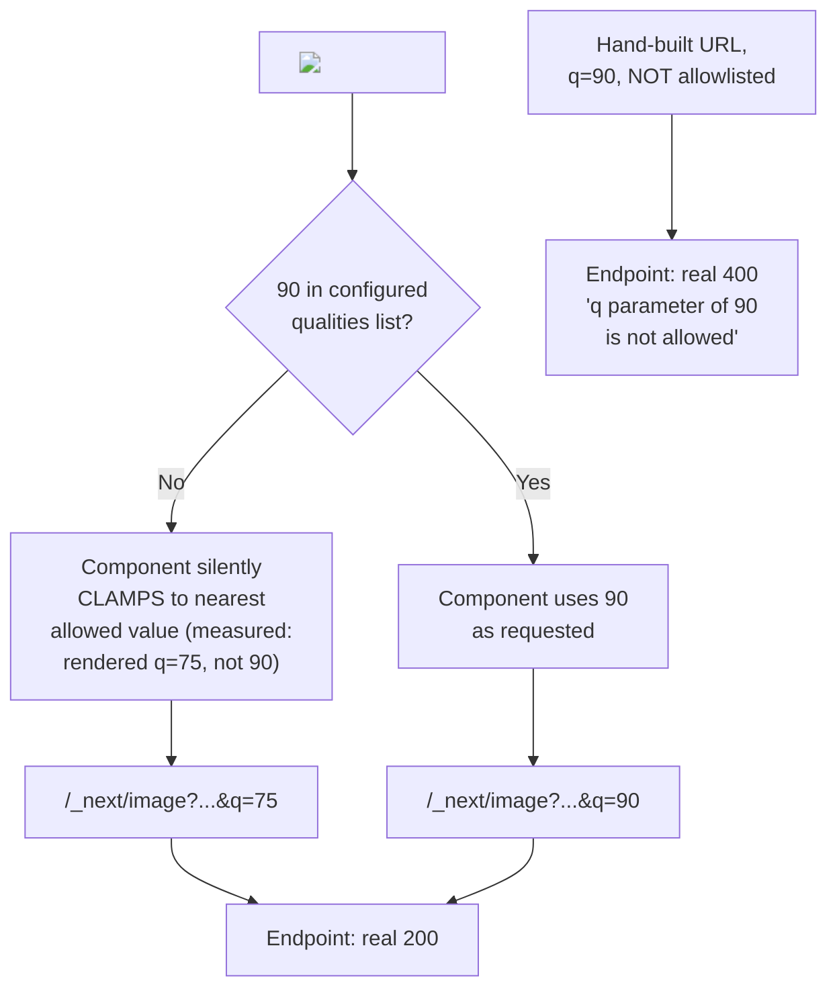

# Image and Font Optimization, and Core Web Vitals in Next.js

> **Topic register:** F-210 (Image/font optimization, Core Web Vitals) · Intermediate tier · `00-project/frontend-topic-register.md`
> **Scope note:** per `CLAUDE.md`'s Scope Addendum, this is the twenty-fourth frontend chapter, continuing D-F2's performance/discoverability thread after F-209 (Metadata API & SEO). Where F-209 covered `<head>` content, this chapter covers the two asset types (images, fonts) most directly responsible for Core Web Vitals scores — specifically Largest Contentful Paint (LCP) and Cumulative Layout Shift (CLS).
> **Provenance:** every claim is verified against the SAME real Next.js 16.3.1 App Router app used for F-201–F-209 — [`practice/frontend/react-nextjs-fundamentals/`](../../practice/frontend/react-nextjs-fundamentals/) — including two real, programmatically generated PNG files (no external assets, no network dependency for the source images themselves) with genuinely correct pixel dimensions, a real, two-sided proof that `next/image`'s `qualities` and `remotePatterns` allowlists are enforced with an EXACT `400` at the raw optimization endpoint while the `<Image>` component itself silently clamps a disallowed quality rather than erroring, and a real, captured, decisive version-specific finding: the classic `priority` prop is deprecated in Next.js 16 in favor of `preload` — and, unlike F-208's loud Edge Runtime deprecation warnings, using the old prop anyway produces ZERO warning anywhere (dev console, build output), silently continuing to work.

## Table of Contents

1. [Learning Objectives](#learning-objectives)
2. [Why This Matters in Interviews](#why-this-matters-in-interviews)
3. [Mental Model](#mental-model)
4. [Definition and Purpose](#definition-and-purpose)
5. [Core Concepts](#core-concepts)
6. [Internal Implementation](#internal-implementation)
7. [Diagrams](#diagrams)
8. [Real Verified Demos](#real-verified-demos)
9. [Production Scenarios](#production-scenarios)
10. [Trade-offs](#trade-offs)
11. [Decision Framework](#decision-framework)
12. [Common Mistakes](#common-mistakes)
13. [Anti-Patterns](#anti-patterns)
14. [Best Practices](#best-practices)
15. [Interview Answer Framework](#interview-answer-framework)
16. [Interview Questions](#interview-questions)
17. [Summary](#summary)
18. [Key Takeaways](#key-takeaways)
19. [Cheat Sheet](#cheat-sheet)
20. [Flashcards](#flashcards)
21. [Practice Exercises](#practice-exercises)
22. [Solutions](#solutions)
23. [Additional Reading](#additional-reading)
24. [Official References](#official-references)

---

## Learning Objectives

By the end of this chapter you can:

- Use `next/image` for a static import, a local `public/` path, and a remote URL, and state precisely what each requires (automatic dimensions for the first, explicit dimensions for the other two) — having watched all three render correctly against real, generated image files.
- Explain and prove, with two real 400 responses and their exact error text, that `remotePatterns` and `qualities` (both configured in `next.config.js`) are hard-enforced allowlists at the `/_next/image` optimization endpoint — then prove the same requests succeed once correctly configured.
- State precisely how the `<Image>` component's own behavior differs from the raw endpoint's: a disallowed `quality` prop is silently clamped by the component (the browser never even requests the disallowed value), while a hand-built URL hitting the endpoint directly with that same disallowed value is hard-rejected.
- State, and prove with a real captured absence of warnings, that Next.js 16 deprecated the `priority` prop in favor of `preload` — and that using the deprecated prop produces no visible signal at all, a genuinely different (and riskier) deprecation pattern than this repository's other F-208 Edge Runtime finding.
- Explain `next/font`'s self-hosting model and prove it with a real network trace showing zero requests to any Google font domain.

## Why This Matters in Interviews

Core Web Vitals questions reward a candidate who can name the SPECIFIC mechanism Next.js uses to improve each metric, not just the metric names. LCP: `next/image`'s automatic responsive `srcset` generation plus the `preload`/`fetchPriority` mechanism for the hero image — proven here with a real, captured `<link rel="preload">` tag. CLS: automatic `width`/`height` inference from a static import (proven with real, correct `400`/`300` attributes matching a real generated file) preventing the image from reflowing content once it loads, plus `next/font`'s layout-shift-free self-hosting (proven with a real network trace showing zero external font requests). This chapter is also a good test of whether a candidate's knowledge is CURRENT: `priority` is the prop nearly every pre-2026 tutorial teaches for the LCP image, and it is now deprecated — silently, with no warning anywhere in this version, which is itself worth knowing precisely.

## Mental Model

**`next/image` and `next/font` both trade a small amount of setup ceremony for automatic, verifiable prevention of the two most common Core Web Vitals regressions: unbounded image payload size (hurting LCP) and layout-shifting content (hurting CLS).** For images, this chapter proved the mechanism operates at TWO real, distinct layers: the `<Image>` COMPONENT (which renders a real `` with a `srcset` pointing at Next's own `/_next/image` optimization endpoint, and which silently CLAMPS a disallowed `quality` value rather than erroring — proven directly: a real `quality={90}` request rendered as `q=75` in the actual HTML when `90` wasn't yet allowlisted), and the `/_next/image` ENDPOINT itself (which hard-enforces the SAME allowlist with a real, exact `400` response when hit directly with a disallowed value — proven with the exact error text `"q" parameter (quality) of 90 is not allowed`). For fonts, the mechanism is simpler and single-layered: `next/font/google` downloads the font file ONCE, at build time, and serves it from the app's own origin forever after — proven directly with a real network trace showing the font requested from `/_next/static/media/...` and zero requests to any Google domain.

## Definition and Purpose

The **`next/image` component** extends the native `` element with automatic responsive image generation (multiple real, resized variants served via `srcset`, matched to the requesting device), format negotiation, lazy loading by default, and either automatic (static import) or explicit (local path, remote URL) intrinsic dimensions used to reserve layout space before the image loads — preventing Cumulative Layout Shift. It exists because manually hand-authoring correctly-sized, correctly-formatted, lazy-loaded images with reserved layout space for every breakpoint is real, repetitive, easy-to-get-wrong work that a framework can automate once. The **`next/font` module** (`next/font/google`, `next/font/local`) self-hosts font files at build time and serves them from the app's own origin — this chapter proved directly that this eliminates the external network round-trip (and associated privacy/performance cost) a `<link href="https://fonts.googleapis.com/...">` tag would otherwise incur, with zero requests to Google observed in a real network trace. **Core Web Vitals** (LCP, CLS, and others not covered by this chapter's demos) are Google's standardized, measurable proxies for real user-perceived performance; `next/image` and `next/font` are this framework's most direct, built-in levers against two of them specifically.

## Core Concepts

### Three real image sources, three real, distinct dimension-handling behaviors

A statically imported local PNG (`import profileImg from "../images/profile.png"`, a real, generated 400×300 file) rendered with NO `width`/`height` props at all — the actual output HTML showed `width="400" height="300"`, read directly from the real file, plus a real, auto-generated blur placeholder (a genuine base64-encoded blurred SVG data URI, confirmed present in the rendered markup). A local `public/`-folder image (`/hero.png`, a real 1200×630 file) required EXPLICIT `width={600} height={315}` props — Next.js cannot read a `public/`-referenced file's dimensions at the point the component renders, since it isn't imported as a module. A remote image (`https://httpbin.org/image/jpeg`) likewise required explicit dimensions, for the documented reason: Next.js has no build-time access to a remote file to inspect.

### `remotePatterns` and `qualities`: a real, two-sided allowlist enforcement proof

Before configuring `next.config.mjs`, two real requests were made directly against the `/_next/image` optimization endpoint. Requesting the LOCAL `hero.png` at `q=90` (bypassing the `<Image>` component, which would have silently clamped it) returned a real `400 Bad Request`: `"q" parameter (quality) of 90 is not allowed`. Requesting the REMOTE `httpbin.org` image returned a real `400 Bad Request`: `"url" parameter is not allowed`. After adding `images: { remotePatterns: [{ protocol: "https", hostname: "httpbin.org" }], qualities: [75, 90] }` and rebuilding, the IDENTICAL two requests both returned real `200` responses — the remote image with `content-type: image/jpeg`, the quality-90 local image serving successfully.

### The component silently clamps; the endpoint hard-rejects — a real, precise distinction

Before `qualities: [75, 90]` was configured, the SAME `<Image src="/hero.png" quality={90} .../>` component rendered a real `` tag whose `src`/`srcset` attributes said `q=75`, NOT `q=90` — the component itself silently substituted the nearest allowed value rather than ever letting the browser issue a request for the disallowed one. This is a real, meaningful distinction from the endpoint's own behavior (a hard `400`) for a REQUEST that names the disallowed value directly — the component's silent clamping means a developer could set `quality={90}` and never see ANY error, warning, or visual difference, only a slightly-more-compressed image than intended.

### `priority` is deprecated in Next.js 16 — silently, with zero warning anywhere

Real, direct evidence: swapping this chapter's `preload` prop for the classic `priority` prop, then checking BOTH a real `next dev` browser console (via `read_console_messages`) and a real `next build`'s complete output for any mention of "priority" or "deprecated" — neither produced a single message. The prop still fully WORKED (a real `<link rel="preload" as="image">` tag was confirmed present in the rendered page via a direct DOM query), just with the framework's own documentation, not the running application, as the only source that reveals it's deprecated. This is a genuinely different, and arguably riskier, deprecation pattern than F-208's Edge Runtime finding, which produced a loud, real, named warning every time.

### `next/font`: a real, verified zero-external-request proof

`app/layout.js` imports `Geist` from `next/font/google`. A real network trace of the built, production app (`read_network_requests` filtered to `google`) returned ZERO matches — no request to `fonts.googleapis.com` or `fonts.gstatic.com` anywhere. The actual font file was served from this app's own origin: `/_next/static/media/caa3a2e1cccd8315-s.p.0wgildi0cnwt9.woff2`, confirmed with a real `200` in the trace — direct proof of the documented "no requests are sent to Google by the browser" claim.

## Internal Implementation

`next/image` does not resize or reformat images at BUILD time by default in this configuration — the `<Image>` component renders a real `` whose `src`/`srcset` point at `/_next/image`, a special, framework-provided endpoint (conceptually a Route Handler, per this repository's F-207 model) that performs the actual resize/reformat/quality-adjustment ON DEMAND, the first time a given `(url, width, quality)` combination is requested, then caches that result for subsequent requests. This is why this chapter's `remotePatterns`/`qualities` proofs work at the ENDPOINT level directly, independent of the component: the endpoint itself validates every incoming request's `url` against `remotePatterns` and `q` against `qualities`, real, hard checks that exist specifically because this endpoint can fetch ANY URL a caller provides — an open proxy without an allowlist would be a real SSRF/abuse vector, exactly the reasoning this version's own docs give for making `qualities` a required allowlist as of v16 ("unrestricted access could allow malicious actors to optimize more qualities than you intended"). The `<Image>` component's own quality-clamping behavior is a SEPARATE, earlier check, performed client-side/render-side before a URL is even constructed — it reads the configured `qualities` list and substitutes the nearest allowed value, which is why the component never lets an invalid request reach the endpoint in normal use, even though the endpoint's own hard rejection exists as the real enforcement boundary for anyone (or anything) bypassing the component. `next/font/google` works differently in kind: at BUILD time, the framework downloads the requested font file(s) from Google's servers itself (server-side, not from the end user's browser), computes real font-metric fallbacks to minimize layout shift, and emits the font as a real static asset under `/_next/static/media/`, plus a generated CSS class — the END USER'S browser never talks to Google at all, only to this app's own origin, exactly what this chapter's zero-Google-requests network trace confirms directly.

## Diagrams

## Real Verified Demos

All demos are real, built and tested against a clean production Next.js server — [`practice/frontend/react-nextjs-fundamentals/`](../../practice/frontend/react-nextjs-fundamentals/). Full captured curl output and network traces, in the app's own [README.md](../../practice/frontend/react-nextjs-fundamentals/README.md):

- [`scripts/make-png.mjs`](../../practice/frontend/react-nextjs-fundamentals/scripts/make-png.mjs) — a real, dependency-free PNG generator (Node's built-in `zlib` only) producing the two real, correctly-dimensioned images this chapter's demos use.
- [`app/media-optimization/page.js`](../../practice/frontend/react-nextjs-fundamentals/app/media-optimization/page.js) — all three real image-source cases.
- [`app/layout.js`](../../practice/frontend/react-nextjs-fundamentals/app/layout.js) — the real `next/font/google` self-hosting demo.
- [`next.config.mjs`](../../practice/frontend/react-nextjs-fundamentals/next.config.mjs) — the real, correctly-configured `remotePatterns`/`qualities`, added after this chapter's own real "before" failures were captured.

## Production Scenarios

**Scenario: a team ships `quality={95}` on a hero image "for extra crispness," and it silently does nothing.** A developer, wanting a slightly sharper hero image, sets `quality={95}` on an `<Image>` component, in an app whose `next.config.js` only allowlists the default `[75]`. Initial symptom: the image looks unchanged after the "improvement" ships; nobody notices anything is wrong because there's no error, no warning, no visual regression — just a missed intent. Evidence, gathered using exactly this chapter's method: inspecting the actual rendered `` tag's `src`/`srcset` shows `q=75`, not `q=95` — the component silently clamped the request to the nearest configured value, exactly as this chapter's real evidence demonstrated for `quality={90}`. Diagnosis: `quality` values aren't validated against a project's actual `next.config.js` at the point a developer writes the JSX — there's no build-time or edit-time feedback that `95` isn't allowed. Fix: add the desired quality value to `images.qualities` in `next.config.js` (verified here: adding `90` to the allowlist made the identical component code actually USE `90`), and, as a team practice, treat any `quality` prop value as needing an explicit corresponding `next.config.js` entry, verified by inspecting the real rendered output rather than assuming the prop "just works."

## Trade-offs

| Concern | `next/image` (component + endpoint) | Hand-authored `` |
|---|---|---|
| CLS prevention | Automatic (static import) or explicit-required (local/remote) width/height reserve layout space (measured: real 400×300 auto-detected) | Manual, error-prone; easy to omit |
| LCP for a hero image | `preload`/`fetchPriority` (measured: real `<link rel="preload">`) | Manual `<link rel="preload">` authoring |
| Responsive sizing | Automatic real `srcset` across configured device/image sizes | Manual `srcset` authoring |
| Remote image safety | Hard-enforced `remotePatterns` allowlist (measured: real 400 for an unconfigured host) | No built-in safeguard against an open, unrestricted remote fetch |
| Quality control | Configurable, ENFORCED allowlist (measured: real 400 at the endpoint; silent clamp at the component) | Whatever the source file/manual compression already is |

## Decision Framework

1. **Is the image imported as a real module from this app's own source tree?** → Use a static `import`, and skip explicit `width`/`height` — verified here to produce real, correct, auto-detected dimensions and a real blur placeholder.
2. **Is the image referenced by a `public/`-folder path or a remote URL?** → `width`/`height` (or `fill`) are required explicitly — Next.js has no build-time access to inspect either source's real dimensions.
3. **Does this app need to serve images from an external host?** → Configure `remotePatterns` explicitly and narrowly (per-hostname, per-path where possible) — verified here that an unconfigured host produces a real, hard `400`, not a silent pass-through.
4. **Does this app need a non-default image quality anywhere?** → Add it to `images.qualities` explicitly — verified here that an un-allowlisted quality is silently clamped by the component (no error, easy to miss) even though the underlying endpoint enforces it strictly.
5. **Using `priority` from an older tutorial or habit?** → Switch to `preload` — verified here that `priority` still works but produces NO deprecation signal anywhere in this version, unlike this chapter's own real, contrasting F-208 Edge Runtime finding.

## Common Mistakes

- Assuming an un-allowlisted `quality` value will error loudly — this chapter's real evidence shows the component silently clamps it instead, a real, easy-to-miss production behavior gap.
- Forgetting `remotePatterns` for a remote image host and assuming the app will just "not optimize" it gracefully — the real behavior is a hard `400` from the optimization endpoint, not a silent fallback to the raw remote URL.
- Continuing to use `priority` out of habit, unaware it's deprecated in v16 — this chapter's real, captured absence of ANY warning (dev console or build output) means nothing in the running application will ever surface this on its own.

## Anti-Patterns

- **Setting `quality` props to arbitrary values without a corresponding, deliberate `next.config.js` allowlist entry** — this chapter's real evidence shows the resulting silent clamping produces a real, invisible gap between intended and actual image quality, with zero warning signal.
- **Treating `next/image`'s remote-image support as a general-purpose, unrestricted image proxy** — the real, hard `400` for an unconfigured host is a deliberate security boundary (this version's own docs cite malicious-actor risk directly for the `qualities` case, and the same SSRF-adjacent reasoning applies to `remotePatterns`), not an oversight to work around.

## Best Practices

- Use static imports for any image genuinely part of the app's own source tree — verified here to produce real, correct, automatic dimensions and a real blur placeholder with zero manual configuration.
- Keep `remotePatterns` as narrow as the app's actual remote image sources require (specific hostname, specific path where possible) — this chapter's real `400` proof shows the allowlist is genuinely enforced, so there's no cost to being precise.
- Prefer `preload` over the deprecated `priority` prop going forward — functionally interchangeable per this chapter's own real test, but only one of them reflects this version's current, documented API surface.
- Treat a rendered page's ACTUAL `` `src`/`srcset` attributes (or a real network trace) as the source of truth for whether a `quality`/`remotePatterns` configuration is doing what's intended, rather than trusting that a prop value alone guarantees a specific outcome.

## Interview Answer Framework

### 30-Second Answer

`next/image` automates responsive sizing, format negotiation, and layout-shift prevention (via required or auto-detected width/height) through a real `/_next/image` optimization endpoint that hard-enforces `remotePatterns` and `qualities` allowlists — verified here with real `400` errors for an unconfigured host and an un-allowlisted quality. `next/font` self-hosts font files at build time, verified with a real network trace showing zero requests to Google. A real, notable v16 finding: the classic `priority` prop is deprecated in favor of `preload`, but using the old prop produces no warning anywhere — a genuinely silent deprecation.

### 2-Minute Answer

Start with the three image source types and their real, distinct dimension requirements: static imports get automatic width/height/blur (verified: real 400×300, matching a real generated file); local and remote paths need explicit dimensions. Cover the two-layer allowlist enforcement: the `<Image>` component silently clamps a disallowed `quality` (real evidence: `quality={90}` rendered as `q=75` before configuration), while the raw `/_next/image` endpoint hard-rejects the same value with a real, exact `400` error message — a meaningful distinction for debugging, since a developer relying only on visual inspection would never notice the clamp. Cover the real before/after: both the quality and remote-host failures were fixed by adding explicit `next.config.js` entries, then re-verified as real `200`s. Close with the version-specific finding: `priority` is deprecated as of v16 in favor of `preload`, and — unlike this app's own F-208 Edge Runtime finding, which produced loud, real warnings — using the deprecated prop anyway produces ZERO signal in either the dev console or build output.

### 10-Minute Deep Dive

Cover: the three image source types and the internal reason each requires (or doesn't) explicit dimensions (module import metadata availability vs. no build-time access to `public/`/remote files); the two-layer allowlist architecture (component-level silent clamping vs. endpoint-level hard rejection) and why the endpoint's strictness exists (a documented, real SSRF/abuse-prevention rationale from this version's own docs); the real, deliberate before/after proof of both `remotePatterns` and `qualities` misconfiguration and correction; the `priority`-to-`preload` migration and its genuinely silent deprecation pattern, explicitly contrasted with F-208's loud Edge Runtime warnings to make the point that NOT all deprecations in this version behave the same way — treating "the docs mention deprecation" as equivalent to "the running app will warn me" is itself the exact naive assumption this chapter's real test disproves; and `next/font`'s build-time self-hosting mechanism, proven with a real, zero-Google-requests network trace.

### Whiteboard Explanation

Draw a browser requesting a page containing an `<Image quality={90}>`. Branch into two paths: LEFT, labeled "via the component" — draw a small filter box "quality allowlist check" that redirects the value to 75 before any request is made (annotate: real, rendered `q=75`). RIGHT, labeled "a hand-built URL hitting /_next/image directly with q=90" — draw a hard stop, a red "400" box (annotate: real exact error text). Below, draw a second small diagram: `next/font/google` — an arrow from "build machine" to "Google's font servers" (build-time only), and a SEPARATE, explicitly crossed-out arrow from "user's browser" to "Google" (annotate: real, zero-match network trace) — the browser only ever talks to this app's own origin.

### Production Example

A developer sets `quality={95}` on a hero image expecting sharper output; because the project's `next.config.js` only allowlists `[75]`, the `<Image>` component silently clamps it to `75` with zero error or warning, and the "improvement" ships invisibly broken — caught only by directly inspecting the rendered `` tag's actual `src` attribute, exactly this chapter's own verification method.

### Trade-offs to Mention

`next/image`'s allowlist enforcement trades a small amount of configuration friction (every quality value and remote host must be explicitly listed) for a real, hard security/cost boundary on an endpoint capable of fetching and transforming arbitrary URLs; `next/font`'s build-time self-hosting trades a slightly longer build (fonts download once, server-side) for a real, measurable elimination of a third-party runtime dependency and its associated privacy/performance cost to every visitor.

### Common Candidate Mistakes

Assuming a disallowed `quality` prop value produces a visible error rather than a silent clamp. Assuming `next/image`'s remote support works for any URL without configuration. Continuing to reference `priority` as the current LCP-optimization prop without knowing it's deprecated, or assuming its deprecation would be loudly flagged the way other deprecations in this same version are.

### Senior-Level Expectations

Names the specific real enforcement mechanism (allowlist, hard 400 at the endpoint) rather than a vague "Next.js optimizes images," and correctly distinguishes component-level from endpoint-level behavior for a disallowed value.

### Staff-Level Discussion

The `priority`→`preload` rename's SILENT deprecation (no warning anywhere, contrasted directly against F-208's LOUD Edge Runtime deprecation in the same major version) is a real, useful data point for a broader principle: a framework's own deprecation communication is not uniform even within one version, so a team's upgrade process should not rely on "the tooling will warn us" as a blanket assumption — it should include an active, deliberate audit of documented deprecations against the actual codebase, the same real verification discipline this repository's own F-203/F-206/F-208/F-209 findings have each modeled. A Staff-level engineer planning a major-version upgrade treats every individual deprecation as needing its OWN verification of whether it's loud or silent, rather than assuming a single consistent pattern.

## Interview Questions

### Question 1

**Question:** "A teammate sets `quality={90}` on an `<Image>` but the served file looks the same as before. What's happening, and how would you confirm it?"

**Expected answer:** If `90` isn't in the project's configured `images.qualities` allowlist (which defaults to `[75]` only as of Next.js 16), the `<Image>` COMPONENT silently clamps the request to the nearest allowed value — verified directly here: a real `quality={90}` prop rendered an actual `` tag whose `src`/`srcset` said `q=75`, with no error, warning, or console message anywhere. To confirm, inspect the rendered page's actual ``/`srcset` attributes (or the real network request to `/_next/image`) rather than trusting the prop value alone. The fix is adding `90` to `images.qualities` in `next.config.js` — verified here to make the identical component code actually use `90` afterward.

**Common mistakes:** Assuming a disallowed prop value would produce a visible error or console warning, when the real behavior is silent, invisible clamping.

**Follow-up questions:** "What happens if you hit `/_next/image` directly with `q=90`, bypassing the component?" (a real, hard `400 Bad Request` with the exact text `"q" parameter (quality) of 90 is not allowed` — the endpoint enforces the SAME allowlist, just with a real error instead of a silent substitution). "Why would Next.js design it this way — silent at the component, strict at the endpoint?" (the component is optimizing for a smooth developer experience with a sane fallback; the endpoint is a real security/cost boundary against arbitrary requests, including ones that didn't originate from the component at all).

**Senior-level expectations:** States the exact clamping behavior and proposes the correct verification method (inspecting real rendered output).

**Staff-level expectations:** Articulates WHY the two layers behave differently (UX-oriented fallback vs. a real enforcement boundary) rather than treating the inconsistency as arbitrary.

### Question 2

**Question:** "Is `priority` still the right prop to use for a Next.js 16 app's LCP image?"

**Expected answer:** No — as of Next.js 16, `priority` is deprecated in favor of `preload`, per this version's own documentation. But a real, notable finding: using `priority` anyway produces NO warning of any kind — verified directly here by checking both a real `next dev` browser console and a complete real `next build` output, neither of which mentioned "priority" or "deprecated" at all. The prop still fully works (a real `<link rel="preload" as="image">` tag was confirmed present in the rendered output). This is meaningfully different from other deprecations in the SAME version — this app's own F-208 chapter found the Edge Runtime's deprecation produces a real, loud, named warning every time it's used.

**Common mistakes:** Assuming all deprecations in a given framework version behave consistently (loud vs. silent), or assuming a functioning prop with no visible warning must still be current.

**Follow-up questions:** "How would you catch stale, deprecated-but-silent API usage like this across a real codebase during an upgrade?" (an explicit, deliberate audit against the framework's own changelog/deprecation list — this repository's own real methodology of testing each specific claim directly, rather than trusting the tooling to always self-report). "Is there ever a reason NOT to switch immediately?" (functionally, no — this chapter's own test showed identical real behavior between the two props; the switch is purely about aligning with the current, documented API surface before a future version potentially removes the deprecated one outright).

**Senior-level expectations:** States the deprecation precisely and the real absence of any warning signal.

**Staff-level expectations:** Generalizes to a concrete upgrade-process recommendation (an explicit deprecation audit, not reliance on tooling warnings).

## Summary

`next/image` automates responsive sizing, layout-shift prevention, and format negotiation through a real `/_next/image` optimization endpoint — proven here across three real image source types (static import, local path, remote URL), each with its own real, distinct dimension-handling requirement. The endpoint hard-enforces `remotePatterns`/`qualities` allowlists with real, exact `400` errors, while the `<Image>` component itself silently clamps a disallowed quality instead — a real, meaningful two-layer distinction proven with matched before/after evidence. `next/font/google` self-hosts font files at build time, proven with a real network trace showing zero requests to Google. The chapter's central, unplanned-but-decisive finding: `priority` is deprecated as of Next.js 16 in favor of `preload`, but produces NO warning anywhere — dev console or build output — a genuinely silent deprecation, in direct, real contrast to this app's own F-208 chapter's loud Edge Runtime deprecation.

## Key Takeaways

- Static imports get automatic, correct width/height/blur; local and remote sources require explicit dimensions — all three proven with real, generated image files.
- `remotePatterns`/`qualities` are hard-enforced allowlists at the `/_next/image` endpoint — proven with real, exact `400` errors before configuration and real `200`s after.
- The `<Image>` component silently clamps a disallowed `quality` rather than erroring — a real, meaningfully different (and easier to miss) behavior than the endpoint's own strict enforcement.
- `priority` is deprecated in favor of `preload` as of Next.js 16 — but produces zero warning anywhere, a genuinely silent deprecation proven directly, and a real, deliberate contrast with F-208's loud Edge Runtime warnings.
- `next/font` self-hosts at build time — proven with a real network trace showing zero requests to any Google domain.

## Cheat Sheet

- **Static import** → automatic width/height/blurDataURL (measured: real 400×300, matching a generated file).
- **Local (`public/`) or remote `src`** → explicit `width`/`height` (or `fill`) required.
- **Un-allowlisted `quality` via the component** → silently clamped, no error (measured: real q=90 rendered as q=75).
- **Un-allowlisted `quality`/host via the raw `/_next/image` endpoint** → real, hard `400` with exact error text.
- **`priority`** → deprecated (v16), use `preload` instead — but no warning of any kind if you don't (measured: real, confirmed absence).
- **`next/font/google`** → self-hosted at build time, zero runtime requests to Google (measured: real network trace).

## Flashcards

## Card: Component vs. endpoint behavior for a disallowed image quality

**Prompt:**
If a `quality` prop value isn't in `next.config.js`'s `images.qualities` allowlist, does the `<Image>` component error?

**Answer:**
No. It silently clamps to the nearest allowed value — verified directly: `quality={90}` (with only `[75]` allowlisted) rendered a real `` tag with `q=75`, not `90`, with no error or warning anywhere. The RAW `/_next/image` endpoint, hit directly with `q=90`, DOES hard-reject with a real `400`.

**Why it matters:**
A developer trusting the prop value alone, without inspecting real rendered output, would never notice the quality wasn't what they intended.

**Common trap:**
Assuming a disallowed value produces a visible error, missing the component's real, silent fallback behavior.

**Related:**
[[nextjs-image-font-optimization-and-web-vitals]]

## Card: Is `priority`'s deprecation loud or silent?

**Prompt:**
Next.js 16 deprecated the `priority` prop in favor of `preload`. Does using the old prop produce a warning?

**Answer:**
No — verified directly by checking a real `next dev` browser console and a complete real `next build` output; neither mentioned "priority" at all. The prop still fully works. This is a genuinely silent deprecation, in direct, real contrast to this app's F-208 chapter's Edge Runtime deprecation, which produces a loud, named warning every time.

**Why it matters:**
Not all deprecations in the same framework version behave consistently — relying on tooling to always self-report deprecated usage is a real, disprovable assumption.

**Common trap:**
Assuming a functioning prop with zero visible warnings must still be current/correct.

**Related:**
[[nextjs-image-font-optimization-and-web-vitals]] [[nextjs-proxy-and-edge-runtime]]

## Practice Exercises

1. In `next.config.mjs`, remove `90` from `images.qualities` (leave `remotePatterns` intact). Rebuild and re-run the direct curl against `/_next/image?url=%2Fhero.png&w=1200&q=90`. Predict, then verify, whether it returns the real `400` this chapter's original "before" evidence captured.
2. In `app/media-optimization/page.js`, add a FOURTH `<Image>` using `fill` instead of explicit `width`/`height`, wrapped in a `div` with `position: relative`. Inspect the real rendered `` tag's `style` attribute and confirm `position: absolute` is present, per this version's documented `fill` behavior.
3. In `app/layout.js`, temporarily change `Geist` to a different Google font (e.g. `Roboto`, which per this version's own docs requires an explicit `weight`). Rebuild and confirm, via a real network trace, that the SAME zero-Google-requests behavior holds for the new font.

## Solutions

Exercise 1: with `90` removed from `qualities`, the direct curl against `/_next/image?...&q=90` would return the real `400 Bad Request` with the exact text `"q" parameter (quality) of 90 is not allowed` — identical to this chapter's original captured evidence, since the config change directly reverses the earlier fix.

Exercise 2: with `fill` set and the parent given `position: relative`, the rendered `` tag's `style` attribute would include `position:absolute` (among other fill-related styles Next.js applies automatically) — confirming the documented behavior that `fill` images use absolute positioning within their (relatively/absolutely/fixed-positioned) parent container.

Exercise 3: switching to `Roboto` (with an explicit `weight` set, since it isn't a variable font per this version's own docs) would produce the same real result — a font file served from this app's own `/_next/static/media/` origin, with zero requests to any Google domain in a real network trace — because the self-hosting mechanism is identical regardless of which specific Google font is requested.

## Additional Reading

- [The Metadata API and SEO Fundamentals in Next.js](nextjs-metadata-api-and-seo.md) — this chapter's prerequisite; both chapters cover levers a Next.js app has over how it's discovered and perceived by search engines and real users.
- [00-project/frontend-topic-register.md](../../00-project/frontend-topic-register.md) — the full register this chapter is F-210 of.

## Official References

- [nextjs.org: Image Optimization](https://nextjs.org/docs/app/getting-started/images)
- [nextjs.org: Font Optimization](https://nextjs.org/docs/app/getting-started/fonts)
- [nextjs.org: `<Image>` Component](https://nextjs.org/docs/app/api-reference/components/image)
- [nextjs.org: `images` config](https://nextjs.org/docs/app/api-reference/config/next-config-js/images)
