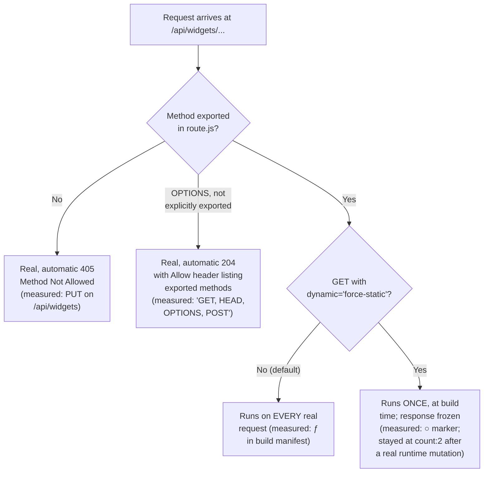

# Route Handlers: Building a Backend-for-Frontend Layer in Next.js

> **Topic register:** F-207 (Route Handlers: building a backend-for-frontend layer in Next.js itself) · Intermediate tier · `00-project/frontend-topic-register.md` · flagged as relevant to a Java-backend-plus-Next.js full-stack setup — "where does logic live"
> **Scope note:** per `CLAUDE.md`'s Scope Addendum, this is the twenty-first frontend chapter, opening a new thread within D-F2 (Next.js) alongside the rendering/caching/streaming line (F-201–F-206). Where F-204 covered how a Server Component's own `fetch()` calls are cached, this chapter covers a DIFFERENT surface: `route.js` files that turn a Next.js app into a real, publicly reachable HTTP API of its own — the exact seam where, in a Java-backend-plus-Next.js system, a team decides whether a piece of logic lives in the Java service or in this thin Next.js layer in front of it.
> **Provenance:** every claim is verified against the SAME real Next.js 16.3.1 App Router app used for F-201–F-206 — [`practice/frontend/react-nextjs-fundamentals/`](../../practice/frontend/react-nextjs-fundamentals/) — including a real production build's route manifest distinguishing cached from uncached Route Handlers, a full real `curl` sequence covering CRUD (200/201/400/404/204), the framework's automatic `405 Method Not Allowed` and `OPTIONS` behavior, and a real browser-driven proof of a Client Component calling these handlers directly.

## Table of Contents

1. [Learning Objectives](#learning-objectives)
2. [Why This Matters in Interviews](#why-this-matters-in-interviews)
3. [Mental Model](#mental-model)
4. [Definition and Purpose](#definition-and-purpose)
5. [Core Concepts](#core-concepts)
6. [Internal Implementation](#internal-implementation)
7. [Diagrams](#diagrams)
8. [Real Verified Demos](#real-verified-demos)
9. [Production Scenarios](#production-scenarios)
10. [Trade-offs](#trade-offs)
11. [Decision Framework](#decision-framework)
12. [Common Mistakes](#common-mistakes)
13. [Anti-Patterns](#anti-patterns)
14. [Best Practices](#best-practices)
15. [Interview Answer Framework](#interview-answer-framework)
16. [Interview Questions](#interview-questions)
17. [Summary](#summary)
18. [Key Takeaways](#key-takeaways)
19. [Cheat Sheet](#cheat-sheet)
20. [Flashcards](#flashcards)
21. [Practice Exercises](#practice-exercises)
22. [Solutions](#solutions)
23. [Additional Reading](#additional-reading)
24. [Official References](#official-references)

---

## Learning Objectives

By the end of this chapter you can:

- Write a `route.js` file that handles multiple HTTP methods (`GET`, `POST`, `PATCH`, `DELETE`) on both a static and a dynamic (`[id]`) segment, having built and tested one.
- State precisely when a Route Handler is cached (never by default; `GET` only, and only when explicitly opted in) and when it is not — verified directly against a real build manifest and a real runtime freeze/no-freeze comparison.
- Explain the Route Handler vs. Server Component `fetch()` distinction: which one is the right tool for data a Server Component needs, and which is the right tool for data a CLIENT (browser JS, a mobile app, a third-party webhook) needs.
- Reason about the Backend-for-Frontend pattern concretely: a Route Handler reshaping and hiding an upstream call, proven with a real external network request.
- State the real, framework-provided default behaviors (`405` for an undefined method, an auto-generated `OPTIONS` response) rather than assuming they need to be hand-written.

## Why This Matters in Interviews

For a candidate moving between a Java backend and a Next.js frontend, this is one of the highest-leverage topics in the whole domain: it is the exact place an interviewer will probe "so where would you actually put this logic — in your Spring service, or in Next.js?" A shallow answer says "Route Handlers are like Express routes." A strong answer states the real, tested caching default (Route Handlers are NOT cached by default — the opposite intuition from a page's `fetch()`, which this chapter's F-204 sibling showed CAN end up cached by default), names the concrete failure mode of using a Route Handler as a Server Component's own data source (a real, build-breaking chicken-and-egg problem, covered below), and can draw the boundary: Route Handlers exist for clients that are NOT this app's own Server Components — a browser's client-side JS, a third-party webhook, a mobile app, or (the register's own framing) a thin proxy/reshaping layer in front of a real backend service.

## Mental Model

**A Route Handler is a real, standalone HTTP endpoint — not a data-fetching helper for this app's own pages.** It speaks the plain Web `Request`/`Response` API (extended with `NextRequest`/`NextResponse` for convenience), lives at a `route.js` file instead of a `page.js`, and is reachable by ANYONE who can reach the app's URL — a browser's `fetch()`, `curl`, a webhook sender, another service. This chapter proved the two properties that most directly contradict a naive mental model borrowed from page-level caching: first, a Route Handler's `GET` is NOT cached unless explicitly opted in with `export const dynamic = 'force-static'` (the build manifest showed `ƒ` for every handler in this demo except the one explicit opt-in, which showed `○` — the SAME marker as a statically rendered page); second, when opted in, that cached response is frozen at BUILD time and stays frozen even while the handler's own underlying data changes at runtime — proven directly by mutating an in-memory store through one endpoint and watching a second, cached endpoint keep reporting the stale, build-time count.

## Definition and Purpose

**Route Handlers** are the App Router's mechanism for defining custom request handlers — a `route.js`/`route.ts` file exporting async functions named after HTTP methods (`GET`, `POST`, `PUT`, `PATCH`, `DELETE`, `HEAD`, `OPTIONS`) — at any segment of the `app/` directory, EXCEPT a segment that also has a `page.js` (the two conflict; a route serves all verbs for that exact path). They exist to let a Next.js deployment serve non-HTML content — JSON APIs, webhooks, RSS/XML feeds, file downloads, redirects — using the same file-based routing and the same deployment as the rest of the app, without standing up a separate backend service for that purpose. The **Backend-for-Frontend (BFF)** pattern this chapter's register entry calls out is a specific, common use of Route Handlers: instead of the browser calling an upstream service (a real backend, a third-party API) directly, it calls a Route Handler, which calls the upstream service SERVER-SIDE and returns a reshaped, minimal response — hiding the upstream's URL, credentials, and exact response shape from the client entirely. This chapter's own `uuid-proxy` demo is a small, real instance of exactly that pattern; in a Java-backend-plus-Next.js system, the same Route Handler would instead call the real Java service.

## Core Concepts

### Caching: not cached by default, and one real, precise opt-in

Per this version's own bundled docs, Route Handlers are NOT cached by default; `GET` is the only method that CAN be cached at all, and only via an explicit route config option (`export const dynamic = 'force-static'` in this app's demo). This chapter's real build manifest showed exactly that split for five sibling `route.js` files in the SAME app: `/api/widgets`, `/api/widgets/[id]`, `/api/echo`, and `/api/uuid-proxy` all showed `ƒ` (Dynamic); only `/api/widgets/cached-count`, carrying the explicit opt-in, showed `○` (Static) — the identical marker this repository's F-201–F-205 chapters use for a statically rendered PAGE, confirming Route Handlers plug into the same build-time-vs-request-time classification system, not a separate one.

### A cached Route Handler freezes at build time — proven with a live mutation

The `cached-count` handler's `○` marker isn't just a label — it was verified behaviorally. Before any mutation, `GET /api/widgets/cached-count` returned `{"count":2,"note":"captured at build time"}`. A real `POST /api/widgets` then added a third widget, confirmed immediately afterward by `GET /api/widgets` returning all three. Re-checking `GET /api/widgets/cached-count` returned the EXACT SAME `{"count":2,...}` — the build-time snapshot, untouched by the runtime mutation that had just happened seconds earlier through a sibling, uncached endpoint in the same file tree.

### CRUD over a dynamic `[id]` segment — a full real request cycle

`app/api/widgets/[id]/route.js` handles `GET` (200 with the widget, or a real 404 with `{"error":"No widget with id 999"}` for a missing one), `PATCH` (merges a JSON body into the existing widget, 200), and `DELETE` (204, no body). All three were exercised with real `curl` requests against a clean `next start` server: `GET /api/widgets/1` → 200; `GET /api/widgets/999` → genuinely 404; `PATCH /api/widgets/1` with `{"qty":99}` → 200 with the updated widget; `DELETE /api/widgets/2` → a real 204 with an empty body.

### Automatic `405` and `OPTIONS` — framework defaults, not hand-written code

Two behaviors this chapter's demo code never implements were verified as genuinely automatic. A real `PUT /api/widgets` (a method this file never exports) returned `405 Method Not Allowed` with no handler code producing that response. A real `OPTIONS /api/widgets` returned `204 No Content` with a header `allow: GET, HEAD, OPTIONS, POST` — an accurate, auto-derived list of exactly the methods this one file actually implements (`GET`, `POST`), plus the always-available `HEAD`/`OPTIONS`. Neither response required a single line of this chapter's own code.

### The Backend-for-Frontend seam — a real reshaping proxy

`app/api/uuid-proxy/route.js` makes a real server-side `fetch` to `https://httpbin.org/uuid`, and returns a DIFFERENT, smaller JSON shape (`{correlationId, source, reshapedBy}`) — the client never sees httpbin's own response shape or URL. Verified twice with real network calls: once via `curl` (`correlationId: "a530720b-..."`) and once via a real browser button click through the app's own Client Component (`correlationId: "6602717a-..."`, genuinely different, confirming a fresh server-side call on each real client-initiated request, matching the handler's explicit `cache: 'no-store'`).

## Internal Implementation

A `route.js` file is compiled into a server-side handler keyed by HTTP method; Next.js's routing layer dispatches an incoming request to the exported function matching its method, passing a `Request` (or `NextRequest`, which adds a parsed `nextUrl` with `searchParams`/`pathname` convenience, plus cookie helpers) and, for dynamic segments, a `{ params }` object whose `params` is itself a Promise (`await params` — this app's `[id]` handlers all await it, consistent with this version's async-params convention seen elsewhere in this app's dynamic routes). The framework tracks, per file, exactly which methods are exported; any UNEXPORTED standard method automatically resolves to a real `405 Method Not Allowed`, and `OPTIONS`, if not explicitly exported, is synthesized with an `Allow` header listing precisely the methods that ARE exported — both verified directly in this chapter's real curl output rather than assumed from documentation. For caching, the SAME static-generation-eligibility analysis this app's F-204 chapter demonstrated for page-level `fetch()` calls applies to a Route Handler's own `GET`: by default, a Route Handler is treated as needing per-request evaluation (no attempt to freeze it at build time); `export const dynamic = 'force-static'` opts a `GET` handler INTO that build-time evaluation instead, at which point the function body runs exactly once, during `next build`, and its returned response is baked into the static output — exactly why this chapter's `cached-count` handler kept returning `2` after a runtime mutation that a live process's in-memory array had genuinely already reflected elsewhere.

## Diagrams

## Real Verified Demos

All demos are real, built and tested against a clean production Next.js server — [`practice/frontend/react-nextjs-fundamentals/`](../../practice/frontend/react-nextjs-fundamentals/). Full captured `curl` output and the live browser session, in the app's own [README.md](../../practice/frontend/react-nextjs-fundamentals/README.md):

- [`lib/widgets-store.js`](../../practice/frontend/react-nextjs-fundamentals/lib/widgets-store.js) — the in-memory store shared across requests within this one server process.
- [`app/api/widgets/route.js`](../../practice/frontend/react-nextjs-fundamentals/app/api/widgets/route.js) — `GET` (list, uncached) and `POST` (create, with real 400 validation).
- [`app/api/widgets/[id]/route.js`](../../practice/frontend/react-nextjs-fundamentals/app/api/widgets/%5Bid%5D/route.js) — `GET`/`PATCH`/`DELETE` on a dynamic segment, real 200/404/204.
- [`app/api/widgets/cached-count/route.js`](../../practice/frontend/react-nextjs-fundamentals/app/api/widgets/cached-count/route.js) — the real `force-static` freeze proof.
- [`app/api/uuid-proxy/route.js`](../../practice/frontend/react-nextjs-fundamentals/app/api/uuid-proxy/route.js) — the real Backend-for-Frontend reshaping proxy.
- [`app/api/echo/route.js`](../../practice/frontend/react-nextjs-fundamentals/app/api/echo/route.js) — `NextRequest.nextUrl` and header access.
- [`app/api-demo/page.js`](../../practice/frontend/react-nextjs-fundamentals/app/api-demo/page.js) + [`app/api-demo/WidgetsClient.js`](../../practice/frontend/react-nextjs-fundamentals/app/api-demo/WidgetsClient.js) — a real Client Component driving all of the above via browser `fetch()`.

## Production Scenarios

**Scenario: a Server Component fetches its own data from this app's own Route Handler, and a deploy starts failing intermittently.** A team, wanting "one clean API layer," has a Server Component `fetch()` an internal `/api/dashboard-summary` Route Handler instead of calling the underlying data source directly. Initial symptom: `next build` fails sporadically with a connection error naming that route. Initial hypothesis: a flaky network blip in CI. Evidence: this is the SAME class of failure this repository's F-204 chapter captured directly (a `force-cache`-eligible fetch executing DURING `next build`, before the app's own server exists) — except here it's specifically a Server Component treating its OWN app's Route Handler as a data source, which this chapter's official reference material explicitly calls out as a documented caveat: for a Server Component prerendered at build time, fetching from that same app's own Route Handler fails, because there is no server listening yet; even for a Server Component rendered on demand, going through the Route Handler adds an unnecessary extra HTTP round trip. Diagnosis: the "one clean API layer" instinct conflated two different clients — this app's OWN Server Components (which should fetch data directly, at its source, the way F-204's demos do) and EXTERNAL clients (browsers, webhooks, other services — for whom a Route Handler is exactly the right tool). Fix: the Server Component fetches its data source directly (no Route Handler in between); the Route Handler stays, serving the SAME data to the app's own client-side JS, third-party integrations, or a mobile client — its actually intended consumers.

## Trade-offs

| Concern | Server Component `fetch()` (data source directly) | Route Handler (`/api/...`) |
|---|---|---|
| Intended caller | This app's own Server Components, rendering HTML | Browsers' client-side JS, webhooks, other apps/services — anyone reaching the URL |
| Build-time behavior | Cacheable fetches attempted at build time (F-204) | `GET` NOT cached by default; opt-in `force-static` runs the handler itself at build time (measured: real freeze) |
| Extra network hop | None — data source called directly in the render path | One extra real HTTP round trip if a Server Component calls it anyway (documented caveat, not measured here) |
| Content type | Renders into this app's own HTML | Any content type — JSON, XML, files, redirects (measured: JSON demos) |
| Public reachability | Not directly reachable — only reachable by rendering a page | Directly, publicly reachable at its own URL (measured: real curl/browser calls) |

## Decision Framework

1. **Is the caller this app's OWN Server Component, rendering a page?** → Fetch the data source directly, the way F-204's demos do — do NOT route it through this app's own Route Handler; that's the documented, real chicken-and-egg build failure this chapter's Production Scenario walks through.
2. **Is the caller something OUTSIDE this app's own render path — browser JS, a webhook sender, another service, a mobile client?** → A Route Handler is the right tool; verified here with a real Client Component doing exactly this.
3. **Does the response need to hide or reshape an upstream service's URL, credentials, or exact response shape?** → A Route Handler acting as a Backend-for-Frontend proxy — verified here with a real external call reshaped before returning to the client.
4. **Does this specific `GET` response change on every request, or is it stable enough to bake in at build time?** → Default (uncached) for per-request data; explicit `force-static` only for data that's genuinely fine to freeze until the next deploy — verified here with a real frozen-vs-live count comparison.

## Common Mistakes

- Assuming Route Handlers are cached like a page's `fetch()` sometimes is by default (F-204) — this chapter's real build manifest showed the opposite default: `ƒ` (uncached) for every handler except one explicit opt-in.
- Having a Server Component fetch its own app's Route Handler as its data source, instead of the underlying data source directly — the exact, documented, real build-failure-prone pattern this chapter's Production Scenario covers.
- Hand-writing a `405` response or an `OPTIONS` handler "to be safe" — both are real, automatic framework behaviors, verified directly in this chapter's curl output, that need no code.

## Anti-Patterns

- **Using `force-static` on a `GET` handler whose data changes at runtime, without understanding it freezes at build time** — this chapter's real `cached-count` demo shows the exact, silent staleness this produces: a runtime mutation the live process genuinely made was invisible through that one cached endpoint.
- **Routing a Server Component's own data fetch through this same app's Route Handler "for consistency"** — a real, documented failure mode (build-time unreachability) and an unnecessary extra round trip even when it doesn't outright fail.

## Best Practices

- Treat a Route Handler as a real, public API endpoint from the moment it's created — validate input (this chapter's `POST`/`PATCH` handlers return real 400s for bad bodies), and never assume only "trusted" callers will reach it.
- Let a Route Handler be the seam where a Java-backend-plus-Next.js system decides "does this call go to the real backend, or does Next.js own this small piece" — the register's own framing, and exactly what this chapter's `uuid-proxy` demo is a small, real instance of.
- Reach for `export const dynamic = 'force-static'` only for genuinely build-stable `GET` data, and pair it with the same on-demand (`revalidateTag`) or time-based (`revalidate`) invalidation this repository's F-204 chapter covers, rather than assuming a cached handler will ever notice a runtime change on its own.

## Interview Answer Framework

### 30-Second Answer

Route Handlers (`route.js` files under `app/`) turn a Next.js app into a real, public HTTP API — they support `GET`/`POST`/`PATCH`/`DELETE`/etc., are NOT cached by default (verified here: real build manifest shows `ƒ` for every handler except one explicit `force-static` opt-in, which then freezes at build time), and exist for callers OUTSIDE this app's own render path — browsers' client-side JS, webhooks, other services — not as a detour for this app's own Server Components to fetch their own data through.

### 2-Minute Answer

Start with the convention: a `route.js` file exports async functions named after HTTP methods; any method not exported gets a real, automatic `405`, and `OPTIONS` is auto-generated with an accurate `Allow` header — both verified directly with curl, no hand-written code involved. Cover caching precisely: unlike a page's own `fetch()` (which F-204 showed CAN end up cached by default), a Route Handler's `GET` is NOT cached unless explicitly opted in with `force-static` — verified with a real build manifest showing the split, and a real runtime mutation proving a cached handler freezes at build time and ignores later changes. Cover the CRUD demo: real 200/201/400/404/204 responses over a dynamic `[id]` segment. Close with the Backend-for-Frontend framing the register calls out: a Route Handler making a real server-side call to an upstream service and returning a reshaped response — the exact seam where, in a mixed Java-backend/Next.js system, a team decides whether logic lives in the real backend or in this thin Next.js layer.

### 10-Minute Deep Dive

Cover: the file convention and method-dispatch mechanism, including the real, automatic `405`/`OPTIONS` behaviors; the caching model and its real, measured contrast with page-level `fetch()` caching (F-204), including the concrete freeze-at-build-time proof; the CRUD lifecycle over a dynamic segment with real request/response pairs for every outcome (success, validation failure, not-found, no-content); the documented, real failure mode of a Server Component fetching its own app's Route Handler (a build-time chicken-and-egg problem, the same CLASS of issue as F-204's `ECONNREFUSED` discovery, but specifically flagged in this version's own Backend-for-Frontend guide as a named caveat); and the Backend-for-Frontend pattern itself, grounded in this chapter's real external-call proxy demo and the register's explicit Java-backend-plus-Next.js framing.

### Whiteboard Explanation

Draw a browser box and a "Next.js server" box connected by an arrow labeled "GET /api/widgets". Inside the Next.js box, draw a small decision diamond: "method exported?" — one branch to "run handler" (annotate: real 200/201/400/404/204 outcomes), one branch to "405, automatic" (annotate: real curl proof, no code). Draw a second small box labeled "force-static?" branching to "per-request (default, measured ƒ)" vs. "frozen at build (measured ○, stayed stale after a real runtime mutation)". Off to the side, draw a THIRD box labeled "httpbin.org" with an arrow from the Next.js server (not the browser) — label it "server-side call, reshaped before returning" — the Backend-for-Frontend seam.

### Production Example

A team routes a Server Component's own data fetch through their app's own `/api/dashboard-summary` Route Handler "for consistency," and hits sporadic `next build` failures — the same class of chicken-and-egg failure F-204 discovered directly, here specifically flagged as a documented caveat: fetching a same-app Route Handler from a Server Component fails at build time (no server listening yet) and is a wasted extra round trip even when it doesn't fail outright. Fixed by having the Server Component call the underlying data source directly, keeping the Route Handler for its actual intended callers (browser JS, webhooks, other services).

### Trade-offs to Mention

Route Handlers are the right tool for anything OUTSIDE this app's own render path, not a universal internal API layer; their default (uncached) behavior is the opposite of what a page's own `fetch()` sometimes does by default, which is worth stating explicitly to avoid an interviewer's easy "are you sure?" follow-up; `force-static` trades runtime freshness for build-time performance, and that trade needs the same explicit invalidation discipline (`revalidateTag`/`revalidatePath`) F-204 already established for page-level caching.

### Common Candidate Mistakes

Describing Route Handlers as generically "like an Express route" without naming the specific, real caching default or the documented Server-Component-fetching-its-own-Route-Handler failure mode. Assuming `OPTIONS`/`405` need to be hand-implemented. Missing the Backend-for-Frontend framing entirely and describing Route Handlers only as "a way to add an API route," without connecting it to where backend logic decisions actually live in a mixed-stack system.

### Senior-Level Expectations

States the real caching default precisely, contrasts it correctly against page-level `fetch()` caching, and can name the concrete failure mode of routing a Server Component's own data fetch through the app's own Route Handler.

### Staff-Level Discussion

In a Java-backend-plus-Next.js system, deciding whether a piece of logic lives in the Java service or in a Next.js Route Handler is a real architectural call with organizational weight: a Route Handler acting as a thin BFF proxy (this chapter's `uuid-proxy` demo) keeps frontend-shaped concerns — reshaping, aggregating multiple calls, hiding upstream credentials from the browser — close to the frontend team that owns them, without duplicating business logic that genuinely belongs in the backend; but letting substantive business logic accumulate in Route Handlers risks splitting a system's actual rules across two codebases with two deploy cycles and two on-call rotations, echoing the same coupling-cost reasoning F-204's Staff-Level Discussion applied to on-demand vs. time-based cache invalidation. A Staff-level engineer draws this line deliberately and documents it, rather than letting it drift by whichever team happened to write a given endpoint first.

## Interview Questions

### Question 1

**Question:** "A teammate wants a Server Component to fetch its data by calling this SAME app's own `/api/widgets` Route Handler, instead of calling the underlying data source directly. What's your concern?"

**Expected answer:** This is a documented, real failure mode, not a style preference. For a Server Component prerendered at build time, fetching from the app's own Route Handler fails, because no server is listening yet at build time — the same class of chicken-and-egg problem this repository's F-204 chapter captured directly as a real `ECONNREFUSED`. Even for a Server Component rendered on demand (not prerendered), going through the Route Handler adds a real, unnecessary extra HTTP round trip compared to calling the data source directly. Route Handlers exist for callers OUTSIDE this app's own render path — browser JS, webhooks, other services — not as an internal detour for this app's own Server Components.

**Common mistakes:** Treating "one clean API layer for everything" as an unconditional good, without naming the specific build-time failure this pattern causes.

**Follow-up questions:** "If both the Server Component and the browser's client-side JS need the same data, how do you avoid duplicating logic?" (a shared function/module the Server Component calls directly and the Route Handler also calls directly — both call the SAME underlying logic, neither calls the OTHER). "How would you actually discover this failure before it hits production?" (a real `next build` locally or in CI — exactly how F-204's version of this same failure class was discovered).

**Senior-level expectations:** Names the specific build-time mechanism, not just "it's slower."

**Staff-level expectations:** Proposes the shared-module fix and generalizes the principle to when Route Handlers ARE the right internal seam (a genuinely external caller) versus when they aren't.

### Question 2

**Question:** "You add `export const dynamic = 'force-static'` to a Route Handler's `GET`. A week after deploy, the data it returns is stale. Why, and what would you check first?"

**Expected answer:** `force-static` makes that `GET` run ONCE, at build time, and its response gets frozen into the static output — this chapter proved this directly: a `cached-count` handler kept returning its build-time value even after a real runtime mutation had already changed the underlying data through a sibling, uncached endpoint in the same app. The first thing to check is exactly this: is the underlying data expected to change between deploys, and if so, is there an invalidation mechanism (`revalidateTag`/`revalidatePath`, the same on-demand mechanism F-204 covers for page-level caching) actually wired up — or is the handler just relying on the next full deploy to refresh it, which may be far later than acceptable.

**Common mistakes:** Assuming `force-static` behaves like an in-memory cache with a TTL, rather than a build-time freeze with no automatic refresh.

**Follow-up questions:** "How would you verify this directly, without waiting a week?" (mutate the data through another endpoint, then re-check the cached one immediately — exactly this chapter's real proof). "What's the fix if this data DOES need to reflect runtime changes?" (drop the `force-static` opt-in entirely, or keep it and call `revalidateTag`/`revalidatePath` from whatever mutation changes that data).

**Senior-level expectations:** Explains the build-time-freeze mechanism precisely and proposes a concrete, verifiable check.

**Staff-level expectations:** Connects this to the same time-based-vs-on-demand invalidation trade-off F-204 already established, rather than treating it as a new, unrelated problem.

## Summary

Route Handlers are real, public HTTP endpoints, defined by `route.js` files exporting HTTP-method-named functions — proven here with a full CRUD lifecycle (200/201/400/404/204) over both a static and a dynamic `[id]` route. They are NOT cached by default (the opposite default from a page's own `fetch()`, per F-204), and an explicit `force-static` opt-in freezes a `GET` handler's response at BUILD time — proven with a real runtime mutation that a cached sibling endpoint never reflected. Unexported methods produce a real, automatic `405`, and `OPTIONS` is auto-generated with an accurate `Allow` header — neither needs hand-written code. The Backend-for-Frontend pattern the register calls out was proven concretely: a Route Handler making a real server-side call to an external service and returning a reshaped response, verified via both `curl` and a real browser-driven Client Component.

## Key Takeaways

- Route Handlers are NOT cached by default — proven with a real build manifest (`ƒ` for every handler except one explicit `force-static` opt-in, which showed `○`).
- A `force-static` `GET` handler freezes at build time — proven with a real runtime mutation a cached sibling endpoint never picked up.
- Unexported methods get a real, automatic `405`; `OPTIONS` is auto-generated with an accurate `Allow` header — neither requires code.
- A Server Component fetching its own app's Route Handler is a documented, real failure mode (build-time unreachability) — the data source should be called directly instead.
- A Route Handler making a real server-side call to an upstream service and reshaping the response is a genuine, small Backend-for-Frontend instance — the exact seam a Java-backend-plus-Next.js system uses to decide where logic lives.

## Cheat Sheet

- **`route.js` exporting `GET`/`POST`/etc.** → a real, public HTTP endpoint, reachable by anyone who can reach the URL.
- **Default `GET` caching** → NOT cached (measured: real `ƒ` marker) — the opposite default from some page-level `fetch()` calls (F-204).
- **`export const dynamic = 'force-static'`** → `GET` runs once at build time, response frozen (measured: real freeze despite a runtime mutation).
- **Unexported method** → automatic real `405 Method Not Allowed`.
- **`OPTIONS`, not exported** → automatic real `204` with an accurate `Allow` header.
- **Server Component fetching its own app's Route Handler** → documented, real build-time failure risk — call the data source directly instead.
- **Backend-for-Frontend** → Route Handler makes the real upstream call server-side, returns a reshaped response — client never sees the upstream URL or shape.

## Flashcards

## Card: Are Route Handlers cached by default?

**Prompt:**
Is a Route Handler's `GET` response cached by default in the App Router?

**Answer:**
No. Verified with a real build manifest: five sibling `route.js` files all showed `ƒ` (Dynamic/uncached) except one with an explicit `export const dynamic = 'force-static'`, which showed `○` (Static) — and that one froze at build time, confirmed by a real runtime mutation it never picked up.

**Why it matters:**
This is the OPPOSITE default from a page's own `fetch()`, which F-204 showed can end up statically cached by default when nothing else forces dynamic rendering — conflating the two is an easy, real mistake.

**Common trap:**
Assuming Route Handler caching works the same way as page-level `fetch()` caching, without checking the actual build manifest marker.

**Related:**
[[nextjs-route-handlers]] [[nextjs-data-fetching-and-caching]]

## Card: Why fetching your own app's Route Handler from a Server Component is risky

**Prompt:**
Why is it a real problem for a Server Component to fetch data by calling that SAME app's own Route Handler, instead of calling the underlying data source directly?

**Answer:**
For a Server Component prerendered at build time, the fetch fails — no server is listening yet during `next build`, the same class of chicken-and-egg failure F-204 captured directly as a real `ECONNREFUSED`. Even when not prerendered, it adds a real, unnecessary extra HTTP round trip.

**Why it matters:**
This is a documented, named caveat in this version's own Backend-for-Frontend guide, not a hypothetical edge case.

**Common trap:**
Treating "route everything through one API layer" as always correct, without exempting this app's own Server Components from that rule.

**Related:**
[[nextjs-route-handlers]]

## Practice Exercises

1. In `app/api/widgets/cached-count/route.js`, remove `export const dynamic = 'force-static'`. Run `next build`, check the route manifest's marker for this route, then run `next start`, mutate the store via `POST /api/widgets`, and re-check this endpoint. Predict, then verify, whether it now reflects the mutation immediately.
2. Add a new method export, `HEAD`, to `app/api/widgets/route.js` that returns an empty 200 response with an `X-Widget-Count` header set to the current count. Run a real `curl -I` against it and verify the header.
3. In `app/api/uuid-proxy/route.js`, change the `fetch` call's `cache` option from `'no-store'` to `'force-cache'`. Run a real `next build`, then `next start`, and `curl` the endpoint twice. Predict, then verify, whether both real requests return the SAME `correlationId` now.

## Solutions

Exercise 1: with the `force-static` opt-in removed, the route manifest would show `ƒ` (Dynamic) instead of `○`, and a `curl` immediately after a `POST /api/widgets` mutation would show the count reflecting that mutation right away — because the handler now runs fresh on every real request instead of being frozen at build time. This is the direct inverse of this chapter's own real freeze proof.

Exercise 2: a `curl -I` (a HEAD request) against the endpoint would return a 200 with no body and the custom `X-Widget-Count` header present, since `HEAD` is one of the officially supported methods a Route Handler file can export directly, and `NextResponse`'s `headers` option applies to any exported method identically to `GET`/`POST`.

Exercise 3: with `cache: 'force-cache'`, the fetch to `httpbin.org/uuid` becomes eligible for the SAME build-time execution behavior F-204 demonstrated for page-level `fetch()` calls — it would be attempted once, during `next build`, and its result frozen; both real curl requests afterward would return the IDENTICAL `correlationId`, in contrast to this chapter's actual `no-store` demo, which returned a genuinely different `correlationId` on each real call (both curl and the live browser click).

## Additional Reading

- [Data Fetching in the App Router](nextjs-data-fetching-and-caching.md) — this chapter's prerequisite; the page-level `fetch()` caching model this chapter's Route Handler caching model is deliberately contrasted against.
- [API Design](../07-api-design/api-design.md) — the backend-domain chapter covering the broader HTTP API design principles (status codes, validation, idempotency) this chapter's CRUD demo applies specifically to a Route Handler.
- [Proxy (formerly Middleware) & the Edge Runtime in Next.js 16](nextjs-proxy-and-edge-runtime.md) — the next chapter in sequence (F-208); covers the OTHER real, public-facing server-side seam in this app, and contrasts it directly against this chapter's Route Handlers (fast, coarse gating vs. real business logic).
- [00-project/frontend-topic-register.md](../../00-project/frontend-topic-register.md) — the full register this chapter is F-207 of.

## Official References

- [nextjs.org: Route Handlers](https://nextjs.org/docs/app/getting-started/route-handlers)
- [nextjs.org: Backend for Frontend](https://nextjs.org/docs/app/guides/backend-for-frontend)
- [nextjs.org: `route.js` file convention](https://nextjs.org/docs/app/api-reference/file-conventions/route)
