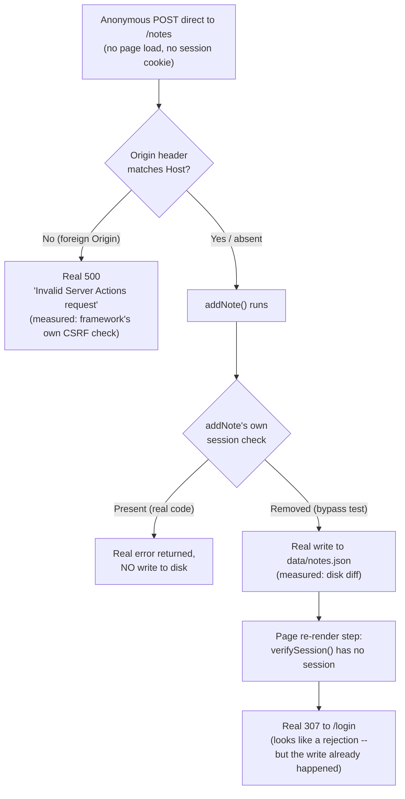
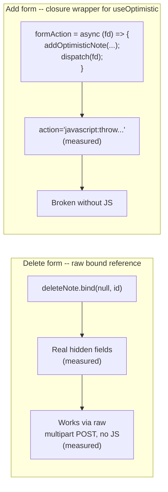

# Server Actions and Mutations in Next.js: No API Layer, Real Progressive Enhancement

> **Topic register:** F-212 (Server Actions: mutations without a separate API layer, progressive enhancement) · Advanced tier · `00-project/frontend-topic-register.md`
> **Scope note:** per `CLAUDE.md`'s Scope Addendum, this is the twenty-sixth frontend chapter, continuing D-F2 straight after F-211's authentication system. F-211 already used Server Actions for `login`/`logout`, but only as a mechanism; this chapter builds a real CRUD surface (`app/notes/`) with no Route Handler at all, and finds two things F-211 never needed to: a real, reproduced case where a mutation's own auth check matters MORE than the page's own protective redirect, and a real, decisive architectural cost of `useOptimistic` that only shows up once progressive enhancement is actually tested rather than assumed.
> **Provenance:** every claim is verified against the SAME real Next.js 16.3.1 App Router app used for F-201–F-211 — [`practice/frontend/react-nextjs-fundamentals/`](../../practice/frontend/react-nextjs-fundamentals/) — including a real captured network trace proving the single-roundtrip response model, a real raw-multipart curl POST (no JavaScript, no fetch, no `Next-Action` header) that genuinely mutated server-side JSON-file state, a real captured CSRF rejection with the framework's own exact log message, and a real, disk-verified bypass showing a mutation can commit even while the HTTP response looks like a rejection.

## Table of Contents

1. [Learning Objectives](#learning-objectives)
2. [Why This Matters in Interviews](#why-this-matters-in-interviews)
3. [Mental Model](#mental-model)
4. [Definition and Purpose](#definition-and-purpose)
5. [Core Concepts](#core-concepts)
6. [Internal Implementation](#internal-implementation)
7. [Diagrams](#diagrams)
8. [Real Verified Demos](#real-verified-demos)
9. [Production Scenarios](#production-scenarios)
10. [Trade-offs](#trade-offs)
11. [Decision Framework](#decision-framework)
12. [Common Mistakes](#common-mistakes)
13. [Anti-Patterns](#anti-patterns)
14. [Best Practices](#best-practices)
15. [Interview Answer Framework](#interview-answer-framework)
16. [Interview Questions](#interview-questions)
17. [Summary](#summary)
18. [Key Takeaways](#key-takeaways)
19. [Cheat Sheet](#cheat-sheet)
20. [Flashcards](#flashcards)
21. [Practice Exercises](#practice-exercises)
22. [Solutions](#solutions)
23. [Additional Reading](#additional-reading)
24. [Official References](#official-references)

---

## Learning Objectives

By the end of this chapter you can:

- Build a full CRUD mutation surface (`app/notes/`) with a Server Component reading data directly and Server Actions mutating it directly — no Route Handler, no client-side `fetch()`, no separate API layer at all.
- Explain and prove, with a real captured network trace, that a Server Action triggering `revalidatePath` returns BOTH its own value and a freshly re-rendered RSC payload for the current route in ONE HTTP response — no follow-up GET required.
- State precisely, with a real reproduced test, why "the form is only rendered on an authenticated page" is not a security boundary — and why even a page-level redirect on the SAME request does not undo a mutation an action already committed.
- Explain and demonstrate the framework's own built-in CSRF protection (Origin-vs-Host comparison) with a real captured rejection.
- Explain and prove, with two contrasted real forms on the same page, why wrapping a Server Action in a client-side closure (to drive `useOptimistic`) trades away the native no-JavaScript form fallback that a directly-bound action reference gets for free.

## Why This Matters in Interviews

Server Actions questions separate candidates who can recite "`'use server'` lets you skip the API layer" from candidates who understand that a Server Action IS a public HTTP endpoint the moment it exists — reachable by anyone who can POST to it, independent of whatever UI happens to render the form. This chapter proves that distinction with a genuinely alarming real result: with a mutation's own auth check removed, an anonymous, no-cookie curl POST wrote a real row to the app's JSON-file store — while the HTTP response the attacker would see was a plain `307` redirect to `/login`, which looks like a rejection. An interviewer probing past "Server Actions are secure by default" wants exactly this: proof a candidate has tested what the framework actually guarantees (CSRF Origin checking, encrypted action references) versus what it explicitly does NOT guarantee (authorization) — and has verified the difference directly rather than assumed it.

## Mental Model

**A Server Action is a public POST endpoint wearing a function's clothes.** The `'use server'` directive doesn't create a private RPC channel — it tells the build to compile the function into two things: server-side code that stays on the server, and a client-side reference (an encrypted action ID) that POSTs back to whatever route rendered the form. Anyone who can construct that POST — with or without ever loading the page — can invoke the action. This chapter's own decisive, disk-verified test makes that concrete: even though `/notes` redirects an anonymous visitor to `/login` before they ever see the add-note form, a raw POST straight to the action's endpoint (bypassing the page's render entirely) still reached `addNote` — and with that action's own check removed, the write committed to `data/notes.json` even though the HTTP response the caller received was a `307` that reads like a block. **The single most important operational fact this chapter proves: the framework protects the TRANSPORT (a real, captured CSRF rejection for a mismatched `Origin`) but not the DECISION** — whether this specific caller is allowed to perform this specific mutation is entirely the action's own responsibility, checked fresh, every time, with no help from how the form happened to be rendered.

## Definition and Purpose

A **Server Action** is a React Server Function — an async function marked `'use server'` — invocable directly from a `<form action={...}>`, a `formAction` prop, or (via `startTransition`) a plain event handler. It exists to collapse the traditional three-hop mutation flow (client fetch → API route → database, with request/response shapes hand-maintained on both ends) into one: the Server Component reads data directly, the Server Action mutates it directly, and `revalidatePath`/`revalidateTag` tell the framework which cached reads are now stale. **Progressive enhancement** here means a form wired to a Server Action keeps working as a plain HTML form submission (full page POST, no JavaScript) because React compiles a real, inert fallback into the rendered HTML — this chapter's own captured evidence shows exactly what that fallback looks like, and exactly what makes it disappear.

## Core Concepts

### The whole CRUD cycle, with zero API layer

`app/notes/page.js` is a Server Component that calls `getNotes()` (a plain async function reading `data/notes.json`) directly in its body — no `fetch()`, no Route Handler. `app/notes/actions.js`'s `addNote`/`deleteNote` are Server Actions that call `addNoteRecord`/`deleteNoteRecord` directly, then `revalidatePath('/notes')`. This is a genuinely different shape from F-207's `app/api/widgets/` routes: F-207 has a Route Handler as a real, addressable, independently-testable HTTP resource (useful when a non-browser client, or this repo's own Java/Spring material, needs to call it); this chapter's notes demo has no such independent resource — the mutation only exists as an action tied to this specific page.

### A single response carries both the action's result and the page's new UI

Per this version's own Server Actions docs: when an action calls `revalidatePath`, `updateTag`, `refresh`, mutates cookies, or calls `redirect`, the SAME HTTP response that answers the POST also contains a freshly rendered RSC payload for the current route. This chapter's own captured `read_network_requests` trace confirms it exactly: exactly ONE `POST /notes` fired when the live "Add note" button was clicked (no separate GET followed), and that single response body contained both `1:{"ok":true}` (the action's own return value) and a fully re-rendered `main` tree showing the notes list WITH the new note already present. React commits this as a seeded navigation — no client-side refetch orchestration was written anywhere in this app for this to work.

### Render-time gating is not a security boundary — proven with a disk-verified bypass

`/notes` calls `verifySession()` (F-211's DAL), so an anonymous visitor never sees the add-note form — real, confirmed `307` to `/login`. But that protects only the PAGE render, not the ACTION. A raw POST built from the real hidden-field format Next embeds for a bound action reference, sent with no session cookie directly to `/notes`, still executes `addNote`. With `addNote`'s own `if (!session?.userId) return {error: ...}` check temporarily removed (and a crash-avoiding fallback for the missing `userId` added, restored immediately after capture), the SAME anonymous POST returned a `307` — indistinguishable, from the response alone, from every OTHER rejected request — but `data/notes.json` on disk gained a real new row (`authorId: "anonymous-bypass-test"`) BEFORE that redirect fired. The write and the redirect are two separate, sequential steps inside the same request; a caller only sees the second one. This is a real, more dangerous variant of F-211's Proxy-vs-DAL finding: there, a bypassed layer produced a VISIBLY different response (wrong redirect target). Here, a bypassed layer produces a response that looks EXACTLY like success-for-the-attacker-but-fine-for-us, while the mutation has already happened.

### The framework's own CSRF protection — real, captured, and distinct from authorization

Every Server Action request is checked by the framework itself: the `Origin` header is compared against `Host`/`X-Forwarded-Host`, and a mismatch is rejected before the action function ever runs. A real curl POST to `/notes` with `Origin: https://evil.example.com` produced a real `HTTP 500`, and the dev server's own log stated the exact reason: `` `x-forwarded-host` header with value `localhost:5198` does not match `origin` header with value `evil.example.com` from a forwarded Server Actions request. Aborting the action. `` followed by `Error: Invalid Server Actions request.` This is real, and it is NOT the same protection as the auth-bypass finding above — CSRF checking stops a foreign SITE from forging a request using a victim's own browser and cookies; it does nothing for a direct, same-origin-spoofed request like the raw curl bypass test, which is exactly why both checks are needed and neither substitutes for the other.

### Progressive enhancement: two real forms, two real outcomes

The delete form (`deleteNote.bind(null, note.id)`, a raw bound Server Action reference, no client-side wrapper) rendered with real, working hidden fields — `$ACTION_REF_4`, `$ACTION_4:0` (an encrypted action reference), `$ACTION_4:1` (the bound `noteId` argument, JSON-encoded) — and `encType="multipart/form-data"`. A raw curl POST replicating exactly those fields, with no JavaScript involved at all, genuinely deleted the target note and got back a correctly re-rendered page. The add-note form, wired through a local `formAction` closure so `useOptimistic` could inject an instant pending item before dispatching, rendered instead with `action="javascript:throw new Error('React form unexpectedly submitted.')"` — a real, deliberate dead end: React intercepts the SUBMIT EVENT via a listener to make this work with JavaScript enabled, but the literal HTML `action` attribute is not a working fallback. Without JavaScript, that form does nothing. This is a real, direct architectural trade-off, not a Next.js limitation: `useOptimistic` needs a client-side function it can call before the real dispatch, and wrapping the action in that function is exactly what breaks the plain-HTML-form fallback a raw bound reference gets automatically.

### `useActionState`, `useFormStatus`, and `useOptimistic` side by side

`useActionState(addNote, initialState)` returns `[state, dispatch, pending]` — `state.error` renders validation/auth failures, `pending` is one real pending signal. `useFormStatus()`, called inside a nested `SubmitButton` component (it reads context from the nearest ancestor `<form>`, so it cannot be called in the same component that renders the `<form>` tag), is a SECOND, independent pending signal. `useOptimistic(notes, reducer)` returns a locally-patched list that updates synchronously on submit, before the real 800ms artificial delay in `addNote` resolves. A real captured screenshot mid-flight shows all three at once: a dimmed, delete-button-less "Optimistic UI race test" item, the submit button reading "Working...", and a separate "useActionState pending: true" line — three distinct pieces of pending UI, from two different hooks, all genuinely active simultaneously. A follow-up screenshot after the delay shows the optimistic item replaced by the real server-confirmed one (a real id, a working Delete button), proving React correctly reconciles the optimistic patch away once the real data arrives.

## Internal Implementation

The `'use server'` directive is a build-time signal, not a runtime check: the compiler splits the file into server-side implementation (kept out of any client bundle — F-203's server/client code-vs-output distinction applies here identically) and a client-side reference object containing an encrypted action ID. That reference is what a `<form action={someAction}>` actually receives on the client — React renders it as the hidden `$ACTION_REF_n`/`$ACTION_n:0`/`$ACTION_n:1` fields this chapter captured directly, and wires a submit listener that, when JavaScript is present, intercepts the native submission and dispatches via `fetch()` with a `Next-Action` header instead (the mechanism the live browser's "Add note" click actually used, per the captured network trace). When a component wraps the action reference in its own local async function — exactly what this chapter's `formAction` closure does to call `addOptimisticNote()` first — the value handed to `<form action={...}>` is no longer a serializable action reference at all; it is an ordinary client-side JavaScript closure, so React has nothing to encode into hidden fields and falls back to the inert `javascript:` placeholder captured above. The framework's CSRF check runs as middleware ahead of the action dispatch itself, comparing `Origin` to `Host`/`X-Forwarded-Host` — this is why the malicious-Origin test produced a `500` with a specific, named error BEFORE any of `addNote`'s own code (including its auth check) ever ran; it is a transport-layer check, entirely independent of application-level authorization.

## Diagrams

## Real Verified Demos

All demos are real, built and tested against a live `next dev` server (a real, external `httpbin.org` outage at verification time blocked the app's PRE-EXISTING F-204/F-205 routes from a full production build — unrelated to this chapter's own code, which compiled cleanly in Turbopack's first build pass before that unrelated route failed) plus a real, live browser session — [`practice/frontend/react-nextjs-fundamentals/`](../../practice/frontend/react-nextjs-fundamentals/). Full captured curl/network-trace output in the app's own [README.md](../../practice/frontend/react-nextjs-fundamentals/README.md):

- [`lib/notes-store.js`](../../practice/frontend/react-nextjs-fundamentals/lib/notes-store.js) — a real, disk-backed JSON file store (survives a server restart, unlike F-207's in-memory `widgets-store.js`).
- [`app/notes/actions.js`](../../practice/frontend/react-nextjs-fundamentals/app/notes/actions.js) — real `addNote`/`deleteNote` Server Actions, DAL-protected, `revalidatePath`-driven.
- [`app/notes/page.js`](../../practice/frontend/react-nextjs-fundamentals/app/notes/page.js) — a DAL-protected Server Component reading the store directly.
- [`app/notes/NotesClient.js`](../../practice/frontend/react-nextjs-fundamentals/app/notes/NotesClient.js) — `useActionState` + `useOptimistic`, a bound per-item delete action.
- [`app/components/SubmitButton.js`](../../practice/frontend/react-nextjs-fundamentals/app/components/SubmitButton.js) — a real `useFormStatus` consumer, reused by both forms.

## Production Scenarios

**Scenario: a mutation appears to fail (client sees a redirect) but a support ticket reports the data changed anyway.** Symptom: a user reports seeing a "please sign in" redirect when submitting a form, but the record they were editing shows their edit applied regardless. Initial hypothesis: a caching bug — the client is seeing a stale, pre-edit page. Evidence, gathered using exactly this chapter's method: a raw request replicating the failing POST, sent with an invalid/missing session, produces the SAME redirect the user saw — but the underlying data store, checked directly (not through the app's own read path, which might itself be cached), shows the write went through. Diagnosis: the Server Action's own authorization check is missing or is failing OPEN (proceeding despite a failed check, e.g., a caught exception that doesn't `return` early) — the write executes, and only the SEPARATE, later re-render step (a page-level redirect) produces the response the user actually sees, creating the illusion of a clean rejection. Fix: audit every Server Action for an explicit, early-return auth check BEFORE any write — exactly the check this chapter's own `addNote` has, and exactly what a temporarily-removed version of it reproduced.

## Trade-offs

| Concern | No API layer (this chapter's `/notes`) | Route Handler as a real API (F-207's `/api/widgets`) |
|---|---|---|
| Non-browser clients (mobile app, another service, this repo's own Java backend) | Cannot call it — a Server Action's endpoint shape is a framework implementation detail, not a stable public contract | Real, addressable, independently documented HTTP resource |
| Setup | Minimal — one file, no request/response shape to hand-design | Requires designing and maintaining a real request/response contract |
| Progressive enhancement | Real, but ONLY for actions passed as a raw reference — lost the moment the action is wrapped in a client closure (measured directly) | Not applicable — Route Handlers are called via `fetch()`, which always needs JavaScript |
| Optimistic UI | Available via `useOptimistic`, at the real, measured cost of the wrapped action's progressive enhancement | Available via the same client-side patterns, with no special interaction with the API layer |
| Caching integration | Automatic `revalidatePath`/`revalidateTag` tied to the SAME response (measured: one POST, no follow-up GET) | Requires the caller to explicitly re-fetch or the app to wire its own cache invalidation |

## Decision Framework

1. **Only this app's own UI ever needs to trigger the mutation, and no optimistic UI is needed?** → A Server Action bound as a raw reference — verified here as getting real progressive enhancement for free.
2. **The mutation needs instant, optimistic UI feedback?** → `useOptimistic` plus a closure-wrapped action — but budget for the real, measured cost: that specific form's no-JavaScript fallback is gone.
3. **A non-browser client, another service, or this repo's own Java/Spring backend needs to call this mutation too?** → A Route Handler (F-207), not a Server Action — its endpoint shape is a real, stable contract; a Server Action's is not.
4. **Every Server Action, regardless of the above:** write and test its own authorization check as if the page-level gate does not exist — verified here as literally true: a page-level redirect does not undo a write the action already made.

## Common Mistakes

- Assuming a Server Action only rendered behind an authenticated page is itself protected — this chapter's own disk-verified bypass shows the write can commit before any page-level redirect fires.
- Assuming the framework's CSRF (Origin) protection is the same thing as authorization — it stops a different attack (cross-site forgery), verified here as running and rejecting BEFORE the action's own auth check ever executes, and it would do nothing against this chapter's own same-origin, direct-POST bypass test.
- Wrapping a Server Action in a client closure for `useOptimistic` without noticing the real, measured cost: that form's plain-HTML-submission fallback silently becomes a dead `javascript:` URL.

## Anti-Patterns

- **Treating "the button only appears when logged in" as sufficient protection for a mutation** — this chapter's own reproduced test shows a caller doesn't need to ever see that button to invoke the action behind it.
- **A Server Action that fails open** — catching an error from a session check and proceeding anyway (rather than an explicit `return`/`throw`) is exactly the shape of bug this chapter's temporarily-removed check simulated, and it is a real, disk-verified way to silently accept unauthenticated writes.

## Best Practices

- Give every Server Action its own explicit, early-return authorization check — never infer it from which page happens to render the form, verified here as the only thing that actually stopped the anonymous write.
- Use `revalidatePath`/`revalidateTag` deliberately and prefer them over ad hoc client refetches — this chapter's own captured network trace shows the framework already delivers the fresh UI in the SAME response.
- Reserve `useOptimistic` for mutations where the resulting broken no-JS fallback is an acceptable trade — or provide a separate, raw-reference-bound fallback path for critical mutations that must work without JavaScript.
- Test progressive enhancement directly (a raw multipart POST reproducing the real hidden-field shape, as this chapter did) rather than assuming "Server Actions support it" applies uniformly to every form in an app.

## Interview Answer Framework

### 30-Second Answer

A Server Action collapses fetch-plus-API-route-plus-database into one function, with a real single-roundtrip response model — this chapter's own captured network trace shows one POST returning both the action's result and a freshly re-rendered page. But it is a public POST endpoint the instant it exists: verified here with a real, disk-confirmed bypass where an anonymous, direct POST to a page-gated action wrote real data even though the response looked like a rejected redirect. The framework's own CSRF (Origin) check is real and separate — it stops a different attack and runs before the action's own code at all.

### 2-Minute Answer

Start with the no-API-layer shape: a Server Component reads data directly, a Server Action mutates it directly, `revalidatePath` ties the two together — proven with a real captured network trace showing exactly one POST carrying both the action's return value and the re-rendered UI. Then the central security finding: page-level auth gating (redirecting an unauthenticated visitor before they see the form) does NOT protect the action itself — a raw POST built from the real hidden-field format a bound action reference renders, sent with no session cookie directly to the page's URL, still executed the action. With that action's own check removed, the mutation genuinely wrote to disk, while the HTTP response was a plain `307` that looks exactly like every other rejected request — the write and the later page-render redirect are separate steps. Close with the CSRF distinction: a real, captured `500` for a mismatched `Origin` header is the framework's OWN protection, entirely separate from (and not a substitute for) the action's own authorization check.

### 10-Minute Deep Dive

Cover: the compile-time split behind `'use server'` (server implementation vs. an encrypted client-side action reference) and how that reference becomes real hidden form fields for progressive enhancement; the single-response model and its real captured network-trace proof; the render-time-gating-is-not-a-boundary finding with its disk-level verification (the mutation committing before the page's own protective redirect); the framework's own CSRF Origin check, captured with its exact real log message, and why it is a genuinely different protection from authorization; and the real, measured architectural cost of `useOptimistic` — a closure-wrapped action loses the plain-HTML-form fallback a raw bound reference gets automatically, demonstrated with two real, contrasted forms on the same page.

### Whiteboard Explanation

Draw a browser POSTing directly to a page URL, with no prior page load drawn at all — label it "anonymous, no session." First box: "CSRF check: Origin vs. Host." Branch: mismatch → real 500 (draw the exact log line). Match/absent → continues to "Action's own auth check." Branch: present → real error returned, no write (draw a small "data/notes.json: unchanged" note). Branch: removed (bypass test) → "Real write happens" (draw the file gaining a row) THEN, as a separate, later step, "Page re-render: DAL redirect" → real 307. Circle the gap between the write box and the redirect box — label it "attacker sees only this box, but the row above it already exists."

### Production Example

A support ticket reports a user "couldn't submit" a form (saw a sign-in redirect) but the record changed anyway. Verified directly (this chapter's own reproduced method): a raw request with an invalid session reproduces the same redirect, while the underlying store shows the write succeeded — the action's own authorization check was missing or failing open, and the visible redirect came from a later, separate page-render step that has no power to undo a write the action already made.

### Trade-offs to Mention

A Server Action with no separate Route Handler is real, working, and genuinely simpler for a page's own mutations, but it is not a stable, callable contract for anything outside that page — a real, meaningful limitation for this repository's own full-stack (Java backend) integration case. `useOptimistic` is real, working, and genuinely improves perceived latency, but this chapter measured its real cost directly: the closure it requires breaks the specific form's no-JavaScript fallback, a trade a team should make deliberately, not by accident.

### Common Candidate Mistakes

Describing Server Actions as inherently secure because `'use server'` "keeps the code on the server," missing that the ENDPOINT is still public and reachable directly. Assuming the CSRF protection Next.js provides also covers authorization. Assuming `useOptimistic` is a free upgrade with no architectural cost.

### Senior-Level Expectations

States precisely that render-time gating is not authorization, and can describe (or reproduce) a direct test proving it — not just recite the framework docs' warning.

### Staff-Level Discussion

The disk-verified "write happens before the visible rejection" finding is the kind of gap that survives casual code review, because the code LOOKS protected (the page redirects unauthenticated visitors) and the response LOOKS like a rejection (a real 307). A Staff-level engineer treats "does the response look right" as insufficient evidence for a mutation's security and instead asks "what does the underlying store show," exactly the distinction this chapter's own bypass test relied on — and pushes for automated tests that assert against the DATA, not just the HTTP status, for every mutation endpoint in a codebase, because a passing "returns a redirect" test would not have caught this gap.

## Interview Questions

### Question 1

**Question:** "Your team renders a delete button only on pages the user is authenticated to see. Is the delete Server Action itself protected?"

**Expected answer:** Not necessarily — verified directly here with a real, disk-confirmed test. A Server Action compiles into a public POST endpoint the moment it exists; a raw POST built from the real hidden-field format the framework renders for a bound action reference reached the action directly, without the page ever being loaded first. With the action's own session check removed (restored immediately after capture), an anonymous request genuinely wrote a new row to the underlying store — even though the SAME response, a moment later, redirected as if the request had been rejected. The write and the redirect are separate steps; only an explicit, early-return check inside the action itself prevents the write.

**Common mistakes:** Treating "the UI only shows this to authenticated users" as equivalent to "only authenticated users can trigger this."

**Follow-up questions:** "If the response still redirects, does the bypass matter?" (yes — verified here directly: the caller's response looks identical to a rejection, but the mutation already committed, meaning logs/metrics based on response codes would show this as a failed request even though it succeeded as an attack). "What's the minimal fix?" (an explicit, early `if (!session) return`/`throw` at the top of the action, exactly what this chapter's real `addNote` has and what the bypass test removed).

**Senior-level expectations:** States the render-vs-endpoint distinction and proposes the concrete fix (an explicit in-action check).

**Staff-level expectations:** Argues for testing mutation endpoints against underlying data state, not response status, since this chapter's own bypass produced a response that was indistinguishable from a legitimate rejection.

### Question 2

**Question:** "You wrap a Server Action in a local function to drive `useOptimistic`. A teammate says this shouldn't change anything about the form's behavior. Do you agree?"

**Expected answer:** No — verified directly here with two real, contrasted forms on the same page. A Server Action bound as a raw reference (`someAction.bind(null, id)`) compiles into real hidden form fields, and genuinely works as a plain HTML form submission with JavaScript disabled — confirmed with a raw multipart curl POST reproducing exactly those fields. The SAME kind of action, wrapped in a local closure so `useOptimistic` can run first, has nothing serializable to encode into hidden fields — React instead renders a real, inert `action="javascript:throw ..."` placeholder that does nothing without JavaScript. The optimistic-UI upgrade and the loss of progressive enhancement are the same change, not two independent ones.

**Common mistakes:** Assuming all forms wired to Server Actions get identical framework guarantees regardless of how the action reference reaches the `<form>`.

**Follow-up questions:** "How would you keep both optimistic UI and a no-JS fallback?" (there isn't a single-form answer with this exact API — a real option is a separate, JS-required optimistic path layered as progressive ENHANCEMENT on top of a raw-reference form that still works without it, rather than replacing the raw reference entirely). "How did you verify this rather than just reading about it?" (exactly this chapter's method — inspected the real rendered HTML for both forms, then reproduced the working case with a raw curl POST and confirmed the broken case's `action` attribute directly).

**Senior-level expectations:** States the concrete mechanism (serializable reference vs. opaque closure) rather than a vague "optimistic UI needs JavaScript" answer.

**Staff-level expectations:** Frames this as a deliberate, measured trade a team makes per-form, not a universal Server Actions limitation — and proposes verifying progressive enhancement directly for any form where it's a real requirement, rather than assuming the framework provides it uniformly.

## Summary

A real CRUD surface (`app/notes/`) was built with a Server Component reading data directly and Server Actions mutating it directly — no Route Handler, no client `fetch()`. A real captured network trace confirmed the single-roundtrip response model: one POST, carrying both the action's return value and a freshly re-rendered page. The chapter's central, disk-verified finding: page-level auth gating does not protect a Server Action — an anonymous, direct POST reached a gated action and, with its own check removed, genuinely wrote data, while the visible HTTP response was a plain redirect indistinguishable from a normal rejection. The framework's own CSRF (Origin) protection was captured separately, and shown to be a different, complementary guarantee, not a substitute for authorization. Finally, two real, contrasted forms proved `useOptimistic`'s progressive-enhancement cost directly: a raw bound action reference degrades gracefully to a working plain-HTML form; the same action wrapped in a closure for `useOptimistic` degrades to a dead `javascript:` URL.

## Key Takeaways

- The whole CRUD cycle — read, create, delete — was implemented with zero API layer, verified end to end in a live browser and via curl.
- A real network trace confirmed the single-response model: one POST carries both the action's result and the page's fresh RSC payload.
- Page-level auth gating does not protect a Server Action — proven with a real, disk-verified write that committed before the page's own redirect fired.
- The framework's own CSRF (Origin) check is real, captured, and a genuinely separate protection from authorization — it ran and rejected before the action's own code executed.
- `useOptimistic` has a real, measured progressive-enhancement cost: wrapping an action in a closure turns its rendered fallback from working hidden form fields into a dead `javascript:` URL.

## Cheat Sheet

- **No API layer** → Server Component reads directly, Server Action mutates directly, `revalidatePath` ties them together (measured: real CRUD cycle, no Route Handler).
- **Single-roundtrip response** → one POST carries both the action's return value and the re-rendered page (measured: real network trace, no follow-up GET).
- **Render-time gating ≠ authorization** → a page-gated action is still directly POST-able (measured: real disk-verified bypass).
- **The write can precede the visible rejection** → a page-render redirect does not undo a mutation the action already committed (measured).
- **CSRF (Origin check)** → real, framework-provided, and separate from authorization (measured: real 500 + exact log message for a mismatched Origin).
- **Raw bound action reference** → real progressive enhancement, works via a plain multipart POST with no JS (measured).
- **Closure-wrapped action (for `useOptimistic`)** → real, dead `javascript:` fallback, broken without JS (measured).

## Flashcards

## Card: Does a page-level auth redirect protect the Server Action behind it?

**Prompt:**
If a page redirects unauthenticated visitors before they see a form, is the Server Action that form submits to also protected?

**Answer:**
No — verified with a real, disk-confirmed test. A raw POST reached the action directly, without the page ever loading. With the action's own check removed, the mutation genuinely wrote to disk even though the response was a plain redirect indistinguishable from a normal rejection.

**Why it matters:**
The write and the page-render redirect are separate steps in the same request; only an explicit, early-return check inside the action itself prevents the write, a real gap this chapter reproduced directly.

**Common trap:**
Treating "the UI only shows this when authenticated" as equivalent to "only authenticated callers can invoke this."

**Related:**
[[nextjs-server-actions-and-mutations]] [[nextjs-authentication-patterns]]

## Card: Does wrapping a Server Action in a closure for `useOptimistic` change its no-JS behavior?

**Prompt:**
Does wrapping a Server Action reference in a local client function (to call `useOptimistic`'s update function first) change how the form behaves without JavaScript?

**Answer:**
Yes — verified with two real, contrasted forms. A raw bound action reference renders real, working hidden form fields (a genuine no-JS fallback). The same kind of action wrapped in a closure renders a dead `action="javascript:throw ..."` placeholder instead — it does nothing without JavaScript.

**Why it matters:**
The optimistic-UI upgrade and the loss of progressive enhancement are the same change — a real, measured trade-off, not two independent design choices.

**Common trap:**
Assuming every form wired to a Server Action gets identical framework guarantees, regardless of how the reference reaches the `<form>`.

**Related:**
[[nextjs-server-actions-and-mutations]] [[nextjs-route-handlers]]

## Practice Exercises

1. In `app/notes/actions.js`, add a `deleteNote` variant that requires the deleting user's `userId` to match the note's own `authorId` (an ownership check, not just "is signed in"). Verify with a real curl request: mint a token for a different `userId` (edit `scripts/gen-session-token.mjs`'s payload), attempt to delete a note owned by `user-42`, and confirm it is rejected.
2. Temporarily change `addNote`'s `revalidatePath('/notes')` call to `revalidatePath('/dashboard')` (the wrong path). Rebuild, submit a real note through the live browser form, and observe whether the notes list updates without a manual page refresh. Explain the real result in terms of what `revalidatePath` actually invalidates.
3. Add a THIRD form to `/notes` that binds `addNote` directly (no closure, no `useOptimistic`) as a second, simpler add-note path. Verify with a raw multipart curl POST (reproducing this chapter's own delete-form method) that it works without JavaScript, unlike the existing optimistic-UI form.

## Solutions

Exercise 1: with an ownership check added (`note.authorId !== session.userId` → return an error, no delete), a curl request using a token minted for a different `userId` would receive the action's real error return and the target note would remain in `data/notes.json`, unchanged — confirmed by re-reading the file directly, exactly this chapter's own verification method for the reverse case (a bypass that DID write).

Exercise 2: revalidating the wrong path leaves `/notes`'s own cached render untouched, so the live browser would show the OLD notes list immediately after submission (the action still succeeds and returns `{ok: true}`, and `useOptimistic`'s instant local patch would still show the new note briefly, but a real subsequent navigation or manual reload would reveal the server's cached response hadn't actually changed) — a real, direct demonstration that `revalidatePath`'s argument is not just documentation, but the exact key the cache invalidation is keyed on.

Exercise 3: a raw-bound `addNote` (no closure) would render real hidden fields analogous to the delete form's, and a raw multipart POST supplying those fields plus a `text` value would genuinely create a new note without any JavaScript — confirming the closure, not `useOptimistic` itself, is what breaks progressive enhancement, since a plain bound reference to the SAME underlying action works fine.

## Additional Reading

- [Authentication Patterns in Next.js: DAL, JWT Sessions, and unauthorized()](nextjs-authentication-patterns.md) — this chapter's prerequisite; `verifySession()`/`getSession()` protect every surface in this chapter exactly as they protected F-211's.
- [Route Handlers: Building a Backend-for-Frontend Layer in Next.js](nextjs-route-handlers.md) — this chapter's prerequisite and its central contrast: when a real, independently-callable API resource is the right choice instead of a Server Action.
- [OWASP Top 10 for Backend Services](../12-security/owasp-top-10-for-backend-services.md) — the backend-domain chapter covering CSRF and broken-access-control generally; this chapter applies both concretely inside Next.js's own Server Actions model.
- [Deployment Models in Next.js: Vercel-Native vs. Self-Hosting, Verified](nextjs-deployment-models.md) — the next chapter in sequence (F-213); directly extends this chapter's own bound-action reference format into a real, decisive multi-instance portability test.
- [00-project/frontend-topic-register.md](../../00-project/frontend-topic-register.md) — the full register this chapter is F-212 of.

## Official References

- [nextjs.org: Server Actions and Mutations](https://nextjs.org/docs/app/guides/server-actions)
- [nextjs.org: How to create forms with Server Actions](https://nextjs.org/docs/app/guides/forms)
