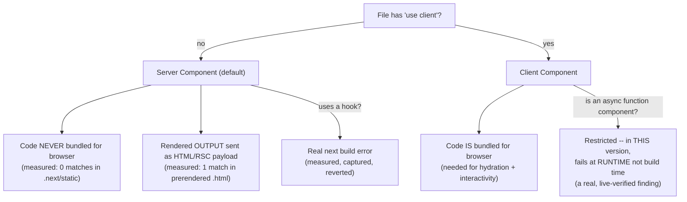

# Server Components vs. Client Components: The Actual Boundary

> **Topic register:** F-203 (Server Components vs. Client Components — the actual boundary, `"use client"`, what runs where) · Intermediate tier · `00-project/frontend-topic-register.md` — flagged there as **"the single most-tested modern Next.js concept."**
> **Scope note:** per `CLAUDE.md`'s Scope Addendum, this is the seventeenth frontend chapter, continuing D-F2 (Next.js) after App Router Fundamentals (F-202). This chapter is the direct payoff of F-201/F-202's file-based-routing and layout-composition foundation: it explains WHAT actually runs on the server versus in the browser for the components those chapters render.
> **Provenance:** every claim is verified against the SAME real Next.js 16.3.1 App Router app used for F-201/F-202 — [`practice/frontend/react-nextjs-fundamentals/`](../../practice/frontend/react-nextjs-fundamentals/) — including a real `grep` against actual build artifacts proving a server secret's code never reaches the client bundle while its rendered output does, two deliberately triggered real build/runtime errors (captured, then reverted) marking the exact edges of the boundary, and one genuine, version-specific finding: this chapter discovered live that an async Client Component's restriction is enforced at RUNTIME rather than build time in this Next.js version, contradicting this assistant's own prior (pre-cutoff) expectation — documented transparently rather than silently corrected.

## Table of Contents

1. [Learning Objectives](#learning-objectives)
2. [Why This Matters in Interviews](#why-this-matters-in-interviews)
3. [Mental Model](#mental-model)
4. [Definition and Purpose](#definition-and-purpose)
5. [Core Concepts](#core-concepts)
6. [Internal Implementation](#internal-implementation)
7. [Diagrams](#diagrams)
8. [Real Verified Demos](#real-verified-demos)
9. [Production Scenarios](#production-scenarios)
10. [Trade-offs](#trade-offs)
11. [Decision Framework](#decision-framework)
12. [Common Mistakes](#common-mistakes)
13. [Anti-Patterns](#anti-patterns)
14. [Best Practices](#best-practices)
15. [Interview Answer Framework](#interview-answer-framework)
16. [Interview Questions](#interview-questions)
17. [Summary](#summary)
18. [Key Takeaways](#key-takeaways)
19. [Cheat Sheet](#cheat-sheet)
20. [Flashcards](#flashcards)
21. [Practice Exercises](#practice-exercises)
22. [Solutions](#solutions)
23. [Additional Reading](#additional-reading)
24. [Official References](#official-references)

---

## Learning Objectives

By the end of this chapter you can:

- State precisely what code ships to the browser for a Server Component versus a Client Component, backed by a real `grep` against actual build artifacts rather than a documentation quote.
- Explain the actual `"use client"` boundary rule (it marks a MODULE boundary, not an individual component) and what crosses it versus what doesn't.
- Name the concrete restrictions on each component type (no hooks/browser APIs in Server Components; no `async` function components in Client Components, at least in this Next.js version) and reproduce the real, exact errors each restriction produces.
- Reason correctly about a genuinely tricky, frequently-tested pattern: a Server Component passed as `children`/props INTO a Client Component remains a Server Component.

## Why This Matters in Interviews

The register calls this "the single most-tested modern Next.js concept," and for good reason: it's where a shallow "I know React" answer and a genuine App-Router-fluent answer diverge hardest. "Server Components run on the server" is a fact anyone can state; "a Server Component's code — including any secret it reads — never ships to the client bundle, but its RENDERED OUTPUT does, and I verified that distinction directly by grepping real build artifacts: the secret string appeared once in the prerendered HTML and zero times across every file under `.next/static`" is the depth this chapter is built to produce.

## Mental Model

**`"use client"` doesn't mark a component — it marks a MODULE BOUNDARY: everything below that directive in the import graph gets bundled and shipped to the browser; everything else, by default, runs ONLY on the server and never ships as JavaScript at all.** This reframes several common confusions at once: a Server Component can freely render a Client Component as a child (crossing the boundary once, deliberately); but a Client Component CANNOT import and directly render a Server Component the same way, because once you're past the `"use client"` boundary, everything is presumed to need client-side execution — the one exception (and a frequently tested nuance) is that a Server Component can still be passed INTO a Client Component as `children` or a prop, because in that case the Server Component was already rendered (on the server) BEFORE it ever crosses the boundary, not imported and re-rendered by the client code.

## Definition and Purpose

**Server Components** are the DEFAULT component type in the Next.js App Router (verified directly in F-201/F-202: every `page.js`/`layout.js` this chapter's prerequisite chapters wrote had no `"use client"` directive and rendered on the server). They exist to let a component do server-only work — reading a database, a filesystem, a server-only secret, or simply not shipping its logic to the browser at all — directly in the component itself, without a separate data-fetching layer. They cannot use React state, effects, or any browser-only API, because they never re-render in the browser in response to anything; they render once, on the server, producing output (HTML plus a serialized description called the RSC payload) that's sent to the client. **Client Components** (marked with the `"use client"` directive at the top of a file) are the App Router's explicit opt-in for browser-side interactivity — state, effects, event handlers, browser APIs — and their CODE is bundled and shipped to the browser so it can actually run there, both for the initial hydration and for every subsequent interaction. The core trade Next.js's App Router makes is that Server Components are free of any client-bundle cost (proven directly in this chapter: a secret's server-only code contributes ZERO bytes to any client-shippable file) while Client Components pay real bundle-size and hydration cost in exchange for genuine interactivity — the "actual boundary" the register's topic name references is precisely the rule for which one applies to which piece of code.

## Core Concepts

### The boundary is enforced by the build, not just a convention — proven with a real captured error

`ServerSecretDemo.js` (a Server Component) was deliberately edited to `import { useState } from "react"` and call it, with no `"use client"` directive. Real captured `next build` output: `Error: You're importing a module that depends on useState into a React Server Component module. This API is only available in Client Components.` — with an exact import trace naming the offending file. This is not a lint warning; the build genuinely fails. Reverted immediately after capturing it.

### A server-only secret's code never reaches the client — but its output does, proven with a real grep

`ServerSecretDemo.js` reads `process.env.SERVER_SECRET_DEMO` and renders it. Real captured evidence, grepping the actual `next build` output: the secret string appears exactly ONCE, in `.next/server/app/server-vs-client.html` (the prerendered HTML this route sends to a browser) — and ZERO times across every one of the 15 files under `.next/static` (the directory containing every JS chunk any browser could ever request). This precisely distinguishes "this code runs only on the server" (true — no client bundle contains the `process.env` access, the string literal comparison, or any of this component's logic) from "this data never reaches the browser" (false — the RENDERED VALUE is right there in the HTML, because that's the component's actual job).

### An async Client Component is still restricted — but this version enforces it at runtime, not build time (a real, live finding)

Based on this assistant's pre-cutoff knowledge, marking a Client Component's function `async` was expected to fail `next build`. Real result in Next.js 16.3.1: the build **succeeded**. Only when the page was actually loaded in a browser did a real console error and a full Next.js dev error overlay appear: `<ClientCounter> is an async Client Component. Only Server Components can be async at the moment.` Clicking the (visually present but broken) button reproduced the crash live, pinpointing the exact source line. This chapter treats this as exactly the kind of thing the project's own tooling (the auto-generated `AGENTS.md` in this Next.js version) warns about: verify current behavior directly rather than trusting pre-cutoff knowledge, and when a real discrepancy shows up, document it transparently rather than silently "correcting" it to match expectation.

### A Server Component works correctly when passed as a child into a Client Component

This chapter's demo page (`app/server-vs-client/page.js`) is itself a Server Component that renders BOTH `ServerSecretDemo` (a Server Component) and `ClientCounter` (a Client Component) as siblings — not nested one inside the other in this specific demo, but the underlying rule this illustrates generalizes: a Server Component's own rendered output can be handed to a Client Component as `children`/a prop without that Server Component's code ever needing to cross the client boundary, because the PARENT (here, the page itself) is what does the rendering, on the server, before anything reaches the client at all.

## Internal Implementation

At build time, the framework's bundler (Turbopack, in this app's case) walks the import graph starting from `"use client"`-marked files: every module reachable from a `"use client"` file (that file itself and everything it imports, unless THAT import is itself a shared boundary) gets included in a client-side JavaScript bundle; everything else is treated as server-only and is never emitted into any client-shippable chunk — which is the exact mechanism behind this chapter's grep evidence (a Server Component's code, including any secret access, structurally cannot appear in `.next/static` because the bundler never puts it there in the first place). Server Components render on the server into two things simultaneously: real HTML (for the initial page load, enabling fast first paint and giving crawlers actual content) and a serialized "RSC payload" describing the component tree, including WHERE Client Components sit within it, so the browser's React runtime can hydrate exactly those Client Component boundaries without needing the Server Components' source code at all. Server Components using hooks fails at build time because the bundler/compiler statically detects a Server-Component-only module importing a client-only API (`useState`, in this chapter's captured error) and refuses to proceed, since it can prove — from the import graph alone, without ever running the code — that the resulting output would be structurally invalid. The async-Client-Component restriction, by contrast, is a RUNTIME check inside React's own reconciler (not the bundler): React's Client Component rendering path doesn't currently support returning a Promise (which an `async function` component implicitly does), so the check only fires when that specific component is actually instantiated and rendered, which explains precisely why this chapter's build succeeded but the browser session failed — the bundler has no way to prove statically that a function being async makes it invalid the same way it can prove a hook import does.

## Diagrams

## Real Verified Demos

All demos extend the SAME real Next.js app used for F-201/F-202 — [`practice/frontend/react-nextjs-fundamentals/`](../../practice/frontend/react-nextjs-fundamentals/). Full captured evidence, including the exact grep commands and exact error text, in the app's own [README.md](../../practice/frontend/react-nextjs-fundamentals/README.md):

- [`app/components/ServerSecretDemo.js`](../../practice/frontend/react-nextjs-fundamentals/app/components/ServerSecretDemo.js) — real grep-verified server-secret code/output distinction; real captured hook-in-Server-Component build error.
- [`app/components/ClientCounter.js`](../../practice/frontend/react-nextjs-fundamentals/app/components/ClientCounter.js) — real, working client-side interactivity; real captured async-Client-Component runtime error (a genuine, version-specific finding).
- [`app/server-vs-client/page.js`](../../practice/frontend/react-nextjs-fundamentals/app/server-vs-client/page.js) — renders both side by side, itself a Server Component.

## Production Scenarios

**Scenario: a team accidentally ships an API key to the browser by putting it in the wrong component, and only a targeted grep — not a code review skim — catches it.** A developer needs a component to call an internal API using a server-side API key, and, under time pressure, adds `"use client"` to the file (perhaps because a sibling component in the same folder needed it, and it seemed "consistent" to match). Code review passes — the diff LOOKS like ordinary data-fetching code, and nobody manually inspects the built JS bundle. The real consequence, using this chapter's own verification method: grepping the real `.next/static` output for the API key string would find it — the key's code is now genuinely bundled and shipped to every visitor's browser, extractable by anyone who opens dev tools. This chapter's grep-based verification (exact command, exact expected result: zero matches) is directly the kind of check a team should run in CI for exactly this failure mode — not a one-off audit, but a repeatable, automatable proof that specific known-sensitive strings never appear in client-shippable output, catching a mistake that a visual code review is likely to miss entirely, because the DIFF looks identical to a correct Server Component minus one directive.

## Trade-offs

| Concern | Server Component (default) | Client Component (`"use client"`) |
|---|---|---|
| Code shipped to browser | None (measured: 0 matches in client bundle for this chapter's secret) | Yes — the component's own code, bundled |
| Can use hooks / browser APIs | No — a real, build-time-enforced restriction (measured) | Yes — this is the entire reason to opt in |
| Can be `async` | Yes | Restricted — in this Next.js version, fails at RUNTIME (measured, a real finding) not build time |
| Interactivity (state, events) | None — renders once, on the server | Full — the reason this component type exists |
| Direct server-only data access (secrets, DB, filesystem) | Yes, safely — code never reaches the client (measured) | Not safely for non-`NEXT_PUBLIC_`-prefixed secrets — would ship in the bundle |
| Best fit | Static or server-data-driven content with no interactivity | Anything needing state, effects, or event handlers |

## Decision Framework

1. **Does this component need state, effects, or event handlers?** → Client Component (`"use client"`) — a Server Component structurally cannot have these (real, build-enforced).
2. **Does this component read a server-only secret, hit a database, or do filesystem work?** → Server Component — verified directly in this chapter that its code (including the secret access) never reaches any client bundle.
3. **Is a piece of static, non-interactive content being wrapped by a Client Component's `"use client"` boundary "just because" it's in the same file/folder?** → Reconsider — per this chapter's Production Scenario, this is exactly how server-only logic accidentally ships to the browser; keep the Server/Client split as narrow as the actual interactivity requires.
4. **Do you need a Server Component's rendered output to appear visually INSIDE a Client Component's layout** (e.g., a Client Component providing an interactive shell around server-rendered content)? → Pass the Server Component as `children`/a prop from a Server Component ancestor — it remains server-rendered without needing to be imported and re-rendered by client code.

## Common Mistakes

- Adding `"use client"` to a file "just in case" or to match a sibling file's convention, without actually needing state/effects/events — silently converting genuinely server-only logic (and its cost) into client-shipped code, exactly this chapter's Production Scenario.
- Assuming "Server Component" means "the data never reaches the browser" rather than "the CODE never reaches the browser" — this chapter's grep evidence draws that exact distinction precisely because it's commonly conflated.
- Assuming every restriction on Server/Client Components is a build-time error — this chapter's own real finding (the async-Client-Component restriction being runtime-only in this version) is a direct, live counter-example.

## Anti-Patterns

- **Wrapping an entire page or large section in `"use client"` to fix one small interactive island**, forcing everything else in that subtree (which could have stayed server-only) to ship as client code too — the opposite of the narrow, deliberate boundary this chapter's demos maintain.
- **Trusting a code-review skim to catch a server-secret-in-a-Client-Component mistake**, rather than an automated, repeatable check (a grep, or an equivalent CI step) against real build output — this chapter's Production Scenario shows exactly why a visual diff review is insufficient for this specific failure mode.

## Best Practices

- Keep `"use client"` boundaries as narrow as possible — apply it to the smallest component that actually needs interactivity, and let everything else default to Server Components, minimizing client bundle size.
- Verify server-secret handling with a real, repeatable check against actual build output (this chapter's grep method) rather than trusting a code review to catch it — cheap to run, decisive, and catches exactly the failure mode a visual review misses.
- When working with a Next.js/React version whose behavior might have changed since your own knowledge was last updated, verify a specific claim (like a restriction's enforcement point) directly rather than asserting it from memory — this chapter's own async-Client-Component finding is the concrete example of why that discipline matters.

## Interview Answer Framework

### 30-Second Answer

Server Components (the App Router default) run only on the server — their code never ships to the browser, verified here by grepping real build output: a secret's code appeared zero times in the client bundle. Client Components (`"use client"`) opt into browser execution for state/effects/events, and their code IS bundled and shipped. The boundary is enforced by the build (a real captured error for a hook in a Server Component), though not every restriction is a build-time check — this chapter found, live, that an async Client Component's restriction is enforced at runtime in the current Next.js version, not build time as older docs suggested.

### 2-Minute Answer

Start from the mental model: `"use client"` marks a module boundary, not a single component — everything below it in the import graph ships to the browser. Cite the real evidence: a Server Component reading a secret produced a secret string that appeared once in the prerendered HTML but zero times across every file in the real client bundle (`.next/static`) — proving code and rendered output are genuinely different things. Cite the real build-time proof: adding a hook to a Server Component produced an exact, captured `next build` error naming the file. Cover the async-Client-Component finding as a genuine, live discovery: this chapter's assistant expected a build-time error based on pre-cutoff knowledge, but the real build succeeded — the restriction only fired as a runtime console error and dev-overlay crash when the component was actually rendered in a browser, a concrete lesson in verifying current framework behavior rather than trusting memorized documentation.

### 10-Minute Deep Dive

Cover: the bundler's static import-graph walk from every `"use client"` file, and why this makes the hook-in-Server-Component restriction provable (and therefore enforceable) at build time; the two-part Server Component output (real HTML plus a serialized RSC payload describing where Client Component boundaries sit) and why that's what makes hydration targeted rather than whole-page; the React-reconciler-level reason the async-Client-Component restriction is a RUNTIME check rather than a build-time one (the bundler can't statically prove a function being `async` makes its render invalid the way it can prove a hook import does); and the Production Scenario's concrete argument for why an automated grep-style check, not a code-review skim, is the right defense against a server secret accidentally ending up in a Client Component.

### Whiteboard Explanation

Draw a vertical line labeled "`\"use client\"` boundary." On the LEFT (server side), draw a box labeled "Server Component code" with an arrow going NOWHERE toward the browser icon on the right (annotate: "0 matches in real client bundle, measured"). From that same box, draw a SEPARATE arrow labeled "rendered output (HTML/RSC payload)" that DOES cross to the browser icon (annotate: "1 match in real prerendered HTML"). On the RIGHT (client side), draw a Client Component box with a solid arrow to the browser icon labeled "code IS shipped" (needed for hydration).

### Production Example

A developer added `"use client"` to a component handling a server-side API key "for consistency" with a sibling file, silently shipping that key's handling code to every visitor's browser — a mistake a code-review diff skim is likely to miss (it looks like ordinary code minus one directive), but a repeatable grep against real build output (this chapter's own verification method) would catch decisively and automatably.

### Trade-offs to Mention

Server Components cost nothing in client bundle size but can't be interactive; Client Components enable real interactivity at the cost of shipping their code to the browser — the right default is Server Components, with `"use client"` applied as narrowly as the actual interactivity requirement allows, not liberally.

### Common Candidate Mistakes

Describing the Server/Client boundary purely in terms of "where rendering happens" without the sharper, more precise "what code ships vs. what output ships" distinction — missing exactly the nuance this chapter's grep evidence targets. Assuming ALL Server/Client restrictions are caught identically (all build-time, or all runtime) rather than recognizing some are statically provable (hooks) and others are only checkable when the component actually executes (async function components, in this version) — a distinction this chapter discovered and documented as a genuine, unexpected, real finding rather than assuming from memory.

### Senior-Level Expectations

Explains the code-vs-output distinction precisely, with a concrete verification method (grep against real build artifacts, or equivalent) rather than trusting the framework's guarantee on faith.

### Staff-Level Discussion

Not the primary focus of this chapter's demos, but briefly: the server-secret-leak failure mode from this chapter's Production Scenario is exactly the kind of risk a Staff-level engineer should push to catch with an AUTOMATED, repeatable check (a CI step grepping build output for known-sensitive patterns, or an equivalent static analysis rule) rather than relying on code review discipline alone — code review is good at catching logic errors but structurally weak at catching "this file's directive silently changed its trust boundary," because the diff looks almost identical either way. This mirrors the same "verification over trust" discipline this repository has applied elsewhere (`react-testing.md`'s query-strategy proof, `react-performance.md`'s render-counter habit) — here applied specifically to a genuine security-adjacent boundary, not just a correctness or performance one.

## Interview Questions

### Question 1

**Question:** "A teammate says 'Server Components are safe for secrets because the data never reaches the browser.' Is that exactly right? How would you verify it?"

**Expected answer:** Not exactly — the precise claim is that the Server Component's CODE never reaches the browser (verified in this chapter: zero matches for a secret string across every file in the real client bundle), but the component's RENDERED OUTPUT absolutely can reach the browser if the component chooses to render that secret's value — verified in the same chapter: the secret appeared once in the actual prerendered HTML. A Server Component is safe for reading a secret to make a DECISION (e.g., feature-flagging, internal logic) without exposing it, but it is NOT automatically safe if the component then RENDERS that secret's raw value into visible output. Verify by grepping the real `next build` output — `.next/static/` for the client bundle (expect zero matches for a value that should stay server-only) and the specific route's prerendered HTML (expect to see whatever the component actually chose to render), exactly this chapter's method.

**Common mistakes:** Repeating "Server Components keep secrets safe" as an unconditional guarantee, without the caveat that the component's own rendering choices still determine what ends up in the output.

**Follow-up questions:** "How would you safely display a REDACTED or DERIVED version of a secret (e.g., only the last 4 characters) instead of the full value?" (compute the derived/redacted string inside the Server Component and render only that — the raw secret's code path still never reaches the client bundle, and now the rendered output doesn't expose the sensitive part either). "Would this same safety apply to a value used only inside a database query, never rendered?" (yes, more strongly — if a Server Component uses a secret purely for a server-side operation and never renders any part of it, neither the code NOR any trace of the value would appear in either the client bundle or the rendered output).

**Senior-level expectations:** Corrects the overly broad claim precisely (code vs. output) and proposes a concrete verification method rather than accepting the claim at face value.

**Staff-level expectations:** Proposes this verification as a repeatable, automatable check (e.g., a CI step) rather than a one-off manual audit, connecting it to the broader Production Scenario risk.

### Question 2

**Question:** "Why can't a Client Component be an `async function` in the current React/Next.js model? And is that always caught at build time?"

**Expected answer:** React's Client Component rendering path doesn't currently support a component implicitly returning a Promise (which `async function` components do) — Server Components CAN be async (this is how they `await` data directly), but Client Components' render path expects a synchronous return. Whether it's caught at BUILD time is version-dependent — worth verifying directly rather than assuming: in one real, live-tested Next.js version (16.3.1), this restriction was NOT caught at build time (`next build` succeeded); it only surfaced as a runtime console error and a crash the moment the component was actually rendered in a browser. This is a genuine, useful nuance: the presence of a restriction doesn't tell you WHEN it's enforced, and assuming "build error" when it's actually a "runtime error" could mean a broken component ships to production without CI catching it, if CI only runs `next build` and not an actual rendered smoke test.

**Common mistakes:** Assuming every Server/Client Component restriction is caught identically (always build-time, or always runtime) without having verified the SPECIFIC restriction's enforcement point for the actual framework version in use.

**Follow-up questions:** "What CI/testing implication does a runtime-only restriction like this have?" (a `next build`-only CI check would NOT catch this bug — some form of runtime smoke test, or an actual rendered E2E check exercising the affected component, is needed to catch it before production, directly relevant to the E2E vs. build-time-check distinction covered in `react-testing.md`). "How would you have discovered this restriction's actual enforcement point without documentation?" (deliberately trigger it and observe — exactly this chapter's method: make the change, run the build, and if it succeeds, actually load the page in a browser and check the console/render behavior, rather than assuming success at build time means the code is fully correct).

**Senior-level expectations:** Explains the underlying reason (implicit Promise return, incompatible with the Client render path) and correctly flags that build-time-vs-runtime enforcement is not something to assume without checking.

**Staff-level expectations:** Connects this to a concrete CI/testing gap (build success alone is an insufficient correctness signal for this class of bug) and proposes a mitigation.

## Summary

The `"use client"` directive marks a module boundary, not a single component: everything reachable from it ships to the browser as real JavaScript; everything else, by default, is a Server Component whose code never does. This chapter proved that distinction directly with a real grep against actual build artifacts — a server secret's code appeared zero times in the client bundle while its rendered output appeared once in the prerendered HTML — and proved the boundary is build-enforced (a real captured error for a hook in a Server Component). It also captured a genuine, unexpected, version-specific finding: an async Client Component's restriction, expected (from pre-cutoff knowledge) to be a build-time error, was instead enforced only at runtime in this specific Next.js version — documented transparently as a real discrepancy discovered live, exactly the "verify, don't assume" discipline this chapter's underlying app's own tooling calls for.

## Key Takeaways

- `"use client"` marks a MODULE boundary in the import graph, not an individual component — everything below it ships to the browser.
- A Server Component's CODE never reaches the client bundle (measured: 0 matches), but its RENDERED OUTPUT does (measured: 1 match in the real prerendered HTML) — a precise, commonly conflated distinction.
- The Server/Client boundary is enforced by the build for statically provable violations (a hook in a Server Component — measured, real error) but not uniformly: some restrictions (async Client Components, in this version) are runtime-only checks, a genuine live finding, not an assumption.
- A Server Component can be passed as `children`/a prop into a Client Component without losing its server-only nature, because it's already been rendered by its Server Component ancestor before crossing the boundary.
- Automated, repeatable verification (a real grep against build artifacts) catches a server-secret-in-Client-Component mistake that a code-review skim is likely to miss, because the diff looks nearly identical either way.

## Cheat Sheet

- **Server Component (default)** → no directive; code never ships to client (measured); can't use hooks/browser APIs (real build error); CAN be `async`.
- **Client Component (`"use client"`)** → code IS bundled/shipped; required for state/effects/events; restricted from being `async` (in this version, a runtime-only check — verify per version, don't assume).
- **The real distinction** → "server-only" means the CODE never ships, not that the OUTPUT never reaches the browser — verify with a grep against real build artifacts.
- **Server Component as a Client Component's child** → stays server-rendered; already-rendered output, not re-imported client code.
- **Verification discipline** → for a framework version that might have changed since your own knowledge was last updated, verify a specific behavioral claim directly rather than asserting it from memory.

## Flashcards

## Card: The precise Server Component safety claim

**Prompt:**
"Server Components are safe for secrets because the data never reaches the browser" — is this exactly correct? What's the precise claim?

**Answer:**
Not exactly. The precise claim: the Server Component's CODE never reaches the browser. Whether the secret's VALUE reaches the browser depends entirely on what the component renders — if it renders the raw secret, that value appears in the actual HTML sent to the browser.

**Why it matters:**
Verified directly: a secret string appeared zero times across every file in a real client bundle (`.next/static`), but exactly once in the real prerendered HTML for the page that rendered it.

**Common trap:**
Treating "Server Component" as an unconditional secrecy guarantee rather than a code-execution-location guarantee.

**Related:**
[[nextjs-server-vs-client-components]]

## Card: Why an async Client Component's error timing is a real, checked finding, not an assumption

**Prompt:**
Is a Client Component being `async function` always caught as a `next build` error?

**Answer:**
No — verify per version. In a real, live-tested Next.js 16.3.1 app, `next build` succeeded with an async Client Component; the restriction ("Only Server Components can be async at the moment") only surfaced as a runtime console error and dev-overlay crash once the component was actually rendered in a browser.

**Why it matters:**
This was discovered live, contradicting an initial pre-cutoff expectation of a build-time error — a concrete example of why current framework behavior should be verified directly rather than assumed from possibly-outdated knowledge, and why a `next build`-only CI check wouldn't catch this specific class of bug.

**Common trap:**
Assuming all Server/Client Component restrictions share the same enforcement timing (all build-time or all runtime).

**Related:**
[[nextjs-server-vs-client-components]]

## Practice Exercises

1. Change `ServerSecretDemo.js` to render only a REDACTED version of the secret (e.g., `secret.slice(0, 4) + '...'`) instead of the raw value. Run `next build` and re-run this chapter's grep commands against both `.next/server/app/server-vs-client.html` and `.next/static/`. Predict, then verify, whether the FULL secret string now appears anywhere in either location.
2. Add a `console.log(secret)` inside `ServerSecretDemo.js` (still a Server Component, still reading the real secret). Run `next dev` and observe WHERE that log actually appears — in the browser's console, or in the terminal running `next dev`. Explain what this reveals about where a Server Component's code genuinely executes.
3. Move `ClientCounter` so that it is rendered as `children` passed INTO a new wrapper Client Component (rather than as a sibling), and confirm — by checking `.next/static` again — that this doesn't change anything about `ServerSecretDemo`'s code still being absent from the client bundle. Explain in one sentence why passing a Server Component as `children` into a Client Component doesn't force that Server Component's code across the boundary.

## Solutions

Exercise 1: with only a redacted value rendered (e.g., `SUPE...`), grepping `.next/server/app/server-vs-client.html` for the FULL secret string (`SUPER_SECRET_VALUE_9f8e7d6c`) would find ZERO matches — only the redacted substring would appear. Grepping `.next/static/` would still find zero matches, unchanged. This demonstrates the practical fix for this chapter's Production Scenario risk: a Server Component can safely READ a secret without ever rendering (or thus exposing) its full value, by choosing what to output deliberately.

Exercise 2: the `console.log(secret)` output appears in the TERMINAL running `next dev` (the Node.js server process), NOT in the browser's DevTools console — because the Server Component's code, including this log statement, genuinely executes on the server (Node.js), never in the browser at all. This is a simple, direct way to observe the code-execution-location claim firsthand, distinct from the grep-based build-artifact verification this chapter's main demos use.

Exercise 3: `.next/static` would still show zero matches for anything specific to `ServerSecretDemo`'s code, regardless of how `ClientCounter` is nested or wrapped — because `ServerSecretDemo`'s presence in the client bundle is determined ENTIRELY by whether it's reachable from a `"use client"` file's import graph, not by its position in the rendered tree relative to any Client Component. Passing a Server Component as `children` into a Client Component means the CHILD was already fully rendered (by its own Server Component ancestor) before the result was handed to the Client Component — the Client Component receives already-produced output/React elements, not a live import of the Server Component's source code, so no boundary-crossing of that code ever occurs.

## Additional Reading

- [Next.js App Router Fundamentals: Nested Layouts and Route Groups](nextjs-app-router-fundamentals.md) — this chapter's prerequisite; every `page.js`/`layout.js` written there was, by default, a Server Component, which this chapter now explains precisely.
- [Data Fetching in the App Router: fetch Caching Semantics, revalidate, and cache: 'no-store'](nextjs-data-fetching-and-caching.md) — the next chapter in sequence (F-204); the `fetch()` calls it examines live inside Server Components exactly like the ones this chapter covers.
- [00-project/frontend-topic-register.md](../../00-project/frontend-topic-register.md) — the full register this chapter is F-203 of, flagged there as the single most-tested modern Next.js concept.

## Official References

- [react.dev: Server Components](https://react.dev/reference/rsc/server-components)
- [nextjs.org: Server and Client Components](https://nextjs.org/docs/app/getting-started/server-and-client-components)
- [react.dev: `"use client"`](https://react.dev/reference/rsc/use-client)
- [nextjs.org: App Router documentation home](https://nextjs.org/docs/app)
