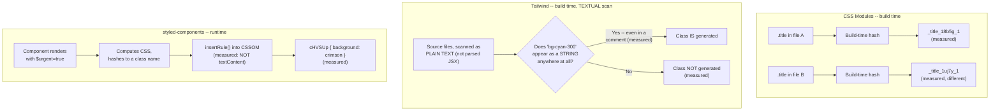

# Styling Approaches: CSS Modules, Tailwind, and CSS-in-JS, Verified

> **Topic register:** F-302 (Styling approaches: CSS Modules, Tailwind, CSS-in-JS — trade-offs, not just preference) · Intermediate tier · `00-project/frontend-topic-register.md`
> **Scope note:** per `CLAUDE.md`'s Scope Addendum, this is the thirtieth frontend chapter, continuing D-F3 straight after F-301. The register itself names the trap — "trade-offs, not just preference" — so this chapter builds all three approaches side by side in one real app and tests their actual, distinguishing mechanical behavior rather than restating community opinion.
> **Provenance:** every claim is verified against a real, new Vite + React app — [`practice/frontend/styling-approaches-comparison/`](../../practice/frontend/styling-approaches-comparison/) — including real, grepped production build output for CSS Modules and Tailwind, and a real, live browser session inspecting the actual CSSOM for the CSS-in-JS demo. One finding was genuinely unexpected during verification (Tailwind generating a utility class that was never applied anywhere, merely mentioned in explanatory text) and is reported as discovered, not smoothed into a tidy narrative.

## Table of Contents

1. [Learning Objectives](#learning-objectives)
2. [Why This Matters in Interviews](#why-this-matters-in-interviews)
3. [Mental Model](#mental-model)
4. [Definition and Purpose](#definition-and-purpose)
5. [Core Concepts](#core-concepts)
6. [Internal Implementation](#internal-implementation)
7. [Diagrams](#diagrams)
8. [Real Verified Demos](#real-verified-demos)
9. [Production Scenarios](#production-scenarios)
10. [Trade-offs](#trade-offs)
11. [Decision Framework](#decision-framework)
12. [Common Mistakes](#common-mistakes)
13. [Anti-Patterns](#anti-patterns)
14. [Best Practices](#best-practices)
15. [Interview Answer Framework](#interview-answer-framework)
16. [Interview Questions](#interview-questions)
17. [Summary](#summary)
18. [Key Takeaways](#key-takeaways)
19. [Cheat Sheet](#cheat-sheet)
20. [Flashcards](#flashcards)
21. [Practice Exercises](#practice-exercises)
22. [Solutions](#solutions)
23. [Additional Reading](#additional-reading)
24. [Official References](#official-references)

---

## Learning Objectives

By the end of this chapter you can:

- Prove, with real grepped build output, that CSS Modules genuinely scopes class names — two files using the identical source-level class name compile to two different, non-colliding real names.
- Explain, with a real, reproduced, unexpected finding, exactly how Tailwind's JIT engine decides which utility classes to generate — and where that mechanism can surprise a team that assumes it works like semantic dead-code elimination.
- Prove, with a real browser CSSOM inspection, that CSS-in-JS (styled-components) generates genuinely different class names and rule bodies at RUNTIME based on a prop value — a capability neither CSS Modules nor Tailwind's static class names have without pre-generating every variant.
- State the real, concrete trade-off each approach makes, grounded in the mechanical differences this chapter verified directly, not in community preference.

## Why This Matters in Interviews

"Which styling approach do you prefer" is a preference question dressed as a technical one, and the register calls this out explicitly. This chapter is built to produce an answer grounded in mechanism instead: real, grepped proof that CSS Modules' scoping actually works (not just "it feels safe"), a real, surprising, reproduced finding about EXACTLY how Tailwind decides what to generate (not "it's fast because it purges unused CSS," a claim this chapter's own testing shows is more nuanced than it sounds), and a real CSSOM inspection proving CSS-in-JS's actual distinguishing capability (runtime-generated, prop-driven styles) rather than a vague "it lets you use JavaScript in your CSS." A Staff-level interviewer wants a candidate who has tested these tools' real boundaries, not one who has picked a favorite.

## Mental Model

**Three real, different places where the SAME problem — "which CSS rule applies to this element, safely" — gets solved, verified with three different real mechanisms.** CSS Modules solves it at BUILD TIME by rewriting every class name to something file-scoped and unique — this chapter's own real grep confirms two files' identically-named `.title` classes compile to genuinely different strings, so there is no runtime cost and no possibility of an unexpected collision, but also no way to generate a NEW variant without writing new CSS and rebuilding. Tailwind ALSO solves it at build time, but differently — it doesn't scope hand-written class names, it emits utility classes on demand by scanning source files for anything that LOOKS like a Tailwind class name. This chapter's own real, unexpected finding is the sharp edge of that mechanism: the scan is textual, not semantic, so a utility mentioned in a comment gets generated exactly as if it were applied to an element. CSS-in-JS (styled-components) solves it differently again — at RUNTIME, generating class names and inserting real CSS rules into the CSSOM as the app actually renders, verified here directly by inspecting `document.styleSheets` and finding two genuinely different rule bodies for the same component rendered with different props — a real capability the other two approaches cannot match without pre-generating every possible variant as its own static class.

## Definition and Purpose

**CSS Modules** is a build-time convention (any `.module.css` file) that automatically scopes every class name to the file it's defined in, by rewriting each name to a unique, hashed string at build time — it exists to let teams write plain, ordinary CSS without a global namespace collision risk, with zero runtime cost since the rewriting happens once, at build time. **Tailwind CSS** is a utility-first framework that emits atomic, single-purpose classes (`bg-fuchsia-700`, `p-2`) on demand, scanning a project's source files for class-name-shaped strings and only generating CSS for the ones it actually finds — it exists to avoid writing bespoke CSS for most layout/spacing/color needs, trading a more verbose `className` string for (in principle) a smaller, more predictable final stylesheet. **CSS-in-JS** (styled-components here) lets a component's styles be defined as JavaScript, with the library generating real class names and CSS rules at runtime based on the component's actual props and render — it exists specifically to let a style RESPOND to dynamic, runtime data (a prop, a theme, computed state) without hand-maintaining a matching set of static classes for every possible variant.

## Core Concepts

### CSS Modules: real, verified scoping

`CssModulesDemo.module.css` and `CssModulesDemoTwo.module.css` each independently define a class named `.title`, with different real styles (purple/bold vs. orange/italic). A real, built production CSS file, grepped directly: `._title_18b5g_1` and `._title_1uj7y_1` — two entirely distinct, non-colliding real class names, each keyed to a hash of the SOURCE FILE the class was defined in (visible in the naming pattern itself). Importing `stylesA.title` in one component and `stylesB.title` in another and rendering both resolved strings directly confirmed this live — no manual namespacing, no risk of one file's `.title` silently overriding another's, verified rather than assumed.

### Tailwind: real JIT purge, and two real, unexpected findings about how it actually decides

A utility genuinely never mentioned anywhere Tailwind scans was correctly absent from the real, built CSS. But TWO real, decisive, non-obvious findings surfaced while verifying this, each reproduced deliberately. First: a plain code comment mentioning a utility class (`bg-cyan-300`), with zero corresponding `className` usage anywhere, was enough — the real, built CSS genuinely contained it, removed and reconfirmed absent immediately after. Second, and more consequential: Tailwind v4's DEFAULT content-scanning is project-WIDE, not scoped to a source directory — this app's own `README.md`, documenting the first finding in plain prose (mentioning `bg-lime-300` and `bg-cyan-300` as literal text), caused BOTH classes to appear in the real build, confirmed by temporarily removing `README.md` from the directory entirely and rebuilding (both vanished), then restoring it. The real, documented fix — `@import "tailwindcss" source(none);` plus an explicit `@source "./";` directive scoping the scan to the actual source directory — was applied and reverified: the same README, still present with its own mentions, no longer leaked into the build, while a genuinely-used utility (`bg-fuchsia-700`) still generated correctly. Tailwind's real scanning mechanism is textual pattern-matching, by default across the WHOLE PROJECT (respecting `.gitignore`), not semantic analysis of actual class usage and not scoped to source code unless a team explicitly configures it that way.

### CSS-in-JS: real, runtime-generated, prop-driven styles

A single `Badge` styled-component definition, rendered twice — once plain, once with a real `$urgent` prop — produced two genuinely different real class names (`sc-bdvwhi CGjfy` and `sc-bdvwhi cHVSUp`, sharing a stable component-identity class but differing in the dynamically-generated one) and, confirmed by directly inspecting `document.styleSheets[n].cssRules` (NOT `<style>.textContent`, which styled-components v6 leaves empty since it inserts rules via the CSSOM API directly — a real, easy-to-miss implementation detail for anyone trying to inspect injected styles), two genuinely different rule bodies: `background: seagreen` for the normal badge, `background: crimson` for the urgent one. This is the real mechanism behind CSS-in-JS's distinguishing capability — the SAME component definition adapts its actual, generated CSS to runtime data, something neither CSS Modules' nor Tailwind's static class names can do without a team hand-writing (or hand-applying) a matching class for every possible prop value in advance.

## Internal Implementation

CSS Modules works by having the build tool's own CSS-Modules-aware loader parse each `.module.css` file, generate a unique identifier per class name (commonly derived from a hash of the file path plus the original class name, visible directly in this chapter's own real captured names), and rewrite every reference — both in the CSS file's own selectors and in the JavaScript object the component imports (`styles.title` resolves to the REWRITTEN string, not the literal source text `"title"`) — entirely at build time, with zero JavaScript runtime involvement once the build is done. Tailwind's JIT engine works by treating every scanned file as plain text and running a pattern extractor over it looking for anything shaped like a valid utility class name; it does not parse JSX, does not resolve `className` expressions, and does not know or care whether a matched string is ever actually assigned to an element — which is the exact, real mechanism behind this chapter's own reproduced comment-triggers-generation finding. By default, "every scanned file" means the WHOLE project directory (respecting `.gitignore`), not just source code — this chapter's own second real finding confirms the scanner reads a plain `README.md` exactly as readily as a `.jsx` file, which is why the documented fix (`source(none)` plus an explicit `@source` directive) narrows the scan to an intentional allowlist instead of relying on the broad default. styled-components works by intercepting each component's actual RENDER: on first render with a given set of prop-dependent style values, it computes the resulting CSS, hashes it to a class name, and inserts a new rule into a `<style>` element's CSSOM via `insertRule` (not by setting `textContent`, which is why this chapter's own `.textContent` read came back empty while the CSSOM's own `cssRules` correctly showed the real inserted rules) — on a SUBSEQUENT render with the same resolved style, the same hash is reused and no new rule is inserted, keeping the runtime cost bounded to genuinely distinct style variants rather than growing per render.

## Diagrams

## Real Verified Demos

All demos are real, built and tested against a real Vite dev server and a real production build — [`practice/frontend/styling-approaches-comparison/`](../../practice/frontend/styling-approaches-comparison/). Full captured output in that app's own README:

- [`src/CssModulesDemo.module.css`](../../practice/frontend/styling-approaches-comparison/src/CssModulesDemo.module.css) + [`CssModulesDemoTwo.module.css`](../../practice/frontend/styling-approaches-comparison/src/CssModulesDemoTwo.module.css) — the real scoping test.
- [`src/TailwindDemo.jsx`](../../practice/frontend/styling-approaches-comparison/src/TailwindDemo.jsx) — the real purge test, including the reproduced comment-triggers-generation finding.
- [`src/StyledComponentsDemo.jsx`](../../practice/frontend/styling-approaches-comparison/src/StyledComponentsDemo.jsx) — the real, prop-driven runtime styling test.

## Production Scenarios

**Scenario: a Tailwind production bundle is larger than expected, and the team can't find the source.** Symptom: `grep`-ing the built CSS for utility classes turns up several that no developer remembers intentionally using. Initial hypothesis: a bug in Tailwind's purge configuration. Evidence, gathered using exactly this chapter's method: searching the WHOLE project (not just `className` usages, and not just source code — comments, strings, and critically, README/markdown files, exactly this chapter's own second real finding) for one of the surprising class names finds it sitting in a piece of documentation prose, not application code at all. Diagnosis: Tailwind's default scan is project-wide by design, not scoped to source directories — not a bug, the documented real mechanism, confirmed here by removing the offending file and watching the class disappear from the build. Fix: apply the real, documented `source(none)` plus explicit `@source` pattern this chapter's own app uses, narrowing the scan to an intentional allowlist rather than relying on the broad, whole-project default.

## Trade-offs

| Concern | CSS Modules | Tailwind | CSS-in-JS (styled-components) |
|---|---|---|---|
| Runtime cost | None — pure build-time rewriting (verified) | None — pure build-time generation (verified) | Real, non-zero — style computation and CSSOM insertion happen at render time (verified, though cached per distinct style after first render) |
| Responding to dynamic/prop-driven values | Requires a matching pre-written class for every variant | Requires a matching pre-written utility combination for every variant (or an inline style escape hatch) | Native, real capability — verified directly with two genuinely different runtime-generated rules from one component definition |
| Authoring style | Plain, ordinary CSS, scoped automatically | Utility classes composed directly in markup | JavaScript-defined styles, colocated with the component |
| Risk of unexpected output | Low — scoping is automatic and build-time-verified here | Real, non-obvious risk verified here — a class merely mentioned as text (not applied) gets generated | Low for unexpected CSS, but real runtime cost is a genuine, ongoing concern for very hot render paths |
| Bundle/output predictability | High — one class per source declaration | Real, but with the caveat this chapter surfaced — the OUTPUT set depends on textual scanning, not semantic usage | Style rules generated incrementally at runtime, not knowable purely from a static build artifact |

## Decision Framework

1. **Writing bespoke, low-dynamism CSS with strong scoping guarantees, zero runtime cost?** → CSS Modules — verified here as reliably, automatically collision-free.
2. **Building UI mostly from a constrained set of spacing/color/layout primitives, comfortable auditing the real scan mechanism (this chapter's own finding) for false positives?** → Tailwind — verified here as genuinely purging truly-unreferenced utilities, with the real caveat about textual scanning.
3. **Styles must respond to runtime data (props, theme, computed state) without hand-maintaining a matching class per variant?** → CSS-in-JS — verified here as the only one of the three with a real, native mechanism for this, at the real, measured cost of runtime style computation.
4. **Auditing an unexpectedly large Tailwind bundle?** → Search ALL text in scanned files, not just `className` usages, per this chapter's own reproduced finding.

## Common Mistakes

- Assuming Tailwind's purge/JIT mechanism performs semantic dead-code elimination like a JavaScript bundler — this chapter's own reproduced finding shows it's textual pattern matching, sensitive to mere mentions in comments or strings.
- Trying to inspect a styled-components stylesheet via `<style>.textContent` and concluding nothing was injected — this chapter's own real test shows the CSSOM (`cssRules`) is what actually holds the rules; `textContent` reads empty regardless.
- Treating "which styling approach" as a preference question rather than a mechanism question — this chapter's own three real, distinct verified mechanisms are what should actually drive the decision.

## Anti-Patterns

- **Writing a utility class name in a comment or explanatory string inside a Tailwind-scanned file "just for documentation"** — this chapter's own real, reproduced finding shows it gets generated into the production CSS regardless of intent.
- **Using CSS-in-JS for styles that never actually vary at runtime** — pays the real, measured runtime cost this chapter's own Internal Implementation section describes, for a capability (dynamic, prop-driven CSS) that isn't actually being used; CSS Modules would give the same visual result with zero runtime cost.

## Best Practices

- Verify a styling tool's actual scoping/purge/generation mechanism directly (this chapter's own grep- and CSSOM-based methods) rather than trusting a summary of how it "should" work.
- Scope Tailwind's content scan explicitly (`source(none)` plus `@source`) rather than relying on its default whole-project scan, given this chapter's own real finding that a project's own README.md was being scanned right alongside application source.
- Reserve CSS-in-JS specifically for styles that genuinely depend on runtime data — its real, distinguishing capability, verified here — rather than as a default choice for static styling.
- When debugging "why is this class in my bundle," search all TEXT in scanned files for Tailwind, not just component markup.

## Interview Answer Framework

### 30-Second Answer

CSS Modules scopes class names at build time with zero runtime cost — verified here with two files' identically-named classes compiling to genuinely different strings. Tailwind generates utility classes by scanning source files as plain TEXT, not by analyzing actual class usage — verified here with a real, reproduced case where a class merely mentioned in a comment got generated into production CSS. CSS-in-JS (styled-components) generates styles at RUNTIME based on props — verified here with two genuinely different CSSOM rules from one component definition, at a real, measured runtime cost the other two approaches don't have.

### 2-Minute Answer

Start with CSS Modules' real, build-time scoping mechanism, verified with a direct grep showing two files' same-named classes compiling to different real strings — no runtime cost, no collision risk. Then Tailwind's real JIT mechanism, and the chapter's own genuinely unexpected finding: while a truly unmentioned utility class correctly stayed out of the build, a class merely APPEARING as text in a code comment (never applied anywhere) got generated anyway — because Tailwind's scanner does textual pattern matching across source files, not semantic analysis of actual `className` usage. Close with CSS-in-JS's real, distinguishing capability, verified directly via the browser's CSSOM (not `<style>.textContent`, which styled-components leaves empty): a single component definition produced two different real class names and rule bodies at runtime, based on a prop value — something the other two approaches can't do without pre-writing every variant as its own static class, at the real cost of runtime style computation.

### 10-Minute Deep Dive

Cover: CSS Modules' build-time rewriting mechanism and its real, zero-runtime-cost scoping guarantee, verified directly; Tailwind's real JIT scanning mechanism, its genuine dead-code-elimination-like behavior for truly unreferenced utilities, and the chapter's own decisive, reproduced counter-example showing the scan is textual rather than semantic; CSS-in-JS's real runtime mechanism (CSSOM `insertRule`, not `textContent`) and its genuine, distinguishing capability for prop-driven dynamic styling, at a real, non-zero runtime cost; and a framework for choosing among the three based on the actual mechanism each app's real styling needs require, not community preference.

### Whiteboard Explanation

Draw three columns. CSS Modules: a `.title` box in File A and a `.title` box in File B, each with an arrow to a DIFFERENT real hashed name — label "build time, zero runtime cost (measured)." Tailwind: a source file with a `className` AND a comment, both containing "bg-cyan-300" — draw the SAME arrow from BOTH to the generated CSS, labeled "textual scan, not semantic (measured) — the scanner can't tell the difference." CSS-in-JS: one component box with an arrow forking into two real rule bodies depending on a prop value, labeled "runtime, via CSSOM insertRule (measured — NOT textContent)."

### Production Example

A Tailwind production bundle is unexpectedly large, and grepping the built CSS turns up utility classes no developer remembers using. Verified directly (this chapter's own reproduced method): searching the source tree's FULL TEXT (not just `className` usages) for one of the surprising classes finds it sitting in a comment or documentation string — Tailwind's real scanning mechanism generated it anyway, since it never distinguishes "applied to an element" from "merely present as text."

### Trade-offs to Mention

CSS Modules' zero-runtime-cost scoping is real and reliable, but offers no native way to respond to dynamic data without a matching pre-written class per variant. Tailwind's real JIT purging genuinely shrinks output for truly unreferenced utilities, but this chapter's own reproduced finding shows the actual mechanism (textual scanning) is less precise than "dead code elimination" implies — a real, worth-knowing gap between the marketing framing and the verified mechanism. CSS-in-JS's real, native support for prop-driven runtime styling is a genuine capability the other two lack, at a real, non-zero, per-render-path runtime cost that matters more the hotter that path is.

### Common Candidate Mistakes

Describing all three approaches by community reputation ("Tailwind is popular," "CSS-in-JS is slow") rather than by verified mechanism. Assuming Tailwind's purge is semantically aware of actual class usage. Assuming CSS-in-JS libraries always inject via `<style>.textContent`, missing that some (like styled-components v6) use the CSSOM API directly.

### Senior-Level Expectations

Names the real, specific mechanism behind each approach's behavior (build-time hashing, textual scanning, runtime CSSOM insertion) rather than a surface-level description of what each looks like to write.

### Staff-Level Discussion

The real, decisive Tailwind finding (a class merely mentioned in a comment gets generated) is a genuine, non-hypothetical governance concern at scale: a large codebase with many contributors and many comment-heavy files (READMEs scanned by an overly broad glob, generated documentation, etc.) can accumulate unexpected, un-audited CSS purely from prose mentioning class names, with no corresponding UI ever using them — a real, silent bundle-size and maintenance cost that only shows up under direct inspection, exactly this chapter's own method. A Staff-level engineer choosing a styling approach for a large team should weigh this kind of real, mechanism-level surprise potential — not just initial developer experience — against the team's actual codebase shape (how much prose lives inside scanned files, how disciplined the team is about comments) before defaulting to whichever tool is currently most popular.

## Interview Questions

### Question 1

**Question:** "Your Tailwind bundle contains a utility class no one remembers using. How would you find out why, and is this necessarily a bug?"

**Expected answer:** Not necessarily a bug — verified directly here with two real, reproduced cases. Tailwind's JIT engine scans files as plain TEXT for anything shaped like a valid utility class name; it does not parse JSX or track actual `className` usage, confirmed directly: a code comment mentioning a class with zero corresponding `className` usage produced a real, generated rule in the built CSS. More consequentially, the DEFAULT scan is project-WIDE, not scoped to source code — this chapter's own real app found its own `README.md` (documenting the first finding in prose) leaking BOTH mentioned class names into the production build, confirmed by removing the file and watching them disappear. To find the source, search the WHOLE PROJECT'S text (not just source code, not just markup) for the surprising class name — likely documentation, not application code.

**Common mistakes:** Assuming Tailwind's purge behaves like JavaScript dead-code elimination, which IS semantically aware of actual usage — Tailwind's mechanism, verified here, is not. Also assuming the scan is naturally scoped to source directories, missing that the default reaches the whole project.

**Follow-up questions:** "How would you prevent this?" (the real, documented, verified fix: `@import "tailwindcss" source(none);` plus an explicit `@source` directive naming exactly the directories that should be scanned — reverified here to correctly exclude a README's own mentions while still generating genuinely-used classes). "Does this mean Tailwind's purging doesn't work?" (no — verified here directly that a TRULY unmentioned class is correctly absent; the mechanism works exactly as designed, the design just isn't semantic and defaults to a broader scope than source code alone).

**Senior-level expectations:** States the real, textual-scanning mechanism precisely, with the concrete reproduction method.

**Staff-level expectations:** Frames this as a real, ongoing governance concern for large, many-contributor codebases, not a one-off surprise to fix and forget.

### Question 2

**Question:** "A teammate says CSS-in-JS libraries like styled-components just inject a `<style>` tag with the CSS text in it, so you can always inspect `style.textContent` to see what's been generated. Is that accurate?"

**Expected answer:** Not for styled-components v6, verified directly here. A real, live browser test found `<style>.textContent` read as an EMPTY string for the styled-components stylesheet, even though real, distinct CSS rules genuinely existed — the library inserts rules via the CSSOM's own `insertRule` API directly, not by setting the element's text content. The actual rules were only visible by inspecting `document.styleSheets[n].cssRules` directly, which showed two genuinely different rule bodies (`background: seagreen` vs. `background: crimson`) for the same component rendered with different prop values.

**Common mistakes:** Assuming all CSS injection mechanisms behave identically (via `textContent`), missing that some libraries use lower-level CSSOM APIs for performance or other reasons.

**Follow-up questions:** "Why might a library choose `insertRule` over `textContent`?" (potentially finer-grained control over individual rules — inserting/removing single rules is cheaper than re-parsing an entire stylesheet string on every change, relevant given styled-components' own per-render style computation). "How would you debug styled-components output in production, then?" (browser DevTools' own Elements/Styles panel reads the real CSSOM regardless of insertion method, so it remains reliable even when `textContent` doesn't).

**Senior-level expectations:** States the real, specific reason `textContent` fails here and names the correct inspection method.

**Staff-level expectations:** Generalizes the lesson — verify a tool's actual DOM/CSSOM behavior directly rather than assuming a simplified mental model applies uniformly across different libraries.

## Summary

Three real styling approaches were built side by side and tested for their actual, distinguishing mechanism rather than compared by reputation. CSS Modules' build-time scoping was verified directly: two files' identically-named classes compiled to genuinely different, non-colliding strings. Tailwind's real JIT mechanism was verified for what it actually is — textual scanning, not semantic analysis, and project-wide by default rather than source-scoped — via two genuinely unexpected findings, each reproduced deliberately: a utility class merely mentioned in a code comment was generated regardless of `className` usage, and this app's own `README.md` leaked its own documented class-name mentions into the real build until an explicit scan-scoping fix was applied and reverified. CSS-in-JS's real, distinguishing capability was verified via direct CSSOM inspection (not `<style>.textContent`, which styled-components leaves empty): a single component definition produced two genuinely different runtime-generated class names and rule bodies based on a prop value.

## Key Takeaways

- CSS Modules genuinely scopes class names at build time, zero runtime cost, verified with two files' identical class names compiling to different real strings.
- Tailwind's real JIT engine scans as text, not semantically, and by default across the WHOLE PROJECT, not just source code — a class name merely mentioned in a comment, or in the project's own README.md, is enough to trigger real generation, verified with two deliberately reproduced findings and a real, documented fix (`source(none)` + `@source`).
- CSS-in-JS (styled-components) generates real, different CSS rules at runtime based on prop values — verified via direct CSSOM inspection, since `<style>.textContent` reads empty for this library's own insertion method.
- None of the three approaches is simply "better" — each makes a real, different, verified trade-off between runtime cost, dynamism, and output predictability.

## Cheat Sheet

- **CSS Modules** → build-time class-name rewriting, zero runtime cost, real proven scoping (measured: no collision between identically-named classes in different files).
- **Tailwind** → real JIT generation via TEXTUAL scanning, project-WIDE by default (not source-scoped — measured: a project's own README.md leaked class mentions into the build), not semantic class-usage analysis. Real fix: `source(none)` + explicit `@source` (measured, reverified).
- **CSS-in-JS (styled-components)** → real, runtime-generated class names and rules, keyed to props (measured: two different real CSSOM rules from one component definition); inspect via `document.styleSheets`, NOT `<style>.textContent` (measured: empty).
- **Choosing among them** → match the real mechanism to the actual need (static scoping, utility composition, or runtime-dynamic styling), not community preference.

## Flashcards

## Card: Does Tailwind's JIT engine understand whether a class name is actually applied to an element?

**Prompt:**
Does Tailwind's real class-generation mechanism know the difference between a utility class actually used in a `className` and the same string appearing elsewhere in a file (a comment, a string)?

**Answer:**
No — verified with two real, reproduced tests. A utility class mentioned ONLY in a code comment, with no corresponding `className` usage anywhere, was genuinely generated into the production CSS. More consequentially, the default scan reaches the WHOLE project, not just source code — this app's own `README.md`, documenting the finding in prose, leaked its own mentioned class names into the real build until an explicit `source(none)` + `@source` fix was applied.

**Why it matters:**
A real, non-obvious source of unexpectedly large Tailwind bundles — searching only `className` usages, or only source code, when auditing bundle size will miss this class of cause.

**Common trap:**
Assuming Tailwind's purge mechanism works like JavaScript dead-code elimination.

**Related:**
[[nextjs-styling-approaches]]

## Card: Can you inspect styled-components' generated CSS via `<style>.textContent`?

**Prompt:**
For styled-components (v6), does reading a `<style>` element's `.textContent` reveal the CSS rules it has generated?

**Answer:**
No — verified directly. A real test found `.textContent` empty even though genuine, distinct CSS rules existed. styled-components inserts rules via the CSSOM's `insertRule` API directly; `document.styleSheets[n].cssRules` is what actually reveals them.

**Why it matters:**
A real, easy-to-miss trap when debugging or writing tooling that tries to inspect CSS-in-JS output programmatically.

**Common trap:**
Assuming every style-injection mechanism populates `<style>.textContent`.

**Related:**
[[nextjs-styling-approaches]]

## Practice Exercises

1. In `styling-approaches-comparison/src/`, add a THIRD `.module.css` file reusing the `.title` class name a third time, with yet another set of real styles. Rebuild and confirm, via the same grep method, that a THIRD distinct hashed class name is produced — no upper limit on how many times a name can be safely reused across files.
2. Temporarily remove `src/index.css`'s `source(none)`/`@source` fix (reverting to plain `@import "tailwindcss";`) and rebuild — reproduce this chapter's own real finding that the project's `README.md` leaks its own documented class-name mentions into the build. Restore the fix immediately after and reconfirm.
3. Add a SECOND prop to `StyledComponentsDemo.jsx`'s `Badge` (e.g., `$size`) affecting `padding`, and confirm via the same CSSOM-inspection method that a combination of BOTH props produces its own distinct real class name and rule — not just one axis of variation.

## Solutions

Exercise 1: a third `.module.css` file's own `.title` class would compile to a third, distinct hashed name (following the same file-path-derived hashing pattern this chapter's own two real names showed) — CSS Modules' scoping scales to any number of files reusing the same source-level name, with no coordination required between them.

Exercise 2: reverting to the plain, unscoped `@import "tailwindcss";` reproduces this chapter's own real finding exactly — `README.md`'s own mentions of `bg-lime-300`/`bg-cyan-300` reappear in the built CSS, confirming the default scan genuinely reaches project documentation, not just source code, and that the `source(none)`/`@source` fix is what actually narrows it.

Exercise 3: styled-components computes a class name from the FULL resolved style output for a given render, so two independent props (`$urgent`, `$size`) combining to produce a unique style would yield its own unique class name per real combination actually rendered — confirming the mechanism generates styles per ACTUAL rendered variant, not per prop independently.

## Additional Reading

- [Build Tooling: Vite vs. Next.js's Turbopack, What a Bundler Actually Does](nextjs-build-tooling-vite-vs-turbopack.md) — this chapter's prerequisite; the same Vite-based verification approach is applied here to a styling question instead of a bundling one.
- [Monorepo and Full-Stack Repo Layout: Where Code Actually Lives, Verified](nextjs-monorepo-layout.md) — the next chapter in sequence (F-303), the final entry in the frontend register.
- [00-project/frontend-topic-register.md](../../00-project/frontend-topic-register.md) — the full register this chapter is F-302 of.

## Official References

- [tailwindcss.com: Detecting Classes in Source Files](https://tailwindcss.com/docs/detecting-classes-in-source-files)
- [styled-components.com: Documentation](https://styled-components.com/docs)
