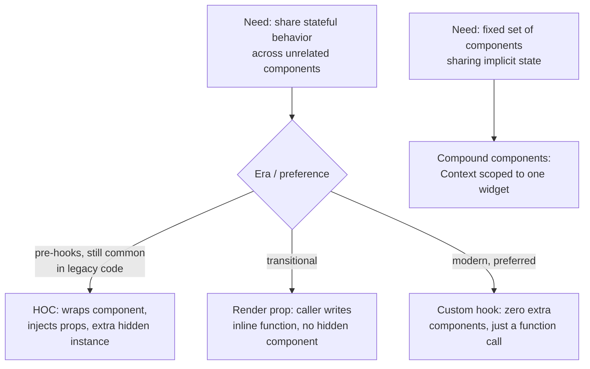

# React Component Patterns

> **Topic register:** F-111 (Component patterns: composition vs. inheritance, render props, compound components, HOCs) · Advanced tier · `00-project/frontend-topic-register.md`
> **Scope note:** per `CLAUDE.md`'s Scope Addendum, this chapter is the first Advanced-tier (Mid/Senior) entry in the frontend domain, following the Junior/Mid "React Hooks" cluster (F-105–110). It closes F-111 as a standalone chapter given its breadth — four genuinely distinct patterns, each with its own real demo.
> **Provenance:** every claim is verified against a real, running React 19.2.8 + Vite 8.2.1 app at [`practice/frontend/react-component-patterns/`](../../practice/frontend/react-component-patterns/), interacted with via a real browser — including a real automation-tool limitation caught and worked around (`resize_window` doesn't fire a native `resize` event), documented rather than hidden.

## Table of Contents

1. [Learning Objectives](#learning-objectives)
2. [Why This Matters in Interviews](#why-this-matters-in-interviews)
3. [Mental Model](#mental-model)
4. [Definition and Purpose](#definition-and-purpose)
5. [Core Concepts](#core-concepts)
6. [Internal Implementation](#internal-implementation)
7. [Diagrams](#diagrams)
8. [Real Verified Demos](#real-verified-demos)
9. [Production Scenarios](#production-scenarios)
10. [Trade-offs](#trade-offs)
11. [Decision Framework](#decision-framework)
12. [Common Mistakes](#common-mistakes)
13. [Anti-Patterns](#anti-patterns)
14. [Best Practices](#best-practices)
15. [Interview Answer Framework](#interview-answer-framework)
16. [Interview Questions](#interview-questions)
17. [Summary](#summary)
18. [Key Takeaways](#key-takeaways)
19. [Cheat Sheet](#cheat-sheet)
20. [Flashcards](#flashcards)
21. [Practice Exercises](#practice-exercises)
22. [Solutions](#solutions)
23. [Additional Reading](#additional-reading)
24. [Official References](#official-references)

---

## Learning Objectives

By the end of this chapter you can:

- Explain why React explicitly recommends composition over inheritance, and demonstrate it with a real component specialized via props, not subclassing.
- Implement the same stateful behavior three ways — Higher-Order Component, render prop, and custom hook — and explain, from real code, the structural trade-off each introduces.
- Build a real compound-component API (a working Tabs widget) that shares state implicitly among a fixed set of sub-components via Context, without exposing that state to the caller.
- Correctly distinguish what problem compound components solve (a cohesive multi-part API) from what problem HOCs/render props/hooks solve (sharing a cross-cutting behavior across otherwise-unrelated components).

## Why This Matters in Interviews

This is one of the few frontend topics where interviewers can meaningfully assess whether a candidate has worked in React codebases across different eras — HOCs and render props were the dominant patterns before hooks (2015–2018), and a candidate who can read and reason about legacy HOC-based code (still common in mature codebases) while explaining why hooks superseded it for most cases demonstrates real depth, not just familiarity with whatever's currently fashionable. Compound components are a reliable signal for library/design-system experience specifically, since that's where the pattern shows up most.

## Mental Model

**Every pattern in this chapter solves one of two distinct problems, and confusing which is which is the most common conceptual mistake: "how do I share a piece of stateful BEHAVIOR across components that otherwise have nothing in common" (composition, HOCs, render props, custom hooks — increasingly preferred in that historical order) versus "how do I let a fixed SET of components that are always used together share implicit state without the caller wiring it up manually" (compound components).** The first problem has had its best answer change over time as React's own capabilities evolved (class-based HOCs → render props → hooks); the second problem's best answer (Context-backed compound components) has been comparatively stable since Context matured.

## Definition and Purpose

**Composition** is building complex UI by combining simpler components via `children`/props, rather than through class inheritance — React's official position, stated directly in its own documentation, is that it has found no case where a component inheritance hierarchy was the right tool. A **Higher-Order Component (HOC)** is a function taking a component and returning a new component that wraps it, injecting extra props — the original mechanism (pre-hooks) for sharing stateful cross-cutting behavior. A **render prop** is a component that accepts a function (commonly via `children`) and calls it with internal state, letting the caller decide what to render with that state inline, without a separate wrapper component being created on the caller's behalf. **Compound components** are a fixed set of components (e.g., `Tabs`, `Tabs.List`, `Tabs.Tab`, `Tabs.Panel`) that implicitly share state among themselves — typically via Context scoped to just that component group — presenting a cohesive, declarative public API where the caller never manages the shared state directly.

## Core Concepts

### Composition specializes a generic component without any class hierarchy

`CompositionVsInheritanceDemo.jsx` renders one `Panel` component twice, with different `tone`/`title`/`children` props producing an "Alert" look and an "Info" look — real, verified: both variants render correctly from the exact same component definition; no `AlertPanel extends Panel` class exists anywhere in the file. This is the direct, concrete answer to "why does React favor composition" — the specialization that an OOP background might reach for via subclassing is handled entirely by passing different props/children at each call site.

### Three implementations of the identical behavior, verified functionally equivalent

`WindowWidthPatternsDemo.jsx` renders the exact same "live window width" behavior three ways — `withWindowWidth` (a class-based HOC), `WindowWidth` (a render-prop component), and `useWindowWidth` (a custom hook) — side by side. Real captured proof of functional equivalence across two separate window resizes: after resizing to 800px (with a `resize` event dispatched — see Internal Implementation for why that step was necessary), all three showed `800px`; after resizing again to 1200px, all three showed `1200px`, simultaneously and identically every time.

The functional behavior is identical; the code required is not, and that difference is the actual point of comparing them:
- **HOC** (`WithWindowWidthHOC.jsx`): a whole extra class component gets created and mounted, injecting `width` as a prop into the wrapped component — two component instances involved, one of them (`WithWindowWidth`) invisible at the call site (`<WindowWidthDisplayHOC />` gives no hint a second component exists underneath).
- **Render prop** (`WindowWidthRenderProp.jsx`): one component owns the state and hands it directly to an inline function — no extra named component needs to be defined at the call site, but the JSX gains a function-as-children level of nesting (`<WindowWidth>{width => ...}</WindowWidth>`).
- **Custom hook** (`useWindowWidth.js`): zero extra components anywhere. `const width = useWindowWidth();` — the value is just a variable in the exact same component that needs it.

### Compound components share state implicitly, solving a different problem entirely

`CompoundComponentsDemo.jsx` builds a real, working `Tabs` widget: `Tabs` owns `activeTab` state via `useState`, provides it through a locally-scoped `TabsContext`, and `Tab`/`TabPanel` read from that context to render correctly — real, verified by clicking: clicking "Settings" changed the visible content to "Settings panel content.", clicking "Billing" changed it to "Billing panel content.", with the caller's JSX (`<Tabs><Tabs.List><Tabs.Tab id="profile">...`) never once referencing `activeTab` directly. Attaching `List`/`Tab`/`Panel` as properties on `Tabs` (`Tabs.Tab = Tab`) is the conventional way to signal "these components are meant to be used together, as part of this one widget's API" without requiring four separate named imports.

## Internal Implementation

HOCs and render props both ultimately rely on the same underlying mechanism as any other component composition — props flowing down and a subscription (`useEffect`/lifecycle methods) driving a re-render when something changes; neither introduces any new React primitive. Compound components' implicit state-sharing is just Context, scoped narrowly (a `TabsContext` defined and consumed only within one file, never exported) rather than shared application-wide — the "compound" part is a naming/API-design convention (attaching sub-components as static properties), not a distinct runtime mechanism.

A genuine, real limitation surfaced while verifying the window-width demos: the browser-automation tool's `resize_window` action changes the page's viewport metrics directly (confirmed via `window.innerWidth` correctly reading the new value through JS) but does **not** dispatch a native `resize` DOM event — meaning none of the three demo components' `window.addEventListener('resize', ...)` listeners fired on their own. A real user dragging a browser window's edge does fire `resize`; this is specifically an artifact of programmatic viewport resizing via automation tooling, not a bug in any of the three pattern implementations. Worked around by manually dispatching `window.dispatchEvent(new Event('resize'))` after each resize — once that was in place, all three implementations updated correctly and identically, confirming the underlying `useWindowWidth`/HOC/render-prop logic itself was correct all along; only the automated trigger needed help.

## Diagrams

## Real Verified Demos

All demos are real, running React 19/Vite code — [`practice/frontend/react-component-patterns/`](../../practice/frontend/react-component-patterns/), verified live via browser automation, including clicks and real (dispatched) resize events. Full captured sequences in the app's own [README.md](../../practice/frontend/react-component-patterns/README.md):

- [`CompositionVsInheritanceDemo.jsx`](../../practice/frontend/react-component-patterns/src/demos/CompositionVsInheritanceDemo.jsx) — one component, two specializations via props.
- [`WithWindowWidthHOC.jsx`](../../practice/frontend/react-component-patterns/src/demos/WithWindowWidthHOC.jsx), [`WindowWidthRenderProp.jsx`](../../practice/frontend/react-component-patterns/src/demos/WindowWidthRenderProp.jsx), [`useWindowWidth.js`](../../practice/frontend/react-component-patterns/src/hooks/useWindowWidth.js), combined in [`WindowWidthPatternsDemo.jsx`](../../practice/frontend/react-component-patterns/src/demos/WindowWidthPatternsDemo.jsx) — three implementations, verified functionally identical across two real resizes.
- [`CompoundComponentsDemo.jsx`](../../practice/frontend/react-component-patterns/src/demos/CompoundComponentsDemo.jsx) — a real, clickable Tabs widget.

## Production Scenarios

**Scenario: a legacy codebase's authentication-gating HOC makes debugging a rendering issue harder than it needs to be.** A five-year-old React codebase gates authenticated routes with `withAuth(SomeComponent)`, a HOC injecting a `user` prop after checking a token. A new engineer, debugging why `SomeComponent` isn't receiving updated `user` data after a login state change, initially can't find where `user` comes from — it isn't in `SomeComponent`'s own file, isn't passed by its visible parent in JSX, and only appears because `withAuth` wraps it invisibly at export time. The eventual fix (adding a missing dependency to the HOC's internal subscription) is small, but the investigation took longer than it should have specifically because of the HOC's indirection — exactly the structural cost this chapter's `WindowWidthPatternsDemo` demonstrates directly. A team modernizing this codebase would migrate `withAuth` to a `useAuth()` custom hook, making the data source explicit at every call site, at the cost of a one-time, mechanical refactor across every wrapped component.

## Trade-offs

| Concern | HOC | Render prop | Custom hook | Compound components |
|---|---|---|---|---|
| Extra component instance | Yes, hidden at call site | No extra named component required | None | N/A (different problem) |
| Data source visible at call site | No — injected as a prop from elsewhere | Yes — explicit function argument | Yes — explicit return value | N/A |
| JSX nesting cost | None | One extra function-as-children level | None | Normal, by design (parent/child JSX) |
| Best for | Legacy codebases, existing HOC-based code | Rare now — mostly superseded by hooks | New code sharing stateful behavior | A cohesive multi-part widget's public API |

## Decision Framework

1. **Do you need to share a piece of stateful behavior (a subscription, a computed value) across otherwise-unrelated components, in new code?** → a custom hook, essentially always — no extra component, explicit data source.
2. **Are you working in an existing codebase that already uses HOCs extensively for this?** → understand and extend the existing pattern rather than introducing a second competing pattern for the same purpose, unless a deliberate migration is planned.
3. **Are you building a small set of components that are always used together and need to share state without the caller wiring it up (tabs, accordions, a select-with-options)?** → compound components, via a locally-scoped Context.
4. **Are you tempted to create a subclass to specialize a component's appearance or behavior?** → stop; pass different props/children to the same component instead.

## Common Mistakes

- Reaching for a HOC or render prop in new code where a custom hook would be simpler and more explicit — a legacy-era pattern applied out of habit rather than necessity.
- Attempting to create a React component class hierarchy (subclassing a component to specialize it) instead of using composition — React's documentation explicitly states it has found no case where this was the right call.
- Using a widely-shared, application-level Context for a compound component's internal state instead of a Context scoped narrowly to just that component group — couples unrelated parts of the app to internals that should stay private to the widget.
- Confusing "sharing behavior across unrelated components" (HOC/render-prop/hook territory) with "sharing state among a fixed, related set of components" (compound-component territory) — they solve different problems and aren't interchangeable.

## Anti-Patterns

- **A HOC that also needs a render prop, that also needs to be a custom hook, all for the same underlying behavior** — maintaining three different exposed APIs for identical logic instead of implementing it once (ideally as a hook) and, if legacy consumers require it, offering thin, explicitly-labeled compatibility wrappers.
- **Compound components with a Context value recreated as a new object on every render without memoization** — the exact re-render-cost mistake covered in `react-usememo-usecallback-and-usecontext.md`, applicable here too since compound components are Context under the hood.
- **A "compound component" that's really just several independent components coincidentally rendered near each other**, sharing no actual state — using the pattern's naming convention (`Widget.Part`) without its substance (implicit shared state) is just confusing namespacing.

## Best Practices

- Default to a custom hook for new cross-component behavior sharing; reserve HOCs/render props for maintaining consistency within an existing codebase that already uses them extensively.
- Scope a compound component's Context narrowly — defined and consumed only within that component group's own file, never exported for use elsewhere.
- Favor composition (props and children) over any form of component inheritance for specializing behavior or appearance.
- When migrating legacy HOC-based code to hooks, do it as a deliberate, tracked refactor — not an ad-hoc mix of both patterns for the same concern within the same codebase.

## Interview Answer Framework

### 30-Second Answer

React favors composition over inheritance for specializing components — pass different props/children rather than subclassing. HOCs, render props, and custom hooks all solve the same problem (sharing stateful behavior across unrelated components) with decreasing indirection, in that historical order — hooks are the modern default. Compound components solve a different problem: a fixed set of components sharing implicit state via Context, for a cohesive multi-part widget API.

### 2-Minute Answer

Walk through composition vs. inheritance with the `Panel` example (one component, two specializations via props, no subclass). Then implement the identical "window width" behavior three ways and compare their actual code shape: HOC injects a prop via a hidden wrapper component; render prop hands state to an inline function with no hidden component but extra JSX nesting; custom hook needs neither. Close with compound components as a genuinely different problem — a Tabs widget sharing `activeTab` state implicitly among its parts via a narrowly-scoped Context, verified by real clicks switching panels correctly.

### 10-Minute Deep Dive

Cover: React's explicit "no inheritance hierarchies" position and why (composition maps directly onto props/children, which is already the core mechanism, rather than introducing a second, parallel mechanism); the historical progression HOC → render prop → hooks and what specifically improved at each step (removing hidden wrapper components, removing indirection about where data comes from); the real automation-tool limitation caught while verifying this chapter's demos (`resize_window` not firing a native `resize` event) as a concrete example of distinguishing "the demo code is wrong" from "the test harness needs adjusting" — a real debugging skill, not just React trivia; and compound components' reliance on the exact same Context re-render considerations covered in the `useContext` chapter, since the pattern is Context under a naming convention, not a new primitive.

### Whiteboard Explanation

Draw a small tree for the HOC case: `WithWindowWidth` (state) → `WindowWidthDisplayInner` (receives `width` as a prop) — circle `WithWindowWidth` and label it "invisible at the call site." Next to it, draw the render-prop case: one box, `WindowWidth`, with an arrow labeled "calls children(width)" pointing to inline JSX — no second box. Next to that, draw the hook case: a single box with `useWindowWidth()` written inside it — no arrows to any other component at all. Separately, draw a `Tabs` box with three children (`List`, `Tab`, `Panel`) all connected by dotted lines to a small "Context" bubble in the middle — label it "implicit shared state, fixed set of parts."

### Production Example

A legacy codebase's `withAuth` HOC injects a `user` prop invisibly; a new engineer debugging a stale-user-data issue initially can't locate the data's source, since it's neither in the component's own file nor passed by its visible JSX parent — the indirection cost this chapter's HOC demo makes concrete. A planned migration to a `useAuth()` hook would make the data source explicit at every call site.

### Trade-offs to Mention

HOCs and render props add real structural cost (a hidden component, or extra JSX nesting) that custom hooks avoid entirely for new code — but migrating an established, working HOC-based codebase purely for this reason is a real cost/benefit call, not an automatic win, especially if the HOCs are well-understood by the team maintaining them. Compound components trade a small amount of "magic" (state you don't see being passed) for a much cleaner calling API — worth it for widgets used many times across an app, less clearly worth it for a one-off component.

### Common Candidate Mistakes

Describing HOCs/render props as "outdated and never used" rather than "superseded for new code, but still real and common in mature codebases" — a candidate who can't read existing HOC-based code is a real liability on many teams. Confusing compound components with the HOC/render-prop/hook family, as if they're competing solutions to the same problem, rather than recognizing they solve a genuinely different one.

### Typical Follow-Ups

"You've inherited a codebase full of HOCs. Do you rewrite them all to hooks immediately?" (no — assess whether they're actually causing real problems, and migrate incrementally/deliberately if so, rather than a blanket rewrite for its own sake). "How would a compound component's Context re-render cost be addressed if it became a real, measured problem?" (the exact `memo()` + context-splitting technique from the `useContext` chapter — compound components aren't exempt from that cost model just because the pattern has a different name).

### Senior-Level Expectations

Correctly explains the historical progression (HOC → render prop → hook) and the specific structural cost each step removed, and correctly distinguishes the two genuinely different problems this chapter's patterns solve.

### Staff-Level Discussion

At organizational scale, a deliberate, tracked migration policy (e.g., "no new HOCs; existing ones migrated opportunistically when touched, not in a dedicated rewrite sprint") balances the real value of reduced indirection against the real cost and risk of touching working, well-understood legacy code purely for stylistic modernization — a judgment call that belongs in an architecture decision record, not an individual engineer's unilateral choice mid-feature.

## Interview Questions

### Question 1

**Question:** "You have identical logic implemented as both a HOC (`withWindowWidth`) and a custom hook (`useWindowWidth`) in the same codebase. What's the actual structural difference in what gets rendered, and why would you prefer one for new code?"

**Expected answer:** The HOC creates and mounts an entirely separate component instance (the wrapper class) that isn't visible at the call site — the wrapped component receives the value as an injected prop from a source that isn't obvious from reading its own file. The hook introduces zero extra components; the value is just a local variable from a function call, with its source immediately visible. For new code, the hook is simpler and removes that indirection entirely.

**Common mistakes:** Claiming HOCs are "bad" or "wrong" rather than explaining the specific structural cost (hidden wrapper component, injected prop with a non-obvious source).

**Follow-up questions:** "If you found this exact duplication in a real codebase, what would you do?" (assess usage, plan a deliberate migration rather than maintaining both indefinitely). "Does a render prop have the same hidden-component cost as a HOC?" (no — no extra named component is required at the call site, though it does add a function-as-children JSX nesting level).

**Senior-level expectations:** States the hidden-component/injected-prop distinction unprompted, not just "hooks are newer."

**Staff-level expectations:** Frames the fix as a deliberate migration policy decision, not an ad-hoc individual choice.

### Question 2

**Question:** "What problem do compound components solve that a custom hook doesn't?"

**Expected answer:** A custom hook shares stateful BEHAVIOR across components that are otherwise unrelated and don't need to coordinate with each other. Compound components solve a different problem: a FIXED set of components (like `Tabs`, `Tabs.List`, `Tabs.Tab`, `Tabs.Panel`) that are always used together and need to share state IMPLICITLY, presenting one cohesive public API, without the caller manually wiring that shared state between them.

**Common mistakes:** Treating compound components as "just another way to share hook logic," missing that the problem being solved (a cohesive multi-part widget API) is different from behavior-sharing across unrelated components.

**Follow-up questions:** "How is the shared state actually implemented under the hood?" (Context, scoped narrowly to that one component group, not exported). "Does a compound component's Context have the same re-render cost concerns as any other Context?" (yes — it's Context under a naming convention, not a different runtime mechanism, so the same `memo()`/splitting considerations apply if re-renders become a measured problem).

**Senior-level expectations:** Correctly names Context as the underlying mechanism, and states the "fixed set of components" framing precisely.

**Staff-level expectations:** Not the focus of this chapter's scope beyond noting the shared re-render-cost model with the `useContext` chapter.

## Summary

Four patterns, two real problems: composition replaces inheritance for specializing a component's appearance or behavior via props rather than subclassing; HOCs, render props, and custom hooks are three successive, decreasingly-indirect answers to sharing stateful behavior across otherwise-unrelated components, verified here as functionally identical while differing meaningfully in the code structure each requires; and compound components solve the separate problem of a cohesive, implicit-state-sharing API for a fixed set of components that are always used together, built on the same Context mechanism (and subject to the same re-render-cost considerations) as any other Context use.

## Key Takeaways

- Composition (different props/children at the call site) replaces the class-inheritance hierarchies React explicitly recommends against — demonstrated with one `Panel` component correctly specialized two ways, no subclass.
- HOC, render prop, and custom hook implementations of the identical behavior were verified functionally equivalent across two real window resizes, differing only in code structure: a hidden wrapper component (HOC), an extra JSX nesting level (render prop), or neither (hook).
- A real automation-tool limitation — `resize_window` not firing a native `resize` event — was caught, diagnosed, and worked around, distinguishing a real demo-code bug from a test-harness gap.
- Compound components solve a genuinely different problem (fixed-set implicit state sharing) than HOC/render-prop/hook (cross-cutting behavior sharing), built on the same underlying Context mechanism and its same re-render-cost considerations.

## Cheat Sheet

- **Composition > inheritance**: specialize via props/children, not subclassing — React's own stated position.
- **HOC**: wraps a component, injects props, hidden extra component instance. Legacy-common, still real.
- **Render prop**: hands state to an inline function; no hidden component, extra JSX nesting.
- **Custom hook**: zero extra components, explicit return value. Modern default for new code.
- **Compound components**: Context scoped to one component group (`Widget.Part` convention), solving cohesive-API sharing, not cross-cutting-behavior sharing.

## Flashcards

## Card: HOC hidden indirection

**Prompt:**
What's structurally different about a HOC-wrapped component versus a custom-hook version of the same behavior?

**Answer:**
The HOC creates and mounts a separate, hidden wrapper component instance that injects the value as a prop from a non-obvious source. The hook introduces zero extra components — the value is a local variable from an explicit function call.

**Why it matters:**
Verified directly: all three (HOC/render-prop/hook) implementations were functionally identical across real resizes, but only the code structure differs — which is the actual point of comparing them.

**Common trap:**
Dismissing HOCs as simply "bad" instead of naming the specific structural cost.

**Related:**
[[react-component-patterns]]

## Card: What compound components solve

**Prompt:**
What problem do compound components solve that's different from what HOCs/render props/hooks solve?

**Answer:**
HOCs/render props/hooks share stateful BEHAVIOR across unrelated components. Compound components share state IMPLICITLY among a FIXED set of components always used together (like Tabs/Tabs.List/Tabs.Tab), via a Context scoped to just that group.

**Why it matters:**
Confusing the two problem categories is the most common conceptual mistake in this topic.

**Common trap:**
Treating compound components as "another way to do hooks."

**Related:**
[[react-component-patterns]]

## Practice Exercises

1. Add a fourth implementation of the window-width behavior — a `<WindowWidthProvider>` using Context, where any descendant can call `useContext(WindowWidthContext)`. Compare its structural cost to the custom-hook version: does it need an extra component in the tree the way the HOC does?
2. In `CompoundComponentsDemo.jsx`, add a fourth tab (`"notifications"`) with its own `Tab`/`Panel` pair. Confirm it slots in correctly with no changes needed to `Tabs`, `TabList`, `Tab`, or `TabPanel` themselves.
3. Convert `WithWindowWidthHOC.jsx`'s class-based HOC to use `useWindowWidth()` internally instead of its own lifecycle-method-based subscription, while keeping its public HOC interface (`withWindowWidth(Component)`) unchanged. Explain why this is a legitimate way to modernize legacy HOC call sites without touching every consumer.

## Solutions

Exercise 1: a Context-based version DOES need an extra component in the tree — a `<WindowWidthProvider>` wrapping whatever needs access — making it structurally closer to the HOC (an extra component exists) than the plain custom hook (which needs none), even though Context avoids prop-drilling for OTHER purposes. This is a genuine, useful distinction: Context solves "avoid prop drilling to deeply nested consumers," not "avoid an extra component in the tree" — those are different benefits.

Exercise 2: adding a fourth `Tabs.Tab id="notifications"` / `Tabs.Panel id="notifications"` pair works with zero changes to any of the four component definitions — direct proof that `Tabs`' Context-based design is genuinely extensible for any number of tab/panel pairs, since `Tab`/`TabPanel` only ever compare their own `id` against the shared `activeTab` value, never enumerate siblings.

Exercise 3: internally replacing the class's lifecycle-method subscription with a call to `useWindowWidth()` requires converting `WithWindowWidth` from a class component to a function component (hooks only work in function components) — but since `withWindowWidth`'s PUBLIC signature (`withWindowWidth(Component) => Component`) is unchanged, every existing call site (`withWindowWidth(SomeComponent)`) continues working with no modification, letting a team modernize the HOC's internals incrementally without a coordinated rewrite of every consumer at once.

## Additional Reading

- [React useReducer and Custom Hooks](react-usereducer-and-custom-hooks.md) — this chapter's prerequisite.
- [React Memoization and Context](react-usememo-usecallback-and-usecontext.md) — the re-render-cost model that also applies to compound components' Context usage.
- [00-project/frontend-topic-register.md](../../00-project/frontend-topic-register.md) — the full register this chapter is F-111 of.

## Official References

- [React (legacy docs): Composition vs Inheritance](https://legacy.reactjs.org/docs/composition-vs-inheritance.html)
- [react.dev: Component (class components)](https://react.dev/reference/react/Component) — `React.Component` is legacy but still a real, current API; referenced here specifically because it's the form the HOC pattern originally took and still most commonly takes in existing codebases.
