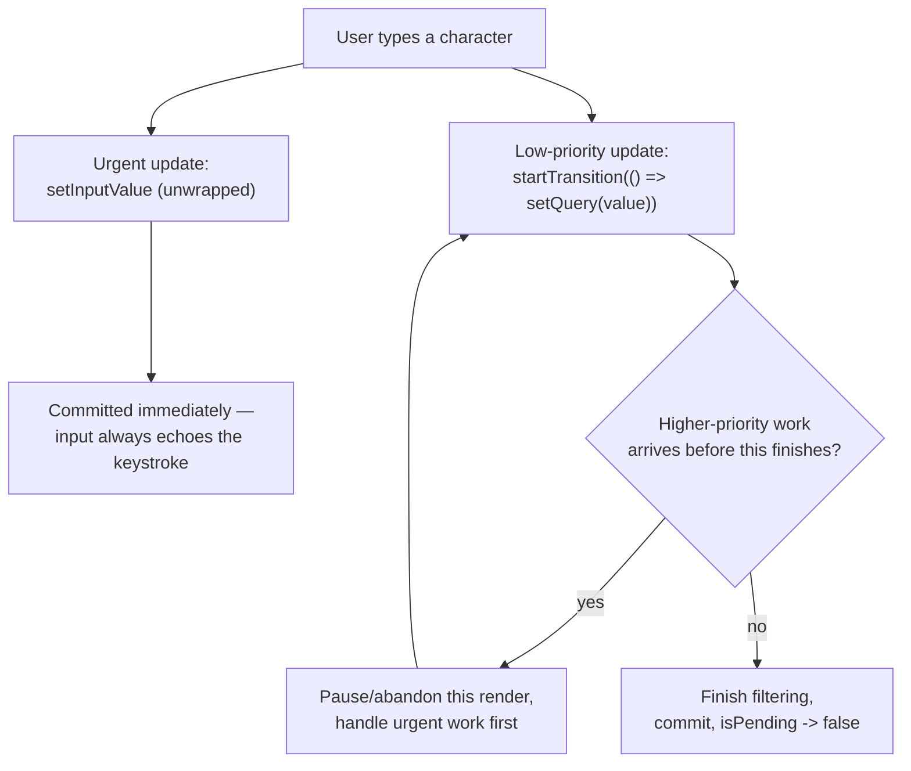
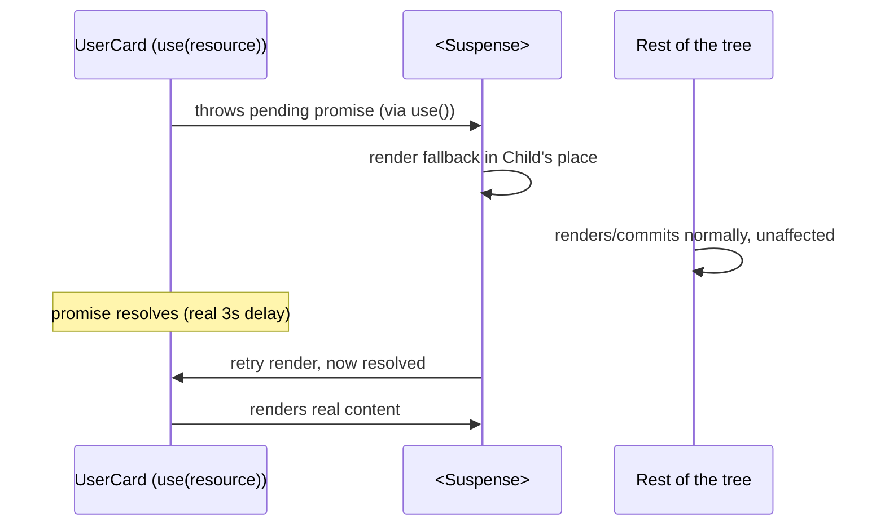

# Concurrent React: Transitions, Deferred Values, and Suspense for Data

> **Topic register:** F-113 (Concurrent React — transitions, `useDeferredValue`, `useTransition`, Suspense for data) · Advanced tier · `00-project/frontend-topic-register.md`
> **Scope note:** per `CLAUDE.md`'s Scope Addendum, this is the scheduling/priority half of Fiber that `react-reconciliation-and-fiber.md` (F-112) deliberately deferred — that chapter covered the synchronous diffing heuristic and batching; this one covers what makes rendering *interruptible* and *prioritizable*, demonstrated here with the actual concurrent-feature APIs rather than described abstractly.
> **Provenance:** every claim is verified against a real, running React 19.2.8 + Vite 8.2.1 app at [`practice/frontend/react-concurrent/`](../../practice/frontend/react-concurrent/) — including a real 3-second simulated network delay actually observed mid-flight (a `"Loading user..."` fallback captured at +100ms, resolved content captured after the delay), not inferred from documentation.

## Table of Contents

1. [Learning Objectives](#learning-objectives)
2. [Why This Matters in Interviews](#why-this-matters-in-interviews)
3. [Mental Model](#mental-model)
4. [Definition and Purpose](#definition-and-purpose)
5. [Core Concepts](#core-concepts)
6. [Internal Implementation](#internal-implementation)
7. [Diagrams](#diagrams)
8. [Real Verified Demos](#real-verified-demos)
9. [Production Scenarios](#production-scenarios)
10. [Trade-offs](#trade-offs)
11. [Decision Framework](#decision-framework)
12. [Common Mistakes](#common-mistakes)
13. [Anti-Patterns](#anti-patterns)
14. [Best Practices](#best-practices)
15. [Interview Answer Framework](#interview-answer-framework)
16. [Interview Questions](#interview-questions)
17. [Summary](#summary)
18. [Key Takeaways](#key-takeaways)
19. [Cheat Sheet](#cheat-sheet)
20. [Flashcards](#flashcards)
21. [Practice Exercises](#practice-exercises)
22. [Solutions](#solutions)
23. [Additional Reading](#additional-reading)
24. [Official References](#official-references)

---

## Learning Objectives

By the end of this chapter you can:

- Explain what "concurrent rendering" actually means in React 18+: the ability to prepare a render in memory without committing it, interrupt that work for something more urgent, and resume or discard it — not "true JavaScript parallelism," which the single-threaded runtime never has.
- Use `useTransition` to mark a state update as low-priority, and prove — with a real `isPending` history, not just a claim — that it doesn't block a more urgent update in the same interaction.
- Use `useDeferredValue` to get the same "let this lag behind" behavior without an explicit `startTransition` call, and explain precisely when to reach for one hook over the other.
- Use `Suspense` with the `use()` hook to suspend a component on a real promise, and state what Suspense boundaries actually do to the tree around them.

## Why This Matters in Interviews

Concurrent features are one of the most commonly *namedropped and least commonly understood* parts of modern React — candidates who can say "React 18 added concurrent rendering" but cannot explain what specifically becomes possible, or produce a working `useTransition` example under pressure, are extremely common at Mid/Senior level. This chapter draws the line explicitly between the reconciliation/batching mechanics from F-112 (which govern every render, always) and concurrent features (which are opt-in, and only change *when* and *in what order* renders happen — never *what* the final DOM looks like).

## Mental Model

**Concurrent rendering does not make React's rendering multi-threaded — it makes rendering *interruptible*, so React can start preparing a low-priority update, pause partway through if something more urgent (a keystroke, a click) comes in, handle the urgent thing first, and then either resume or restart the paused work.** This is only possible because of Fiber's linked-list, unit-of-work structure (F-112's Internal Implementation section) — a plain recursive call stack cannot be paused and resumed like this. Every concurrent-feature hook in this chapter is really just a different way of telling React "this particular update is allowed to be interrupted, deprioritized, or shown as still-loading" — the diffing heuristic and the commit-phase guarantees from F-112 are completely unchanged underneath.

## Definition and Purpose

**Concurrent rendering** is the rendering model introduced in React 18 (via `createRoot`) in which the render phase is no longer guaranteed to run to completion synchronously and uninterrupted — React can pause, abandon, or reprioritize in-progress render work. It exists to solve a specific, common UX problem: an expensive update (re-filtering a large list, re-rendering a big chart) triggered by the same interaction as an urgent one (an input echoing a keystroke) used to make the urgent one wait, because pre-18 rendering ran to completion in one synchronous block. **`useTransition`** lets you explicitly mark a `setState` call as a "transition" — low priority, interruptible, with an `isPending` flag exposed so the UI can show a loading affordance. **`useDeferredValue`** achieves a related effect without wrapping a setter call: it gives you a version of a value that "lags behind" the real one during expensive re-renders, useful when you don't control the state update itself (e.g., a value coming from a parent or a URL). **Suspense** lets a component declare "I'm not ready yet" (by throwing a promise, or via `use()`) and have React render a fallback UI for the nearest `<Suspense>` boundary instead, without blocking the rest of the tree outside that boundary.

## Core Concepts

### `useTransition`: marking an update as interruptible, proven via a real pending history

`TransitionDemo.jsx` filters a 20,000-item array with an artificially expensive synchronous filter function. Typing into the input calls `setInputValue` directly (urgent — must echo every keystroke immediately) and wraps the actual filtering state update in `startTransition(() => setQuery(value))`. An effect logs every time `isPending` changes value. Real captured result after typing `"item-5"`: `pending log: pending: true -> pending: false` — direct, observed proof that React marked the filter update as pending and later resolved it, rather than blocking synchronously on the expensive computation. The input itself never lagged, because its own update was never wrapped in the transition.

### `useDeferredValue`: the value itself lags, no explicit setter wrapping

`DeferredValueDemo.jsx` filters a similarly large array, but the input is a plain, single, non-split `useState` — there's no separate "urgent" and "low-priority" setter calls to write. Instead, `useDeferredValue(query)` produces `deferredQuery`, which React is free to update on a delay during expensive work; the component computes `isStale = query !== deferredQuery` and logs every flip. Real captured result after typing `"entry-5"`: `stale log: stale: true -> stale: false`, with `query` and `deferredQuery` ending up equal again once the expensive filter caught up. This is the tool of choice specifically when you can't (or don't want to) restructure the state update itself into a transition — e.g., the value is a prop from a parent you don't control.

### Suspense + `use()`: a real, observed fallback window, not an assumption

`SuspenseDataDemo.jsx` calls a function returning a `Promise` that resolves after a real 3-second `setTimeout` (simulating a network call), stores that promise in state on a button click, and passes it to a child component that calls `use(resource)` — which suspends the child (not the whole page) until the promise settles, letting the nearest `<Suspense fallback={...}>` render its fallback in the meantime. Verifying this reliably required combining the click and the DOM check into a single `javascript_exec` call — separate, sequential browser-automation round-trips were slower than the original delay, so every check landed after resolution. Real captured result from one combined poll: `+100ms → "Loading user..."`, `+3.2s → "Loaded: User 2 (id 2)"` — the fallback text genuinely present in the DOM during the pending window, not inferred from the API's documented behavior.

## Internal Implementation

`startTransition` (and the setter returned by `useTransition`) tags the state update it wraps with a lower internal priority lane, rather than the default "synchronous/urgent" lane every other `setState` call uses. When React's work loop (F-112) processes pending work, it can interleave: start the low-priority fiber work, then if a higher-priority update comes in (a new keystroke, itself an urgent-lane update), abandon or pause the in-progress low-priority render and handle the urgent one first, only returning to the low-priority work afterward — this is the concrete mechanism `isPending` reflects. `useDeferredValue` works by having React, internally, briefly re-render the component with the OLD value at high priority (so nothing else is blocked) while a lower-priority render computes the new value in the background; when that background render finishes, React commits it and the deferred value "catches up." `Suspense` works by having a component that isn't ready throw a promise (which `use()` does internally when its argument is pending); React catches this like an exception, walks up to the nearest `<Suspense>` boundary, renders its `fallback` in the boundary's place instead of the throwing subtree, and re-attempts the subtree's render once the thrown promise resolves — the parts of the tree OUTSIDE that boundary are entirely unaffected and continue rendering/committing normally.

## Diagrams

## Real Verified Demos

All three demos are real, running React 19/Vite code — [`practice/frontend/react-concurrent/`](../../practice/frontend/react-concurrent/), verified live via real typed input, a real button click, and a real 3-second network simulation actually observed mid-flight. Full captured sequences in the app's own [README.md](../../practice/frontend/react-concurrent/README.md):

- [`TransitionDemo.jsx`](../../practice/frontend/react-concurrent/src/demos/TransitionDemo.jsx) — real `isPending` history proving a low-priority update didn't block the urgent input.
- [`DeferredValueDemo.jsx`](../../practice/frontend/react-concurrent/src/demos/DeferredValueDemo.jsx) — real `isStale` history proving a deferred value lags and catches up.
- [`SuspenseDataDemo.jsx`](../../practice/frontend/react-concurrent/src/demos/SuspenseDataDemo.jsx) — real fallback text observed mid-flight, then real resolved content.

## Production Scenarios

**Scenario: a search-as-you-type feature feels laggy on lower-end devices, but only on the input itself, not the actual search logic.** A product search box re-filters and re-renders a large results grid on every keystroke. On lower-end devices, users report the input feels "sticky" — characters appear to lag behind typing, especially when typing fast. Initial hypothesis: network latency (wrong — the filtering is entirely client-side, no network call involved). Evidence: profiling shows each keystroke triggers a synchronous re-render of the entire results grid before the input's own DOM update is painted — because both updates were in the same, unsplit `useState`/render path, pre-18 React (or React 18 without opting into transitions) processes them as one synchronous block. Diagnosis, directly traceable to this chapter: the results-grid update needs to be marked as a transition (or filtered on a deferred value) so the input's own state update — cheap, and the one users are most sensitive to lag on — is never blocked by the expensive grid re-render. Fix: wrap the results-filtering `setState` in `startTransition`, add an `isPending`-driven subtle loading indicator on the grid so users get feedback that results are still catching up, while the input itself stays instantly responsive. Trade-off made explicit to the team: this doesn't make the filtering itself faster — it changes *when* React is allowed to interrupt it, which is a real UX win but not a substitute for actually reducing the filter's own cost if it's genuinely too expensive.

## Trade-offs

| Concern | `useTransition` | `useDeferredValue` | Suspense + `use()` |
|---|---|---|---|
| What you control | The setter call itself (wrap it in `startTransition`) | Nothing about the setter — works on any value, including props you don't own | Whether a component "isn't ready yet" (a promise) |
| Explicit pending signal | Yes — `isPending` boolean | Indirect — compare the value to its deferred version | Yes — the nearest `<Suspense fallback>` renders |
| Best fit | You own the state update that's expensive to render | You only have a value (prop, derived state), not the setter | Data fetching, code-splitting, anything genuinely async |
| Blast radius if misused | Marking something urgent as a transition makes it feel unresponsive when it should be instant | Same risk, less obvious since there's no explicit wrapping call to reconsider | Suspending too broad a subtree makes an unrelated slow child hide fast, ready siblings |

## Decision Framework

1. **Do you own the specific `setState` call for the expensive update, and want an explicit pending flag?** → `useTransition`.
2. **Do you only have a value (a prop, a value derived from the URL, something you don't call `setState` on yourself) that feeds an expensive render?** → `useDeferredValue`.
3. **Is the "waiting" actually for genuinely asynchronous work (a fetch, a dynamic `import()`), not just an expensive synchronous computation?** → `Suspense` + `use()` (or `React.lazy` for code-splitting), not a transition — transitions and deferred values reprioritize synchronous rendering work; they don't make you wait for a promise.
4. **Are you about to wrap a `<Suspense>` boundary around a large subtree that mixes fast-ready and slow-loading children?** → Reconsider the boundary's placement — a single slow child inside a broad boundary hides everything else in that boundary behind the fallback, even parts that were ready instantly.

## Common Mistakes

- Using `useTransition`/`useDeferredValue` to try to speed up an expensive computation — they change scheduling priority, not the actual cost of the work; a genuinely slow filter is still slow, just no longer blocking urgent updates.
- Believing `useDeferredValue` requires calling a special setter — it doesn't; it wraps any value, including ones you don't control the update source of.
- Placing a `<Suspense>` boundary too broadly, around several independent pieces of UI, so one slow child hides everything else in the boundary behind the fallback instead of just itself.

## Anti-Patterns

- **Wrapping every `setState` call in `startTransition` "just in case," including genuinely urgent ones** (like the input's own value) — this reintroduces the exact laggy-input problem transitions exist to solve, just self-inflicted.
- **Using `useTransition`/`useDeferredValue` as a substitute for actually fixing an expensive computation** (e.g., an O(n²) filter over a huge list) — they redistribute WHEN slow work happens relative to urgent updates; they don't make the slow work faster, and treating them as a performance fix rather than a prioritization tool leads to teams shipping still-slow features that merely feel less broken.

## Best Practices

- Keep the truly urgent part of an interaction (what the user directly typed or clicked) in an unwrapped, synchronous `setState` call, and wrap only the expensive, secondary consequence of that interaction in a transition.
- Use the `isPending` flag (or the `value !== deferredValue` comparison) to show a real, deliberate loading affordance — don't let a pending update silently show stale content with no indication anything is still resolving.
- Scope `<Suspense>` boundaries tightly around the specific piece of UI that's actually async, rather than one large boundary around an entire page, so fast-ready content isn't held hostage by one slow sibling.

## Interview Answer Framework

### 30-Second Answer

React 18's concurrent rendering makes render work interruptible rather than always-synchronous. `useTransition` lets you mark a specific state update as low-priority with an explicit `isPending` flag; `useDeferredValue` gives the same "let it lag" behavior for a value you don't control the setter of; Suspense (with `use()`) lets a component declare it isn't ready yet and shows a fallback for just its nearest boundary, without blocking the rest of the tree.

### 2-Minute Answer

Start from the mental model: concurrent rendering doesn't add parallelism, it adds interruptibility, built on Fiber's unit-of-work structure. Walk through `useTransition` with the concrete demo: input value updates instantly (unwrapped), the expensive filtered-list update is wrapped in `startTransition`, and a real `isPending` history (`true` then `false`) proves React deprioritized it without blocking the input. Contrast `useDeferredValue`: same effect, but for a value you don't have a setter for — the value itself briefly lags and then catches up. Close with Suspense: a component suspends on a real promise via `use()`, and only the nearest `<Suspense>` boundary shows a fallback — proven here with a real, observed `"Loading user..."` window before the resolved content appears.

### 10-Minute Deep Dive

Cover: the render/reconciliation/commit split from F-112 and specifically how concurrent rendering only affects the render phase's schedulability, never the commit phase (still synchronous, still all-or-nothing); the priority-lane mechanism underlying `startTransition`; why `useDeferredValue` internally involves a fast render at the OLD value before backgrounding the new one, rather than just "waiting"; the distinction between concurrent features (reprioritizing synchronous work) and Suspense (waiting on genuinely asynchronous work) — a very common conflation; and the practical failure mode of an over-broad Suspense boundary hiding ready content behind one slow sibling.

### Whiteboard Explanation

Draw a timeline with two lanes: "urgent lane" and "transition lane." Mark a keystroke event on the urgent lane with an immediate commit. Mark the same keystroke's transition-wrapped filter update on the transition lane, show it getting interrupted by a second keystroke's urgent-lane work, then resuming afterward. Below that, draw a separate box for Suspense: a component subtree with an "X" (suspended) feeding into the nearest enclosing `<Suspense>` box, whose fallback renders in the subtree's place while the rest of the page (outside the box) renders normally.

### Production Example

A search-as-you-type feature's input felt laggy because the same synchronous render block handled both the urgent input echo and the expensive results-grid re-filter; wrapping the grid's `setState` in `startTransition` (with an `isPending`-driven subtle loading indicator) let the input stay instantly responsive while the grid update was deprioritized and interruptible — without making the filter itself any faster.

### Trade-offs to Mention

Transitions and deferred values are scheduling tools, not performance optimizations — they don't reduce the actual cost of expensive work, only when it's allowed to block something more urgent. Suspense boundary placement is a real design decision: too broad, and one slow child hides unrelated ready content; too narrow/scattered, and you lose the simplicity of one shared fallback for a genuinely single loading unit.

### Common Candidate Mistakes

Describing concurrent React as making rendering "run in parallel" or "on another thread" (JavaScript is still single-threaded; the mechanism is interruption/reprioritization, not parallelism). Reaching for `useTransition`/`useDeferredValue` to fix a computation that's simply too slow, rather than recognizing they only change scheduling. Conflating Suspense's async-waiting model with transitions' synchronous-reprioritization model — they solve related but distinct problems.

### Senior-Level Expectations

Correctly distinguishes "interruptible, not parallel," picks the right tool (`useTransition` vs. `useDeferredValue`) based on whether they own the setter call, and can state precisely what a `<Suspense>` boundary does to the tree around it.

### Staff-Level Discussion

Not the primary target of this chapter, but briefly: deciding where transitions and Suspense boundaries belong across a large application is a real architectural decision with cross-team consequences — a shared, too-broad top-level Suspense boundary becomes a single point of UX degradation for every team's feature nested inside it, while scattering many tiny boundaries ad hoc leads to inconsistent, jarring partial-loading UIs; a Staff-level engineer is the one setting the convention (e.g., route-level boundaries, explicit guidance on when a feature warrants its own nested boundary) rather than letting it emerge organically per-PR.

## Interview Questions

### Question 1

**Question:** "You wrap a `setState` call in `startTransition`, but the UI still feels like it blocks on every keystroke. What would you check first?"

**Expected answer:** Check whether the truly urgent part of the update (e.g., the input's own displayed value) was ALSO accidentally wrapped in the transition, or fed from state that depends on the transitioned update — only work that's genuinely allowed to be deprioritized should be inside `startTransition`; wrapping the input's own state update by mistake reintroduces the exact lag the feature is meant to prevent.

**Common mistakes:** Assuming `startTransition` is broken or not supported, rather than checking what's actually inside vs. outside the wrapped call.

**Follow-up questions:** "How would you verify your fix actually worked, rather than just assuming it did?" (a real, observed `isPending` history, like this chapter's demo, or profiling the actual commit timing — not just visual impression). "Would `useDeferredValue` behave any differently here?" (only if the issue is about a value you don't own the setter for — otherwise it addresses the same underlying scheduling concern).

**Senior-level expectations:** Identifies the "accidentally urgent work inside the transition" failure mode unprompted.

**Staff-level expectations:** Not the primary focus of this chapter.

### Question 2

**Question:** "What's the actual difference between what `useTransition`/`useDeferredValue` do and what `Suspense` does — aren't they both about handling 'things that aren't ready yet'?"

**Expected answer:** No — transitions and deferred values reprioritize SYNCHRONOUS rendering work that's simply expensive (a big filter, a big list re-render); nothing is actually "pending" in an async sense, React is choosing when to run already-available work. Suspense is for genuinely ASYNCHRONOUS readiness — a promise that hasn't resolved yet (data fetching, code-splitting) — where there's truly nothing to render until external work completes. The two can be combined (e.g., a transition into a state change that triggers a Suspense-boundary'd fetch) but solve different problems.

**Common mistakes:** Treating them as interchangeable "loading state" tools without being able to articulate the synchronous-vs-asynchronous distinction.

**Follow-up questions:** "Can you use `useTransition` to wrap a state update that triggers a Suspense fallback?" (yes — this is a common, intentional pattern: the transition keeps the CURRENT UI visible and interactive with `isPending` true, instead of immediately unmounting to show the fallback, until the new content is ready). "What does `use()` actually do when given a pending promise?" (it throws the promise, which React's Suspense mechanism catches, walking up to the nearest boundary).

**Senior-level expectations:** States the synchronous-vs-asynchronous distinction clearly and unprompted.

**Staff-level expectations:** Can describe the combined pattern (transition + Suspense together) and why it improves perceived UX over a bare Suspense fallback appearing abruptly.

## Summary

Concurrent rendering makes React's render phase interruptible rather than always-run-to-completion, built directly on the Fiber unit-of-work structure from F-112. `useTransition` marks a specific state update as low-priority with an explicit, real `isPending` flag (proven here with a captured pending-then-resolved history). `useDeferredValue` achieves the same lagging-value effect without an explicit setter wrap, useful when you don't own the update source. Suspense, paired with `use()`, handles genuinely asynchronous readiness — proven here with a real, observed fallback window during an actual pending promise — and is a distinct concern from the synchronous-reprioritization that transitions and deferred values provide.

## Key Takeaways

- Concurrent rendering means interruptible, reprioritizable render work — never true parallelism, and never a change to what the final DOM looks like (F-112's commit-phase guarantees are untouched).
- `useTransition` (you own the setter) and `useDeferredValue` (you only have the value) solve the same synchronous-reprioritization problem from two different entry points.
- Transitions and deferred values change WHEN work happens, never how expensive it is — they are not a substitute for actually optimizing a slow computation.
- Suspense handles genuinely asynchronous readiness (a real pending promise), a distinct problem from synchronous reprioritization — proven here with an actually observed fallback window, not an assumption.

## Cheat Sheet

- **`useTransition`** → you own the `setState` call; wrap it in `startTransition`; get an explicit `isPending` flag.
- **`useDeferredValue`** → you only have a value (prop, derived state); get a lagging copy that catches up.
- **Suspense + `use()`** → genuinely asynchronous readiness (data, code-splitting); nearest boundary shows the fallback, rest of the tree unaffected.
- Concurrent features **reprioritize**, they don't **speed up** — a slow computation is still slow.
- Scope Suspense boundaries tightly; one slow child in a broad boundary hides everything else in it.

## Flashcards

## Card: `useTransition` vs. `useDeferredValue`

**Prompt:**
When would you reach for `useTransition` over `useDeferredValue`, and vice versa?

**Answer:**
`useTransition` when you own the specific `setState` call for the expensive update — wrap it in `startTransition` and get an explicit `isPending` flag. `useDeferredValue` when you only have a value (a prop, something derived, no setter you control) that feeds expensive rendering.

**Why it matters:**
Verified directly: both demos produce the same kind of "pending then resolved" history, but from two different entry points into the same underlying scheduling mechanism.

**Common trap:**
Assuming they're interchangeable regardless of whether you control the setter — the deciding factor is exactly that.

**Related:**
[[react-concurrent-rendering]]

## Card: What Suspense actually waits for

**Prompt:**
What kind of "not ready yet" does Suspense handle, and how is that different from what `useTransition` handles?

**Answer:**
Suspense handles genuinely asynchronous readiness — a real pending promise (data fetching, code-splitting) — where nothing exists to render until external work resolves. `useTransition` reprioritizes already-available, purely synchronous rendering work; nothing is actually "pending" externally, React is just choosing when to run it.

**Why it matters:**
Verified directly: the Suspense demo showed a real fallback during an actual 3-second pending promise, not a synchronous computation being deprioritized.

**Common trap:**
Treating transitions and Suspense as interchangeable "loading state" tools instead of recognizing the sync-vs-async distinction.

**Related:**
[[react-concurrent-rendering]]

## Practice Exercises

1. In `TransitionDemo.jsx`, remove the `startTransition` wrapper (call `setQuery(value)` directly instead) and predict, before running it, what happens to the `pending log` and to how the input feels while typing.
2. In `DeferredValueDemo.jsx`, replace `useDeferredValue(query)` with just using `query` directly (no deferral at all) for the filter. Predict what the `stale log` shows now, and why.
3. In `SuspenseDataDemo.jsx`, wrap the button's `onClick` handler in `startTransition`. Research (or test) what visibly changes about the transition from the old content to the Suspense fallback, and explain why this combined pattern is commonly recommended over a bare Suspense fallback.

## Solutions

Exercise 1: without `startTransition`, `setQuery(value)` becomes a normal, urgent, synchronous update — the `pending log` would stay `(none yet)` forever, since `isPending` is only ever set by transition-wrapped updates, and the expensive filter would now run synchronously as part of the same commit as the input's own update, making the input itself feel laggy on every keystroke (the exact problem the transition was solving).

Exercise 2: using `query` directly (no `useDeferredValue`) means the filter recomputes on the fully current value on every render, with no lag and no possible staleness — `isStale` would always be `false`, and the `stale log` would stay `(none yet)`, because there's no longer a "deferred, catching-up" value to differ from the real one; the trade-off is the expensive filter is no longer deprioritized at all.

Exercise 3: wrapping the click handler's `setResource` call in `startTransition` keeps the OLD UI (the previous idle/loaded state) visible and interactive, with `isPending` true, instead of immediately unmounting to show the Suspense fallback the instant the promise is created — React only actually swaps to the fallback if the new content isn't ready within a short internal threshold, giving a noticeably smoother transition for fast-resolving cases and still falling back to a real loading state for slow ones. This is why the transition-plus-Suspense combination is commonly recommended over a bare Suspense trigger for UI a user has already interacted with once.

## Additional Reading

- [React Reconciliation and the Fiber Architecture](react-reconciliation-and-fiber.md) — this chapter's prerequisite; covers the Fiber structure this chapter's interruptibility builds on.
- [React `useReducer` and Custom Hooks](react-usereducer-and-custom-hooks.md) — the stale-closure concern this chapter's batching-adjacent material is explicitly distinguished from.
- [00-project/frontend-topic-register.md](../../00-project/frontend-topic-register.md) — the full register this chapter is F-113 of.

## Official References

- [react.dev: `useTransition`](https://react.dev/reference/react/useTransition)
- [react.dev: `useDeferredValue`](https://react.dev/reference/react/useDeferredValue)
- [react.dev: `use`](https://react.dev/reference/react/use)
- [react.dev: React 18 release notes — New Feature: Transitions](https://react.dev/blog/2022/03/29/react-v18#new-feature-transitions)
