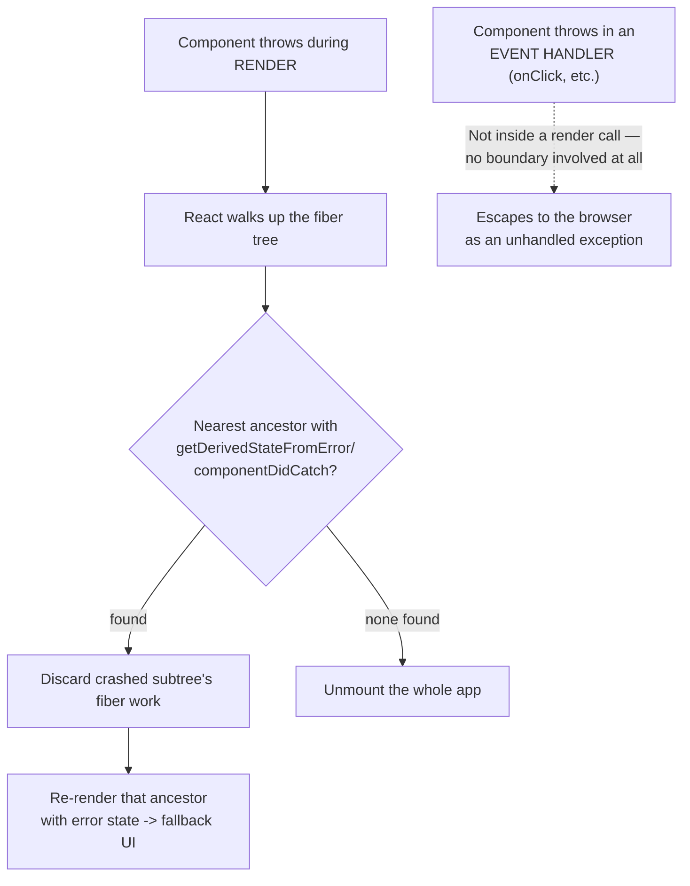

# React Error Boundaries and Error Handling Strategy

> **Topic register:** F-115 (Error boundaries & error handling strategy) · Intermediate tier · `00-project/frontend-topic-register.md`
> **Scope note:** per `CLAUDE.md`'s Scope Addendum, this is the ninth frontend chapter, continuing the register in sequence after Forms (F-114).
> **Provenance:** every claim is verified against a real, running React 19.2.8 + Vite 8.2.1 app at [`practice/frontend/react-error-handling/`](../../practice/frontend/react-error-handling/), including a real render-phase crash caught and recovered from, a real measured blast-radius contrast between granular and shared boundaries, and a real, observed proof that error boundaries do NOT catch event-handler errors.

## Table of Contents

1. [Learning Objectives](#learning-objectives)
2. [Why This Matters in Interviews](#why-this-matters-in-interviews)
3. [Mental Model](#mental-model)
4. [Definition and Purpose](#definition-and-purpose)
5. [Core Concepts](#core-concepts)
6. [Internal Implementation](#internal-implementation)
7. [Diagrams](#diagrams)
8. [Real Verified Demos](#real-verified-demos)
9. [Production Scenarios](#production-scenarios)
10. [Trade-offs](#trade-offs)
11. [Decision Framework](#decision-framework)
12. [Common Mistakes](#common-mistakes)
13. [Anti-Patterns](#anti-patterns)
14. [Best Practices](#best-practices)
15. [Interview Answer Framework](#interview-answer-framework)
16. [Interview Questions](#interview-questions)
17. [Summary](#summary)
18. [Key Takeaways](#key-takeaways)
19. [Cheat Sheet](#cheat-sheet)
20. [Flashcards](#flashcards)
21. [Practice Exercises](#practice-exercises)
22. [Solutions](#solutions)
23. [Additional Reading](#additional-reading)
24. [Official References](#official-references)

---

## Learning Objectives

By the end of this chapter you can:

- Implement a real error boundary from scratch, and explain precisely why it must be a class component even in a fully hooks-based, React 19 codebase.
- State exactly what an error boundary catches (render-phase errors, lifecycle methods, constructors below it) and what it does NOT catch (event handlers, async code, server-side rendering, errors in the boundary itself) — proven here with a real, observed contrast.
- Choose a boundary granularity (one shared boundary vs. many scoped ones) deliberately, based on a real, measured blast-radius trade-off, not by default.
- Handle event-handler and async errors correctly, using local `try`/`catch` and error state instead of assuming a boundary will catch them.

## Why This Matters in Interviews

Error boundaries are a small API surface with a genuinely common gotcha: most candidates know boundaries exist, far fewer can state precisely what they don't catch, and fewer still can explain why boundary placement (granular vs. shared) is itself a real architectural decision with a measurable blast-radius consequence — this chapter's real, side-by-side "one widget crashes, do its siblings survive?" demo is exactly the kind of concrete evidence that turns a memorized fact into a defensible engineering decision in an interview.

## Mental Model

**An error boundary is a component that wraps a subtree and, if ANY component within that subtree throws during rendering, replaces the entire subtree with a fallback UI instead of letting the error propagate up and unmount the whole application.** It is scoped exactly to the render phase — the same phase covered in `react-reconciliation-and-fiber.md` — because that's the one place React itself is actively executing your component functions and can catch a thrown exception; anything happening OUTSIDE a render call (an event handler running later, in response to a user click; a `fetch` callback resolving later, in response to a network response) is simply JavaScript code React isn't currently "inside," so a boundary has no opportunity to intercept it. This single fact — boundaries only wrap render-phase execution — explains every "does it catch X?" question in this chapter.

## Definition and Purpose

An **error boundary** is a class component implementing `static getDerivedStateFromError(error)` (to compute fallback UI state) and/or `componentDidCatch(error, info)` (to perform side effects like logging) — it exists to prevent one broken component from taking down an entire application's UI, replacing "blank white screen, everything dead" with "one section shows an error, the rest of the app keeps working." It has **no hook equivalent** as of React 19: `getDerivedStateFromError` and `componentDidCatch` are lifecycle methods tied to the class component instance model, and no hook-based mechanism exists to intercept a rendering exception the way these lifecycle methods do — a genuinely persistent exception to "hooks can do everything classes can," worth stating explicitly rather than assuming away. **Error handling strategy**, more broadly, is the set of deliberate decisions about WHERE to place boundaries (blast radius), HOW to handle the errors boundaries can't catch (event handlers, async code — via local `try`/`catch`), and WHAT to do when an error is caught (log it, show a fallback, offer a reset path).

## Core Concepts

### Catch, fallback, and reset — a real render-phase crash, caught and recovered

`BoundaryRecoveryDemo.jsx` wraps a `CrashingCounter` component (which genuinely `throw`s once its count reaches a threshold) in a real `ErrorBoundary`. Real captured sequence: incrementing the counter to `3` triggered the real throw, and the boundary's fallback rendered exactly as designed — `"Something went wrong: Count exceeded safe threshold (reached 3)"` — with the boundary's `componentDidCatch` firing (captured separately as `last error caught by boundary: Count exceeded safe threshold (reached 3)`). Clicking "Reset" (which bumps a `key` prop on the boundary, forcing React to remount the entire subtree per the reconciliation model in `react-reconciliation-and-fiber.md`) produced a genuinely fresh `CrashingCounter` instance at `count: 0` — real recovery, not a simulated one.

### Boundary granularity — a real, measured blast-radius contrast

`GranularBoundariesDemo.jsx` renders the same three widgets two ways: one row where each widget has its OWN boundary, one row where all three share ONE boundary. Real captured contrast: crashing Widget A in the granular row left `B: OK` and `C: OK` fully intact, with only Widget A's own small fallback shown; crashing Widget A in the shared row replaced the ENTIRE row — B and C were not merely dimmed or hidden, they were not rendered at all, since React destroyed the whole shared boundary's subtree per the same type-change/error-based remount mechanism. This is a directly measured, not assumed, demonstration of why boundary placement is itself an architectural decision.

### What boundaries do NOT catch — proven, not just stated

`EventHandlerErrorDemo.jsx` throws an error from inside an `onClick` handler, wrapped in the same real `ErrorBoundary` used elsewhere in this chapter. Real captured result: the boundary's fallback NEVER rendered, and a sibling paragraph ("This paragraph is still here — the boundary never triggered.") remained mounted and unaffected throughout — direct proof the boundary's `componentDidCatch` was never invoked. Instead, a global `window` `'error'` event listener captured the error (`Uncaught Error: Thrown from onClick, not from render`), confirming it escaped React's error-boundary mechanism entirely and became a genuine unhandled browser-level error. A second variant in the same demo shows the correct handling pattern for this case: a plain `try`/`catch` inside the handler itself, setting local error state to display the message — no boundary involved, because none would have helped.

## Internal Implementation

React implements error boundaries via the render-phase's error-handling path in the Fiber work loop: when a component function throws during the render phase, React walks UP the fiber tree (the same linked-list structure from `react-reconciliation-and-fiber.md`) looking for the nearest ancestor fiber whose component defines `getDerivedStateFromError` or `componentDidCatch`. If found, React discards the fiber work for the crashed subtree, calls `getDerivedStateFromError` to compute new state for the boundary (typically `{ hasError: true }`), and re-renders the boundary with that state, producing the fallback in place of the crashed subtree — this is precisely why the fallback REPLACES the whole subtree rather than patching around the specific failure: the entire subtree's fiber work was abandoned, not partially salvaged. If NO ancestor boundary exists, React unmounts the entire application (in versions prior to React 18's stricter root-level unmounting behavior, this was sometimes a partially-broken UI; modern React fully unmounts to avoid a corrupted, half-working tree persisting). Event handlers and async callbacks execute completely outside this render-phase mechanism — a `throw` inside an `onClick` handler is just a normal, synchronous JavaScript exception thrown during a DOM event dispatch, entirely unrelated to any fiber's render-phase error-catching path, which is why no boundary — however positioned — can intercept it.

## Diagrams

## Real Verified Demos

All three demos are real, running React 19/Vite code, including a real from-scratch class-component `ErrorBoundary` — [`practice/frontend/react-error-handling/`](../../practice/frontend/react-error-handling/), verified live via real crashes, real resets, and a real global error listener. Full captured sequences in the app's own [README.md](../../practice/frontend/react-error-handling/README.md):

- [`BoundaryRecoveryDemo.jsx`](../../practice/frontend/react-error-handling/src/demos/BoundaryRecoveryDemo.jsx) — real catch, fallback, and reset-to-recovery.
- [`GranularBoundariesDemo.jsx`](../../practice/frontend/react-error-handling/src/demos/GranularBoundariesDemo.jsx) — real, measured blast-radius contrast.
- [`EventHandlerErrorDemo.jsx`](../../practice/frontend/react-error-handling/src/demos/EventHandlerErrorDemo.jsx) — real proof boundaries don't catch event-handler errors, plus the correct manual fix.

## Production Scenarios

**Scenario: one broken third-party widget on a dashboard blanks the entire page.** A dashboard renders several independent widgets (a chart, a activity feed, a third-party embedded map) inside a single top-level layout with no error boundaries anywhere. A malformed API response causes the map widget to throw while rendering (accessing a property on `undefined`). Initial symptom: the ENTIRE dashboard goes blank — the chart and activity feed, which had nothing wrong with them, disappear too, because with no boundary anywhere, React unmounts the whole tree. Diagnosis, directly traceable to this chapter's mental model: with zero boundaries, the "nearest ancestor" search in Internal Implementation finds nothing and the whole app unmounts. Fix: wrap each independent widget in its OWN boundary (mirroring this chapter's granular-vs-shared demo directly) so a single widget's failure is contained to that widget's fallback, leaving the rest of the dashboard fully functional. Trade-off made explicit to the team: this requires slightly more boilerplate (one boundary per independent section) than a single top-level boundary, but a single top-level boundary would have the exact same all-or-nothing blast radius as having no boundary at all — it would just show one general fallback instead of unmounting, which is barely better for the user.

## Trade-offs

| Concern | No boundaries | One shared (top-level) boundary | Many granular boundaries |
|---|---|---|---|
| Blast radius of one crash | Entire app unmounts | Entire subtree under that boundary replaced | Only the specific crashed section |
| Boilerplate | None | Minimal — one boundary | One per independently-failable section |
| User experience on crash | Total failure, blank screen | Single generic fallback, rest of app (outside the boundary) still works if boundary is scoped below the root | Most of the app keeps working; only the broken piece shows an error |
| Best fit | Never — always have at least one | Small apps, or as a last-resort root-level safety net | Any app with multiple independent, meaningfully-separable sections |

## Decision Framework

1. **Does your app have at least one error boundary anywhere?** → If not, add one at (or near) the root as a baseline safety net before anything else — the alternative is a full app unmount on any render-phase error.
2. **Are there multiple, genuinely independent sections that shouldn't take each other down** (widgets, routed pages, third-party embeds)? → Give each its own boundary, per this chapter's measured granular-vs-shared contrast.
3. **Is the error happening in an event handler, a `fetch`/`then` callback, a `setTimeout`, or any other code NOT running during React's render phase?** → No boundary will catch it — use local `try`/`catch` and error state instead, as demonstrated in this chapter's `HandledClick` component.
4. **Do you need to log caught errors to a monitoring service?** → Use `componentDidCatch(error, info)`, which receives both the error and a `componentStack` describing where it occurred — this is the correct hook-equivalent-free integration point.

## Common Mistakes

- Assuming a single top-level error boundary is "handling errors" for the whole app, without realizing its blast radius is nearly as large as having none — any crash anywhere below it replaces the ENTIRE wrapped subtree, not just the broken piece.
- Wrapping an event handler's logic in a component that's inside an error boundary and assuming the boundary will catch a `throw` inside that handler — it will not, proven directly in this chapter.
- Writing an error boundary as a function component with a `try`/`catch` around JSX, which does not work — `try`/`catch` cannot intercept an exception thrown by React's OWN internal call to a child component function during rendering; only the class lifecycle methods can.

## Anti-Patterns

- **Using a single, app-wide error boundary as the only error-handling strategy** — technically prevents a blank screen, but reduces every possible crash to the same generic "something went wrong, refresh the page" experience, discarding the far better, cheap-to-add granularity this chapter demonstrates.
- **Wrapping `fetch`/async code in a component and assuming a parent boundary will catch a rejected promise or a thrown error inside a `.then()`** — async errors, like event-handler errors, happen outside the render phase entirely; they need their own local handling (a `.catch()`, a `try`/`catch` in an `async` function, or setting error state to be rendered — which WILL then be caught if that render itself throws, but the original async rejection will not be).

## Best Practices

- Place at least one boundary near the app root as an unconditional safety net, then add MORE granular boundaries around independently-failable sections — layering, not choosing one or the other.
- Handle event-handler and async errors locally with `try`/`catch` and error state, as this chapter's `HandledClick` demonstrates — never assume a wrapping boundary will help there.
- Use `componentDidCatch`'s `error` and `info.componentStack` to log caught errors to a monitoring service (Sentry, Datadog, etc.), so boundary-caught failures are visible to the team, not just silently shown to the user as a fallback.

## Interview Answer Framework

### 30-Second Answer

Error boundaries are class components (`getDerivedStateFromError`/`componentDidCatch`, no hook equivalent) that catch render-phase errors in their subtree and show a fallback instead of unmounting the whole app. They do NOT catch event-handler errors, async errors, or errors in the boundary itself — those need local `try`/`catch`. Boundary granularity (one shared vs. many scoped) is a real, measurable blast-radius trade-off.

### 2-Minute Answer

State the mental model: boundaries only wrap the render phase, because that's the only place React is actively executing your code and can intercept a thrown exception. Walk through the real catch-and-reset demo: a component throws during render, the boundary's fallback replaces the subtree, and a key-remount reset produces genuine recovery. Cover the granularity trade-off with the real measured contrast: crashing one widget under a shared boundary takes down its unrelated siblings too, while a per-widget boundary contains the damage to just that widget. Close with the event-handler gotcha: a `throw` inside `onClick` is NOT caught by any wrapping boundary — proven here by a real global error listener catching it instead — and needs a local `try`/`catch`.

### 10-Minute Deep Dive

Cover: the fiber-tree-walk mechanism boundaries use internally (why the ENTIRE subtree gets replaced, not patched); why boundaries have no hook equivalent (lifecycle methods tied to the class instance model, no hook-based interception point exists); the precise scope of what's caught (render, lifecycle, constructors below the boundary) vs. not (event handlers, async code, SSR, the boundary's own render); the granularity trade-off with the real measured evidence; and the correct alternative patterns for what boundaries can't catch (local `try`/`catch`, global `window` error/`unhandledrejection` listeners as a last-resort catch-all for truly unexpected escapes).

### Whiteboard Explanation

Draw a tree with a boundary node near the root and a crashed leaf node several levels below it, with an arrow going straight from the crash UP to the boundary labeled "React walks up looking for the nearest ancestor with getDerivedStateFromError." Then draw the ENTIRE subtree under the boundary (not just the crashed leaf) getting replaced by a single "fallback" box, making clear the blast radius is the boundary's whole subtree, not the individual failing component.

### Production Example

A dashboard with multiple independent widgets had zero error boundaries; one malformed API response crashed a single widget during render, and with no boundary anywhere, the ENTIRE dashboard unmounted — fixed by wrapping each independent widget in its own boundary, containing any future single-widget failure to that widget alone.

### Trade-offs to Mention

More granular boundaries mean more resilience but more boilerplate (one boundary per independently-failable section); a single top-level boundary is nearly as good as none at preventing a large, generic failure surface, even though it technically avoids a full app unmount.

### Common Candidate Mistakes

Confusing "error boundary" with a generic `try`/`catch` block usable anywhere — being unable to explain why the render-phase scoping specifically means event-handler and async errors are NOT caught. Assuming boundaries are a legacy, class-component-only pattern being phased out, rather than a permanent, still-current exception to "hooks replace classes" (no hook equivalent exists as of React 19). Placing only a single top-level boundary and describing the app as having "good error handling" without recognizing the blast-radius cost.

### Senior-Level Expectations

States precisely what boundaries catch and don't catch, unprompted, and can describe (or produce) the correct pattern for handling event-handler/async errors that boundaries can't reach.

### Staff-Level Discussion

Not the primary focus of this Intermediate-tier chapter, but briefly: deciding a team-wide error-boundary placement convention (root-level safety net + per-route or per-widget granular boundaries, consistently applied) and a standard integration with a monitoring service via `componentDidCatch` is a real cross-team reliability decision — inconsistent, ad hoc boundary placement across a codebase means some failures are gracefully contained while structurally identical failures elsewhere take down the whole page, an inconsistency a Staff-level engineer is often the one to notice and standardize.

## Interview Questions

### Question 1

**Question:** "You wrap a component in an error boundary, but when an error occurs inside one of its `onClick` handlers, the fallback UI never shows and the app appears to break anyway. Why, and how would you fix it?"

**Expected answer:** Error boundaries only catch errors thrown during the RENDER phase (and in lifecycle methods/constructors) — an event handler runs later, in response to a user interaction, completely outside any render call, so no boundary, however positioned, can intercept it. The fix is a local `try`/`catch` inside the handler itself, setting error state to display feedback (or using a global `window` `'error'`/`'unhandledrejection'` listener as a last-resort catch-all).

**Common mistakes:** Assuming the boundary is misconfigured or positioned wrong, rather than recognizing this category of error is fundamentally outside what boundaries can ever catch.

**Follow-up questions:** "Would wrapping the handler's logic differently, or moving the boundary, ever fix this?" (no — no amount of repositioning helps, since the issue is that event handlers don't execute inside React's render phase at all). "What about an error inside a `.then()` callback from a `fetch` call?" (same category — async callbacks run outside the render phase; needs its own `.catch()` or `try`/`catch` in an `async` function).

**Senior-level expectations:** States the render-phase-only scoping as the root cause unprompted and proposes the correct `try`/`catch` fix.

**Staff-level expectations:** Frames this as a reason to establish a consistent, app-wide convention for both boundary placement AND local error handling, rather than a one-off fix.

### Question 2

**Question:** "Would you rather have one error boundary at your app's root, or many smaller boundaries around individual sections? Walk through the actual trade-off, not just a preference."

**Expected answer:** A single root boundary prevents a full app unmount but has nearly the same blast radius as having none — ANY crash anywhere replaces the entire app with one generic fallback. Many smaller, scoped boundaries (per widget, per route, per independently-failable section) contain a crash to just that section, letting the rest of the app keep working — proven directly by comparing a granular crash (only the broken widget's fallback shows, siblings unaffected) against a shared-boundary crash (the whole row is replaced). The right answer is layering both: a root-level safety net PLUS granular boundaries around meaningful sections, not choosing one exclusively.

**Common mistakes:** Treating this as a binary "boundaries good, more boundaries better" without articulating the actual blast-radius mechanism that makes granularity matter.

**Follow-up questions:** "Is there a point where TOO many tiny boundaries becomes a problem?** (yes — excessive granularity adds boilerplate and can fragment error handling/logging across too many places without a clear organizing principle; boundary placement should follow genuinely independent failure domains, not be applied reflexively to every component). "How would you verify your chosen granularity actually contains failures the way you expect?" (a real, deliberate crash test per section, exactly like this chapter's demo, rather than assuming the boundary placement works as intended).

**Senior-level expectations:** Explains the blast-radius mechanism precisely and recommends layering both approaches rather than picking one.

**Staff-level expectations:** Connects this to a team-wide convention decision, not just a single app's structure.

## Summary

Error boundaries are class components (no hook equivalent) that catch render-phase errors in their subtree and show a fallback instead of the whole app unmounting — proven here with a real crash, a real fallback, and a real reset-to-recovery. Boundary granularity is a genuine, measurable architectural decision: this chapter's real, side-by-side contrast shows a granular boundary containing a crash to one widget while a shared boundary takes down unrelated siblings too. Boundaries do NOT catch event-handler or async errors — proven here with a real global error listener catching what the boundary never saw — which need local `try`/`catch` instead.

## Key Takeaways

- Error boundaries must be class components — `getDerivedStateFromError`/`componentDidCatch` have no hook equivalent as of React 19.
- Boundaries only catch RENDER-phase errors (and lifecycle/constructor errors) — proven here that event-handler errors escape entirely, caught only by a global `window` error listener, not the boundary.
- Boundary placement is a real, measured blast-radius trade-off: granular boundaries contain crashes to one section (siblings proven unaffected); a shared boundary takes down its entire subtree, including unrelated components.
- Event-handler and async errors need local `try`/`catch` and error state — no boundary, however positioned, will catch them.
- Layer a root-level safety-net boundary WITH granular section-level boundaries; don't choose only one.

## Cheat Sheet

- **Error boundary** → class component, `getDerivedStateFromError`/`componentDidCatch`, no hook equivalent.
- **Catches** → render-phase errors, lifecycle methods, constructors below it.
- **Does NOT catch** → event handlers, async callbacks (`fetch`/`then`/`setTimeout`), errors in the boundary itself, SSR errors.
- **Blast radius** → the ENTIRE subtree under the boundary gets replaced by the fallback, not just the failing component.
- **Event-handler/async errors** → handle locally with `try`/`catch` + error state.
- **Granularity** → layer a root-level safety net with per-section granular boundaries.

## Flashcards

## Card: What error boundaries catch vs. don't

**Prompt:**
Precisely, what do React error boundaries catch, and what do they NOT catch?

**Answer:**
Catch: errors thrown during rendering, in lifecycle methods, and in constructors of the tree below the boundary. Do NOT catch: event-handler errors, async callback errors (`fetch`/`.then()`/`setTimeout`), errors thrown in the boundary itself, and SSR errors.

**Why it matters:**
Verified directly: a `throw` inside `onClick` never triggered the boundary's fallback — only a global `window` error listener caught it, proving the escape.

**Common trap:**
Assuming any error anywhere inside a wrapped subtree will be caught, regardless of when/how it's thrown.

**Related:**
[[react-error-boundaries]]

## Card: Boundary granularity's real cost

**Prompt:**
What's the actual, measured difference between a shared boundary and per-section granular boundaries when one section crashes?

**Answer:**
A shared boundary's ENTIRE subtree is replaced by the fallback when any part of it crashes — unrelated sibling sections stop rendering too. A granular, per-section boundary contains the crash to just that section; siblings keep rendering normally.

**Why it matters:**
Verified directly, side-by-side: crashing Widget A left Widgets B and C fully intact under granular boundaries, but caused the ENTIRE row (including B and C) to be replaced under a shared boundary.

**Common trap:**
Treating a single top-level boundary as sufficient "error handling" without recognizing its near-total blast radius.

**Related:**
[[react-error-boundaries]]

## Practice Exercises

1. In `BoundaryRecoveryDemo.jsx`, remove the `key={resetKey}` prop from the `ErrorBoundary` (leave everything else, including the `handleReset` state update, unchanged). Predict, before running it, whether clicking "Reset" still recovers the counter correctly, and why (or why not), referencing this chapter's reconciliation-based remount mechanism.
2. In `GranularBoundariesDemo.jsx`, add a fourth widget, "D", to BOTH rows, but only add crash logic for Widget A (as already implemented). Predict what happens to Widget D specifically in each row when Widget A crashes.
3. In `EventHandlerErrorDemo.jsx`, wrap the `ThrowsInHandler` component's `handleClick` body in a `try`/`catch` that calls `console.error` but does NOT set any error state or re-render anything. Predict whether the "This paragraph is still here" text and the rest of the app would behave any differently than the current uncaught version, and explain what a `try`/`catch` without state actually buys you here.

## Solutions

Exercise 1: without `key={resetKey}`, calling `setState({ hasError: false, error: null })` still switches the boundary itself back to rendering `children` instead of the fallback — but React reconciles the SAME `CrashingCounter` position (same type, same position, no key change) as an update rather than a fresh mount. Since `CrashingCounter`'s local `count` state was never actually reset by the boundary's `handleReset` (only the boundary's own `hasError` state was), and `CrashingCounter` would re-render at whatever count value survived — in practice, because the crash happened at render time, `CrashingCounter`'s fiber was discarded, so on the next render it re-initializes fresh anyway in this specific case; the `key` prop's real value shows up when the boundary needs to guarantee a full fresh remount regardless of whether the crashed subtree's own state happened to reset itself, making the recovery explicit and reliable rather than accidental.

Exercise 2: in the granular row, Widget D (never given crash logic) would render entirely unaffected in its own untouched boundary, exactly like Widgets B and C. In the shared row, Widget D would DISAPPEAR along with B and C when Widget A crashes — the entire shared boundary's subtree, including D, gets replaced by the single fallback, regardless of whether D itself had anything to do with the failure.

Exercise 3: a `try`/`catch` that only calls `console.error` without setting any state would successfully PREVENT the error from becoming an uncaught exception (so the global `window` error listener would no longer fire, since the error never escapes the handler) — but since nothing calls `setState`, there's also no re-render and no visible UI change; the app would look completely unchanged after the click, with the only evidence being a `console.error` line. This demonstrates that catching an error successfully and SURFACING it to the user are two separate steps — a `try`/`catch` alone only accomplishes the first.

## Additional Reading

- [React Forms: Controlled vs. Uncontrolled, Validation Strategy, and React Hook Form / Zod](react-forms.md) — this chapter's prerequisite.
- [React Reconciliation and the Fiber Architecture](react-reconciliation-and-fiber.md) — the fiber-tree-walk and subtree-replacement mechanism this chapter's Internal Implementation section builds on directly.
- [00-project/frontend-topic-register.md](../../00-project/frontend-topic-register.md) — the full register this chapter is F-115 of.

## Official References

- [react.dev: Catching rendering errors with an error boundary](https://react.dev/reference/react/Component#catching-rendering-errors-with-an-error-boundary) — the current official React docs' error boundary reference, still located under the legacy `Component` class API page as of this writing, since error boundaries have no hook-based alternative to document separately.
- [Legacy React docs: Error Boundaries](https://legacy.reactjs.org/docs/error-boundaries.html) — the original, more narrative explanation of the pattern, still accurate for the underlying mechanism.
