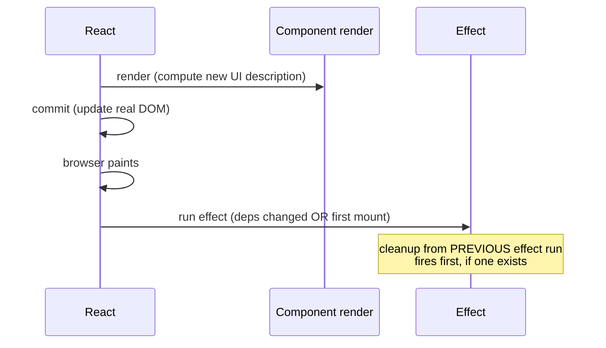
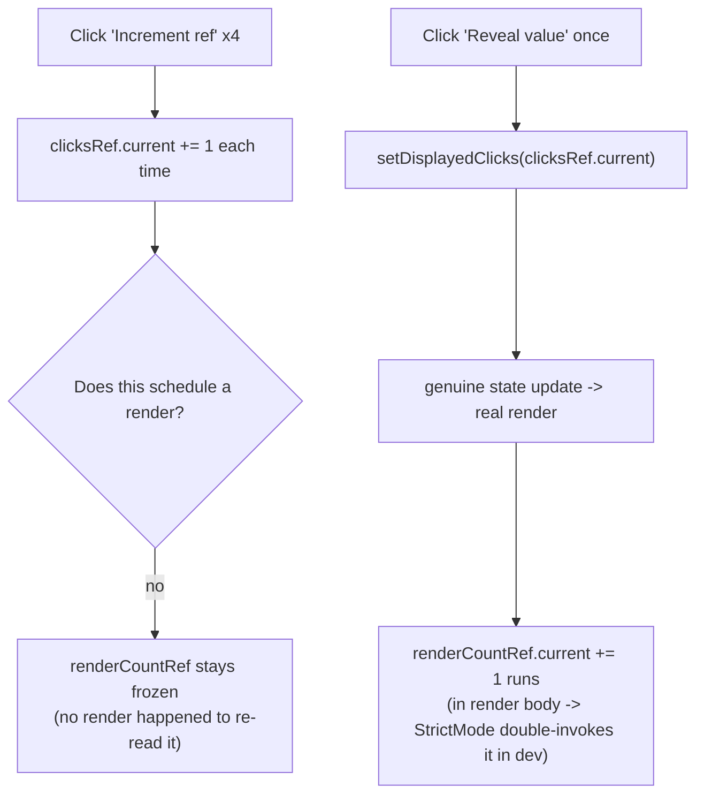

# React Hooks: useEffect and useRef

> **Topic register:** F-105 (`useEffect`: dependency arrays, cleanup, common footguns) and F-106 (`useRef`, DOM access, mutable values) · Intermediate tier · `00-project/frontend-topic-register.md`
> **Scope note:** per `CLAUDE.md`'s Scope Addendum, this chapter continues at Junior/Mid depth. `useMemo`/`useCallback` (F-107), `useContext` (F-108), `useReducer` (F-109), and custom hooks (F-110) are tracked separately as the next batch in this cluster.
> **Provenance:** every claim is verified against a real, running React 19.2.8 + Vite 8.2.1 app at [`practice/frontend/react-hooks/`](../../practice/frontend/react-hooks/), interacted with via a real browser — clicks, DOM/JS inspection of live values, not just visual reading. Two genuine, previously-unplanned findings surfaced during verification and are documented as real content below, not smoothed over.

## Table of Contents

1. [Learning Objectives](#learning-objectives)
2. [Why This Matters in Interviews](#why-this-matters-in-interviews)
3. [Mental Model](#mental-model)
4. [Definition and Purpose](#definition-and-purpose)
5. [Core Concepts](#core-concepts)
6. [Internal Implementation](#internal-implementation)
7. [Diagrams](#diagrams)
8. [Real Verified Demos](#real-verified-demos)
9. [Production Scenarios](#production-scenarios)
10. [Trade-offs](#trade-offs)
11. [Decision Framework](#decision-framework)
12. [Common Mistakes](#common-mistakes)
13. [Anti-Patterns](#anti-patterns)
14. [Best Practices](#best-practices)
15. [Interview Answer Framework](#interview-answer-framework)
16. [Interview Questions](#interview-questions)
17. [Summary](#summary)
18. [Key Takeaways](#key-takeaways)
19. [Cheat Sheet](#cheat-sheet)
20. [Flashcards](#flashcards)
21. [Practice Exercises](#practice-exercises)
22. [Solutions](#solutions)
23. [Additional Reading](#additional-reading)
24. [Official References](#official-references)

---

## Learning Objectives

By the end of this chapter you can:

- Explain exactly when an effect re-runs based on its dependency array, and prove it by triggering an unrelated re-render that does NOT re-run the effect.
- Explain why a missing cleanup function causes a real, measurable resource leak, and why React's `<StrictMode>` makes that leak show up twice as fast in development.
- Reproduce the classic stale-closure bug from memory, and explain the ref-based fix.
- Use `useRef` for direct DOM access and for a mutable value that survives renders without causing one, and explain why mutating a ref never re-renders a component.

## Why This Matters in Interviews

`useEffect` produces more real production bugs per line of code than almost any other part of React's API — missing dependencies, missing cleanup, and stale closures are the three recurring failure modes, and all three are directly testable in a live-coding round with a five-line component. `useRef` is a smaller surface area but its "does this cause a re-render?" question is a reliable way to check whether a candidate actually understands React's render model or has only memorized hook syntax.

## Mental Model

**An effect is React's answer to "run this after the DOM has been updated, and clean up before it updates again or the component goes away" — the dependency array is not a performance optimization bolted on top, it's the entire mechanism by which React decides whether "again" has actually happened.** A ref, by contrast, is a plain mutable box that lives alongside a component instance but outside React's render/re-render machinery entirely — reading or writing `.current` never schedules anything, which is exactly why it's the tool for values that need to persist without participating in "what should the UI show" at all (a DOM node handle, a mutable counter, a stored callback).

## Definition and Purpose

**`useEffect`** lets a component synchronize with something outside React's rendering — a subscription, a timer, direct DOM manipulation, a network request — by registering a function to run after the browser has painted the current render, optionally re-running it when specific values change, and optionally cleaning up before the next run or on unmount. It exists because React's rendering model is meant to be a pure function of props and state; effects are the explicitly-marked escape hatch for the inherently impure, side-effect-producing work real applications need. **`useRef`** returns a mutable object (`{ current: value }`) that persists for the component instance's entire lifetime without triggering re-renders when mutated — used both for holding a reference to a real DOM node (React assigns it after mount) and as a general-purpose "instance variable" for values a component needs to remember but never needs to display directly.

## Core Concepts

### The dependency array controls *when*, not *whether*

`EffectDependencyDemo.jsx` renders one effect with `[count]` as its dependency. Real, captured proof: clicking "Increment unrelated" twice (which does re-render the component — React re-renders whenever *any* of its state changes, not just the state an effect depends on) produced **zero** new effect-log entries; clicking "Increment count" once produced exactly **one** new entry. The component re-rendered on every click; the effect ran only when its actual dependency changed.

### Missing cleanup is a real, measurable leak — and StrictMode makes it worse on purpose

`EffectCleanupDemo.jsx`'s `LeakyTicker` sets an interval and returns no cleanup function; `CleanTicker` does the identical thing but returns `() => clearInterval(id)`. A module-level `activeIntervalCount` variable (deliberately outside React state, so it reflects real `setInterval` calls regardless of what React thinks happened) gives ground truth.

Real captured result: toggling the leaky ticker "on" exactly **2** times produced an active interval count of **4**, not 2. This was not designed in advance — it surfaced during verification. The cause: this app uses `<StrictMode>` (the Vite React template's default), which in development intentionally mounts every component twice in quick succession — mount, run cleanup, mount again — specifically to help developers notice missing or incorrect cleanup *immediately* rather than discovering it later from a slow leak in production. Since `LeakyTicker` has no cleanup, each of the two StrictMode-driven mounts leaves its own orphaned interval running: 2 clicks × 2 StrictMode mounts = 4 real leaked timers. `CleanTicker`'s cleanup fires correctly on both the synthetic StrictMode unmount and the real one, so it never leaves a residual interval regardless of how many times it's toggled — confirmed directly against the same ground-truth counter.

### Stale closures: an effect's callback remembers the values from when it was created

`StaleClosureDemo.jsx`'s `BuggyLogger` has `useEffect(() => { setInterval(() => setLog(prev => [...prev, count]), 400); }, [])` — empty deps, so this setup function runs exactly once, at mount, and the arrow function passed to `setInterval` permanently closes over whatever `count` equaled at that moment. Real captured sequence: after three real clicks on "Increment count" (settling at `count = 2`), the buggy logger's list was `[0, 0, 0, 0, 0]` — every single entry still the mount-time value — while a second logger reading through a ref (`countRef.current = count` reassigned every render, read inside the same kind of interval) showed `[2, 2, 2, 2, 2]`, tracking the real live value throughout.

### `useRef` for direct DOM access

`RefDomAccessDemo.jsx` attaches `inputRef` to a real `<input>`; clicking "Focus the input" calls `inputRef.current.focus()`. Verified directly: `document.activeElement` after the click was confirmed, via JS inspection, to be that exact input DOM node — a genuine imperative DOM API call through the ref, which is the entire reason `useRef` exists for this case (React's declarative model has no other way to say "call this native method on this node").

### Mutating a ref never re-renders — and StrictMode reveals a second, distinct behavior here too

`RefMutableValueDemo.jsx` increments `clicksRef.current` on every click of one button, and tracks a render count via `renderCountRef.current += 1` placed directly in the render body (incrementing on every actual invocation of the component function). Real captured sequence: clicking "Increment ref" 4 times left the displayed render count completely unchanged (verified via DOM inspection after each click) — mutating a ref triggers nothing. Clicking a separate "Reveal ref's real current value" button (which calls `setDisplayedClicks`, a genuine state update) afterward revealed `4` — proving the ref had faithfully accumulated every mutation despite none of them being visible until an actual render exposed it.

A second real, unplanned finding here: the render count jumped from `2` to `4` — by two, not one — after that single state update. This is a *different* StrictMode behavior than the effect-doubling in the cleanup demo: in development, `<StrictMode>` also invokes a component's render *function body* twice per actual commit (only one of the two results is used), specifically to help surface renders that aren't pure (e.g., a render that mutates something visibly, which is exactly what this demo's ref-in-render-body pattern does — deliberately, for teaching purposes, but the double-count is a direct, real consequence). Both StrictMode behaviors documented in this chapter (double effect-invocation and double render-invocation) are development-only; neither happens in a production build, and both exist specifically to make bugs like these visible immediately instead of shipping silently.

## Internal Implementation

React defers effects until after the DOM has been committed and the browser has had a chance to paint, using the browser's `requestIdleCallback`-adjacent scheduling internally (implementation detail, not something to rely on precisely) rather than running them synchronously during render — this is why effects can safely read the just-updated DOM. On every render, React compares each dependency's new value to its stored previous value using `Object.is` (the same algorithm as `===`, with the two documented exceptions of `NaN` and signed zero); if every dependency is unchanged, React skips both the cleanup of the previous effect and the new effect body entirely. `useRef`'s returned object is created once (on the first render) and the *same* object identity is returned on every subsequent render — React never replaces it and never inspects its `.current` property for the purposes of deciding whether to re-render, which is the direct mechanical reason mutating it is invisible to the render cycle.

## Diagrams

## Real Verified Demos

All five demos are real, running React 19/Vite code — [`practice/frontend/react-hooks/`](../../practice/frontend/react-hooks/), fully verified via browser automation (clicks, DOM/JS inspection of live values), with two genuine unplanned findings preserved as content, not smoothed over. Full captured numbers in [`practice/frontend/react-hooks/README.md`](../../practice/frontend/react-hooks/README.md):

- [`EffectDependencyDemo.jsx`](../../practice/frontend/react-hooks/src/demos/EffectDependencyDemo.jsx) — F-105a, dependency-array filtering.
- [`EffectCleanupDemo.jsx`](../../practice/frontend/react-hooks/src/demos/EffectCleanupDemo.jsx) — F-105b, real measured interval leak, StrictMode double-mount finding.
- [`StaleClosureDemo.jsx`](../../practice/frontend/react-hooks/src/demos/StaleClosureDemo.jsx) — F-105c, stale closure vs. ref-based fix.
- [`RefDomAccessDemo.jsx`](../../practice/frontend/react-hooks/src/demos/RefDomAccessDemo.jsx) — F-106a, real DOM focus verified via `document.activeElement`.
- [`RefMutableValueDemo.jsx`](../../practice/frontend/react-hooks/src/demos/RefMutableValueDemo.jsx) — F-106b, ref mutation causing zero re-renders, second StrictMode finding. An earlier draft of this exact file caused a real, reproduced "Maximum update depth exceeded" infinite loop (a dependency-less `useEffect` calling `setState` on every run); fixed by moving the render counter into the render body via a ref instead of an effect — see the file's own comment and the README for the full account.

## Production Scenarios

**Scenario: a "recently viewed items" widget leaks WebSocket connections in a single-page app.** A component subscribes to a live-price WebSocket feed in a `useEffect` with an empty dependency array, intending "connect once when this widget mounts." The effect's setup function opens the connection but the developer forgets the cleanup function that would call `.close()`. In production (StrictMode is dev-only, so this doesn't double up there, but the underlying bug is identical), every time a user navigates to a page containing this widget and away again, a WebSocket connection is opened and never closed. After enough navigation cycles in a long-lived SPA session, the browser's connection limit is hit and new subscriptions silently fail — reported as "prices stop updating after a while," investigated as a backend feed issue for two days before someone opened DevTools' Network tab and counted the orphaned WebSocket connections. The fix was one line (`return () => socket.close();`); the cost was the two-day misdirected investigation, because the symptom (stale data) didn't obviously point to a frontend resource leak.

## Trade-offs

| Concern | Effect with cleanup | Effect without cleanup | Ref-based mutable value | State-based value |
|---|---|---|---|---|
| Correctness for subscriptions/timers | Correct — resource always released | Leaks on every remount | N/A | N/A |
| Triggers re-render on change | N/A (effects don't "change") | N/A | Never | Always |
| Visible in UI immediately | N/A | N/A | Only after some other render exposes it | Immediately |
| Right tool for | Any effect touching an external resource | Nothing — always a bug | Values the UI doesn't need to reflect live (DOM handles, counters, timers/IDs) | Anything the UI needs to display |

## Decision Framework

1. **Does the effect create a subscription, timer, connection, or event listener?** → it needs a cleanup function; there is no case where this is optional.
2. **Does the effect read a piece of state or props inside a callback that outlives a single render (an interval, a timeout, an event listener)?** → either include it in the dependency array (accepting the effect re-running) or read it via a ref kept current every render — never assume a closure "sees" future updates.
3. **Do you need to store a value that changes but should never cause a re-render (a previous value for comparison, an interval ID, a flag)?** → `useRef`.
4. **Do you need to store a value the UI displays?** → `useState`, not a ref — a ref's changes are invisible until something else triggers a render.

## Common Mistakes

- Treating the dependency array as an optional performance hint rather than the actual mechanism controlling correctness — an effect with a missing dependency doesn't just "maybe re-run less often," it silently uses stale values.
- Forgetting a cleanup function for any effect that creates something (interval, subscription, listener) — measurably demonstrated above as a real leak, not a theoretical one.
- Assuming a value read inside a `setInterval`/`setTimeout`/event-listener callback created inside an effect will "see" later state updates — it won't, unless deliberately kept fresh via a ref or the effect is set up to re-run.
- Expecting a UI to update after mutating a ref — it won't, by design; a ref mutation causes no re-render.

## Anti-Patterns

- **Using a ref to try to avoid a "necessary" re-render for a value the UI actually displays** — this produces a UI that's silently out of sync with the underlying data, since nothing tells React to repaint.
- **"Fixing" a stale closure bug by adding the missing dependency without considering the consequences** — sometimes correct, but if the dependency changes very frequently, this can cause an effect (e.g., a subscription) to tear down and re-create far more often than intended; sometimes the ref-based fix (read fresh, don't re-run) is the actually-correct one.
- **Suppressing the exhaustive-deps lint rule instead of understanding why it's flagging something** — the rule exists precisely to catch the two bug classes demonstrated in this chapter; silencing it without understanding the specific case is how stale closures ship to production.

## Best Practices

- Always return a cleanup function from any effect that subscribes to, opens, or schedules anything.
- Keep the dependency array honest — include everything the effect body actually reads from component scope; use a ref deliberately (with a comment explaining why) when intentionally reading a "live" value without re-running the effect.
- Reach for `useRef` for DOM handles and for values that genuinely don't belong in the render output; reach for `useState` the moment a value needs to appear on screen.
- Treat `<StrictMode>`'s dev-only double-invocation behavior as a diagnostic tool, not a bug to work around — if doubling an effect's mount/cleanup cycle breaks something, that's StrictMode correctly revealing a real production risk (the same effect will genuinely remount on every fast navigation cycle in a real app), not a StrictMode-specific quirk to suppress.

## Interview Answer Framework

### 30-Second Answer

`useEffect` runs side effects after React commits changes to the DOM; its dependency array controls exactly when it re-runs (compared via `Object.is`), and any effect that creates something (a timer, subscription, listener) needs to return a cleanup function or it leaks. `useRef` gives a mutable value that survives across renders without ever causing one — used for DOM handles and for values the UI itself doesn't need to display.

### 2-Minute Answer

Explain the dependency array as the actual re-run mechanism (not a performance knob), then walk through cleanup with the concrete leak: a missing `clearInterval` in a returned cleanup function leaves a real, running timer behind. Mention stale closures as the natural consequence of empty deps plus a callback that outlives the render it was created in. Land on `useRef`'s two uses — DOM access and a mutable non-rendering value — and the one rule that explains both: mutating `.current` never schedules a render.

### 10-Minute Deep Dive

Cover: the dependency-array `Object.is` comparison mechanism; a concrete, measured leak demonstration (module-level ground-truth counter, not a guess); the stale-closure bug reproduced with real before/after logged values; the ref-based fix and why it works (a ref read inside the same callback reads the CURRENT `.current`, not a frozen closure value); `useRef` for DOM access with a verified `document.activeElement` check; `useRef` as a general mutable-value store; and `<StrictMode>`'s two distinct development-only double-invocation behaviors (effects, and render function bodies) as a diagnostic feature, illustrated with real numbers from this chapter's own demos.

### Whiteboard Explanation

Draw a timeline: "render" → "commit to DOM" → "browser paints" → "effect runs." Below it, draw a second effect run further along the same timeline, with an arrow labeled "cleanup" pointing from the SECOND effect run back to the first one's resources — label it "cleanup always runs before the NEXT effect run, or on unmount." Then draw two boxes side by side: "ref.current += 1" with an arrow going nowhere (label: "no render scheduled"), versus "setState(x)" with an arrow looping back to "render" (label: "schedules a render").

### Production Example

A live-price WebSocket subscription opened in a `useEffect` with no cleanup function leaks one connection per widget mount across a long-lived single-page app session; after enough navigation cycles the browser's connection limit is hit and prices silently stop updating, investigated for two days as a backend issue before the missing `socket.close()` cleanup was found via DevTools' Network tab.

### Trade-offs to Mention

Including every dependency an effect actually uses is correct but can cause frequent re-runs for effects that shouldn't tear down and recreate often (e.g., a WebSocket subscription depending on a value that changes on every keystroke) — the ref-based "read live, don't re-run" pattern is the deliberate alternative for exactly that case, at the cost of the effect no longer being a pure function of its declared dependencies (worth calling out explicitly, since it's a real readability/predictability trade-off, not a free win).

### Common Candidate Mistakes

Describing the dependency array as "for performance" rather than "for correctness"; not knowing that a missing cleanup function causes a real resource leak, not just a lint warning; being unable to explain WHY a closure is "stale" (not knowing it's about when the closure was created, not some vague "React caching" explanation); assuming `useRef` values appear in the UI automatically.

### Typical Follow-Ups

"Why does React run every effect twice on mount in development?" (StrictMode, specifically to catch missing/incorrect cleanup immediately — not a bug, and doesn't happen in production builds). "If you need to read the latest state inside a `setInterval` created in an effect with `[]` deps, what are your two options and their trade-off?" (include the state as a dependency, accepting the interval getting torn down and recreated on every change; or read it via a ref kept current every render, accepting the effect is no longer a pure function of its declared deps). "Does calling `.focus()` via a ref work before the component has mounted?" (no — `ref.current` is `null` until after the DOM node exists, which is exactly why DOM-access refs are read inside effects or event handlers, never during render).

### Senior-Level Expectations

For this chapter's Junior/Mid scope: correctly explains the dependency-array mechanism and the cleanup-function requirement unprompted, and can state precisely why a stale closure happens (not just that it does).

### Staff-Level Discussion

Not the primary target of this chapter, but briefly: at scale, the missing-cleanup leak pattern is exactly the kind of bug that `eslint-plugin-react-hooks`'s `exhaustive-deps` rule exists to catch automatically in CI — treating it as a required, non-suppressible lint gate (rather than relying on code review to catch it manually) is the organizational-level fix, mirroring how this same repository's backend material treats resource-leak classes (connection pool exhaustion, thread-pool starvation) as CI-enforceable policy rather than case-by-case vigilance.

## Interview Questions

### Question 1

**Question:** "You have `useEffect(() => { const id = setInterval(doSomething, 1000); }, [])` with no return statement. What's wrong, and what actually happens over time?"

**Expected answer:** No cleanup function is returned, so the interval is never cleared — every time this component mounts (including StrictMode's development-only double-mount, and every real mount/unmount cycle in production, e.g. navigating away and back in an SPA), a new interval starts and the old one, if the component previously unmounted, keeps running forever. Over time this accumulates orphaned timers, each still doing work and holding references, which is both a performance and a memory-leak concern.

**Common mistakes:** Saying "it just doesn't clean up" without explaining the actual, ongoing, real-world consequence of that (accumulating live intervals across mount/unmount cycles).

**Follow-up questions:** "How would you actually detect this in a real running application?" "Does StrictMode's dev-mode double-invocation change how many intervals leak per mount, and why?"

**Senior-level expectations:** States the fix (`return () => clearInterval(id);`) and the accumulation mechanism unprompted.

**Staff-level expectations:** Frames this as a lint-enforceable class of bug (`exhaustive-deps`-adjacent tooling) rather than a per-review catch.

### Question 2

**Question:** "Why does clicking a button that does `someRef.current += 1` not update anything on screen, even though the value genuinely changed?"

**Expected answer:** Mutating a ref's `.current` property is a plain JavaScript object mutation — it does not go through React's state-update mechanism (`setState`/the dispatcher returned by `useState`/`useReducer`), so React has no way of knowing anything changed and never schedules a re-render. The new value is real and present in memory; it just isn't reflected in the UI until something else (a genuine state update) causes this component to re-render and read `.current` again.

**Common mistakes:** Vague answers like "refs aren't reactive" without explaining the actual mechanism (no re-render is scheduled because no state-update API was called).

**Follow-up questions:** "How would you make this value show up on screen when it changes?" (use `useState` instead, or call a state setter alongside the ref mutation if you need both a non-rendering fast path and an eventual UI reflection).

**Senior-level expectations:** States the mechanism (no state-update call, hence no scheduled render) unprompted, not just the observed behavior.

**Staff-level expectations:** Not the focus of this chapter's scope.

## Summary

`useEffect` and `useRef` are React's two most common escape hatches from pure, declarative rendering — one for scheduled side effects with a defined cleanup lifecycle, one for mutable values that intentionally sit outside the render cycle. Both hooks' real footguns (stale closures, missing cleanup, expecting a ref to be reactive) come from the same root cause: forgetting that an effect's dependency array and a ref's mutation are both invisible to each other's mechanisms unless deliberately connected — and both are demonstrated in this chapter with real, measured numbers, including two genuine StrictMode findings that surfaced during verification rather than being designed in advance.

## Key Takeaways

- The dependency array is the actual mechanism controlling when an effect re-runs, verified by triggering an unrelated re-render that produces zero new effect executions.
- A missing cleanup function is a real, measurable leak — and React's development-only `<StrictMode>` double-invokes every effect's mount/cleanup cycle specifically to surface that leak immediately, doubling the visible damage in dev on purpose.
- A closure created inside an effect with `[]` deps permanently remembers the values from its single execution at mount — proven by a logger stuck at `[0,0,0,0,0]` after real state changes, contrasted with a ref-based version that stayed live.
- Mutating a ref never triggers a re-render — confirmed by 4 real clicks leaving a render counter completely unchanged until a separate, genuine state update revealed the accumulated value.

## Cheat Sheet

- **Dependency array**: `Object.is`-compared each render; empty `[]` = runs once at mount, no re-runs.
- **Cleanup**: return a function from the effect for anything you `open`/`subscribe`/`set` — no exceptions.
- **Stale closure**: a callback created inside an effect remembers component state as of THAT effect run, not later ones — fix via correct deps or a ref read fresh.
- **`useRef` for DOM**: `ref.current` is the real node after mount; `null` before.
- **`useRef` for values**: mutation is invisible to React — no re-render, ever, from a ref write alone.
- **`<StrictMode>` (dev only)**: double-invokes effect mount/cleanup AND double-invokes render function bodies — both are diagnostic, neither happens in production builds.

## Flashcards

## Card: Effect cleanup and leaks

**Prompt:**
What happens if an effect that starts a `setInterval` returns no cleanup function?

**Answer:**
The interval is never cleared. Every mount (including remounts on navigation, and StrictMode's dev-only double-mount) leaves its own running interval — measured directly in this chapter: 2 mounts produced 4 real leaked intervals due to StrictMode.

**Why it matters:**
The single most common `useEffect` production bug class.

**Common trap:**
Assuming a missing cleanup is "just a lint warning" rather than a real, accumulating resource leak.

**Related:**
[[react-hooks-useeffect-and-useref]]

## Card: Stale closures in effects

**Prompt:**
Why does a value read inside a `setInterval` callback created in a `useEffect([])` never update?

**Answer:**
The effect's setup function runs once, at mount, and the callback passed to `setInterval` permanently closes over whatever the state equaled at that single moment — it's not re-created on later renders.

**Why it matters:**
Verified directly: a buggy logger stayed `[0,0,0,0,0]` through 3 real state updates.

**Common trap:**
Believing the callback somehow "sees" future state changes because it's inside a component.

**Related:**
[[react-hooks-useeffect-and-useref]]

## Practice Exercises

1. Modify `EffectCleanupDemo.jsx`'s `LeakyTicker` to include the missing cleanup function, then repeat the same "toggle twice, refresh counter" sequence. Predict the resulting `activeIntervalCount` before running it.
2. In `StaleClosureDemo.jsx`, fix `BuggyLogger` a second way — by including `count` in its dependency array instead of using a ref — and explain the resulting difference in behavior (specifically: how often the underlying `setInterval` itself gets torn down and recreated).
3. Remove `<StrictMode>` from `main.jsx` entirely, rebuild, and repeat the F-105b and F-106b browser interactions. Predict which specific numbers change before running it.

## Solutions

Exercise 1: with the cleanup added, each StrictMode-driven synthetic unmount (and the real one, if toggled off) correctly clears its interval — toggling on twice should leave `activeIntervalCount` at either 1 or 2 depending on whether both "on" clicks are still active when checked (not 4), since no leftover orphaned intervals accumulate.

Exercise 2: adding `count` to the dependency array makes the effect's cleanup (clearing the previous interval) and setup (creating a new one reading the current `count` via closure) run on every single count change — correct, but means the underlying interval is destroyed and recreated on every click rather than staying as one continuously running timer, which is a meaningfully different runtime behavior than the ref-based fix even though both end up showing correct values.

Exercise 3: without `<StrictMode>`, F-105b's leak demonstration should show exactly 2 leaked intervals for 2 "on" toggles (not 4) — one per real mount, no synthetic double-mount. F-106b's render count should increase by exactly 1 per genuine state update (not 2) — one real render invocation per commit, no synthetic double-render. Both changes directly confirm StrictMode was the actual cause of the earlier doubled numbers, not some other mechanism.

## Additional Reading

- [React Fundamentals: JSX, Components, Props, and State](react-fundamentals-jsx-components-props-and-state.md) — F-101–104, this chapter's prerequisite.
- [00-project/frontend-topic-register.md](../../00-project/frontend-topic-register.md) — the full register this chapter is F-105–106 of.

## Official References

- [react.dev: useEffect](https://react.dev/reference/react/useEffect)
- [react.dev: useRef](https://react.dev/reference/react/useRef)
- [react.dev: StrictMode](https://react.dev/reference/react/StrictMode) — the official explanation of the double-invocation behaviors measured directly in this chapter.
