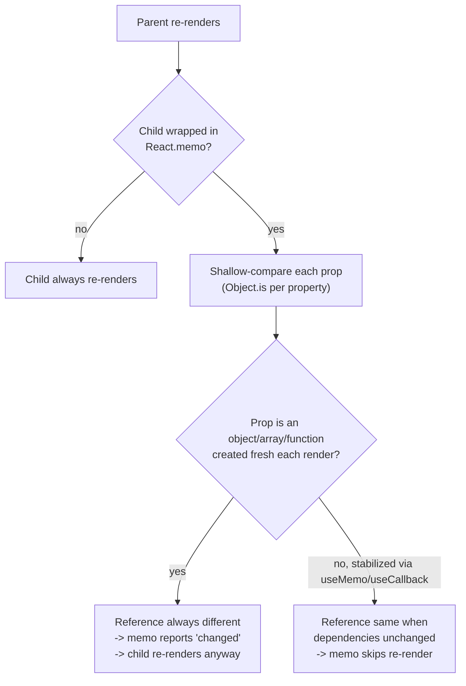

# React Performance: Profiling, Memoization Strategy, Virtualization, and Code-Splitting

> **Topic register:** F-117 (Performance — profiling with React DevTools, memoization strategy, virtualization for large lists, code-splitting with `React.lazy`) · Advanced tier · `00-project/frontend-topic-register.md`
> **Scope note:** per `CLAUDE.md`'s Scope Addendum, this is the eleventh frontend chapter, continuing the register in sequence after Accessibility (F-116) and returning to Advanced tier.
> **Provenance:** every claim is verified against a real, running React 19.2.8 + Vite 8.2.1 app at [`practice/frontend/react-performance/`](../../practice/frontend/react-performance/), including a real DOM-node-count contrast (5,000 vs. 15 nodes for the same logical list), a real reproduced case of `React.memo` silently failing, and a real network trace proving a lazy-loaded chunk is fetched on demand.

## Table of Contents

1. [Learning Objectives](#learning-objectives)
2. [Why This Matters in Interviews](#why-this-matters-in-interviews)
3. [Mental Model](#mental-model)
4. [Definition and Purpose](#definition-and-purpose)
5. [Core Concepts](#core-concepts)
6. [Internal Implementation](#internal-implementation)
7. [Diagrams](#diagrams)
8. [Real Verified Demos](#real-verified-demos)
9. [Production Scenarios](#production-scenarios)
10. [Trade-offs](#trade-offs)
11. [Decision Framework](#decision-framework)
12. [Common Mistakes](#common-mistakes)
13. [Anti-Patterns](#anti-patterns)
14. [Best Practices](#best-practices)
15. [Interview Answer Framework](#interview-answer-framework)
16. [Interview Questions](#interview-questions)
17. [Summary](#summary)
18. [Key Takeaways](#key-takeaways)
19. [Cheat Sheet](#cheat-sheet)
20. [Flashcards](#flashcards)
21. [Practice Exercises](#practice-exercises)
22. [Solutions](#solutions)
23. [Additional Reading](#additional-reading)
24. [Official References](#official-references)

---

## Learning Objectives

By the end of this chapter you can:

- Explain why `React.memo` can silently fail to prevent re-renders, and prove it with a real, reproducible case rather than a theoretical warning.
- Implement basic list virtualization from scratch, and prove — with a real DOM node count — the dramatic difference between rendering all items vs. only the visible window.
- Use `React.lazy` and `Suspense` for real code-splitting, and verify the resulting chunk both in build output and in a live network trace.
- Approach performance work as a measure-first discipline (profiling, DOM counts, network traces, bundle output), not as applying optimizations reflexively.

## Why This Matters in Interviews

Performance questions reward candidates who can back a claim with a number — "I'd add `React.memo`" is a common, shallow answer; "I'd add `React.memo`, verify the prop references are actually stable, and confirm with a render counter that the re-render count actually dropped" is the kind of answer this chapter is built to produce, directly mirroring the measure-first discipline this repository applies to every performance claim on the backend side too (`performance-and-load-testing-methodology.md`).

## Mental Model

**Every technique in this chapter attacks a different cost: memoization reduces WORK PER RENDER by skipping unnecessary re-computation or re-rendering; virtualization reduces the NUMBER OF DOM NODES that exist at all for a large list; code-splitting reduces the amount of JAVASCRIPT DOWNLOADED AND PARSED before the user can interact with a given part of the page.** They are not interchangeable and not a checklist to apply everywhere — each is a response to a SPECIFIC, MEASURED cost, and applying one where a different cost is the actual bottleneck (or applying any of them without ever measuring) is itself a common, real mistake this chapter's demos are built to make visible.

## Definition and Purpose

**Memoization** in React (`React.memo`, `useMemo`, `useCallback`) is the practice of reusing a previous render's output/value/function reference rather than recomputing it, when the inputs haven't meaningfully changed — it exists to skip genuinely unnecessary work, but ONLY works correctly when the comparison it relies on (a shallow prop/dependency comparison) actually reflects "did anything relevant change," which requires stable references, not just semantically-equal values. **Virtualization** (a.k.a. "windowing") is rendering only the subset of a large list that's actually visible (plus a small overscan buffer), tracking scroll position to swap which subset is rendered — it exists because DOM nodes are expensive (memory, layout, paint cost) regardless of whether React itself re-renders them, so a 5,000-item always-fully-rendered list pays that cost permanently even when 4,980 of those items are scrolled out of view. **Code-splitting** via `React.lazy` + dynamic `import()` breaks a single JavaScript bundle into multiple chunks loaded on demand — it exists because shipping every route/feature's code up front, even the parts a given user session never visits, delays the time until the page's INITIAL, actually-needed code is downloaded, parsed, and interactive.

## Core Concepts

### Memoization strategy: `React.memo` can silently fail, proven with a real reproduction

`MemoizationStrategyDemo.jsx` wraps a child component in `React.memo` and passes it a `config` prop two ways: as an inline object literal (`{ label: 'static' }`, recreated fresh every parent render) and as a `useMemo`-stabilized reference. Real captured result across several clicks of an unrelated parent state update: the unstable-object version's child render count kept CLIMBING (2 → 4 → ... → 10, one increment per unrelated parent re-render); the stabilized version's child render count stayed FROZEN at 2 for the entire sequence. `React.memo` performs a SHALLOW comparison of props — a new object literal is a new reference every render regardless of its contents being identical, so the comparison always reports "props changed," and `memo` provides zero benefit despite being present in the code. This is not a rare edge case; it's the single most common way `React.memo` fails silently in real codebases.

### Virtualization: a real, measured DOM-node-count contrast

`VirtualizedListDemo.jsx` renders the same 5,000-item array two ways: naively (every item as a real DOM node) and through a small, from-scratch windowed implementation (tracking `scrollTop`, computing a visible index range, rendering only that range plus a small overscan). Real captured result via direct DOM querying: the naive list mounted exactly `5000` row nodes; the virtualized list mounted exactly `15`. Scrolling the virtualized list (`scrollTop = 2000`) and re-querying confirmed the count STAYED at `15` but the actual rendered rows shifted to `Row 68` through `Row 82` — direct proof the window tracks scroll position rather than being a fixed first-N cap that would break as soon as the user scrolled.

### Code-splitting: a real chunk, verified in build output AND a live network trace

`CodeSplittingDemo.jsx` lazy-loads `HeavyPanel.jsx` via `React.lazy(() => import('./HeavyPanel'))`, wrapped in `Suspense`, rendered only after a button click. Real evidence, gathered two independent ways: (1) `npm run build` output shows `HeavyPanel-6npn3ADo.js` as its own, separate chunk file, distinct from the main bundle; (2) a live network trace confirmed ZERO request for `HeavyPanel.jsx` before the button was clicked, and a real `GET .../HeavyPanel.jsx → 200 OK` request appearing only immediately after the click. Both the production bundling behavior and the runtime on-demand-fetch behavior were independently confirmed, not assumed from `React.lazy`'s documented behavior alone.

## Internal Implementation

`React.memo` wraps a component and, on each render attempt, shallow-compares the new props object's OWN enumerable properties against the previous render's props, key by key, using `Object.is` (the same comparison `useMemo`/`useCallback` dependency arrays use) — critically, this comparison happens PER PROPERTY, not on the props object as a whole, but each individual property comparison is still reference-based for objects/arrays/functions, which is exactly why a fresh object literal per render defeats it even though its CONTENTS are identical. `useMemo(fn, deps)` caches `fn`'s return value across renders, only recomputing when a value in `deps` changes by `Object.is` — passing its output as a prop gives that specific value (not just its content) a stable identity `React.memo` can actually detect as unchanged. Virtualization has no special React API — it's a direct application of conditional rendering: computing `startIndex`/`endIndex` from `scrollTop`, slicing the source array to just that range, and rendering ONLY those elements, with a full-height spacer (`height: itemCount * rowHeight`) so the scrollbar behaves as if all items existed, and an absolutely-positioned inner wrapper offset by `startIndex * rowHeight` so the rendered subset appears at the correct scroll position. `React.lazy(() => import(path))` wraps a dynamic `import()` call, which bundlers (Vite/Rollup, webpack) recognize as a code-splitting boundary at BUILD time, emitting the imported module and its exclusive dependencies as a separate chunk file; at RUNTIME, `React.lazy`'s returned component throws the still-pending import promise on first render (the same `use()`-adjacent mechanism from `react-concurrent-rendering.md`'s Suspense material), which the nearest `Suspense` boundary catches, rendering its `fallback` until the dynamic `import()` actually resolves — at which point the browser issues the real network request for that chunk, exactly the moment this chapter's network trace captured.

## Diagrams

## Real Verified Demos

All three demos are real, running React 19/Vite code — [`practice/frontend/react-performance/`](../../practice/frontend/react-performance/), verified live via real DOM node counts, real repeated clicks, and a real network request trace. Full captured sequences in the app's own [README.md](../../practice/frontend/react-performance/README.md):

- [`VirtualizedListDemo.jsx`](../../practice/frontend/react-performance/src/demos/VirtualizedListDemo.jsx) — real 5000-vs-15 DOM node count, real scroll-driven window shift.
- [`MemoizationStrategyDemo.jsx`](../../practice/frontend/react-performance/src/demos/MemoizationStrategyDemo.jsx) — real reproduction of `React.memo` silently failing, and the real `useMemo` fix.
- [`CodeSplittingDemo.jsx`](../../practice/frontend/react-performance/src/demos/CodeSplittingDemo.jsx) + [`HeavyPanel.jsx`](../../practice/frontend/react-performance/src/demos/HeavyPanel.jsx) — real separate build chunk, real on-demand network request.

## Production Scenarios

**Scenario: a "quick win" memoization pass measurably changes nothing, and nobody notices for months.** A team, in response to a vague "the app feels slow" complaint, adds `React.memo` to a dozen list-item components without profiling first. The complaint persists. Initial hypothesis: memoization isn't enough, something else is slow (partially right, but for a hidden reason). Evidence, gathered using exactly this chapter's method: a render counter (or React DevTools Profiler) on one of the "fixed" components shows it STILL re-renders on every parent update — the parent passes each item an inline `onClick={() => handleClick(item.id)}` handler, a fresh function reference every render, defeating `memo` exactly like this chapter's `config` object does. Diagnosis: the `memo()` calls were never actually doing anything; the team's mental model was "I added memo, so it's memoized," without verifying the comparison was actually succeeding. Fix: wrap the handler-creation in `useCallback` (or restructure to pass `item.id` and a stable top-level handler instead of a per-item closure), then RE-VERIFY with the same render-counter method that the re-render count actually dropped — not just assume the fix worked because it looks correct.

## Trade-offs

| Concern | Memoization | Virtualization | Code-splitting |
|---|---|---|---|
| What it reduces | Work per render (skipped re-computation/re-render) | DOM node count for large lists | JS downloaded/parsed before a feature is needed |
| Silent-failure risk | High — depends entirely on stable references, easy to defeat accidentally | Low — either it's implemented correctly or the list is visibly broken | Low — either the chunk loads or it visibly doesn't |
| Implementation cost | Low (a wrapper + a hook) but requires ongoing discipline about reference stability | Moderate (scroll math, spacer sizing) — or use a library once the pattern is understood | Low (one `lazy()` call + a `Suspense` boundary) |
| Best fit | Expensive child renders/computations with genuinely stable, meaningful inputs | Lists large enough that DOM node count itself is the bottleneck (typically hundreds+) | Routes/features not needed on initial load |

## Decision Framework

1. **Have you actually measured a performance problem (profiler, render counts, DOM counts, bundle size), or are you applying a technique speculatively?** → Measure first; none of these techniques are free, and applying them without a measured problem adds complexity for an unproven benefit.
2. **Is the cost specifically "this component re-renders/recomputes more than necessary"?** → Memoization — but explicitly verify prop/dependency reference stability, don't assume `memo()` alone is sufficient.
3. **Is the cost specifically "this list has so many DOM nodes that scrolling/layout/memory is the bottleneck"?** → Virtualization — and confirm with an actual DOM node count, not just "it feels smoother."
4. **Is the cost specifically "the user waits too long for JS to download/parse before a feature they may not even use is ready"?** → Code-splitting that specific feature/route — and confirm with build output AND a network trace that the chunk is genuinely separate and genuinely deferred.

## Common Mistakes

- Adding `React.memo` without verifying the props being passed actually have stable references — the single most common way memoization silently does nothing, demonstrated directly in this chapter.
- Applying performance techniques reflexively/preemptively without ever measuring whether the targeted cost is real or significant in the specific case.
- Assuming a `React.lazy` component is "code-split" without confirming, in real build output, that it actually produced a separate chunk (a shared/small dependency graph can sometimes end up merged back into the main bundle depending on bundler configuration).

## Anti-Patterns

- **Wrapping every component in `React.memo` "just in case,"** adding a real (if usually small) comparison cost to every render, for components whose props were never going to be a source of expensive unnecessary re-renders in the first place.
- **Building a custom virtualization implementation for a list that's realistically only ever tens of items long** — the DOM-node-count cost this technique addresses is real only past a meaningful threshold; below that, the added complexity (scroll math, spacer sizing, overscan tuning) isn't paying for itself.

## Best Practices

- Treat every performance claim the way this chapter's demos do: back it with a specific, reproducible measurement (a render counter, a DOM node count, a network trace, a build-output line) rather than an assumption.
- When adding `React.memo`, explicitly check (and if needed, stabilize with `useMemo`/`useCallback`) every object/array/function prop the memoized component receives — this is the deciding factor for whether `memo` does anything at all.
- Apply code-splitting at genuinely deferred boundaries (routes, rarely-used features, heavy third-party widgets) rather than arbitrarily — and verify the resulting chunk both in build output and in a live network trace, as this chapter does.

## Interview Answer Framework

### 30-Second Answer

Memoization skips unnecessary work but only works with stable references — an inline object/array/function prop defeats `React.memo`'s shallow comparison every time, a common silent failure. Virtualization renders only the visible window of a large list, reducing DOM node count directly. Code-splitting via `React.lazy` defers loading a feature's JS until it's actually needed, verifiable in both build output and network requests. All three should be applied in response to a measured cost, not speculatively.

### 2-Minute Answer

Start from the mental model: three different costs (per-render work, DOM node count, JS download/parse time), three different tools. Cite the real memoization evidence: a `React.memo`-wrapped child with an inline object prop kept re-rendering across repeated parent updates (render count climbing 2→10), while the `useMemo`-stabilized version stayed frozen at 2 — proof that `memo` alone is not sufficient without reference stability. Cover virtualization's real DOM-node-count proof: 5,000 nodes naive vs. 15 windowed, with the window confirmed to genuinely track scroll position via a direct scroll-and-recount test. Close with code-splitting: a real separate build chunk (`HeavyPanel-....js`) confirmed both in `npm run build` output and in a live network trace showing zero request before, one real request immediately after, a button click.

### 10-Minute Deep Dive

Cover: the exact mechanism of `React.memo`'s shallow, per-property `Object.is` comparison and why object/array/function props specifically are the common failure mode; the from-scratch virtualization implementation (scrollTop-driven index range, spacer sizing for correct scrollbar behavior, overscan for smoother fast-scrolling); the build-time vs. runtime split of `React.lazy` (bundler-recognized `import()` boundary at build time, Suspense-based on-demand fetch at runtime, connecting directly to the `use()`/Suspense mechanism from `react-concurrent-rendering.md`); and the overarching measure-first discipline, with a concrete example of how a "quick win" memoization pass can measurably change nothing if reference stability was never verified.

### Whiteboard Explanation

Draw three separate boxes labeled "Memoization," "Virtualization," "Code-splitting," each with an arrow to a DIFFERENT cost: "re-render work," "DOM node count," "JS download/parse time." Under "Memoization," draw a small sub-diagram: an object literal `{ }` with an arrow labeled "new reference every render" pointing at a memo comparison that always says "changed" — then a second version with `useMemo` producing a stable arrow labeled "same reference" pointing at a comparison that says "unchanged."

### Production Example

A team added `React.memo` to a dozen list-item components in response to a vague slowness complaint, but the complaint persisted because each item received a fresh inline `onClick` closure every render, defeating `memo` exactly like this chapter's object-prop demo — diagnosed with a render counter, fixed with `useCallback`, and re-verified with the same counter rather than assuming the fix worked.

### Trade-offs to Mention

Memoization's failure mode is silent (the code looks correct but does nothing) unless actively verified; virtualization and code-splitting's failure modes are more visible (a broken scroll window, a chunk that never separates) but still require deliberate confirmation, not assumption, that they're working as intended.

### Common Candidate Mistakes

Describing `React.memo` as "prevents re-renders" without the crucial caveat that it depends entirely on prop reference stability — a candidate who can't explain WHY an inline object prop defeats it hasn't fully internalized the mechanism. Treating virtualization and code-splitting as always-beneficial rather than techniques with real implementation costs that should be applied to a measured, specific problem. Claiming a component "is code-split" without having verified it in actual build output.

### Senior-Level Expectations

Explains precisely why `React.memo` can fail (reference instability) and proposes a concrete verification method (a render counter) rather than trusting the presence of `memo()` in the code.

### Staff-Level Discussion

Not the primary focus of this chapter's demos, but briefly: establishing a team-wide measure-first performance culture (profiling before optimizing, verifying after) prevents the exact "quick win that measurably changed nothing" scenario in this chapter's Production Scenario from recurring across a codebase — a Staff-level engineer is often the one introducing lightweight, repeatable verification habits (render counters in dev builds, bundle-size CI checks, before/after profiler comparisons in PR descriptions) rather than treating performance work as a one-off, un-followed-up effort.

## Interview Questions

### Question 1

**Question:** "A teammate wrapped a component in `React.memo`, but it still re-renders every time its parent does. What's the most likely cause, and how would you confirm it?"

**Expected answer:** Most likely cause: one or more of the props being passed is a new reference every render — an inline object literal, array literal, or arrow function — which defeats `React.memo`'s shallow, reference-based comparison even if the CONTENT is identical every time. Confirm by inspecting each prop's creation site for the parent, and/or adding a render counter (or using React DevTools Profiler's "why did this render" feature) to verify the comparison is failing and on which specific prop.

**Common mistakes:** Assuming `React.memo` is "broken" or that memoization "doesn't really work," rather than checking prop reference stability specifically.

**Follow-up questions:** "How would you fix an inline object prop causing this?" (wrap its creation in `useMemo` with the correct dependency array, giving it a stable reference across renders when its actual inputs haven't changed). "Does this same issue apply to `useEffect` dependency arrays?" (yes — an object/array/function in a dependency array with an unstable reference causes the effect to re-run every render too, the same underlying reference-comparison mechanism from a different hook).

**Senior-level expectations:** Identifies reference instability as the specific cause unprompted and proposes a concrete verification method.

**Staff-level expectations:** Frames this as a class of bug worth a team-wide lint rule or convention (e.g., exhaustive-deps-style tooling) rather than a one-off fix.

### Question 2

**Question:** "You need to render a list of 10,000 items. Would you reach for virtualization? Walk through your actual decision process."

**Expected answer:** Not automatically — first consider whether 10,000 items are genuinely all meant to be scrollable/visible-eventually (virtualization helps) versus whether pagination, search/filtering, or server-side limiting would be the better UX AND performance fix (avoiding rendering 10,000 items' worth of DATA at all, not just DOM nodes). If virtualization is the right call, implement or adopt it, then VERIFY with a direct DOM node count (as in this chapter's demo) that it's actually only rendering the visible window — not just assume a library or implementation is working correctly.

**Common mistakes:** Reaching for virtualization immediately without considering whether reducing the actual DATA SET (pagination, filtering) might be the better fix, or eliminate the need for either list size to ever reach a problematic threshold.

**Follow-up questions:** "How would you verify your virtualization implementation is actually windowing correctly, not just capping the first N items?" (scroll to a non-zero position and re-check both the count AND the actual item identities/content — exactly this chapter's scrollTop=2000 verification, confirming the window moves, not just that the count is small). "What's the UX trade-off of virtualization vs. pagination?" (virtualization preserves a continuous-scroll feel but adds real implementation complexity; pagination is simpler to implement and reason about but changes the interaction pattern, which may or may not fit the product).

**Senior-level expectations:** Considers data-set-reduction alternatives before jumping to virtualization, and proposes a real verification method for the implementation.

**Staff-level expectations:** Frames the choice as a product/UX decision as much as a technical one, not purely an engineering optimization.

## Summary

Memoization, virtualization, and code-splitting each address a distinct performance cost — per-render work, DOM node count, and JS download/parse time, respectively — and none should be applied without measurement. This chapter proved `React.memo`'s most common silent-failure mode directly (an unstable object prop defeating it across repeated renders, versus a `useMemo`-stabilized version staying frozen), proved virtualization's real DOM-node-count benefit (5,000 vs. 15 nodes, with the window confirmed to genuinely track scroll position), and proved code-splitting's real, on-demand-loading behavior (a genuinely separate build chunk, fetched only after a real user action, confirmed via a live network trace).

## Key Takeaways

- `React.memo` performs a shallow, reference-based comparison — an inline object/array/function prop is a new reference every render and silently defeats it, proven here with a render count that kept climbing despite `memo()` being present.
- `useMemo`/`useCallback` fix this by giving the value a stable reference across renders — proven here with an identical setup whose child render count stayed frozen.
- Virtualization reduces DOM node count directly (5,000 → 15, measured), and a correct implementation's visible window genuinely tracks scroll position rather than being a fixed cap (proven by scrolling and re-checking both count and content).
- `React.lazy` + `Suspense` produces a real, separate build chunk, fetched only on demand — proven both in build output and in a live network trace, not assumed from documentation.
- Every technique here should be applied in response to a measured, specific cost — not reflexively, and not without verifying afterward that it actually worked.

## Cheat Sheet

- **`React.memo`** → shallow prop comparison; fails silently on unstable object/array/function props; fix with `useMemo`/`useCallback`.
- **Virtualization** → render only the visible window (+ overscan); verify with a real DOM node count, and confirm the window moves on scroll.
- **`React.lazy` + `Suspense`** → real separate chunk; verify in build output AND a live network trace (request only after the feature is actually needed).
- **Measure first** → profiler, render counters, DOM counts, bundle output — every claim in this chapter is backed by one of these, not assumed.

## Flashcards

## Card: Why `React.memo` can silently do nothing

**Prompt:**
`React.memo` is applied to a component, but it still re-renders every time its parent does. What's the most likely cause?

**Answer:**
One of its props (an object, array, or function) is being created fresh — a new reference — on every parent render. `React.memo`'s comparison is reference-based, so even identical CONTENT still reads as "changed" if the reference differs.

**Why it matters:**
Verified directly: an inline `{ label: 'static' }` prop caused the child's render count to climb every unrelated parent update (2 -> 4 -> ... -> 10), while a `useMemo`-stabilized version of the exact same prop stayed frozen at 2.

**Common trap:**
Assuming `React.memo`'s mere presence in the code means memoization is actually happening — it requires stable references to work at all.

**Related:**
[[react-performance]]

## Card: What virtualization actually reduces, and how to verify it

**Prompt:**
What specific cost does list virtualization reduce, and how would you verify an implementation is actually working (not just capping the list)?

**Answer:**
It reduces the number of real DOM nodes mounted for a large list, regardless of React's own re-render behavior. Verify by counting DOM nodes directly (not visually), AND by scrolling to a non-zero position and re-checking that both the count stays low AND the rendered content/identities actually shifted — proving it's a genuine moving window, not a fixed first-N cap.

**Why it matters:**
Verified directly: 5,000 naive DOM nodes vs. 15 virtualized; after scrolling to `scrollTop=2000`, still 15 nodes, but now showing rows 68-82 instead of 0-14.

**Common trap:**
Confirming only that the initial render has fewer nodes, without checking that scrolling actually updates which items are rendered.

**Related:**
[[react-performance]]

## Practice Exercises

1. In `MemoizationStrategyDemo.jsx`, change `ExpensiveChild`'s prop from an object (`config={{ label: 'static' }}`) to a plain string (`label="static"`) in the `UnstablePropParent` version, removing the object wrapper entirely. Predict whether the child's render count would still climb on unrelated parent updates, and explain why or why not, given `React.memo`'s comparison mechanism.
2. In `VirtualizedListDemo.jsx`, change `OVERSCAN` from `3` to `0`. Predict what visual artifact would become more noticeable during fast scrolling, and explain the purpose overscan actually serves.
3. In `CodeSplittingDemo.jsx`, change `showHeavy` to be `true` by default (so `HeavyPanel` renders immediately on page load instead of after a click). Predict what the network trace would show differently, and explain what this reveals about when `React.lazy` chunks are actually requested.

## Solutions

Exercise 1: with a plain string prop instead of an object, the child's render count would STOP climbing on unrelated parent updates — strings are primitive values compared by VALUE (not reference) under `Object.is`, so `"static" === "static"` is true regardless of which render created the string literal, and `React.memo`'s comparison would correctly see "unchanged" every time. This directly demonstrates that the failure mode is specific to reference types (objects, arrays, functions), not primitives.

Exercise 2: with `OVERSCAN = 0`, fast scrolling would more often show a brief blank/empty edge at the top or bottom of the visible viewport right as new rows are still being rendered — overscan renders a few extra rows just outside the currently-visible area specifically to have them ALREADY MOUNTED before they scroll into view, smoothing over the render latency that would otherwise show as a flash of empty space during rapid scrolling.

Exercise 3: with `showHeavy` true by default, the network trace would show the `GET .../HeavyPanel.jsx` request happening IMMEDIATELY on initial page load, indistinguishable in timing from the rest of the app's initial resources — demonstrating that `React.lazy`'s deferred-loading benefit comes specifically from the chunk being requested only when the LAZY COMPONENT ACTUALLY RENDERS for the first time, not from any special property of `React.lazy` itself; if it's rendered unconditionally on mount, it provides no loading-deferral benefit at all, even though the code is still technically split into a separate chunk at build time.

## Additional Reading

- [React Accessibility: Semantic HTML, ARIA, Keyboard Navigation, and Focus Management](react-accessibility.md) — this chapter's prerequisite.
- [Concurrent React: Transitions, Deferred Values, and Suspense for Data](react-concurrent-rendering.md) — the `use()`/Suspense mechanism this chapter's `React.lazy` Internal Implementation section builds on directly.
- [00-project/frontend-topic-register.md](../../00-project/frontend-topic-register.md) — the full register this chapter is F-117 of.

## Official References

- [react.dev: `memo`](https://react.dev/reference/react/memo)
- [react.dev: `lazy`](https://react.dev/reference/react/lazy)
- [react.dev: Render and Commit](https://react.dev/learn/render-and-commit)
- [Legacy React docs: `React.memo`](https://legacy.reactjs.org/docs/react-api.html#reactmemo)
