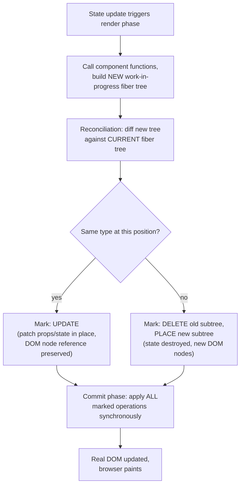

# React Reconciliation and the Fiber Architecture

> **Topic register:** F-112 (Reconciliation & the fiber architecture — how React actually diffs/schedules) · Advanced tier, internals-depth · `00-project/frontend-topic-register.md`
> **Scope note:** per `CLAUDE.md`'s Scope Addendum, this continues the frontend domain's Advanced tier begun with Component Patterns (F-111). This chapter deliberately covers only synchronous reconciliation (diffing, DOM node identity, batching) — the scheduling/priority side of Fiber that enables interruptible rendering is covered separately in Concurrent React (F-113), where it can be demonstrated with actual concurrent-feature APIs rather than described abstractly here.
> **Provenance:** every claim is verified against a real, running React 19.2.8 + Vite 8.2.1 app at [`practice/frontend/react-reconciliation-and-fiber/`](../../practice/frontend/react-reconciliation-and-fiber/) — including a direct object-identity (`===`) comparison of the actual DOM node, not just visual/behavioral inference.

## Table of Contents

1. [Learning Objectives](#learning-objectives)
2. [Why This Matters in Interviews](#why-this-matters-in-interviews)
3. [Mental Model](#mental-model)
4. [Definition and Purpose](#definition-and-purpose)
5. [Core Concepts](#core-concepts)
6. [Internal Implementation](#internal-implementation)
7. [Diagrams](#diagrams)
8. [Real Verified Demos](#real-verified-demos)
9. [Production Scenarios](#production-scenarios)
10. [Trade-offs](#trade-offs)
11. [Decision Framework](#decision-framework)
12. [Common Mistakes](#common-mistakes)
13. [Anti-Patterns](#anti-patterns)
14. [Best Practices](#best-practices)
15. [Interview Answer Framework](#interview-answer-framework)
16. [Interview Questions](#interview-questions)
17. [Summary](#summary)
18. [Key Takeaways](#key-takeaways)
19. [Cheat Sheet](#cheat-sheet)
20. [Flashcards](#flashcards)
21. [Practice Exercises](#practice-exercises)
22. [Solutions](#solutions)
23. [Additional Reading](#additional-reading)
24. [Official References](#official-references)

---

## Learning Objectives

By the end of this chapter you can:

- Prove, via direct object-identity comparison (not just visual inspection), that React reuses real DOM nodes across re-renders when an element's type and position are unchanged.
- State precisely when React instead destroys and rebuilds a subtree from scratch, and demonstrate the resulting state loss with a real, reproduced example.
- Explain what batching actually guarantees, and prove — with a real commit counter — that multiple state updates in one handler cost exactly one commit, not one per update.
- Describe what "Fiber" is at a level beyond a buzzword: a linked-list-based unit-of-work representation that makes rendering interruptible, distinct from the diffing algorithm itself.

## Why This Matters in Interviews

Reconciliation questions separate candidates who have internalized React's actual execution model from those who have only memorized surface rules like "always use a key." Being able to explain WHY the index-as-key bug (`react-fundamentals-jsx-components-props-and-state.md`) happens, WHY changing a wrapping element's tag type resets all descendant state, and WHY batching exists, all trace back to the same handful of reconciliation facts covered here — a candidate who understands this chapter can derive the answer to a dozen surface-level "gotcha" questions instead of memorizing each one independently.

## Mental Model

**React's rendering model has three distinct phases that are worth keeping separate in your head: render (call component functions, compute a new tree description — pure, can be thrown away, can in principle be interrupted), reconciliation (diff the new tree description against the previous one to decide what actually needs to change), and commit (apply exactly those changes to the real DOM, synchronously, in one pass).** Reconciliation's diffing algorithm is a heuristic, not a full tree-diff (which would be prohibitively expensive at O(n³) for arbitrary trees) — React's specific heuristic is: elements of different types produce entirely different trees (destroy and rebuild), and elements of the same type at the same position are compared prop-by-prop and patched in place. Everything else in this chapter is a direct consequence of that one heuristic.

## Definition and Purpose

**Reconciliation** is the algorithm React uses to determine which parts of the real DOM need to change, given a new tree description (from a component re-render) and the previous one. It exists because directly rebuilding the entire DOM from scratch on every state change would be far too slow for interactive UIs — reconciliation's entire purpose is computing the *minimal* set of real DOM mutations needed. **Fiber** is the name of React's internal data structure and algorithm (introduced in React 16, replacing the older synchronous "stack reconciler") — a linked list of "fiber" nodes, each representing a unit of work for one element, that can be processed incrementally and paused/resumed, which is what makes concurrent features (Suspense, transitions — covered in F-113) possible at all. **Batching** is React's practice of grouping multiple state updates that occur within the same synchronous execution context (an event handler, and since React 18, more contexts than before) into a single re-render and commit, rather than processing each update independently.

## Core Concepts

### Same type + position → the real DOM node is reused, proven by identity

`DomNodeReuseDemo.jsx` captures the actual DOM node via a `ref` and compares it, by `===`, against the node captured on the previous render. Real captured result: after typing `"persist-me"` into the input and clicking "Re-render" twice, the text was never lost (`raw value: "persist-me"` throughout), and the identity check confirmed `3` renders where the captured node was the exact same object reference as the previous render's — not merely "looked the same," but literally the same JavaScript object. This is the direct, provable mechanism behind why uncontrolled inputs keep their typed text across re-renders, and it's the exact same mechanism responsible for the index-as-key bug covered in `react-fundamentals-jsx-components-props-and-state.md` — that bug is this reuse behavior applied to the WRONG node, when a list's `key` incorrectly implies "same identity" across a reorder.

### Different type at the same position → full destroy and rebuild

`TypeChangeRemountDemo.jsx` wraps a stateful counter in either a `
` or a `<section>`, toggled by a button. Real captured sequence: incrementing the counter to `2`, then toggling the wrapper from `
` to `<section>`, reset the counter to `0` — React saw a type change at that position (`div` → `section`) and, per its diffing heuristic, could not compare the old and new subtrees at all; it unmounted the entire old subtree (destroying the counter's state along with it) and mounted a completely fresh one. Contrast, captured in the same run: incrementing the counter to `2` again, then toggling only a *prop* (`highlighted`) on the *same* element type, left the counter unaffected at `2` — same type means React patches the existing subtree's props in place, with no destroy/rebuild and therefore no state loss.

### Batching: real commit-count proof, not a claim

`BatchingDemo.jsx` tracks `commitCount` (incremented directly in the render body, the idempotent-under-StrictMode pattern established in earlier chapters) alongside three independent `useState` values (`a`, `b`, `c`). Real captured sequence: clicking a handler that calls all three setters produced `a=1, b=1, c=1` and moved the commit counter from `2` to `4` — a `+2` increase, exactly one real commit's worth (StrictMode double-invokes the render body per commit, established in `react-hooks-useeffect-and-useref.md`). Clicking a second handler that updates only ONE state value produced an identical `+2` increase (`4` → `6`). Three simultaneous updates and one single update cost the exact same number of commits — direct, measured proof that React batches updates within an event handler into one render/commit pass, not three.

## Internal Implementation

Each fiber node corresponds to one element/component and holds, among other fields, its type, its props, its state, and pointers to its child, sibling, and return (parent) fibers — a linked-list structure specifically chosen (over a plain recursive tree walk) because it lets React's work loop process one fiber, then explicitly decide whether to continue immediately or yield control back to the browser (e.g., to handle a higher-priority event), something a naturally recursive call stack cannot do without significant additional machinery. During the render phase, React builds a new "work-in-progress" fiber tree alongside the existing "current" one; reconciliation compares them fiber-by-fiber using the same-type/different-type heuristic described above, marking each fiber with the specific DOM operation it needs (update, insert, delete); the commit phase then walks the marked fibers and applies exactly those operations to the real DOM synchronously, in one pass — this is why partial/inconsistent DOM states are never visible to the user, even though the render phase itself can, with concurrent features, be paused and resumed across multiple browser frames.

## Diagrams

## Real Verified Demos

All three demos are real, running React 19/Vite code — [`practice/frontend/react-reconciliation-and-fiber/`](../../practice/frontend/react-reconciliation-and-fiber/), verified live via direct DOM node identity checks and real clicks. Full captured sequences in the app's own [README.md](../../practice/frontend/react-reconciliation-and-fiber/README.md):

- [`DomNodeReuseDemo.jsx`](../../practice/frontend/react-reconciliation-and-fiber/src/demos/DomNodeReuseDemo.jsx) — real `===` identity proof of DOM node reuse.
- [`TypeChangeRemountDemo.jsx`](../../practice/frontend/react-reconciliation-and-fiber/src/demos/TypeChangeRemountDemo.jsx) — type change (state lost) vs. prop change (state preserved), real contrast.
- [`BatchingDemo.jsx`](../../practice/frontend/react-reconciliation-and-fiber/src/demos/BatchingDemo.jsx) — real commit-count proof that 3 updates cost the same single commit as 1.

## Production Scenarios

**Scenario: a "loading skeleton" component swap silently resets form data mid-flow.** A multi-step form shows a loading skeleton (`<SkeletonForm />`) while fetching initial data, then swaps to the real form (`<RealForm />`) once data arrives — both conditionally rendered at the same JSX position based on a `loading` flag. A user who starts typing into `RealForm` before an unrelated background refetch flips `loading` back to `true` briefly (to show the skeleton again) loses everything they'd typed: `RealForm` and `SkeletonForm` are different component types at the same position, so React destroys `RealForm`'s entire subtree (and its uncommitted form state) when `loading` flips, then builds a brand new `RealForm` instance when `loading` flips back — with no memory of what was there before. Diagnosed via exactly this chapter's reconciliation model: the fix is either avoiding the type swap entirely (keep `RealForm` mounted, control its visibility with CSS/a prop, e.g. `<RealForm hidden={loading} />`) or lifting the form state above the conditional so it survives the remount.

## Trade-offs

| Concern | Same-type updates (patch in place) | Type-change (destroy/rebuild) |
|---|---|---|
| State preservation | Preserved automatically | Lost — the entire subtree's state is gone |
| DOM node identity | Preserved (verified by `===`) | New DOM nodes created |
| Performance | Cheap — only changed props/attributes touched | Expensive — full unmount + full remount of every descendant |
| When it's actually desired | The common case — most re-renders | Genuinely wanting a full reset (e.g., switching between fundamentally different views that should never share state) |

## Decision Framework

1. **Do you want a component's local state to reset when some condition changes?** → Either change its `key` (a deliberate remount trigger) or ensure a genuine type change occurs at that position — both are legitimate, but should be intentional, not accidental.
2. **Are you conditionally rendering two DIFFERENT component types at the same JSX position, and state loss on the switch would be a bug?** → Recognize this as a type change destroying state; either keep one type mounted and toggle visibility, or lift the state above the conditional.
3. **Are multiple related `setState` calls happening in the same handler, and you're relying on them being applied together, atomically, before the next render?** → They are, by React's batching guarantee, as verified directly in this chapter — no special handling needed for that specific concern (though see `react-usereducer-and-custom-hooks.md` for the SEPARATE stale-closure-read issue this doesn't solve).
4. **Debugging why a component's internal state unexpectedly resets?** → Check for a type change (or a `key` change) at that JSX position first, before assuming a bug elsewhere.

## Common Mistakes

- Assuming conditionally rendering different component types at the same position is equivalent to a same-type prop change — it isn't; one preserves state, the other destroys it, verified with a direct, reproducible contrast in this chapter.
- Believing batching means "all state updates across the whole app happen together" rather than the more specific claim: updates within the same synchronous execution context are grouped into one render/commit.
- Debugging unexpected state resets by looking for bugs in the component itself, rather than checking whether its type (or key) changed at its render position first.

## Anti-Patterns

- **Conditionally rendering two different component types to represent what is conceptually "the same UI element in different states"** (a loading skeleton vs. the real content, an edit-mode vs. view-mode of the same field) when state needs to survive the transition — the type-change reconciliation behavior will discard that state every time, a source of real, hard-to-reproduce bugs.
- **Relying on DOM node identity for anything outside the reconciliation-aware demos in this chapter** (e.g., manually caching a DOM node reference across renders assuming it never changes) without accounting for the cases where React WILL create a new node (type changes, key changes, list reordering with unstable keys).

## Best Practices

- When two conditionally-rendered branches represent "the same conceptual thing in a different state" and shared state matters, keep them the same component type (toggling internal behavior via props) rather than swapping entirely different component types.
- Use a deliberate `key` change as an intentional "force remount and reset all state" tool when that's genuinely the desired behavior — it's the same mechanism as an accidental type-change reset, but used on purpose.
- Trust React's batching guarantee for grouping related state updates within one handler into a single commit; don't add manual workarounds (e.g., `setTimeout`-deferred updates) to try to force "atomicity" that batching already provides.

## Interview Answer Framework

### 30-Second Answer

React's reconciliation algorithm diffs a new element tree against the previous one using one core heuristic: same type at the same position gets patched in place (DOM node and state preserved); different type gets the entire subtree destroyed and rebuilt from scratch (state and DOM nodes lost). Batching groups multiple state updates within the same handler into a single render and commit. Fiber is the linked-list-based internal representation that makes this process interruptible, which is what enables concurrent features.

### 2-Minute Answer

Walk through the three phases (render, reconciliation, commit), then the core same-type-vs-different-type heuristic with the direct contrast this chapter demonstrates: a wrapping element's type change resets a nested counter's state to 0, while a prop-only change on the same type preserves it. Prove DOM node reuse with the identity-comparison demo (an uncontrolled input's typed text survives because the actual DOM node object is reused, not just visually similar). Close with batching's real, measured guarantee: three simultaneous state updates cost exactly the same single commit as one.

### 10-Minute Deep Dive

Cover: why reconciliation uses a heuristic rather than a full tree-diff (cost); the fiber linked-list structure and why it replaced the older stack-based recursive reconciler specifically to enable interruptible work; the render/reconciliation/commit phase separation and why the commit phase is always synchronous (no partial DOM states visible); the direct connection between this chapter's DOM-node-reuse proof and the index-as-key bug from `react-fundamentals-jsx-components-props-and-state.md` (same underlying mechanism, applied incorrectly); and the real, measured batching proof, distinguishing it clearly from the stale-closure issue covered in the `useReducer` chapter (batching guarantees "these updates commit together," not "later code in the same handler sees the updated value synchronously").

### Whiteboard Explanation

Draw two trees side by side, labeled "current fiber tree" and "new fiber tree," with matching node shapes for a `
` at the root. Draw one child node that's a `
` in both trees — connect them with a solid arrow labeled "same type: PATCH, DOM node reused." Draw a second scenario below: the child is `
` in the current tree but `<section>` in the new tree — connect them with a broken/X'd-out arrow labeled "different type: DESTROY old subtree, BUILD new one, state lost."

### Production Example

A multi-step form conditionally renders a `<SkeletonForm />` or `<RealForm />` at the same JSX position based on a loading flag; an unrelated background refetch briefly flips the flag, causing React to see a type change, destroy `RealForm`'s entire subtree, and silently lose whatever the user had typed — diagnosed via the same-position-type-change reconciliation rule, fixed by keeping one component type mounted and toggling visibility instead.

### Trade-offs to Mention

Patching in place is cheap and the common case, but requires deliberately choosing the same component type across conditional branches when state preservation matters — which isn't always the obviously "natural" way to structure the JSX. Forcing a remount via a type or key change is a legitimate, sometimes-desired reset mechanism, but the exact same mechanism causes real bugs when it happens by accident.

### Common Candidate Mistakes

Describing reconciliation as "React figures out the differences" without being able to state the actual heuristic (same type → patch; different type → destroy/rebuild); confusing batching (updates commit together) with synchronous read-after-write (updates being immediately visible to subsequent code in the same handler, which batching does NOT provide — that's the separate stale-closure concern from the `useReducer` chapter); treating "Fiber" as a synonym for "the reconciliation algorithm" rather than the specific interruptible-work data structure that ENABLES concurrent scheduling.

### Typical Follow-Ups

"Why does React use a heuristic instead of a full, optimal tree diff?" (a general tree-diff algorithm is O(n³) in the number of nodes for arbitrary trees — far too slow to run on every state change in an interactive UI; React's type-based heuristic is O(n) and covers the overwhelming majority of real UI update patterns correctly). "If you wanted to intentionally force a component to fully remount and reset its state, how would you do it, using what this chapter covered?" (change its `key`, which reconciliation treats as an identity change even when the type is the same — a deliberate, on-purpose application of the same destroy/rebuild mechanism). "Does batching guarantee that `console.log` right after a `setState` call sees the updated value?" (no — that's a distinct, separate question about when state updates are actually applied, not about commit grouping; the updated value is available on the NEXT render, not synchronously after the call).

### Senior-Level Expectations

States the same-type/different-type heuristic precisely and unprompted, and correctly distinguishes batching (commit grouping) from the unrelated stale-closure/synchronous-read concern.

### Staff-Level Discussion

Not the primary target of this chapter, but briefly: understanding reconciliation's type-based heuristic is what lets a Staff-level engineer correctly diagnose an entire category of "component randomly loses its state" production bugs (the loading-skeleton scenario above is a real, common instance) from first principles, rather than trial-and-error — a genuine productivity and incident-response difference at scale, and a strong justification for why this internals-depth material belongs in the curriculum at all, mirroring the same rationale used for the backend's JVM-internals chapters.

## Interview Questions

### Question 1

**Question:** "A component's internal state unexpectedly resets to its initial value every time a certain condition changes, even though you didn't intend that. What's the most likely reconciliation-related cause, and how would you confirm it?"

**Expected answer:** The most likely cause is a type change (or a `key` change) at that component's position in the JSX — conditionally rendering two different component types (or the same type with a changing `key`) at the same spot causes React to destroy the old subtree and mount a fresh one, resetting all its state. Confirm by checking the JSX for exactly that pattern — a ternary or conditional switching between different component types (or elements) at that render position.

**Common mistakes:** Assuming the reset is a bug in the component's own state logic rather than checking the calling code's structure first.

**Follow-up questions:** "How would you fix it if the state loss is unwanted?" (keep one component type mounted, toggle behavior via props, rather than switching types). "How would you deliberately trigger the same reset behavior on purpose?" (change the `key` prop).

**Senior-level expectations:** States the type-change/key-change cause unprompted and can name the fix.

**Staff-level expectations:** Connects this to a broader diagnostic habit — checking reconciliation structure before assuming a logic bug — as a real production-debugging skill.

### Question 2

**Question:** "You have a handler that calls three separate `setState` functions. Does this cause three re-renders or one? How would you actually verify your answer rather than just stating it?"

**Expected answer:** One — React batches all state updates that occur within the same synchronous execution context (an event handler) into a single render and commit. Verification: a real, measured test, like this chapter's `BatchingDemo`, tracking an actual commit counter and confirming it increases by the same amount whether one or three state updates happen in a single handler invocation — not just trusting the claim.

**Common mistakes:** Correctly stating "one render" but being unable to describe how they'd actually verify it, relying purely on memorized documentation.

**Follow-up questions:** "Does this batching guarantee also apply to `setTimeout` callbacks or promise `.then()` handlers?" (as of React 18, yes, more broadly than pre-18's event-handler-only batching — but worth verifying for the specific React version in use rather than assuming). "Is batching the same guarantee that fixes the stale-closure bug from the useReducer chapter?" (no — batching is about commit grouping; the stale-closure issue is about what value a closure captured, a separate concern entirely).

**Senior-level expectations:** Proposes a concrete verification method, not just a stated answer.

**Staff-level expectations:** Not the focus of this chapter's scope.

## Summary

Reconciliation's entire behavior reduces to one heuristic — same type at the same position gets patched in place, preserving both the real DOM node and component state (proven here via direct object-identity comparison); a different type at the same position gets the whole subtree destroyed and rebuilt from scratch (proven via a real, reproduced state-loss contrast). Batching groups multiple state updates within one synchronous execution context into a single commit, proven here with a real commit counter showing three simultaneous updates cost exactly the same as one. Fiber is the linked-list-based internal structure that makes this process interruptible, the foundation concurrent features (F-113) build on.

## Key Takeaways

- Same type + position preserves both the real DOM node (proven by direct `===` identity comparison) and component state.
- A type change at the same position destroys and rebuilds the entire subtree, losing all state — proven with a direct, real contrast against a same-type prop change that preserves it.
- Batching groups same-context state updates into one commit — proven with a real commit counter showing identical `+2` increases for both a 3-update and a 1-update handler.
- Fiber is the interruptible-work data structure enabling concurrent scheduling, distinct from the diffing heuristic itself — the two are related but not the same concept.

## Cheat Sheet

- **Same type, same position** → patch in place, DOM node reused, state preserved.
- **Different type, same position** → destroy old subtree, build new one, state and DOM nodes lost.
- **Force a reset on purpose** → change the element's `key`.
- **Batching** → multiple `setState` calls in one handler = one commit, verified via direct commit-count measurement.
- **Fiber** ≠ reconciliation algorithm — it's the linked-list unit-of-work structure that makes rendering interruptible.

## Flashcards

## Card: Type change vs. prop change

**Prompt:**
What's the difference in outcome between changing an element's TYPE vs. changing a PROP on the same type, at the same JSX position?

**Answer:**
Type change: React destroys the entire old subtree and builds a new one — all state and DOM nodes lost. Prop change on the same type: React patches the existing subtree in place — state and DOM node identity preserved.

**Why it matters:**
Verified directly: a counter reset to 0 on a type change, but survived an unrelated prop change on the same type.

**Common trap:**
Conditionally rendering different component types for what should be "the same thing in a different state," accidentally losing state on the switch.

**Related:**
[[react-reconciliation-and-fiber]]

## Card: Batching guarantee, precisely

**Prompt:**
What does React's batching guarantee actually promise?

**Answer:**
Multiple state updates within the same synchronous execution context (e.g., one event handler) are grouped into a single render + commit, not one per update. It does NOT promise that later code in the same handler synchronously sees the updated value.

**Why it matters:**
Verified with a real commit counter: 3 simultaneous updates cost the identical single commit as 1 update.

**Common trap:**
Confusing "batched into one commit" with "immediately readable after the setState call" — those are separate concerns (the latter is the stale-closure topic from the useReducer chapter).

**Related:**
[[react-reconciliation-and-fiber]]

## Practice Exercises

1. In `TypeChangeRemountDemo.jsx`, change the `key` prop on the `<StatefulCounter />` itself (leave the wrapper type unchanged) whenever `highlighted` toggles. Predict, before running it, whether the counter's state now resets on a highlight toggle too.
2. In `DomNodeReuseDemo.jsx`, change the `<input>` to be conditionally rendered as either an `<input>` or a `<textarea>` based on a toggle, keeping everything else the same. Predict what happens to the identity-comparison stats when you toggle between them.
3. In `BatchingDemo.jsx`, wrap the three `setState` calls in a `setTimeout(() => { ... }, 0)` instead of calling them directly in the handler. Research (or test, if your React version supports it) whether the commit count still increases by exactly one commit's worth, and explain what that reveals about the scope of React 18+'s batching guarantee versus pre-18 behavior.

## Solutions

Exercise 1: adding a `key={highlighted}` to `<StatefulCounter />` makes React treat it as a DIFFERENT identity whenever `highlighted` changes, even though the component TYPE never changes — the counter would reset to 0 on every highlight toggle too, since `key` changes trigger the same destroy/rebuild behavior as a type change. This directly demonstrates that `key` is reconciliation's OTHER identity signal, independent of type.

Exercise 2: toggling between `<input>` and `<textarea>` is a genuine type change (different host element tags) — the identity-comparison stats would show `sameNodeRenders` NOT incrementing across that toggle (a brand new DOM node is created), and any previously typed text would be lost, exactly mirroring the `TypeChangeRemountDemo`'s state-loss behavior applied to DOM content instead of component state.

Exercise 3: as of React 18, automatic batching extends to `setTimeout` callbacks (and promises, and native event handlers) in addition to React's own event handlers — a change from React 17 and earlier, where only React-managed event handlers were batched by default, and a `setTimeout`-deferred set of `setState` calls would have produced three separate commits. Testing this directly and observing the commit count is the most reliable way to confirm the exact batching scope for the React version actually in use, rather than assuming based on outdated documentation.

## Additional Reading

- [React Component Patterns](react-component-patterns.md) — this chapter's prerequisite.
- [React Fundamentals: JSX, Components, Props, and State](react-fundamentals-jsx-components-props-and-state.md) — the index-as-key bug, which is this chapter's DOM-node-reuse mechanism applied incorrectly.
- [00-project/frontend-topic-register.md](../../00-project/frontend-topic-register.md) — the full register this chapter is F-112 of.

## Official References

- [react.dev: Preserving and Resetting State](https://react.dev/learn/preserving-and-resetting-state)
- [React Fiber Architecture (community reference, Andrew Clark)](https://github.com/acdlite/react-fiber-architecture)
