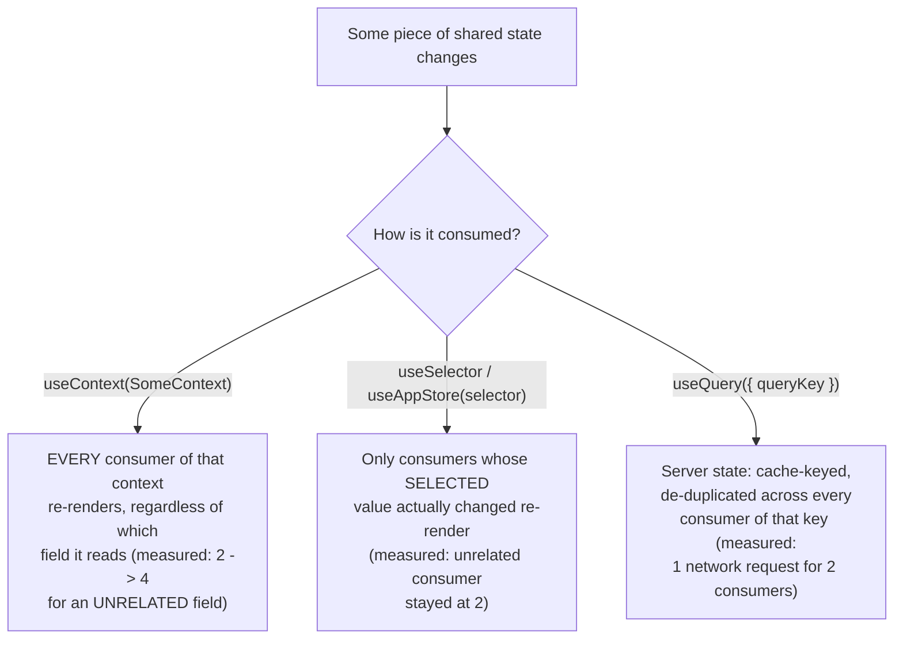

# React State Management Landscape: Context vs. Redux Toolkit vs. Zustand vs. Server State

> **Topic register:** F-120 (State management landscape — Context vs. Redux Toolkit vs. Zustand vs. server state; decision framework, not just syntax) · Advanced tier · `00-project/frontend-topic-register.md` — the register frames this as "the 'when do you actually need a global store' question."
> **Scope note:** per `CLAUDE.md`'s Scope Addendum, this is the fourteenth frontend chapter and the closing chapter of the D-F1 React Fundamentals section, continuing the register in sequence after TypeScript (F-119).
> **Provenance:** every claim is verified against a real, running React 19.2.8 + Vite 8.2.1 app at [`practice/frontend/react-state-management/`](../../practice/frontend/react-state-management/), including real, measured render-counter evidence for the Context-vs-selector re-render distinction, and a real network trace proving TanStack Query's cross-component cache deduplication.

## Table of Contents

1. [Learning Objectives](#learning-objectives)
2. [Why This Matters in Interviews](#why-this-matters-in-interviews)
3. [Mental Model](#mental-model)
4. [Definition and Purpose](#definition-and-purpose)
5. [Core Concepts](#core-concepts)
6. [Internal Implementation](#internal-implementation)
7. [Diagrams](#diagrams)
8. [Real Verified Demos](#real-verified-demos)
9. [Production Scenarios](#production-scenarios)
10. [Trade-offs](#trade-offs)
11. [Decision Framework](#decision-framework)
12. [Common Mistakes](#common-mistakes)
13. [Anti-Patterns](#anti-patterns)
14. [Best Practices](#best-practices)
15. [Interview Answer Framework](#interview-answer-framework)
16. [Interview Questions](#interview-questions)
17. [Summary](#summary)
18. [Key Takeaways](#key-takeaways)
19. [Cheat Sheet](#cheat-sheet)
20. [Flashcards](#flashcards)
21. [Practice Exercises](#practice-exercises)
22. [Solutions](#solutions)
23. [Additional Reading](#additional-reading)
24. [Official References](#official-references)

---

## Learning Objectives

By the end of this chapter you can:

- Explain, with a real measured example, why Context re-renders every consumer on any value change while Redux Toolkit and Zustand only re-render consumers whose SELECTED slice actually changed.
- Distinguish client state from server state, and explain why TanStack Query's cache deduplication solves a problem none of the three client-state tools address at all.
- Choose correctly between Context, a dedicated store library, and a server-state library for a given piece of state, using a real decision framework rather than familiarity or default habit.
- Articulate the actual cost difference between Redux Toolkit and Zustand for an equivalent guarantee, not just "Zustand is simpler."

## Why This Matters in Interviews

State management questions expose whether a candidate reaches for tools reflexively ("we always use Redux") or by reasoning about the actual state's nature — is it local, shared client state, or server-owned data? — and the actual cost it's incurring right now. "Context has performance problems at scale" is a common but often unsubstantiated claim; "Context re-renders every consumer on any provider value change because it has no per-field subscription — I measured it: a `name`-only consumer's render count went from 2 to 4 on a `count`-only update, while the identical Redux/Zustand setup left that consumer's render count untouched" is the depth this chapter is built to produce.

## Mental Model

**There are two fundamentally different kinds of state here, and conflating them is the single most common state-management mistake: CLIENT state (owned by the browser session — UI toggles, form input, a shopping cart) and SERVER state (owned by a remote source, merely cached/mirrored on the client — a user profile, a product list).** Context, Redux Toolkit, and Zustand are all client-state tools, differing mainly in HOW GRANULARLY they let a component subscribe to change (Context: none — subscribe to the whole provider value; Redux/Zustand: per-selector, only re-rendering when the selected slice changes). TanStack Query is a server-state tool solving an entirely different problem (staleness, caching, deduplication, background refetching) that none of the client-state tools address, because none of them know or care that the data came from a network call in the first place.

## Definition and Purpose

**React Context** (`createContext`/`useContext`) provides a way to pass a value down a component tree without prop drilling — it exists to solve a PLUMBING problem (avoiding passing props through many intermediate layers), not a performance or subscription-granularity problem; every component that calls `useContext` on a given context re-renders whenever that context's Provider value changes, full stop, regardless of which part of the value that component actually reads. **Redux Toolkit** (`configureStore`, `createSlice`, `useSelector`/`useDispatch`) is the modern, opinionated standard way to use Redux — a predictable, centralized store with a single source of truth, action-based updates, and (critically) SELECTOR-based subscriptions, where `useSelector`'s equality check means a component only re-renders when its OWN selected value changes, not on every store update. **Zustand** is a minimal state-management library providing the same selector-based subscription guarantee as Redux, without Redux's ceremony (no action types, no reducers-as-a-formal-concept, no `Provider` required, no middleware setup to get started) — it exists for teams who want Redux's re-render-granularity guarantee without Redux's boilerplate. **TanStack Query** (formerly React Query) manages SERVER state specifically — caching, deduplicating, and background-refreshing data fetched from a remote source — it exists because server state has fundamentally different concerns than client state (a value can go STALE because something external changed it, the same data might be requested by multiple unrelated components, a request might be in flight when a second identical request is made), none of which Context, Redux, or Zustand were designed to handle.

## Core Concepts

### Context has no selective subscription — proven with a real measured re-render

`ContextDemo.jsx` bundles `count` and `name` into one context value. `CountConsumer` reads only `count`; `NameConsumer` reads only `name`. Real captured evidence: clicking a button that changes ONLY `count` moved BOTH consumers' render counters from 2 to 4 (StrictMode double-invokes in dev, so one real click = +2) — `NameConsumer`, which never reads `count`, re-rendered anyway, because Context has no mechanism to subscribe to "just the `name` field."

### Redux Toolkit and Zustand: selector-based subscriptions, measured directly

The identical two-slice setup (a counter and a name, updated independently) was rebuilt with Redux Toolkit's `useSelector` and with Zustand's selector-argument hook. Real captured evidence, both libraries: after the same "+1 count" click, the count consumer's render counter moved 2 → 4 (same StrictMode doubling), but the NAME consumer's render counter stayed at exactly 2 — unchanged — in both libraries. Selector-based subscription means a component only re-renders when the SPECIFIC value it selected actually changed, which is the concrete mechanism behind "Redux/Zustand scale better than Context for frequently-changing shared state," not just a documented claim.

### TanStack Query: cache deduplication, proven with a real network trace

`QueryDemo.jsx` mounts two independent `TodoViewer` components, both calling `useQuery({ queryKey: ['todo', 1], queryFn: fetchTodo })`. A real network trace confirmed exactly ONE `GET /api/todos/1` request fired, despite two independently mounted consumers both requesting that same query key — TanStack Query recognized the duplicate key and served both components from a single shared cache entry/in-flight request, rather than each component firing its own independent fetch.

## Internal Implementation

Context's re-render behavior stems directly from how React's reconciler treats context reads: `useContext(SomeContext)` subscribes the calling component (specifically, the fiber for that component) to re-render whenever `SomeContext.Provider`'s `value` prop changes by reference — React does NOT inspect which fields of that value a given consumer actually accessed, because doing so would require tracking property-level reads, which Context's API was never designed to do; this is precisely why bundling multiple pieces of state into one context value (as this chapter's demo deliberately does, mirroring realistic usage) causes ANY field's change to re-render EVERY consumer of that context. Redux's `useSelector(selectorFn)` re-renders a component only when `selectorFn(newState) !== selectorFn(oldState)` (a reference/shallow-equality check by default) — because `configureStore`'s combined reducer tree only creates a NEW object reference for the specific slice(s) a given action's reducer actually modified (Redux Toolkit's Immer-based `createSlice` handles this transparently), a `name`-slice-selecting component's selector keeps returning the exact same object reference when only the `counter` slice changed, so its equality check reports "unchanged" and no re-render occurs. Zustand's `create` store implements the identical selector-based subscription model internally (each `useAppStore(selector)` call subscribes only to updates where that specific selector's result changes), achieving the same guarantee with far less required structure — no combined-reducer tree, no action-type constants, no `Provider` component, since Zustand stores exist outside React's component tree entirely and are accessed via a plain hook. TanStack Query's cache deduplication works because every `useQuery` call is keyed by its `queryKey` (here, `['todo', 1]`) — internally, the `QueryClient` maintains one cache entry per unique key; a second component mounting with the SAME key, while a request for that key is already in flight or its result is still within `staleTime`, subscribes to the EXISTING request/cached result rather than the library issuing a redundant network call, which is exactly what this chapter's single-request network trace confirms.

## Diagrams

## Real Verified Demos

All demos are real, running code with real, measured render counters and a real network trace — [`practice/frontend/react-state-management/`](../../practice/frontend/react-state-management/). Full captured evidence in the app's own [README.md](../../practice/frontend/react-state-management/README.md):

- [`ContextDemo.jsx`](../../practice/frontend/react-state-management/src/demos/ContextDemo.jsx) — real measured cross-field re-render.
- [`ReduxDemo.jsx`](../../practice/frontend/react-state-management/src/demos/ReduxDemo.jsx) + [`store/reduxStore.js`](../../practice/frontend/react-state-management/src/store/reduxStore.js) — real measured selective re-render.
- [`ZustandDemo.jsx`](../../practice/frontend/react-state-management/src/demos/ZustandDemo.jsx) + [`store/zustandStore.js`](../../practice/frontend/react-state-management/src/store/zustandStore.js) — same guarantee, a fraction of the setup code.
- [`QueryDemo.jsx`](../../practice/frontend/react-state-management/src/demos/QueryDemo.jsx) — real network-trace-confirmed cache deduplication.

## Production Scenarios

**Scenario: a "just use Context" decision quietly degrades a frequently-updating dashboard, and the fix is smaller than the original mistake.** A team builds a live trading/analytics dashboard, bundling several independently-updating values (a live price ticker, a user's watchlist, a UI theme toggle) into one Context for convenience. As the price ticker starts updating multiple times per second (a realistic requirement, not a contrived one), the ENTIRE dashboard — including completely unrelated components that only read the watchlist or the theme — starts re-rendering multiple times per second too, exactly as this chapter's `ContextDemo` measured at a small scale. Initial hypothesis: "React is just slow for real-time data." Evidence, gathered using this chapter's method: a render counter (or React DevTools Profiler) on the watchlist component shows it re-rendering in lockstep with the price ticker despite never reading price data. Diagnosis: the shared Context, not React itself, is the cause — every consumer of that one context subscribes to ALL of it. Fix: split the price ticker into its own Zustand store (or a separate, narrower Context, or lift it entirely out of React state into a ref-driven imperative update if the ticker doesn't even need to trigger re-renders for most consumers), leaving the watchlist and theme on whatever they were using, completely unaffected. The fix is a small, targeted change — reduce the SUBSCRIPTION SCOPE using a tool with per-selector granularity — not a full rewrite; the choice of state-management tool for a specific piece of state is a decision that can and should be made independently per state slice, not once for an entire app.

## Trade-offs

| Concern | Context | Redux Toolkit | Zustand | TanStack Query |
|---|---|---|---|---|
| Problem it solves | Prop-drilling avoidance | Predictable, centralized client state with strong tooling (DevTools, middleware) | Minimal client state with the same selective-subscription guarantee | Server state (caching, staleness, deduplication) |
| Re-render granularity | None — whole-provider-value subscription (measured: unrelated field re-rendered too) | Per-selector (measured: unrelated slice untouched) | Per-selector (measured: unrelated slice untouched) | Per-query-key; irrelevant axis — this isn't client re-render granularity, it's request deduplication |
| Setup cost | Very low (built into React) | Moderate (slices, store config, `Provider`) | Low (one `create()` call, no `Provider`) | Low-moderate (`QueryClientProvider`, `queryKey`/`queryFn` per query) |
| Best fit | Rarely-changing or narrowly-scoped shared values (theme, auth user) | Large apps needing strong conventions, time-travel debugging, a large existing team familiar with Redux | Small-to-medium apps wanting Redux's guarantee without its ceremony | Any data genuinely owned by a server, regardless of app size |
| Common misuse | Bundling frequently-changing values into one context "for convenience," as this chapter's Production Scenario shows | Using it for server data that TanStack Query would cache/dedupe far more correctly | Same server-data misuse risk as Redux | Using it for genuinely local-only UI state it wasn't designed for (a toggle, a form draft) |

## Decision Framework

1. **Is this state owned by a remote server, even if it's cached locally?** → TanStack Query (or an equivalent server-state library) — this chapter's real network trace shows it solves deduplication/caching that none of the client-state tools address at all. Do not model server data as Redux/Zustand/Context state managed by hand.
2. **Is this state genuinely local to one component or a small, co-located subtree?** → `useState`/`useReducer` — no global tool needed at all; this chapter's own topics are for SHARED state specifically.
3. **Is this shared client state that changes rarely, or is only read by a small, stable set of consumers?** → Context is fine — its lack of selective subscription is a real cost, but only matters at meaningful update frequency/consumer count, exactly the register's framing: "when do you actually need a global store."
4. **Is this shared client state that changes frequently, or read by many components, where Context's whole-value re-render would be a measured problem (not a hypothetical one)?** → Redux Toolkit or Zustand — verify with a render counter (as this chapter does) that the switch actually helps, rather than assuming.
5. **Between Redux Toolkit and Zustand specifically:** does the team need Redux's mature DevTools/middleware ecosystem, strict conventions for a large team, or existing Redux familiarity? → Redux Toolkit. Otherwise, for the same selective-re-render guarantee with meaningfully less setup? → Zustand, as this chapter's side-by-side line-count comparison illustrates directly.

## Common Mistakes

- Reaching for Context by default for ALL shared state, including frequently-changing values, without measuring whether its whole-provider-value re-render behavior is actually a problem at the current scale — this chapter's Production Scenario shows exactly how this degrades a real dashboard.
- Modeling server-owned data (a fetched user profile, a product list) as hand-managed Redux/Zustand/Context state, reimplementing caching/deduplication/staleness logic that TanStack Query already solves correctly and with less code.
- Choosing Redux Toolkit reflexively ("that's just what we use") for a small app or feature where Zustand would provide the identical re-render guarantee with a fraction of the setup.

## Anti-Patterns

- **One giant Context bundling every piece of shared app state "for simplicity,"** guaranteeing that ANY update anywhere in that bundle re-renders every consumer of any part of it — the exact mechanism this chapter's `ContextDemo` measured directly, scaled up to an entire application.
- **Hand-rolling `useEffect` + `useState` fetch-and-cache logic repeatedly across components for the same server data**, instead of a server-state library — reimplements request deduplication, staleness, and cache invalidation poorly and inconsistently, when TanStack Query (or an equivalent) already solves it, verified in this chapter with a real single-request network trace for two independent consumers.

## Best Practices

- Classify each piece of state as client or server state FIRST, before picking a tool — the register's own framing ("when do you actually need a global store") only even applies to client state; server state has a different, better-fitting answer entirely.
- When choosing between Context and a selector-based store for shared client state, base the decision on actual update frequency and consumer count — verify with a render counter (as this chapter does) rather than assuming either "Context is always fine" or "Context always doesn't scale."
- Split unrelated pieces of shared state into SEPARATE contexts/stores rather than one bundled value — this alone eliminates most of Context's practical re-render-fan-out cost, independent of which library is chosen.

## Interview Answer Framework

### 30-Second Answer

Client state (Context, Redux Toolkit, Zustand) and server state (TanStack Query) solve different problems and shouldn't be conflated. Among client-state tools, Context has no selective subscription — every consumer re-renders on any provider value change, measured directly here (an unrelated consumer's render count doubled on an unrelated update). Redux Toolkit and Zustand both provide selector-based subscriptions — only the consumer of the CHANGED slice re-renders, also measured directly. Zustand achieves the same guarantee with far less setup than Redux Toolkit. TanStack Query solves caching/deduplication/staleness for server-owned data, which none of the client-state tools address at all — proven here with a real network trace showing one request served two independent consumers.

### 2-Minute Answer

Start from the mental model: client state vs. server state are fundamentally different problems. Cite the real Context evidence: bundling `count` and `name` in one context, a `count`-only update moved BOTH consumers' render counters (2→4), including the `name` consumer that never reads `count` — Context has no per-field subscription mechanism. Cite the real Redux Toolkit/Zustand evidence: the identical setup with selector-based subscriptions left the `name` consumer's render count untouched (stayed at 2) after the same update — proof that selector-based tools only re-render what actually changed. Note Zustand achieves this with dramatically less setup code than Redux Toolkit (no slices, no `Provider`, one `create()` call). Close with TanStack Query: a real network trace showed exactly one request for two independently mounted consumers of the same query key — solving a caching/deduplication problem none of the three client-state tools were designed to address.

### 10-Minute Deep Dive

Cover: the exact reconciler-level reason Context re-renders every consumer (fiber-level subscription to the whole Provider value, no property-level read tracking); Redux's Immer-based `createSlice` producing a new object reference only for the specific slice a reducer actually touched, and how that interacts with `useSelector`'s equality check; Zustand's equivalent selector-subscription model without Redux's combined-reducer/Provider machinery; TanStack Query's `queryKey`-based cache entry model and why a second mount with the same key subscribes to an existing entry rather than issuing a new request; and the Production Scenario's real-time-dashboard example as a concrete illustration of Context's cost compounding at realistic update frequency, with a targeted (not full-rewrite) fix.

### Whiteboard Explanation

Draw a Provider box with two arrows going out to two consumer boxes, one labeled "reads count," one labeled "reads name." Draw a lightning bolt hitting only "count" inside the Provider, then draw BOTH consumer boxes flashing/re-rendering — annotate with the real captured numbers (2→4, both). Beside it, draw the same setup but with a selector-based store: the same lightning bolt on "count," but only the "reads count" consumer box flashes — annotate with the real captured numbers (2→4 vs. staying at 2). Add a third, separate diagram: two components both labeled "queryKey: ['todo', 1]" both pointing into ONE shared cache-entry box, with a single arrow out to "1 real network request."

### Production Example

A live trading dashboard bundled a fast-updating price ticker with a rarely-changing watchlist and theme toggle into one Context; the entire dashboard began re-rendering multiple times per second as the ticker updated, including completely unrelated components — diagnosed with a render counter (mirroring this chapter's own method) and fixed by moving the ticker to its own Zustand store, leaving the rest of the app's state management untouched.

### Trade-offs to Mention

Context's simplicity (zero extra dependencies, built into React) trades against a real, measurable re-render cost at scale; Redux Toolkit's stronger conventions/tooling trade against real setup overhead versus Zustand's minimalism; none of the three client-state tools are a substitute for a proper server-state library once data is genuinely server-owned.

### Common Candidate Mistakes

Treating "Context vs. Redux" as the entire state-management question, without acknowledging server state (TanStack Query/React Query) as a separate, third category with different concerns entirely. Asserting "Context causes unnecessary re-renders" as a memorized fact without being able to explain the actual mechanism (whole-provider-value subscription, no per-field tracking) or back it with a concrete measurement. Recommending Redux Toolkit by default without considering Zustand as a lower-ceremony alternative providing the identical selective-re-render guarantee.

### Senior-Level Expectations

Distinguishes client state from server state unprompted, and explains Context's re-render behavior via its actual mechanism (whole-value subscription) rather than a vague "it's slower" claim.

### Staff-Level Discussion

Not the primary focus of this chapter's demos, but briefly: a Staff-level engineer treats the choice of state-management tool as a PER-STATE-SLICE decision made deliberately across an entire application (as the Decision Framework's five questions imply), not a single, app-wide, once-and-forever choice — and recognizes that migrating a specific piece of state's management strategy (as this chapter's Production Scenario's fix does, moving only the ticker to Zustand) is usually a small, targeted change precisely BECAUSE the state was correctly scoped/separated to begin with; the deeper organizational risk isn't picking "the wrong library" once, it's under-separating state so that every future change requires touching a large, entangled blob rather than one narrow slice — the same "narrow, well-scoped boundary" principle this repository's architecture chapters apply to service/module boundaries, applied here to state.

## Interview Questions

### Question 1

**Question:** "Your team currently uses one big Context for all shared app state, and a teammate says 'Context causes performance problems, we should switch everything to Redux.' How do you respond?"

**Expected answer:** Push back on "everything" — the actual problem is specific: bundling multiple, independently-changing pieces of state into ONE context value means any single field's change re-renders every consumer of the whole context, regardless of which field each consumer reads (cite the concrete mechanism: whole-provider-value subscription, no per-field tracking — and if pressed, a concrete measurement like this chapter's 2→4 render-count change on an unrelated consumer). The fix isn't necessarily "switch everything to Redux" — it could be as targeted as splitting the one bundled context into several narrower ones, or moving only the frequently-changing piece(s) to a selector-based store (Redux Toolkit or Zustand) while leaving rarely-changing values (theme, auth user) on Context, which remains perfectly fine for those.

**Common mistakes:** Agreeing wholesale that "Context is bad, always use Redux" without identifying that the actual problem is BUNDLING unrelated state into one value, which a full library switch doesn't uniquely fix (a badly-bundled Zustand store has the same problem unless selectors are used correctly).

**Follow-up questions:** "What if the team specifically needs Redux's DevTools time-travel debugging?" (a legitimate, specific reason to prefer Redux Toolkit over Zustand — not "Redux is just better," a concrete feature need). "How would you actually verify the re-render problem is real before recommending a change?" (a render counter or React DevTools Profiler on the specific components suspected of over-rendering — exactly this chapter's own verification method, not assuming from documentation).

**Senior-level expectations:** Diagnoses the actual mechanism (bundling, not Context itself) before proposing a fix, and proposes the smallest fix that solves the actual measured problem.

**Staff-level expectations:** Frames per-state-slice tool selection as an ongoing architectural discipline, not a one-time library choice for the whole app.

### Question 2

**Question:** "A component fetches a user's profile with `useEffect` + `useState`, and a sibling component fetches the SAME profile the same way. What's wrong with this, and what would you do instead?"

**Expected answer:** This is server state being hand-managed as if it were client state — each component independently fires its own fetch, with no deduplication (two network requests for the same data), no shared cache (if one component's fetch resolves and the profile changes elsewhere, the other component doesn't know), and no consistent staleness/refetch strategy. The correct fix is a server-state library (TanStack Query or equivalent): both components call `useQuery({ queryKey: ['user', id], queryFn: fetchUser })` with the SAME key, and the library deduplicates the request and shares the cached result — verified directly in this chapter with a real network trace showing exactly one request for two independent consumers of the same key.

**Common mistakes:** Proposing to fix this by lifting the fetch into a shared Redux/Zustand store instead — this can work, but requires manually reimplementing caching, deduplication, and staleness logic that a server-state library already provides correctly, and conflates server state with the client-state tools this chapter distinguishes it from.

**Follow-up questions:** "What happens if the two components mount at slightly different times, one fetch already resolved before the second component mounts?" (TanStack Query serves the cached result immediately if it's within `staleTime`, with no new request at all — a stronger guarantee than simple in-flight deduplication alone). "How would you invalidate this cached data after the user updates their own profile?" (TanStack Query's `queryClient.invalidateQueries({ queryKey: ['user', id] })`, triggering a refetch for every current subscriber of that key — a capability with no direct equivalent in hand-rolled `useEffect` fetching).

**Senior-level expectations:** Identifies this specifically as a client-state-tool-vs-server-state-tool category error, not just "these components should share a fetch somehow."

**Staff-level expectations:** Discusses cache invalidation strategy (not just initial fetch deduplication) as part of the real problem being solved, and the broader argument for standardizing server-state handling across a codebase rather than solving it ad hoc per feature.

## Summary

Client state (Context, Redux Toolkit, Zustand) and server state (TanStack Query) are fundamentally different problems requiring different tools. Among client-state tools, this chapter proved directly that Context lacks selective subscription (an unrelated consumer's render count doubled on an unrelated update) while Redux Toolkit and Zustand both provide it (an unrelated consumer's render count stayed unchanged under the identical update) — with Zustand achieving the same guarantee as Redux Toolkit at a fraction of the setup cost. TanStack Query solves a problem none of the three client-state tools address: this chapter's real network trace confirmed two independent consumers of the same query key were served by exactly one request, not two.

## Key Takeaways

- Classify state as client or server FIRST — the tool choice for one category doesn't transfer to the other.
- Context has no per-field subscription — proven here with a real measured re-render of an unrelated consumer (2→4 renders on an unrelated update).
- Redux Toolkit and Zustand both provide selector-based subscriptions with an identical re-render guarantee — proven here with an unrelated consumer's render count staying unchanged under the same update.
- Zustand achieves Redux Toolkit's selective-re-render guarantee with dramatically less setup code (no slices, no `Provider`, one `create()` call).
- TanStack Query deduplicates requests across independent consumers of the same query key — proven here with a real network trace showing one request for two consumers.

## Cheat Sheet

- **Context** → whole-provider-value subscription; every consumer re-renders on any change (measured). Fine for rarely-changing/narrow values; split bundled state into separate contexts to limit blast radius.
- **Redux Toolkit** → selector-based (`useSelector`); only the changed slice's consumer re-renders (measured). Best for large teams needing strong conventions/DevTools.
- **Zustand** → same selective-re-render guarantee as Redux, far less setup (no slices/`Provider`/action creators).
- **TanStack Query** → server state; caches/deduplicates by `queryKey` (measured: 1 request for 2 consumers of the same key). Never hand-roll fetch caching when this exists.
- **Decision order** → server-owned? → TanStack Query. Local-only? → `useState`/`useReducer`. Shared, rarely-changing? → Context. Shared, frequently-changing/many consumers? → Redux Toolkit or Zustand.

## Flashcards

## Card: Why Context re-renders an unrelated consumer

**Prompt:**
Two components both call `useContext` on the same provider — one reads `count`, the other reads `name`. Why does updating ONLY `count` re-render both?

**Answer:**
`useContext` subscribes a component to the whole Provider VALUE, not to specific fields within it — React has no mechanism to track which property of that value a given consumer actually reads. Any change to the value (even to a field the consumer never uses) triggers a re-render.

**Why it matters:**
Verified directly: clicking a `count`-only update moved BOTH the `count` consumer's AND the `name` consumer's render counters from 2 to 4.

**Common trap:**
Assuming Context is simply "less efficient" without being able to name the actual mechanism (whole-value subscription, no per-field tracking).

**Related:**
[[react-state-management]]

## Card: What TanStack Query's cache deduplication actually proves

**Prompt:**
Two independent components both call `useQuery` with the exact same `queryKey`. How many real network requests fire, and why does that matter compared to hand-rolled `useEffect` fetching?

**Answer:**
Exactly one — verified directly with a real network trace showing a single `GET` request despite two independently mounted consumers. TanStack Query's cache is keyed by `queryKey`; a second consumer with the same key subscribes to the existing request/cached result instead of firing its own. Hand-rolled `useEffect` + `useState` fetching provides no such deduplication by default — each component fetches independently.

**Why it matters:**
This is the concrete difference between treating fetched data as ad hoc per-component state versus genuinely shared, cache-managed server state.

**Common trap:**
Fixing duplicate fetches by lifting them into Redux/Zustand instead of a server-state library — this works but requires manually reimplementing caching/deduplication/staleness logic a server-state library already provides.

**Related:**
[[react-state-management]]

## Practice Exercises

1. In `ContextDemo.jsx`, split the single `StoreContext` into two separate contexts (`CountContext` and `NameContext`), each with its own provider, and update `CountConsumer`/`NameConsumer` to use only their respective context. Predict, then verify by running the app and reading render counters, whether `NameConsumer` still re-renders when `count` changes.
2. In `reduxStore.js`, add a THIRD slice (`themeSlice`) and a `ThemeView` component in `ReduxDemo.jsx` that selects only `state.theme.value`. Click the existing "+1 count" button and verify (render counter) that `ThemeView` stays unchanged, exactly like `NameView` did.
3. In `QueryDemo.jsx`, change the second `TodoViewer`'s `queryKey` from `['todo', 1]` to `['todo', 2]` (a genuinely different key). Predict, then verify with a network trace, how many total requests fire now, and explain why the deduplication behavior from this chapter's captured evidence no longer applies.

## Solutions

Exercise 1: after splitting into two separate contexts, `NameConsumer` (now consuming only `NameContext`) would STOP re-rendering when `count` changes — because it's no longer subscribed to `CountContext` at all. This directly demonstrates that Context's re-render-fan-out problem isn't inherent to Context itself, but specifically to BUNDLING unrelated state into one shared value — splitting into narrower, single-concern contexts is often a sufficient fix without switching libraries at all, exactly as this chapter's Best Practices section recommends.

Exercise 2: `ThemeView`, selecting only `state.theme.value`, would stay at its initial render count when the "+1 count" button is clicked — Redux Toolkit's `configureStore` combines each slice's reducer independently, so an action handled only by `counterSlice`'s reducer produces a new `state.counter` reference while `state.theme` remains referentially identical, and `useSelector`'s equality check on `state.theme.value` reports "unchanged." This confirms the selective-subscription guarantee scales to more than two slices, not just the two demonstrated in the base app.

Exercise 3: with a genuinely different `queryKey` (`['todo', 2]` vs. `['todo', 1]`), TWO real network requests fire — one per unique key — because TanStack Query's cache deduplication operates PER KEY, not globally across all queries. This is expected and correctly distinguishes "two consumers requesting the SAME data" (deduplicated, as this chapter's base evidence shows) from "two consumers requesting DIFFERENT data that happen to use the same query hook" (not deduplicated, and shouldn't be — they're genuinely different data).

## Additional Reading

- [React + TypeScript: Typing Props/State/Hooks, Generic Components, and Discriminated Unions](react-typescript.md) — prerequisite; several of this chapter's own store/selector patterns benefit from the typing techniques covered there.
- [React `useMemo`, `useCallback`, and `useContext`](react-usememo-usecallback-and-usecontext.md) — prerequisite; covers the Context API's own mechanics in depth, which this chapter builds on rather than repeats.
- [00-project/frontend-topic-register.md](../../00-project/frontend-topic-register.md) — the full register this chapter is F-120 of, and the closing chapter of the D-F1 React Fundamentals section.

## Official References

- [Redux Toolkit: Getting Started](https://redux-toolkit.js.org/introduction/getting-started)
- [Zustand: Introduction](https://zustand.docs.pmnd.rs/getting-started/introduction)
- [TanStack Query: Overview](https://tanstack.com/query/latest/docs/framework/react/overview)
- [react.dev: Scaling Up with Reducer and Context](https://react.dev/learn/scaling-up-with-reducer-and-context)
