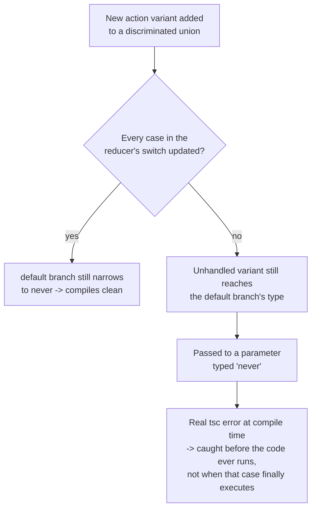

# TypeScript with React: Typing Props/State/Hooks, Generic Components, and Discriminated Unions

> **Topic register:** F-119 (TypeScript with React — typing props/state/hooks, generic components, discriminated unions for variant props) · Advanced tier · `00-project/frontend-topic-register.md`
> **Scope note:** per `CLAUDE.md`'s Scope Addendum, this is the thirteenth frontend chapter, continuing the register in sequence after Testing (F-118).
> **Provenance:** every claim is verified against a real, running React 19.2.8 + Vite 8.2.1 + TypeScript app at [`practice/frontend/react-typescript/`](../../practice/frontend/react-typescript/), including three deliberate misuses, each producing a real, captured `tsc -b` compiler error, then reverted to a clean compile.

## Table of Contents

1. [Learning Objectives](#learning-objectives)
2. [Why This Matters in Interviews](#why-this-matters-in-interviews)
3. [Mental Model](#mental-model)
4. [Definition and Purpose](#definition-and-purpose)
5. [Core Concepts](#core-concepts)
6. [Internal Implementation](#internal-implementation)
7. [Diagrams](#diagrams)
8. [Real Verified Demos](#real-verified-demos)
9. [Production Scenarios](#production-scenarios)
10. [Trade-offs](#trade-offs)
11. [Decision Framework](#decision-framework)
12. [Common Mistakes](#common-mistakes)
13. [Anti-Patterns](#anti-patterns)
14. [Best Practices](#best-practices)
15. [Interview Answer Framework](#interview-answer-framework)
16. [Interview Questions](#interview-questions)
17. [Summary](#summary)
18. [Key Takeaways](#key-takeaways)
19. [Cheat Sheet](#cheat-sheet)
20. [Flashcards](#flashcards)
21. [Practice Exercises](#practice-exercises)
22. [Solutions](#solutions)
23. [Additional Reading](#additional-reading)
24. [Official References](#official-references)

---

## Learning Objectives

By the end of this chapter you can:

- Type component props, state, and hooks precisely enough to catch real bugs at compile time, not just satisfy the compiler.
- Write a generic component whose type parameter is correctly inferred (or checked) across every prop that uses it.
- Model variant-specific props with a discriminated union, and explain why that's stronger than a bag of optional fields.
- Use exhaustiveness checking (the `never` pattern) to make an unhandled case in a switch a compile-time error instead of a silent runtime gap.

## Why This Matters in Interviews

TypeScript-with-React questions separate candidates who use TypeScript as "JavaScript with some annotations" from candidates who use its type system to eliminate entire bug classes at compile time. "I add types to my props" is table stakes; "I model variant props as a discriminated union so a missing required prop for one variant is a compile error, and I've watched that exact error fire" is the depth this chapter is built to produce — the same "prove it, don't just assert it" standard this repository has applied to every other frontend chapter, here applied to the compiler's own output instead of runtime behavior.

## Mental Model

**Every technique in this chapter turns a class of bug that would otherwise surface at runtime (or not at all) into a compile-time error instead — the earliest, cheapest point to catch it.** Typed props catch a wrong-shape object before it ever renders; a correctly parameterized generic component catches a type mismatch at the specific call site that introduced it; a discriminated union catches "this variant is missing a prop it specifically requires" as a property-level error, not a generic "something's wrong" warning; exhaustiveness checking catches "a new case was added to a union but nobody updated this switch" the moment the union changes, not when that specific untested case finally executes in production. None of this changes runtime behavior — it moves the discovery of a bug earlier and makes it unmissable.

## Definition and Purpose

**Typing props/state/hooks** means giving `interface`/`type` shape to a component's inputs (`props`) and internal state (`useState<T>`, `useReducer<S, A>`), and to hooks' generic parameters — it exists to let the compiler verify every USE of a component or hook, not just its definition, catching mismatches (a required prop omitted, a wrong-typed value passed to `setState`) before the code ever runs. **A generic component** parameterizes a component's props by a type variable `T`, letting one component (a `List<T>`, a `Select<T>`) be reused across many concrete types while the compiler still enforces internal consistency (a render function receiving exactly the same `T` as the items array) at each specific usage — it exists to avoid either duplicating the component per type or widening its props to `any`, which would silently discard all type safety. **A discriminated union for variant props** models "this component has fundamentally different valid prop shapes depending on a mode/variant field" as a union of object types sharing one literal-typed discriminant field — it exists because a single interface with a pile of optional fields ("`onRetry` is optional, but actually required if `variant` is `'error'`") cannot express that conditional requirement at the type level at all; a discriminated union can, and does.

## Core Concepts

### Typed props, state, and a typed, exhaustive `useReducer`

`TypedComponents.tsx`'s `Card` component types its `children` prop as `ReactNode` (not the narrower `JSX.Element`, since it must also accept strings, fragments, and conditionally-rendered `false`/`null`). Its `useReducer` types both `state` (`number`) and `action` via a discriminated `CounterAction` union (`'increment' | 'decrement' | { type: 'reset'; to: number }`), with the reducer's `switch` ending in `default: return assertNever(action)` — a real, live-verified guard: adding a fourth `{ type: 'double' }` member to the union without a matching `case` produced a genuine `tsc` error, captured below.

### A generic component: one `List<T>`, two real call sites

`GenericList.tsx`'s `List<T>` component takes `items: T[]`, `renderItem: (item: T) => ReactNode`, and `keyExtractor: (item: T) => string | number` — three props that must all agree on the same `T`. It's used twice in the same app: once with `T` inferred as `Task` (an object with `id`/`label`/`done`), once with `T` inferred as `number` — the SAME component, no duplication, no `any`. Deliberately mistyping `renderItem`'s parameter as `number` while still passing `items: Task[]` produced a real, two-part compiler error (captured below), proving the three props are checked against a single, unified `T` at that call site, not independently.

### Discriminated union props: `onRetry` only exists (and is only required) on one branch

`VariantAlert.tsx`'s `AlertProps` is a union of three object types sharing the literal-typed `variant` field as discriminant; only the `'error'` member includes `onRetry: () => void`. Inside the component, `if (props.variant === 'error')` narrows `props` to specifically that member — `props.onRetry` is valid ONLY inside that branch. Omitting `onRetry` from an `'error'`-variant JSX usage produced a real compiler error naming the exact missing property and its exact required type (captured below) — not a generic type mismatch.

## Internal Implementation

TypeScript's structural type system checks a JSX component invocation like `<Alert variant="error" message="..." />` the same way it checks any object literal being passed where a specific type is expected: it computes the type of the passed object, computes which member(s) of the `AlertProps` union it could structurally match, and — because the passed object's `variant` field is the literal `'error'` — narrows the expected type to specifically the `'error'` member before checking the remaining fields, which is why the resulting error names `onRetry` specifically rather than describing a general shape mismatch. Generic component type inference works left-to-right, prop-by-prop, in the order TypeScript encounters them during checking (not necessarily JSX source order) — in `GenericListDemo`'s live-reproduced error, `renderItem`'s explicit `(task: number) => ...` annotation fixed `T = number` first, and `items={tasks}` was THEN checked against `T[] = number[]`, producing the "`Task[]` is not assignable to `number[]`" error rather than a symmetric "these two props disagree" error — a directly useful debugging fact: when a generic component's error message blames one prop for a type owned by a different prop, look for whichever prop carries an explicit type annotation, since that one usually "won" the inference. Exhaustiveness checking exploits control-flow narrowing: after a `switch` has handled every named member of a union in its own `case`, the value's STATIC type at the `default` branch is narrowed to `never` (the type with zero possible values) — a function parameter typed `never` accepts nothing, so passing anything at all (including a newly added, unhandled union member) is a real type error, which is precisely the mechanism, not a lint heuristic, behind the `'double'` case's captured failure.

## Diagrams

## Real Verified Demos

All demos are real, compiling (and deliberately, temporarily broken) TypeScript/React code — [`practice/frontend/react-typescript/`](../../practice/frontend/react-typescript/). Full captured `tsc -b` output for all three proofs in the app's own [README.md](../../practice/frontend/react-typescript/README.md):

- [`TypedComponents.tsx`](../../practice/frontend/react-typescript/src/demos/TypedComponents.tsx) — typed props/state, exhaustiveness-checked `useReducer`, real captured `never`-assignment error.
- [`GenericList.tsx`](../../practice/frontend/react-typescript/src/demos/GenericList.tsx) — one generic `List<T>`, two real call sites, real captured cross-prop inference error.
- [`VariantAlert.tsx`](../../practice/frontend/react-typescript/src/demos/VariantAlert.tsx) — discriminated union props, real captured missing-required-property error.

## Production Scenarios

**Scenario: a new notification variant ships without its required action handler, and TypeScript catches it before code review even starts.** A team's `Notification` component uses a discriminated union exactly like this chapter's `Alert` (`'info' | 'success' | 'action-required'`, with `'action-required'` uniquely requiring an `onAction` handler). A developer, copy-pasting an existing `'info'` usage to add a new `'action-required'` notification, forgets to add the required handler. Initial expectation: this would normally surface as a runtime bug — clicking a rendered-but-nonfunctional button, or a `TypeError` when an `undefined` handler is invoked — likely caught late, possibly in QA or production. Actual outcome, because the props are modeled as a discriminated union rather than a pile of optional fields: the build fails immediately, in the developer's own editor, with an error naming `onAction` as missing specifically for the `'action-required'` variant — exactly this chapter's captured `TS2322`/"Property is missing" pattern. Lesson generalized: the cost of correctly modeling variant-specific requirements at the type level is paid once, at the type definition; the payoff is every future misuse of that component being caught immediately, by the compiler, before a human reviewer or a runtime user ever sees it.

## Trade-offs

| Concern | Loosely typed props (many optional fields) | Discriminated union props | Generic components (`<T>`) | `any` / untyped escape hatches |
|---|---|---|---|---|
| Catches variant-specific missing props | No — "optional" means the compiler never complains | Yes — proven directly in this chapter | N/A (different concern) | No |
| Upfront authoring cost | Low | Moderate (must design the union deliberately) | Moderate (must design the shared shape correctly) | None |
| Reusability across types | N/A | N/A | High — one component, many `T` | High, but with zero safety |
| Failure mode when misused | Runtime (undefined handler, `TypeError`) — often late | Compile-time, precisely scoped error | Compile-time, precisely scoped error | Runtime, or silently wrong, no compiler help at all |

## Decision Framework

1. **Does a component's required props genuinely change based on a mode/variant field?** → Model it as a discriminated union, not a pile of optional fields — the union makes the conditional requirement a real, checked constraint rather than a comment or a runtime `if`.
2. **Would this component's logic be identical across several different data shapes, differing only in the specific type of item it handles?** → Make it generic (`<T>`) rather than duplicating it per type or widening to `any` — this chapter's `List<T>` demo is exactly this case.
3. **Does a `switch`/`if-else` chain need to handle every member of a union, and do you want new members to force a compile-time review of every place that switches on it?** → Add the `never`-typed exhaustiveness guard in a `default` branch, as this chapter's `assertNever` does — it converts "someone forgot to update this switch" from a runtime gap into a build failure.
4. **Are you reaching for `any` because a type is "too complicated to model right now"?** → Treat that as a real, tracked shortcut (not a permanent state) — every `any` is a hole in every guarantee this chapter's other three techniques provide.

## Common Mistakes

- Modeling variant-specific requirements as optional fields (`onRetry?: () => void`) instead of a discriminated union — this compiles cleanly for every variant, silently discarding the exact compile-time guarantee this chapter's `VariantAlert` demo proves a union provides.
- Reaching for `any` (or an overly wide `unknown` without narrowing) to "get past" a generic-component typing difficulty, rather than working out the correct shared type parameter — this chapter's `List<T>` demo shows the correctly-typed version costs little and buys real cross-prop checking.
- Writing an exhaustive-looking `switch` without a `never`-typed `default` guard — it compiles today, but a future teammate adding a new union member gets no compiler signal that this switch also needs updating, exactly the gap this chapter's `assertNever` pattern closes.

## Anti-Patterns

- **A single giant `Props` interface with a dozen `variant?: string` fields and ad-hoc runtime `if (variant === 'x' && !someProp) console.warn(...)` checks**, reimplementing at runtime — with weaker guarantees and a real production-crash risk — what a discriminated union catches for free at compile time.
- **`as` type assertions used to silence a generic-component inference error** rather than fixing the actual type mismatch — this doesn't make the underlying bug go away, it just hides it from the compiler, often reintroducing exactly the class of runtime error typing was meant to prevent.

## Best Practices

- Default to discriminated unions (not optional-field bags) the moment a component's required props genuinely differ by variant/mode — verified directly in this chapter's `VariantAlert` demo.
- Keep generic components' type parameters unified and inferred from real usage sites rather than manually annotated per-prop wherever possible — this chapter's cross-prop inference error is exactly the kind of mistake unified inference is meant to catch, not something to work around with explicit per-prop types that could silently drift apart.
- Add a `never`-typed exhaustiveness guard to every `switch`/reducer that's meant to handle a closed, finite union — it's a small amount of boilerplate that converts an entire class of "we added a case but forgot to handle it somewhere" bugs into build failures.

## Interview Answer Framework

### 30-Second Answer

TypeScript with React should be used to move bugs from runtime to compile time: typed props/state catch shape mismatches early; generic components (`List<T>`) reuse logic across types while still checking cross-prop consistency at each call site; discriminated unions model variant-specific required props (like an error alert needing a retry handler) as a real, checked constraint rather than an optional field nobody's forced to fill in; exhaustiveness checking (`never`) turns "a switch wasn't updated for a new union member" into a build failure instead of a silent runtime gap.

### 2-Minute Answer

Start from the mental model: every technique here moves a bug's discovery earlier. Cite the real evidence: a discriminated union (`AlertProps`) made an `'error'` variant missing `onRetry` a real, precisely-scoped compiler error (`Property 'onRetry' is missing`), not a generic warning. A generic `List<T>` component, reused with `T` inferred as both `Task` and `number` in the same app, caught a cross-prop type mismatch (mistyped `renderItem` broke the `items` check too) at the exact call site that introduced it. An exhaustiveness-checked `useReducer` caught a newly added `'double'` action variant with no matching `case` as a real `Argument ... not assignable to parameter of type 'never'` error. Close by contrasting this with `any`/loosely-typed alternatives, which provide none of these guarantees and push the same bugs to runtime, often much later.

### 10-Minute Deep Dive

Cover: the mechanics of literal-type-based discrimination and narrowing (why the error names the specific missing property rather than a general shape mismatch); the left-to-right, annotation-order-sensitive nature of generic type inference across multiple props (illustrated by exactly which prop "won" inference in this chapter's captured error and why); the control-flow-narrowing mechanism behind `never`-based exhaustiveness checking (why the value is genuinely typed `never` at the `default` branch only after every named case is handled); and a broader point about typed React as a discipline of moving specific bug classes from runtime to compile time, illustrated by the Production Scenario's "caught in the editor, not in QA" example.

### Whiteboard Explanation

Draw a union type as three separate boxes — "info," "success," "error" — each listing its own required fields, with "error" uniquely including `onRetry`. Draw an arrow from a JSX usage missing `onRetry` pointing INTO the "error" box specifically (not a generic "type mismatch" cloud), landing on a red X labeled with the real captured error text. Beside it, draw the generic `List<T>` box with three prop arrows (`items`, `renderItem`, `keyExtractor`) all converging on one shared "T" label, illustrating why mistyping one arrow's `T` breaks the others.

### Production Example

A team's `Notification` component used a discriminated union exactly like this chapter's `Alert`; a developer copy-pasting an `'info'` usage into a new `'action-required'` notification forgot the required `onAction` handler — caught immediately by the compiler, in-editor, before code review, rather than surfacing later as a nonfunctional button or a runtime `TypeError`.

### Trade-offs to Mention

Discriminated unions and typed generics cost real upfront design effort (you have to correctly model the variants/shared shape), but that cost is paid once at the type definition while the payoff (every future misuse caught immediately) recurs for the component's entire lifetime — a favorable trade for any component with real variant-specific requirements or genuine type-parametric reuse.

### Common Candidate Mistakes

Describing TypeScript-with-React purely as "adding `.tsx` and prop types" without engaging with discriminated unions or generics at all — missing the techniques that actually prevent the interesting bug classes rather than just documenting shape. Reaching for `any` or type assertions (`as SomeType`) as a first response to a generic-component or union typing difficulty rather than working out the correct type — a pattern this chapter's Anti-Patterns section calls out directly.

### Senior-Level Expectations

Explains discriminated unions and exhaustiveness checking as compile-time bug-prevention mechanisms with a concrete example of what they catch, not just "TypeScript is safer."

### Staff-Level Discussion

Not the primary focus of this chapter's demos, but briefly: a Staff-level engineer treats TypeScript configuration itself (strictness flags, whether `any` is banned via lint rule, whether exhaustiveness guards are a required convention for closed unions) as a team-scale investment decision, not a per-file style choice — the compounding payoff of "every future misuse of this component is caught immediately, for every future engineer who touches it" is exactly the kind of low-glamour, high-leverage lever a Staff engineer is expected to pull deliberately, mirroring the same measure-first and verification-discipline cultures this repository has established elsewhere (`react-performance.md`'s render-counter habit, `react-testing.md`'s behavior-vs-implementation query discipline) — applied here at the type-system layer instead of the runtime or test layer.

## Interview Questions

### Question 1

**Question:** "You have a `Toast` component with a `variant` prop (`'info' | 'error'`), and only the `'error'` variant should require an `onDismiss` callback. How would you model this in TypeScript, and why not just make `onDismiss` optional?"

**Expected answer:** Model it as a discriminated union: `{ variant: 'info'; message: string } | { variant: 'error'; message: string; onDismiss: () => void }`. Making `onDismiss` merely optional on a single shared interface means the compiler never enforces the actual business rule ("error toasts must have a dismiss handler") — every call site compiles whether or not `onDismiss` was provided, silently pushing the bug to runtime (or never surfacing it as a bug at all, just a broken UI). A discriminated union makes `variant === 'error'` narrow the type such that `onDismiss` is only visible — and required — on that specific branch, verified directly in this chapter's `Alert` demo, where omitting it produced a real, precisely-scoped compiler error.

**Common mistakes:** Proposing `onDismiss?: () => void` with a runtime `if (variant === 'error' && !onDismiss) console.warn(...)` check — this reimplements at runtime, with weaker guarantees (a warning instead of a build failure) and real production risk, what the type system provides for free.

**Follow-up questions:** "How would you add a third variant, `'warning'`, that ALSO requires a custom icon prop?" (add a fourth union member with its own required `icon` field — the pattern extends cleanly per-variant). "What happens if you narrow on the wrong field — say, checking `message.length` instead of `variant`?" (TypeScript's narrowing is keyed specifically to the literal discriminant field; checking anything else doesn't narrow the union at all, so `onDismiss` would remain inaccessible/optional-looking depending on the branch, illustrating that the discriminant field itself is load-bearing, not just any field that happens to differ between variants).

**Senior-level expectations:** Proposes the discriminated union unprompted and explains specifically why the optional-field alternative is weaker (a checked constraint vs. an unchecked convention).

**Staff-level expectations:** Frames this as a team-scale convention (all variant-driven components should default to this pattern) rather than a one-off design choice for this specific component.

### Question 2

**Question:** "You're building a generic `Table<T>` component. Walk through what makes it genuinely generic versus just using `any`, and how you'd catch a caller who passes mismatched props."

**Expected answer:** Genuinely generic means the component's props interface (`columns`, `rows`, per-cell render functions, etc.) all reference the SAME type parameter `T`, so the compiler checks that every prop agrees with every other prop's use of `T` at each call site — exactly this chapter's `List<T>` demo, where `items: T[]`, `renderItem: (item: T) => ReactNode`, and `keyExtractor: (item: T) => string | number` are all tied to one `T`. Using `any` instead of `T` would let a caller pass `items` of one shape and a `renderItem` expecting a completely different shape with zero compiler complaint — silently discarding exactly the safety a generic parameter provides. A caller passing mismatched props (e.g., a `renderItem` typed for a different shape than `items`) would produce a real type error, generally attributed to whichever prop's type won the inference first (often an explicitly annotated one) — worth verifying directly rather than assuming, since which specific prop the error blames can be a little surprising, as this chapter's own captured example shows.

**Common mistakes:** Describing `<T>` and `any` as roughly interchangeable "flexible" typing strategies, missing that `any` provides zero cross-prop checking at all.

**Follow-up questions:** "How would you constrain `T` if every row needed at least an `id: string | number` field for React's `key`?" (a generic constraint: `<T extends { id: string | number }>`, letting the component safely access `.id` internally while still accepting any `T` that satisfies the constraint). "What's the trade-off of a generic component versus several type-specific ones?" (one generic component avoids duplication and keeps behavior consistent across usages, but its props interface can become harder to read for a shape genuinely used only once — worth a case-by-case judgment, not a blanket rule).

**Senior-level expectations:** Explains WHY `any` loses cross-prop checking specifically, with a concrete example of what it would silently allow.

**Staff-level expectations:** Discusses when a shared generic component is and isn't the right call at a codebase scale (duplication vs. readability trade-off), not just how to write one correctly.

## Summary

Typed props/state/hooks, generic components, and discriminated unions each move a specific class of bug from runtime to compile time — proven directly in this chapter by deliberately breaking each demo and capturing the real resulting `tsc` error: a discriminated union caught a missing variant-specific required prop with a precisely-scoped error; a generic `List<T>` caught a cross-prop type mismatch at its exact call site; an exhaustiveness-checked `useReducer` caught a newly added, unhandled action variant as a real `never`-assignment error. None of these are documentation-only conventions — each was verified as a genuine compiler-enforced guarantee.

## Key Takeaways

- Model variant-specific required props as a discriminated union, not optional fields — proven here with a real, precisely-scoped `Property 'onRetry' is missing` error.
- Generic components unify a type parameter across every prop that uses it — proven here with a real cross-prop error when one prop's type was mismatched against the rest.
- Exhaustiveness checking via a `never`-typed `default` branch turns an unhandled new union member into a compile-time error — proven here with a real `Argument ... not assignable to parameter of type 'never'` error.
- `any` and loosely-typed escape hatches silently discard all three of these guarantees — the cost is deferred to runtime, often much later and much less precisely diagnosed.
- Every guarantee in this chapter was verified as a real compiler behavior (deliberately broken, then fixed), not assumed from documentation.

## Cheat Sheet

- **Typed props/state/hooks** → `interface Props`, `useState<T>`, `useReducer<S, A>` — catches shape mismatches at every USE site, not just the definition.
- **Generic components** → `function List<T>({ items, renderItem }: ListProps<T>)` — one component, many `T`, cross-prop consistency checked per call site.
- **Discriminated unions** → `{ variant: 'a'; ... } | { variant: 'b'; ...extra required field }` — models variant-specific requirements as a real, checked constraint.
- **Exhaustiveness checking** → `default: return assertNever(action)` where `assertNever(x: never)` — a new unhandled union member becomes a compile-time error.
- **Avoid `any`** → it silently discards every guarantee above; prefer a correctly modeled type, even if it takes more upfront effort.

## Flashcards

## Card: Why a discriminated union beats optional fields for variant props

**Prompt:**
A component's `onRetry` prop should be required only when `variant === 'error'`. Why is `onRetry?: () => void` on a single shared interface weaker than a discriminated union?

**Answer:**
An optional field compiles cleanly for EVERY variant, whether or not `onRetry` was actually provided — the compiler never enforces the real business rule. A discriminated union (`{ variant: 'error'; onRetry: () => void } | ...`) makes `onRetry` visible and required only on the `'error'` branch, so omitting it there is a real compile-time error.

**Why it matters:**
Verified directly: omitting `onRetry` from an `'error'`-variant `<Alert>` usage produced a real `Property 'onRetry' is missing in type ... but required in type ...` error naming the exact issue.

**Common trap:**
Treating "optional plus a runtime warning" as an acceptable substitute for a real, compiler-enforced constraint.

**Related:**
[[react-typescript]]

## Card: What exhaustiveness checking actually catches

**Prompt:**
A `useReducer`'s action type union gains a new member, but the reducer's `switch` isn't updated. What real compiler mechanism catches this, and why?

**Answer:**
A `default: return assertNever(action)` branch, where `assertNever(x: never)`. After every NAMED case in the switch is handled, TypeScript's control-flow narrowing types the remaining value as `never` at the `default` branch. A newly added, unhandled union member is still assignable to `action` there, and passing it to a parameter typed `never` is a real type error.

**Why it matters:**
Verified directly: adding a `{ type: 'double' }` member to `CounterAction` with no matching `case` produced a real `Argument of type '{ type: "double"; }' is not assignable to parameter of type 'never'` error.

**Common trap:**
Writing an exhaustive-looking `switch` with no `never`-typed guard at all — it compiles fine today, but gives zero signal when a future teammate adds a new case without updating it.

**Related:**
[[react-typescript]]

## Practice Exercises

1. In `VariantAlert.tsx`, add a fourth variant, `'warning'`, that requires its own unique `dismissAfterMs: number` prop (not shared with any other variant). Update `Alert`'s implementation to use it, then verify with `npx tsc -b` that omitting `dismissAfterMs` from a `'warning'`-variant usage produces a real, precisely-scoped error naming that specific field.
2. In `GenericList.tsx`, add a generic constraint requiring every `T` to have an `id: string | number` field (`<T extends { id: string | number }>`), and simplify `keyExtractor` out of `ListProps` entirely by using `item.id` directly inside `List`. Predict, then verify with `npx tsc -b`, what happens if `List` is used with `scores: number[]` (which has no `.id` field) after this change.
3. In `TypedComponents.tsx`, remove the `default: return assertNever(action)` branch from `counterReducer` entirely (replacing it with `default: return state`), then re-add the `{ type: 'double' }` member to `CounterAction` without a matching case. Run `npx tsc -b` and explain, in one sentence, why this version compiles cleanly despite the same missing-case bug this chapter's captured evidence caught.

## Solutions

Exercise 1: after adding the `'warning'` variant with its own required `dismissAfterMs: number` field and updating `Alert`'s implementation to branch on it, omitting `dismissAfterMs` from a `'warning'`-variant JSX usage produces a real error in the same family as this chapter's captured `onRetry` error: `Property 'dismissAfterMs' is missing in type '{ variant: "warning"; message: string; }' but required in type '{ variant: "warning"; message: string; dismissAfterMs: number; }'` — confirming the discriminated-union pattern extends cleanly to additional variants with entirely different unique required fields, not just a second copy of the same field name.

Exercise 2: with the constraint `<T extends { id: string | number }>` and `keyExtractor` removed in favor of `item.id`, using `List` with `scores: number[]` fails to compile — `number` does not satisfy `{ id: string | number }` (a primitive has no `.id` property at all), producing a real "Type 'number' does not satisfy the constraint" error at that specific call site. This demonstrates that a generic constraint is itself a real, checked requirement on every type ever used as `T`, not just documentation of an assumption — it correctly rejects the previously-valid `number` usage the moment the component's actual requirements changed.

Exercise 3: this version compiles cleanly because `default: return state` provides a valid return path for EVERY possible `action` value, including any future union member — there is no `never`-typed parameter anywhere for a new, unhandled variant to fail against; the `switch` silently treats any unmatched action as a no-op instead of alerting anyone. This is exactly the risk exhaustiveness checking exists to prevent: without the `assertNever` guard, "we added a new action type and forgot to handle it" becomes a silent, or at best NOTICED-ONLY-AT-RUNTIME (nothing visibly happens when that action is dispatched), bug rather than a build failure caught the moment the union changed.

## Additional Reading

- [React Testing: RTL Philosophy, Mocking, and E2E with Playwright](react-testing.md) — this chapter's prerequisite, sharing the same "prove the mechanism, don't just assert it" evidentiary standard, applied to test queries instead of the type system.
- [00-project/frontend-topic-register.md](../../00-project/frontend-topic-register.md) — the full register this chapter is F-119 of.

## Official References

- [typescriptlang.org: Generics](https://www.typescriptlang.org/docs/handbook/2/generics.html)
- [typescriptlang.org: Narrowing — Discriminated Unions](https://www.typescriptlang.org/docs/handbook/2/narrowing.html#discriminated-unions)
- [React TypeScript Cheatsheet](https://react-typescript-cheatsheet.netlify.app/)
- [TypeScript 5.0 Release Notes](https://www.typescriptlang.org/docs/handbook/release-notes/typescript-5-0.html)
