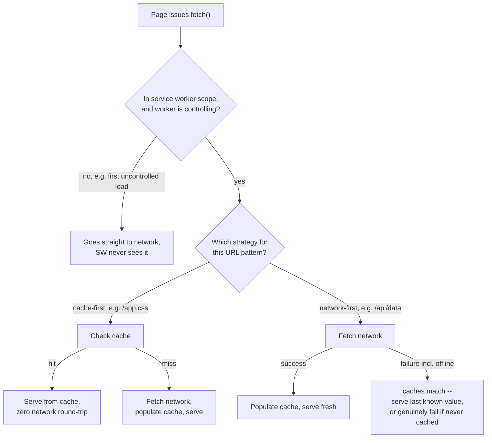

# Service Workers and PWA: Caching Strategies and Offline Support

> **Topic register:** F-404 (Service Workers and PWA: Caching Strategies and Offline Support) · Advanced tier · `00-project/frontend-topic-register.md`'s "D-F4 · Advanced Frontend Architecture & Security" tier — the fourth entry, closing a follow-up gap audit that found this tier's original three items (Security, WebSocket/Real-time, Micro-Frontends, all closed 2026-09-11) left the one remaining, commonly-asked D-F4-shaped topic — offline support and caching strategy — uncovered.
> **Provenance:** every claim in this chapter is verified against a real registered Service Worker, a real Node HTTP server with a real request counter, and a real, headless Chromium browser (Playwright) — including Playwright's own genuine browser-context-level offline mode (`setOffline(true)`), not a mocked `fetch` failure — at [`practice/frontend/service-workers-and-pwa/`](../../practice/frontend/service-workers-and-pwa/README.md).

## Table of Contents

1. [Learning Objectives](#learning-objectives)
2. [Why This Matters in Interviews](#why-this-matters-in-interviews)
3. [Mental Model](#mental-model)
4. [Definition and Purpose](#definition-and-purpose)
5. [Core Concepts](#core-concepts)
6. [Internal Implementation](#internal-implementation)
7. [Diagrams](#diagrams)
8. [Real Verified Demo](#real-verified-demo)
9. [Production Scenarios](#production-scenarios)
10. [Trade-offs](#trade-offs)
11. [Decision Framework](#decision-framework)
12. [Common Mistakes](#common-mistakes)
13. [Anti-Patterns](#anti-patterns)
14. [Best Practices](#best-practices)
15. [Interview Answer Framework](#interview-answer-framework)
16. [Interview Questions](#interview-questions)
17. [Summary](#summary)
18. [Key Takeaways](#key-takeaways)
19. [Cheat Sheet](#cheat-sheet)
20. [Flashcards](#flashcards)
21. [Practice Exercises](#practice-exercises)
22. [Solutions](#solutions)
23. [Additional Reading](#additional-reading)
24. [Official References](#official-references)

---

## Learning Objectives

By the end of this chapter you can explain what a service worker actually is (a script that intercepts network requests for pages in its scope), correctly choose between cache-first and network-first strategies for a given resource, and cite a real, executed demonstration proving both strategies' behavior — including genuine offline mode with a resource that succeeds from cache and a different resource that genuinely fails, proving offline support is real and selective, not a blanket guarantee.

## Why This Matters in Interviews

A service worker is one of the few browser APIs that runs code *between* the page and the network, which is exactly why interviewers ask about it: it tests whether a candidate understands request interception as a real, separate execution context (the service worker doesn't share memory or a call stack with the page), not just "a way to make an app work offline." A candidate who can only say "it caches stuff" hasn't distinguished cache-first from network-first, hasn't explained why a page's own *first* load isn't controlled by a service worker still installing, and can't answer the natural interview follow-up: "what happens if the user is offline and requests something that was never cached?"

## Mental Model

Treat a service worker as a programmable proxy your own code installs between the browser and the network, for every request from pages within its scope — not a cache the browser manages for you automatically, but a script you write that decides, per request, whether to answer from Cache Storage, go to the network, or do both. The two most common strategies answer the same underlying question differently: cache-first asks "do I already have this? if so, don't bother the network at all"; network-first asks "can I get a fresh answer right now? only fall back to what I already have if I genuinely can't."

## Definition and Purpose

A **service worker** is a JavaScript file, registered by a page, that runs in its own separate thread and execution context, and can intercept every `fetch` request made by pages within its registered scope via a `fetch` event handler. **Cache Storage** (the `caches` API) is a real, persistent, origin-scoped storage mechanism a service worker uses to save and retrieve full `Request`/`Response` pairs. Together they exist to make two things possible that a page alone cannot do reliably: serving assets without any network round-trip at all (cache-first), and gracefully degrading to a last-known-good response when the network genuinely isn't available (network-first with a cache fallback) — the mechanism underlying real offline support and Progressive Web Apps.

## Core Concepts

### A page's own first request usually isn't controlled by the service worker installing on that same load

A common misconception is that registering a service worker immediately puts every request from the current page under its control. In fact, per spec, a page that triggers a service worker's *first* registration is not "controlled" by that worker during that same load — the initial `<link>`/`<script>` requests go straight to the network, uncontrolled, exactly as if no service worker existed yet. Calling `self.clients.claim()` in the worker's `activate` handler is the real, specific mechanism that takes control of already-open pages immediately, without requiring a reload — this chapter's demo relies on it explicitly to avoid needing a page reload mid-test.

### Cache-first and network-first answer different real trade-offs, not the same one with different names

Cache-first (check cache, only hit network on a genuine miss) is correct for assets that rarely change and where speed matters more than absolute freshness — a stylesheet, a logo, a font. Network-first (try the network, fall back to cache only on genuine failure) is correct for data that should be as fresh as possible whenever possible, while still degrading gracefully rather than failing outright when the network is unavailable. Using cache-first for frequently-changing data serves stale content silently; using network-first for a static asset adds a real, unnecessary network round-trip on every single load when the asset was never going to change.

### Offline support is real and selective, never a blanket guarantee

A common, costly assumption is that "the app has a service worker" means "the app works offline." In fact, only requests that match a caching strategy that actually populates and reads from the cache will survive being offline — anything else genuinely fails, exactly as it would with no service worker at all. This chapter's own demo proves this directly: a cached asset loads successfully offline, while a resource that was never fetched or cached fails with a real `TypeError: Failed to fetch`, in the same offline browser context, at the same moment.

## Internal Implementation

**Real cache-first strategy** (`practice/frontend/service-workers-and-pwa/public/sw.js`):

```javascript
if (url.pathname === '/app.css') {
  event.respondWith(
    caches.match(event.request).then((cached) => {
      if (cached) return cached;
      return fetch(event.request).then((networkResponse) => {
        return caches.open(CACHE_NAME).then((cache) => {
          cache.put(event.request, networkResponse.clone());
          return networkResponse;
        });
      });
    })
  );
  return;
}
```

**Real network-first strategy, same file**:

```javascript
if (url.pathname === '/api/data') {
  event.respondWith(
    fetch(event.request)
      .then((networkResponse) => {
        return caches.open(CACHE_NAME).then((cache) => {
          cache.put(event.request, networkResponse.clone());
          return networkResponse;
        });
      })
      .catch(() => caches.match(event.request))
  );
  return;
}
```

Real captured output (`practice/frontend/service-workers-and-pwa/output-transcript.txt`) — cache-first, 3 repeated fetches, zero new server requests:

```
=== 2. Cache-first strategy for /app.css: repeated fetches should NOT increase server request count ===
  fetch #1 of /app.css returned 75 bytes
  fetch #2 of /app.css returned 75 bytes
  fetch #3 of /app.css returned 75 bytes
  Server cssRequestCount before: 2, after 3 more fetches: 2 (real proof: cache-first served all 3 with zero new network hits)
```

Network-first, every online fetch genuinely reaching the server:

```
=== 3. Network-first strategy for /api/data: each online fetch SHOULD hit the real server ===
  fetch #1 of /api/data returned value=1
  fetch #2 of /api/data returned value=2
  Server apiRequestCount before: 0, after 2 more fetches: 2 (real proof: network-first hit the server every time while online)
```

Real, genuine offline mode (`browserContext.setOffline(true)`), proving offline support is real and selective:

```
=== 4. Real offline mode (Playwright browser-context-level network cutoff, not a mocked failure) ===
  Offline fetch of /app.css (cached asset): {"ok":true,"bytes":75}
  Offline fetch of /api/data (network-first, falls back to last cached value): {"ok":true,"data":{"value":2,"servedByRequestNumber":2}}
  Offline fetch of /never-cached.txt (never cached, no SW strategy applies): {"ok":false,"error":"TypeError: Failed to fetch"}
  Server counts unchanged during offline fetches (confirms no real network reached the server): cssRequestCount=2, apiRequestCount=2
```

Re-run twice to confirm reliability: byte-identical output both times, fully deterministic.

## Diagrams



## Real Verified Demo

[`practice/frontend/service-workers-and-pwa/`](../../practice/frontend/service-workers-and-pwa/README.md) — a real Node HTTP server with a real, server-side request counter (so cache hits are proven by the *absence* of a server-side count increase, not by a client-side claim), a real registered service worker with `clients.claim()` for immediate control, and a real Playwright-driven Chromium browser exercising genuine offline mode via `browserContext.setOffline(true)`.

## Production Scenarios

**Symptoms.** Users on a flaky mobile connection report a page showing stale data indefinitely, with no indication anything is wrong, even once their connection recovers. **Initial hypotheses.** A caching bug, or the service worker itself is stuck. **Evidence collected.** The affected endpoint uses a cache-first strategy — the same strategy this chapter's demo uses correctly for a static asset, but here applied to a frequently-changing data endpoint by mistake. Once cached, the response never gets re-checked against the network, ever, regardless of connectivity. **Diagnosis.** The wrong strategy was chosen for this resource's actual freshness requirement — cache-first is correct for assets that rarely change, not for data that should track the network's current state. **Immediate mitigation.** Force a cache invalidation (bump the `CACHE_NAME` version, triggering a fresh install) to clear the stale entries. **Permanent remediation.** Switch the endpoint to network-first, matching the freshness the data actually needs, with cache-first reserved for genuinely static assets. **Trade-offs.** Network-first costs a real network round-trip on every request when online, in exchange for staying fresh; the team accepted this cost specifically because staleness had already caused real user confusion. **Prevention.** Choose a caching strategy explicitly per resource type based on its real freshness requirement, rather than applying one strategy uniformly across an entire service worker. **Interview lesson.** A candidate who names "wrong strategy for this resource's freshness needs" — rather than "the cache is broken" — demonstrates the precise mental model this chapter exists to build.

## Trade-offs

Cache-first delivers assets with zero network latency once cached, at the cost of potentially serving stale content indefinitely if applied to something that actually changes. Network-first stays as fresh as possible whenever the network is available, at the cost of a real round-trip on every request and added implementation complexity (a `.catch()` fallback path that itself needs testing, as this chapter's own offline test demonstrates). Registering a service worker at all adds a real, separate execution context and lifecycle (install/activate/fetch) a team must understand and debug, versus no service worker and simply letting every request go to the network uncontrolled.

## Decision Framework

Use cache-first for assets that rarely or never change post-deploy (versioned static assets, fonts, logos). Use network-first for data that should reflect current server state whenever possible, while still degrading gracefully offline. Skip a service worker entirely for an application with no real offline requirement and no meaningful asset-caching win to claim — the added lifecycle complexity isn't free, and per Core Concepts above, "we have a service worker" is not itself a feature unless a real strategy is behind it.

## Common Mistakes

Conceptual: assuming the page's own first load is automatically controlled by the service worker registering during that same load, missing the real `clients.claim()` mechanism needed to avoid a reload. Conceptual: applying cache-first to frequently-changing data, serving stale content indefinitely with no re-check. Conceptual: claiming "the app works offline" without having actually tested a genuine offline scenario against every route the app depends on, including ones that were never meant to be cached.

## Anti-Patterns

Registering a service worker with no coherent caching strategy at all — an empty `fetch` handler pass-through provides no real benefit over having no service worker, while still adding lifecycle complexity. Applying one single caching strategy uniformly to every request regardless of the resource's actual freshness requirement. Never testing genuine offline behavior (only testing that the service worker registers successfully), leaving the actual offline-fallback code path unverified until a real user hits it.

## Best Practices

Choose a caching strategy explicitly per resource type, based on its real freshness requirement, not a single default applied everywhere. Use `clients.claim()` in `activate` when immediate control without a reload matters for the app's own testing or UX. Version the cache name and clear stale caches on `activate` when deploying a new service worker version. Test genuine offline behavior directly (a real offline mode, not just "the service worker registered without erroring") against both cached and uncached routes, exactly as this chapter's own demo does.

## Interview Answer Framework

### 30-Second Answer

A service worker is a script that intercepts network requests for pages in its scope and can serve them from Cache Storage. Cache-first checks the cache before ever trying the network; network-first tries the network first and falls back to the cache only on failure. Offline support only works for requests a strategy actually caches — everything else still genuinely fails.

### 2-Minute Answer

Add: the page's own first load usually isn't controlled by a service worker still installing during that same load — `clients.claim()` in `activate` is the real mechanism to take control immediately without a reload. A real demo proves both strategies directly: cache-first served 3 repeated fetches with zero new server requests; network-first hit the real server on every online fetch; and in genuine offline mode, a cached asset succeeded while a never-cached resource genuinely failed with a real fetch error, in the same offline context.

### 10-Minute Deep Dive

Walk through the demo's real evidence phase by phase: controlled-vs-uncontrolled first load, cache-first's zero-new-requests proof, network-first's every-request-hits-server proof, then the offline block proving selective, real degradation (cached succeeds, never-cached fails, server counters unchanged confirming no real network reached it), then real recovery once back online. Connect to the production scenario: a cache-first-on-frequently-changing-data mistake serving stale content indefinitely, diagnosed by recognizing the strategy mismatch rather than assuming a cache bug.

### Whiteboard Explanation

Draw the browser, the service worker (as a separate box with its own thread, not inside the page), and the network, with the service worker sitting between page requests and the network. Draw two paths off the service worker box: cache-first (check cache first, network only on miss) and network-first (network first, cache only as fallback). Label the offline scenario explicitly: a cached route still reaches the cache box; an uncached route has nothing to fall back to and genuinely fails.

### Production Example

See Production Scenarios above: a cache-first strategy mistakenly applied to frequently-changing data, serving stale content indefinitely until diagnosed as a strategy mismatch and switched to network-first.

### Trade-offs to Mention

Cache-first's staleness risk if applied to changing data; network-first's real per-request network cost and added fallback-path complexity; the real lifecycle overhead of a service worker at all versus its actual offline/performance win for a given app.

### Common Candidate Mistakes

Claiming a registered service worker automatically controls the current page's first load. Describing "the app works offline" without qualifying which specific requests actually survive offline and why. Conflating cache-first and network-first as interchangeable "caching," without naming the specific freshness trade-off each one makes.

### Typical Follow-Up Questions

"What happens if a page requests something offline that the service worker never cached?" "Why might a page's very first network request after registering a service worker still hit the network directly?" "How would you decide which strategy to use for a specific new endpoint?"

### Senior-Level Expectations

Correctly distinguish cache-first from network-first by their actual freshness trade-off, and explain precisely why offline support is selective, not a blanket guarantee — naming a concrete scenario where a request would still fail offline.

### Staff-Level Discussion

Deciding which resources genuinely need offline support, and which caching strategy each one needs, is a real product and engineering trade-off — Staff-level framing weighs the real implementation and testing cost of a service worker's lifecycle against the actual offline/performance value for the specific application, rather than adding one reflexively because "PWAs are best practice."

## Interview Questions

### Question 1

**Question:** "Your team just added a service worker to cache API responses. A user reports seeing week-old data even though they have a good connection. What's your first hypothesis?"
**Why interviewers ask this:** Tests whether a candidate reaches for the real, specific mechanism (wrong caching strategy for this resource) rather than a vague "the cache is broken."
**Expected answer:** The endpoint is likely using a cache-first strategy when it should use network-first, so it never re-checks the network once cached, regardless of connectivity.
**Minimum acceptable answer:** Names a caching-strategy mismatch as a plausible cause.
**Strong Senior answer:** Explains cache-first vs. network-first's real freshness trade-off precisely and proposes the specific fix.
**Staff-level extension:** Discusses cache versioning/invalidation as the immediate mitigation versus fixing the strategy choice as the permanent remediation.
**Common mistakes:** Assuming the service worker itself is malfunctioning rather than correctly executing the wrong strategy.
**Likely follow-ups:** "How would you verify your hypothesis without guessing?"
**Evaluation criteria (1–5):** 1: no real hypothesis. 3: names a strategy mismatch. 5: full mechanism plus immediate/permanent remediation split.

### Question 2

**Question:** "Does having a service worker mean your app works offline?"
**Why interviewers ask this:** Tests whether a candidate understands offline support as selective and strategy-dependent, or believes it's an automatic property of having a service worker at all.
**Expected answer:** No — only requests that match a caching strategy which actually populates and reads from the cache will survive being offline; anything else fails exactly as it would with no service worker.
**Minimum acceptable answer:** States that offline support isn't automatic.
**Strong Senior answer:** Gives a concrete example of a request that would still fail offline (never cached, or a strategy with no fallback).
**Staff-level extension:** Discusses how to systematically test genuine offline behavior across every route an app depends on, rather than assuming coverage from a successful service-worker registration alone.
**Common mistakes:** Claiming "yes" without qualification.
**Likely follow-ups:** "How would you test this claim for real, rather than assuming it?"
**Evaluation criteria (1–5):** 1: claims offline support is automatic. 3: correctly says it's selective. 5: full explanation plus a concrete testing approach.

## Summary

A service worker is a programmable request interceptor with its own execution context; cache-first and network-first answer different real freshness trade-offs, not variations on the same idea; and offline support is real only for requests a strategy actually caches — this chapter's own demo proves a cached asset succeeding and a never-cached one genuinely failing, in the same offline browser context, at the same moment.

## Key Takeaways

- A service worker intercepts requests for pages in its scope; a page's own first load usually isn't controlled by a worker still installing during that same load, unless `clients.claim()` is used.
- Cache-first: check cache first, network only on a genuine miss — correct for rarely-changing assets.
- Network-first: try network first, cache only as a fallback — correct for data that should stay as fresh as possible.
- Offline support is selective: a real demo shows a cached asset succeeding offline while a never-cached resource genuinely fails with `TypeError: Failed to fetch`, in the identical offline context.
- "We have a service worker" is not itself a feature — the strategy chosen per resource is what actually determines behavior.

## Cheat Sheet

**Mental model:** a service worker is a programmable proxy between the page and the network, not an automatic cache.
**Cache-first:** cache check → serve if hit → network only on miss. Use for rarely-changing assets.
**Network-first:** network attempt → cache only as fallback on failure. Use for data that should stay fresh.
**Real demo result:** cache-first served 3 fetches with 0 new server requests; network-first hit the server every time online; offline mode succeeded for a cached asset and genuinely failed (`TypeError: Failed to fetch`) for a never-cached one.
**Control gotcha:** the page's own first load isn't controlled by the worker installing during that load — use `clients.claim()` for immediate control without a reload.
**Related:** [WebSocket and Server-Sent Events](websocket-and-server-sent-events-for-realtime-ui.md) · [Next.js Data Fetching and Caching](nextjs-data-fetching-and-caching.md) (a different, server-side caching layer — no overlap)

## Flashcards

### Card: Why the page's first load isn't controlled by a service worker still installing

**Prompt:** If a page registers a service worker for the first time, does that same page load's own resource requests get intercepted by it?

**Answer:** No, not by default — per spec, the page that triggers a service worker's first registration isn't "controlled" by it during that same load; its requests go straight to the network. `self.clients.claim()` in the worker's `activate` handler is the real mechanism that takes control of already-open pages immediately, without a reload.

**Why it matters:** A very common source of confusion when a service worker "doesn't seem to be working" on first load — it's working correctly, just not controlling that specific load yet.

**Common trap:** Assuming a reload is always required to see a service worker's effect, when `clients.claim()` avoids that.

### Card: Cache-first vs. network-first, the real trade-off

**Prompt:** What's the actual difference in trade-off between cache-first and network-first, not just the mechanical order of operations?

**Answer:** Cache-first prioritizes speed and zero network cost, at the risk of staleness — correct for assets that rarely change. Network-first prioritizes freshness whenever possible, at the cost of a real network round-trip on every request, while still degrading gracefully via a cache fallback when the network genuinely fails.

**Why it matters:** Choosing the wrong strategy for a resource's actual freshness needs is a real, common production bug (see this chapter's Production Scenario).

**Common trap:** Treating the two strategies as interchangeable "caching" rather than deliberate trade-offs for different resource types.

### Card: Real measured evidence — offline is selective, not automatic

**Prompt:** What did a real demo prove about offline support with a service worker?

**Answer:** In genuine offline mode (`browserContext.setOffline(true)`), a cached asset (`/app.css`) loaded successfully, and a network-first endpoint (`/api/data`) fell back to its last cached value — but a resource that was never fetched or cached (`/never-cached.txt`) genuinely failed with `TypeError: Failed to fetch`, in the identical offline context, at the same moment.

**Why it matters:** Directly disproves the common assumption that "having a service worker" means "the whole app works offline."

**Common trap:** Claiming full offline support without having tested every route, including ones with no caching strategy applied.

## Practice Exercises

1. Add a third route to `sw.js` implementing stale-while-revalidate (serve the cached response immediately if present, then update the cache in the background from a real network fetch for next time) and extend `run.js` to prove, with real server request counts, that the served response is one fetch "behind" the true current server value.
2. Modify the offline test to also attempt a `POST` request to `/api/data` while offline, and explain in a comment why a mutating request needs a fundamentally different strategy (background sync / retry queue) than a cache-fallback read.

## Solutions

Exercise 1: cache the response immediately on `fetch`, return the cached version synchronously if present, and separately kick off (without awaiting) a real network fetch that updates the cache for the *next* request — a real test would show request N's response reflecting request N-1's server value, proving the "stale" half of stale-while-revalidate concretely. Exercise 2: a cache fallback only helps for reads (serving a previously-successful response); a `POST` while offline has no previous response to fall back to and, if silently dropped, loses real user data — the correct pattern is queuing the request (e.g. via the Background Sync API) to genuinely retry once connectivity returns, a fundamentally different mechanism than anything this chapter's read-only cache strategies cover.

## Additional Reading

MDN's Service Worker API documentation (linked below) covers the full lifecycle (install/activate/fetch/message) and the Cache Storage API's complete surface beyond the two strategies this chapter focuses on.

## Official References

- [MDN: Service Worker API](https://developer.mozilla.org/en-US/docs/Web/API/Service_Worker_API)
- [W3C Service Workers specification](https://w3c.github.io/ServiceWorker/)
