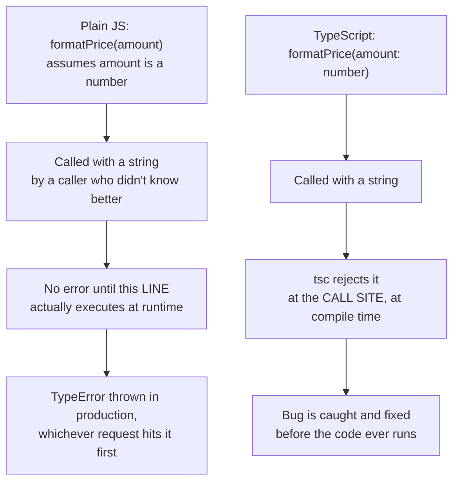
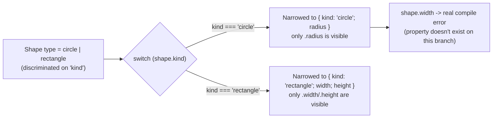

# TypeScript Fundamentals: Types, Interfaces, and Generics

> **Topic register:** F-003 · "Web & Language Fundamentals" (D-F0) · Beginner/Intermediate tier · `00-project/frontend-topic-register.md`
> **Scope note:** this chapter exists because [TypeScript with React](react-typescript.md) (F-119) is an Advanced-tier chapter that teaches discriminated unions, generic components, and exhaustiveness checking *as applied to React* — but never teaches plain TypeScript itself. It assumes a reader who already knows what an `interface` is, what `<T>` means, and how a union type narrows. That assumption left a real gap: a reader who knows JavaScript but has never used TypeScript had nowhere to start. This chapter is that starting point — it teaches TypeScript in isolation, with no React, no JSX, no framework, so that F-119 can be read immediately afterward without re-deriving plain-TypeScript concepts from React-specific examples.
> **Provenance:** every claim in this chapter is verified against real, compiled TypeScript 6.0.3 code at [`practice/frontend/typescript-fundamentals/`](../../practice/frontend/typescript-fundamentals/), including a genuine broken/fixed pair — a plain-JavaScript bug that really crashes at runtime (captured via `node`), then the identical mistake in TypeScript, really rejected by `tsc` at compile time (captured via `npx tsc -p tsconfig.json`, both before and after the fix — see [`tsc-output-before-fix.txt`](../../practice/frontend/typescript-fundamentals/tsc-output-before-fix.txt) and [`tsc-output-after-fix.txt`](../../practice/frontend/typescript-fundamentals/tsc-output-after-fix.txt)).

## Table of Contents

1. [Learning Objectives](#learning-objectives)
2. [Why This Matters in Interviews](#why-this-matters-in-interviews)
3. [Mental Model](#mental-model)
4. [Definition and Purpose](#definition-and-purpose)
5. [Core Concepts](#core-concepts)
6. [Internal Implementation](#internal-implementation)
7. [Diagrams](#diagrams)
8. [Real Verified Demos](#real-verified-demos)
9. [Production Scenarios](#production-scenarios)
10. [Trade-offs](#trade-offs)
11. [Decision Framework](#decision-framework)
12. [Common Mistakes](#common-mistakes)
13. [Anti-Patterns](#anti-patterns)
14. [Best Practices](#best-practices)
15. [Interview Answer Framework](#interview-answer-framework)
16. [Interview Questions](#interview-questions)
17. [Summary](#summary)
18. [Key Takeaways](#key-takeaways)
19. [Cheat Sheet](#cheat-sheet)
20. [Flashcards](#flashcards)
21. [Practice Exercises](#practice-exercises)
22. [Solutions](#solutions)
23. [Additional Reading](#additional-reading)
24. [Official References](#official-references)

---

## Learning Objectives

By the end of this chapter you can:

- Explain, with a real reproduced example, what class of bug TypeScript catches that plain JavaScript cannot — and why that matters even before you write a single line of React.
- Choose between `interface` and `type` alias, and correctly predict whether two independently-declared types are assignable to each other based on shape (structural typing), not name.
- Model "one of several possible shapes" with a union type, "all of these shapes at once" with an intersection type, and a variant with different required fields per case with a discriminated union.
- Read and write a generic function or type (`<T>`), and explain in plain language what problem it solves that `any` does not.

## Why This Matters in Interviews

Almost every modern frontend interview, from a first screen to a Staff-level system-design round, assumes TypeScript fluency the moment any code is written on a shared editor — not because TypeScript itself is usually the topic, but because it's the default language of nearly every real frontend job today. A candidate who pauses to ask "wait, how do I type this" mid-problem loses time that should go to the actual problem, exactly the same failure mode this repository's Java syntax-fundamentals chapter describes for `for` loop hesitation. The specific interview tell this chapter targets is subtler than "knows TypeScript or doesn't": candidates who learned TypeScript by copying `interface Props { ... }` blocks without understanding *why* the compiler accepts or rejects a given value can describe syntax but cannot debug a real type error, predict whether two shapes are compatible, or explain why `any` is dangerous beyond "it's bad practice." This chapter is built to produce the mechanism-level understanding — the same standard [TypeScript with React](react-typescript.md) applies to discriminated unions and generics specifically for component props.

## Mental Model

**TypeScript adds nothing to what your code does at runtime — it exists entirely to catch a category of mistake *before* runtime, by checking that the shapes of your values are used consistently everywhere they flow.** Every feature in this chapter follows from that one idea. A basic type annotation lets the compiler verify a value is used the way its declared type promises. An interface or type alias names a shape once so it can be checked at every place that shape is used. A union type says "this could be any of these shapes, so only do what's safe for all of them until you check which one it actually is." A generic type parameter lets one function or component work correctly across many concrete shapes while the compiler still checks that every usage is internally consistent. None of this exists at runtime — compile TypeScript to JavaScript and every type annotation disappears entirely. The value is purely earlier, cheaper bug detection, not different program behavior.

## Definition and Purpose

**TypeScript** is a strict syntactical superset of JavaScript — every valid JavaScript program is (with rare edge cases) valid TypeScript — that adds a static type system checked by a separate compiler (`tsc`) before the code ever runs. It was created at Microsoft and open-sourced in 2012 specifically to make large JavaScript codebases more tractable: JavaScript's lack of static types means a function's actual expected input shape lives only in comments, tests, or a developer's memory, and a mismatch is discovered only when the wrong code path executes at runtime — sometimes in production, sometimes never, if the buggy path is rare. TypeScript's compiler checks every value's declared or inferred type against every place it's used, and reports a mismatch immediately, at compile time, with the exact file and line — turning "some unknown fraction of type mistakes might surface later" into "every type mistake this chapter's techniques model is caught now."

**A type** in TypeScript describes the shape of a value — what properties it has, what a function's parameters and return value look like — checked structurally (by shape) rather than nominally (by declared name), which is the single most different idea from statically-typed languages like Java, where two classes with identical fields are still different, incompatible types unless one explicitly extends or implements the other.

## Core Concepts

### Basic types, inference, and the `any` vs. `unknown` distinction

`02-basic-types.ts` covers TypeScript's primitive types (`string`, `number`, `boolean`), arrays (`number[]`), tuples (`[number, string]` — a fixed-length array where each position has its own specific type, unlike a same-typed array), and enums (a named set of related constants). TypeScript **infers** a type from a variable's initializer when no annotation is given (`let count = 3;` is inferred as `number`, and reassigning a string to it is still a real compile error) — an explicit annotation is needed only when there's no initializer to infer from, or when you deliberately want a wider or narrower type than inference would pick.

`any` and `unknown` both accept any value, but behave oppositely once you have one: `any` completely disables type checking on everything derived from it — calling a nonexistent method on an `any`-typed value compiles without complaint, silently defeating TypeScript's entire purpose. `unknown` accepts any value but *forbids* using it at all until you narrow its type first (with `typeof`, `instanceof`, or a custom check) — it keeps the safety net that `any` throws away, while still being honest that the value's real type isn't known yet.

### Interfaces, type aliases, and structural typing

`03-interfaces-and-type-aliases.ts` demonstrates the practical difference between `interface` (can be reopened and merged across multiple declarations; describes only object/class shapes) and `type` alias (cannot be redeclared; can alias *any* type, including unions, tuples, and primitives, not just objects) — and then demonstrates TypeScript's real duck-typing model directly: two completely unrelated interfaces, `Point` and `Coordinate`, both declaring `{ x: number; y: number }` with no `extends` or `implements` connecting them, are still mutually assignable, because TypeScript checks the *shape* of the value being assigned, not which interface name it was declared under. This is verified, not asserted: a `Coordinate`-typed value assigned directly to a `Point`-typed variable compiles cleanly.

### Union, intersection, and discriminated union types

`04-union-intersection-discriminated.ts` covers three related but distinct tools. A **union type** (`string | number`) means "this value is one of these types" — TypeScript only permits operations valid on *every* member until you narrow with a runtime check like `typeof`. An **intersection type** (`Timestamped & Named`) means "this value has every field from every member at once" — a value typed this way must satisfy all combined requirements simultaneously. A **discriminated union** is a union of *object* types sharing one common, literal-typed field (a "discriminant," like `kind: "circle" | "rectangle"`) — switching or branching on that one field lets TypeScript narrow the *entire* object to exactly the matching member inside each branch, which is what makes it possible to require different fields per variant and have the compiler enforce it. This is the exact pattern [TypeScript with React](react-typescript.md) uses for variant component props (an `'error'` alert requiring `onRetry`, other variants not) — this chapter's `Shape` (`circle` | `rectangle`) demo is that same mechanism with no React involved at all.

### Generics: reuse without losing type safety

`05-generics.ts` demonstrates what problem generics solve: without them, a function that needs to work across multiple types either gets duplicated per type, or gets widened to `any` and silently loses all safety. A generic function like `identity<T>(value: T): T` declares `T` as a type *parameter* — a placeholder TypeScript fills in per call site based on the actual argument, verified directly here by calling `identity(42)` (inferred `T = number`) and `identity("hello")` (inferred `T = string`) from the *same* function definition, with the compiler still correctly rejecting `.toUpperCase()` on the numeric result. A generic constraint (`<T extends HasId>`) narrows what `T` is allowed to be — only types that structurally satisfy `HasId` — while still accepting any such type, not one hardcoded shape.

### Function types, optional properties, and readonly properties

`06-function-types-optional-readonly.ts` covers typing a callback parameter or variable by its call signature (`(a: number, b: number) => number`), optional properties (`nickname?: string`, which forces every use site to handle the `string | undefined` possibility rather than assuming the field is always present), and `readonly` properties — which are a compile-time-only guarantee (real, but not equivalent to `Object.freeze()`'s runtime immutability, demonstrated directly by assigning through a differently-typed alias to the same object).

## Internal Implementation

`tsc` checks a value's assignability to a target type by comparing **shape**, not declared name — this is why `Point` and `Coordinate` are interchangeable in this chapter's demo despite no declared relationship. For a plain object *literal* assigned directly at the point of declaration, TypeScript additionally applies "excess property checking" — rejecting properties the target type doesn't declare — specifically to catch typos in what would otherwise look like a harmlessly extra field; this stricter check applies only to literals written directly at the assignment site, not to a pre-existing variable of a wider type being assigned through (this chapter's `coordinateWithLabel` demo shows the same value assignable when passed via a variable, even though a literal with the same extra field, assigned directly, would be rejected). For a discriminated union, narrowing works through **control-flow analysis**: TypeScript tracks, branch by branch, which possible values remain after each check on the discriminant field — inside a `case "circle":` block, every other union member is provably excluded, so the compiler treats the value as exactly that one member's shape for the rest of the block. For generics, type inference resolves `T` once per call site, typically left-to-right in the order TypeScript encounters the type-relevant arguments, and then checks every *other* use of `T` in that same call against the now-resolved type — which is why a generic function or component with several props sharing one `T` can produce an error on one prop that's actually caused by a mismatch on a different prop (`react-typescript.md`'s own internals section documents this exact effect for a generic `List<T>` component).

## Diagrams

## Real Verified Demos

All seven files are real TypeScript 6.0.3 code, checked with `tsc` — [`practice/frontend/typescript-fundamentals/`](../../practice/frontend/typescript-fundamentals/):

- [`01-why-typescript-bug.js`](../../practice/frontend/typescript-fundamentals/src/01-why-typescript-bug.js) — the plain-JS version of `formatPrice`, executed with `node`, really throws `TypeError: amount.toFixed is not a function` on its last call.
- [`01-why-typescript-fix.ts`](../../practice/frontend/typescript-fundamentals/src/01-why-typescript-fix.ts) — the identical function, typed. The identical mistake, temporarily reintroduced, produced a real captured `tsc` error (`tsc-output-before-fix.txt`); reverted, the whole project compiles with zero errors (`tsc-output-after-fix.txt`).
- [`02-basic-types.ts`](../../practice/frontend/typescript-fundamentals/src/02-basic-types.ts) — primitives, arrays, tuples, enums, inference, `any` vs. `unknown`.
- [`03-interfaces-and-type-aliases.ts`](../../practice/frontend/typescript-fundamentals/src/03-interfaces-and-type-aliases.ts) — `interface` vs. `type`, and the `Point`/`Coordinate` structural-typing proof.
- [`04-union-intersection-discriminated.ts`](../../practice/frontend/typescript-fundamentals/src/04-union-intersection-discriminated.ts) — unions, intersections, and the `Shape` discriminated union with narrowing.
- [`05-generics.ts`](../../practice/frontend/typescript-fundamentals/src/05-generics.ts) — `identity<T>`, a generic `Box<T>`, and a constrained `<T extends HasId>`.
- [`06-function-types-optional-readonly.ts`](../../practice/frontend/typescript-fundamentals/src/06-function-types-optional-readonly.ts) — function types, optional properties, `readonly`.

Full reproduction steps and both real captured `tsc` transcripts are in the practice directory's [README.md](../../practice/frontend/typescript-fundamentals/README.md).

## Production Scenarios

**Scenario: an API contract change silently breaks a price display, caught immediately by TypeScript instead of by a customer.** A backend team changes a `/products/:id` endpoint's `price` field from a JSON number to a formatted string (`"19.99"` instead of `19.99`) as part of an internationalization effort, without updating every consumer. A frontend component calling `formatPrice(product.price)` — exactly this chapter's central example — is one of dozens of call sites touching that field. In a plain-JavaScript codebase, this ships silently: nothing about the call site looks wrong, and the bug surfaces only when a real user's browser executes that exact code path, producing a blank price or a crashed component, reported after the fact as a confusing, hard-to-reproduce customer complaint. In a TypeScript codebase where `product.price` is typed as `number` (matching a shared `Product` interface) and the API client's response type is updated to reflect the real contract change, every affected call site — not just the ones a developer happened to think to check — fails to compile immediately, listed exhaustively by `tsc`, before the change is even merged. The cost is paid once, at the type definition; the value compounds across every call site the type actually reaches.

## Trade-offs

| Concern | Plain JavaScript | TypeScript with real types | TypeScript with `any` escape hatches |
|---|---|---|---|
| When a shape mismatch is caught | At runtime, whenever that exact code path executes (maybe never, maybe in production) | At compile time, at the exact call site, before the code runs | Same as plain JavaScript — `any` disables checking entirely |
| Upfront authoring cost | None | Real, but usually small (annotate function signatures, model variants) | None |
| Refactoring confidence | Low — a renamed or removed field is discovered by testing or by users | High — every affected call site is listed by the compiler | Low — identical to plain JavaScript wherever `any` is used |
| Editor/IDE support (autocomplete, inline docs) | Limited, inferred loosely | Strong — the editor knows every field and function signature | Degraded wherever `any` appears |

## Decision Framework

1. **Is a value's shape used in more than one place (a function called from multiple sites, a shared data structure)?** → Type it explicitly with an `interface` or `type` alias rather than relying on inference alone — the payoff compounds with every additional use site.
2. **Does a component or function's required fields genuinely change based on a mode/variant?** → Model it as a discriminated union, not a pile of optional fields — an optional field never forces anyone to provide it even when the business logic requires it for that specific case.
3. **Would the exact same logic work identically across several different, otherwise-unrelated types, differing only in the specific type of the data itself?** → Make it generic (`<T>`) rather than duplicating it per type or widening to `any`.
4. **Tempted to reach for `any` because a type feels "too complicated to model right now"?** → Reach for `unknown` instead if you must accept an unknown-shaped value, since it forces a narrowing check before use — `any` should be a rare, explicitly tracked exception, not a default escape hatch.

## Common Mistakes

- Reaching for `any` the moment a type is slightly inconvenient to write correctly, rather than taking the small extra time to model it — this silently reintroduces every bug class TypeScript exists to prevent, for that value and everything derived from it.
- Believing `interface`/`type` names are checked, not shapes — assuming two differently-named types with identical fields are incompatible, or (the more dangerous version) assuming they must be *related* by inheritance to be compatible, when TypeScript's structural model requires neither.
- Modeling a variant-specific requirement as an optional field (`onRetry?: () => void`) instead of a discriminated union — this compiles cleanly whether or not the field was actually provided, silently discarding the exact compile-time guarantee a discriminated union provides.
- Confusing `readonly` with runtime immutability — assigning through a differently-typed alias to the same underlying object still mutates it, because `readonly` is a compile-time-only check, not `Object.freeze()`.

## Anti-Patterns

- **Sprinkling `as SomeType` type assertions to silence a compiler error** rather than fixing the actual type mismatch — this doesn't make the underlying bug go away, it hides it from the compiler, often reintroducing exactly the class of runtime error typing was meant to prevent.
- **A giant, loosely-typed `Props`-style interface with many optional fields and ad-hoc runtime checks** ("`if (variant === 'error' && !onRetry) console.warn(...)`") reimplementing at runtime — with weaker guarantees — what a discriminated union would catch for free at compile time.

## Best Practices

- Prefer letting TypeScript infer types from initializers and return statements where the inferred type is already correct; add explicit annotations at function boundaries (parameters, return types) and shared data shapes, where inference has nothing to work from or where being explicit documents intent.
- Default to `unknown` over `any` for genuinely unknown-shaped values (parsed JSON, third-party API responses) — it preserves the requirement to narrow before use.
- Reach for a discriminated union the moment a type's required fields genuinely differ by variant, rather than a pile of optional fields.
- Treat every `any` in a codebase as a tracked, temporary shortcut, not a permanent, acceptable state.

## Interview Answer Framework

### 30-Second Answer

TypeScript adds a static type system, checked by a separate compiler before the code runs, on top of JavaScript — every type annotation disappears at compile time, so it changes nothing about runtime behavior. Its entire value is catching shape mismatches (wrong-typed function arguments, missing required fields) at compile time instead of at runtime, where they'd otherwise surface as production bugs whenever that exact code path finally executes.

### 2-Minute Answer

Start from the mental model: TypeScript's only job is moving the discovery of a shape-mismatch bug earlier. Walk through the real evidence: the same `formatPrice` function, called with a string it wasn't designed for, crashes at runtime in plain JavaScript (a real captured `TypeError`) but is rejected by `tsc` at the exact call site in TypeScript, before the code ever runs. Cover structural typing (two independently-declared interfaces with the same shape are interchangeable — TypeScript checks shape, not declared name) and discriminated unions (a variant-specific required field, like `onRetry` only on an `'error'` case, becomes a real, checked constraint instead of an unenforced optional field). Close with generics as the tool that lets one function or component work across many types without either duplicating it or widening to `any` and losing all safety.

### 10-Minute Deep Dive

Cover: the structural (shape-based) type-checking model and how it differs from nominal typing in languages like Java; excess property checking's narrower scope (literals only, not variables) as a sharp edge worth knowing; discriminated unions and the control-flow narrowing mechanism that lets a switch on one field narrow an entire object's type; generic type inference's left-to-right, per-call-site resolution and why a mismatch can appear to be "blamed" on the wrong prop; and the `any`-vs-`unknown` distinction as the single most consequential everyday decision a TypeScript codebase makes about how much safety it actually keeps.

### Whiteboard Explanation

Draw two boxes side by side, both labeled with the same fields `{ x: number, y: number }` — one named `Point`, one named `Coordinate`, with no arrow connecting them. Draw a third arrow from the `Coordinate` box directly into a variable slot typed `Point`, landing on a checkmark — "compiles, because the SHAPES match, not the names." Beside it, draw a discriminated union as three boxes ("circle," "rectangle," each with different fields) and show a switch statement's arrow pointing into exactly one box per branch, landing on "only these fields are visible here."

### Production Example

A backend endpoint's `price` field changes from a JSON number to a formatted string without updating every frontend consumer. In a typed codebase, every call site touching the now-mismatched `Product.price` field fails to compile immediately and exhaustively, before the change merges; in an untyped codebase, the same bug ships silently and surfaces later as a confusing customer-reported display bug.

### Trade-offs to Mention

Real typing costs real upfront authoring effort (correctly modeling a shape or a variant), but that cost is paid once at the type definition while the payoff — every future misuse caught immediately, by the compiler, for every future contributor — recurs for the type's entire lifetime. `any` trades all of that away for zero upfront cost, which is why treating it as a tracked exception rather than a default matters.

### Common Candidate Mistakes

Describing TypeScript purely as "JavaScript with type annotations" without being able to explain WHY that matters beyond "it's safer" — unable to name a specific bug class it prevents. Reaching for `any` or an `as` assertion as a first response to a typing difficulty rather than working out the correct type. Believing `interface`s must be related by `extends` to be compatible, missing structural typing entirely.

### Senior-Level Expectations

Not the primary target of this chapter (see this repository's Scope Addendum for the frontend domain's Junior-through-Staff span) — for this chapter's Beginner/Intermediate scope, correctly explains structural typing and the `any`/`unknown` distinction with a concrete example of what each would silently allow or catch.

### Staff-Level Discussion

Not the focus of this chapter's demos; briefly, a Staff-level engineer treats TypeScript's strictness configuration itself (whether `strict` mode is on, whether `any` is banned via lint rule, whether `noImplicitAny` is enforced) as a team-scale investment decision made once in a shared config, not a per-file style choice — [TypeScript with React](react-typescript.md)'s own Staff-Level Discussion makes the same point one layer up, for exhaustiveness-checking conventions specifically.

## Interview Questions

### Question 1

**Question:** "What's the actual difference between `any` and `unknown`, and why would you ever prefer the less convenient one?"

**Expected answer:** Both accept any value, but `any` disables type checking on everything derived from it — every operation on an `any`-typed value compiles, even ones that will crash at runtime, silently defeating TypeScript's purpose for that value onward. `unknown` also accepts any value but forbids using it at all until you narrow its type with a real check (`typeof`, `instanceof`, a custom guard) — it keeps the compiler's safety net intact while still being honest that the real type isn't known yet. `unknown` is preferable specifically because it forces the narrowing check that `any` lets you skip.

**Common mistakes:** Describing them as roughly interchangeable "flexible" types; being unable to give a concrete example of something `any` would silently allow that `unknown` would catch.

**Follow-up questions:** "Where would `unknown` show up naturally in a real codebase?" (parsing JSON from an external API, a `catch` block's error parameter in strict TypeScript). "What's the fix once you have an `unknown` value you need to use?" (narrow it — a `typeof` check, an `instanceof` check, or a type-predicate function).

**Senior-level expectations (relative to this chapter's Beginner/Intermediate scope):** Gives a concrete example of code that compiles with `any` and correctly fails (until narrowed) with `unknown`.

**Staff-level expectations:** Frames banning `any` via lint rule as a team-scale convention decision, not a per-file judgment call.

### Question 2

**Question:** "Two interfaces, `Dog { name: string; bark(): void }` and `Robot { name: string; bark(): void }`, are declared completely independently — no shared base type. Is a `Robot` value assignable to a variable typed `Dog`?"

**Expected answer:** Yes. TypeScript checks structural compatibility — does the value have every property the target type requires, with compatible types — not declared name or inheritance. Since `Robot` has both `name: string` and `bark(): void`, it satisfies everything `Dog` requires, so it's assignable, regardless of the fact that nothing ever declared a relationship between them. This is exactly what this chapter's `Point`/`Coordinate` demo proves directly, not just asserts.

**Common mistakes:** Answering "no" by reasoning from nominal-typing languages (Java, C#) where this would indeed be incompatible without an explicit `implements`/`extends`; not recognizing this as TypeScript's structural ("duck") typing model specifically.

**Follow-up questions:** "Does this still hold if `Robot` has an extra property `Dog` doesn't declare?" (yes, when assigned via a variable — extra properties are fine unless it's a fresh object literal assigned directly, which triggers excess property checking). "What's one real risk of structural typing you'd want a teammate to be aware of?" (two conceptually unrelated types can be accidentally interchangeable if they happen to share a common shape, which can mask a genuine logic error the type system won't catch).

**Senior-level expectations:** States the structural-vs-nominal distinction unprompted and correctly reasons about the excess-property-checking follow-up.

**Staff-level expectations:** Not the focus of this chapter's scope.

## Summary

TypeScript's entire value follows from one idea: check the shapes of values against how they're used, before the code ever runs, and disappear entirely at compile time — proven directly in this chapter by the same `formatPrice` mistake crashing at runtime in plain JavaScript but being rejected, precisely and immediately, by `tsc` once typed. Structural typing (shape over name), unions and discriminated unions (modeling "one of several possibilities" and "different requirements per variant" as real, checked constraints), and generics (reuse without losing per-call-site safety) are the tools that make that value compound across a real codebase — and `any` is the one tool that silently gives all of it back.

## Key Takeaways

- TypeScript changes nothing about runtime behavior — every type annotation disappears at compile time; its entire value is catching shape mismatches earlier, proven here with a real crash-vs-compile-error contrast.
- TypeScript checks shape, not declared name — two independently-declared interfaces with identical fields are mutually assignable, proven directly with `Point`/`Coordinate`.
- A discriminated union makes a variant-specific required field a real, checked constraint; an optional field on a shared interface never enforces it.
- Generics (`<T>`) let one function or type work across many concrete types while the compiler still checks every use of `T` for consistency — `any` gives up that checking entirely.
- `unknown` keeps TypeScript's safety net (forces narrowing before use); `any` throws it away completely.

## Cheat Sheet

- **Structural typing** → shape matters, not declared name or inheritance; two unrelated interfaces with the same fields are interchangeable.
- **`any`** → disables checking entirely for that value and everything derived from it. **`unknown`** → accepts anything but forbids use until narrowed. Prefer `unknown`.
- **`interface`** → object/class shapes, mergeable across declarations. **`type` alias** → any type (unions, tuples, primitives too), not mergeable.
- **Union (`A | B`)** → only operations valid on every member are allowed until narrowed. **Intersection (`A & B`)** → must satisfy every member's requirements at once.
- **Discriminated union** → a union of object types sharing one literal-typed field; switching on that field narrows the whole object per branch.
- **Generics (`<T>`)** → one definition, `T` resolved per call site, every use of `T` checked for consistency — the safe alternative to `any` for reusable code.
- **`readonly`** → compile-time only; not equivalent to `Object.freeze()`.

## Flashcards

## Card: Why TypeScript catches the same bug JavaScript misses

**Prompt:**
`formatPrice(amount)` calls `amount.toFixed(2)`. In plain JavaScript, calling `formatPrice("19.99")` crashes at runtime. What happens in TypeScript, and why?

**Answer:**
With `amount: number` annotated, `tsc` rejects `formatPrice("19.99")` at compile time with `Argument of type 'string' is not assignable to parameter of type 'number'` — caught at the exact call site, before the code ever runs, instead of crashing whenever that call happens to execute in production.

**Why it matters:**
Verified directly: the identical mistake produces a real captured runtime `TypeError` in the plain-JS version and a real captured compile-time rejection in the typed version.

**Common trap:**
Describing TypeScript as "safer" without being able to point to a specific bug class and a specific mechanism.

**Related:**
[[typescript-fundamentals-types-interfaces-and-generics]]

## Card: Structural typing in one example

**Prompt:**
`Point { x: number; y: number }` and `Coordinate { x: number; y: number }` are declared with no relationship to each other. Is a `Coordinate` value assignable to a `Point`-typed variable?

**Answer:**
Yes. TypeScript checks the VALUE's shape against the target type's requirements, not the declared type name or any inheritance relationship. Since both have exactly `x: number` and `y: number`, they're structurally compatible.

**Why it matters:**
This is the single biggest mental-model difference from nominally-typed languages like Java, where this would be a compile error without an explicit `implements`/`extends`.

**Common trap:**
Assuming two types need a declared relationship (inheritance, a shared interface) to be assignable to each other.

**Related:**
[[typescript-fundamentals-types-interfaces-and-generics]]

## Card: `any` vs `unknown`

**Prompt:**
Both `any` and `unknown` accept any value. What's the practical difference?

**Answer:**
`any` disables type checking entirely on everything derived from it — even a nonexistent method call compiles. `unknown` also accepts any value but forbids using it until you narrow its type first (`typeof`, `instanceof`, a custom check) — it keeps the compiler's safety net instead of discarding it.

**Why it matters:**
`unknown` is the safe default for genuinely unknown-shaped values (parsed JSON, third-party responses); `any` should be a rare, tracked exception, not a convenience default.

**Common trap:**
Treating `any` and `unknown` as interchangeable "flexible" types.

**Related:**
[[typescript-fundamentals-types-interfaces-and-generics]]

## Card: What a discriminated union enforces that an optional field doesn't

**Prompt:**
Why is `{ variant: 'error'; onRetry: () => void } | { variant: 'info' }` (a discriminated union) stronger than `{ variant: 'error' | 'info'; onRetry?: () => void }` (one interface with an optional field)?

**Answer:**
The optional-field version compiles cleanly whether or not `onRetry` was actually provided for an `'error'`-variant value — the compiler never enforces the real requirement. The discriminated union makes `onRetry` visible and required only on the `'error'` branch, so omitting it there is a real, compile-time error.

**Why it matters:**
This exact pattern is the mechanism [TypeScript with React](../../syllabus/21-frontend-web/react-typescript.md) uses for variant component props — this chapter's `Shape` demo is the same idea with no React involved.

**Common trap:**
Reaching for a pile of optional fields with runtime `if`-checks instead of modeling the real constraint at the type level.

**Related:**
[[typescript-fundamentals-types-interfaces-and-generics]]

## Card: What generics buy you over `any`

**Prompt:**
`function identity<T>(value: T): T` vs. `function identity(value: any): any` — both accept any argument. What's the real difference?

**Answer:**
The generic version resolves `T` to the SPECIFIC type passed at each call site and keeps checking it — calling `identity(42)` returns a value TypeScript still knows is `number`, so a later `.toUpperCase()` on the result is a real compile error. The `any` version returns `any` regardless of input, so the same mistake compiles silently.

**Why it matters:**
Generics are the tool for genuine type-safe reuse across multiple types; `any` looks similar but discards every guarantee.

**Common trap:**
Treating `<T>` and `any` as interchangeable ways to make a function "accept anything."

**Related:**
[[typescript-fundamentals-types-interfaces-and-generics]]

## Practice Exercises

1. In `02-basic-types.ts`, change `dangerousValue`'s declared type from `any` to `unknown`, then attempt to compile. Predict, then verify with `npx tsc -p tsconfig.json`, exactly which line fails and why — and what minimal change (a `typeof` check) would fix it.
2. In `03-interfaces-and-type-aliases.ts`, add a third interface, `Vector3`, with `{ x: number; y: number; z: number }`. Predict whether a `Vector3` value is assignable to `Point` (`{ x: number; y: number }`), and whether a `Point` value is assignable to `Vector3` — then verify both directions with `tsc`, and explain the asymmetry in one sentence.
3. In `05-generics.ts`, write a new generic function `firstOf<T>(items: T[]): T | undefined` that returns the first element of an array or `undefined` if it's empty, and call it with both a `number[]` and a `string[]`. Then deliberately write a call site that assumes the result is never `undefined` (e.g., calling `.toFixed()` directly on the result without a check), and confirm with `tsc` that this is a real compile error given the `T | undefined` return type.

## Solutions

Exercise 1: with `dangerousValue: unknown`, the line `console.log(dangerousValue.toFixed(2));` fails to compile with `Object is of type 'unknown'` — `unknown` forbids any property access until the type is narrowed. Adding `if (typeof dangerousValue === "number") { ... }` around the access (exactly as the file's `safeValue` example already does) fixes it, since the check proves to the compiler that only the `number` case reaches that line.

Exercise 2: a `Vector3` value IS assignable to a `Point`-typed variable — it has `x` and `y` (plus an extra `z`, which is fine when going through a variable, not a fresh literal). A `Point` value is NOT assignable to a `Vector3`-typed variable — it's missing the required `z` field entirely. The asymmetry: a type with MORE fields than required satisfies a narrower target; a type with FEWER fields than required does not satisfy a wider target. Structural typing checks "does the value have at least everything the target needs," not "do the two types have exactly the same fields."

Exercise 3: `firstOf<T>(items: T[]): T | undefined { return items[0]; }` compiles cleanly and works with any array type by inference. Calling `firstOf(numbers).toFixed(2)` directly (without a check) fails to compile with `'firstOf(...)' is possibly 'undefined'` — proving the `T | undefined` return type is a real, enforced signal that the caller must handle the empty-array case, not just documentation of a possibility that's easy to forget in plain JavaScript.

## Additional Reading

- [00-project/frontend-topic-register.md](../../00-project/frontend-topic-register.md) — the full frontend topic register this chapter is F-003 of, under the "Web & Language Fundamentals" (D-F0) section.
- [TypeScript with React: Typing Props/State/Hooks, Generic Components, and Discriminated Unions](react-typescript.md) — the direct next chapter in sequence; every technique it applies to React components (discriminated union props, generic components, exhaustiveness checking) is the plain-TypeScript technique this chapter teaches first, in isolation.

## Official References

- [typescriptlang.org: Everyday Types](https://www.typescriptlang.org/docs/handbook/2/everyday-types.html)
- [typescriptlang.org: Object Types](https://www.typescriptlang.org/docs/handbook/2/objects.html)
- [typescriptlang.org: Generics](https://www.typescriptlang.org/docs/handbook/2/generics.html)
- [typescriptlang.org: Narrowing — Discriminated Unions](https://www.typescriptlang.org/docs/handbook/2/narrowing.html#discriminated-unions)
