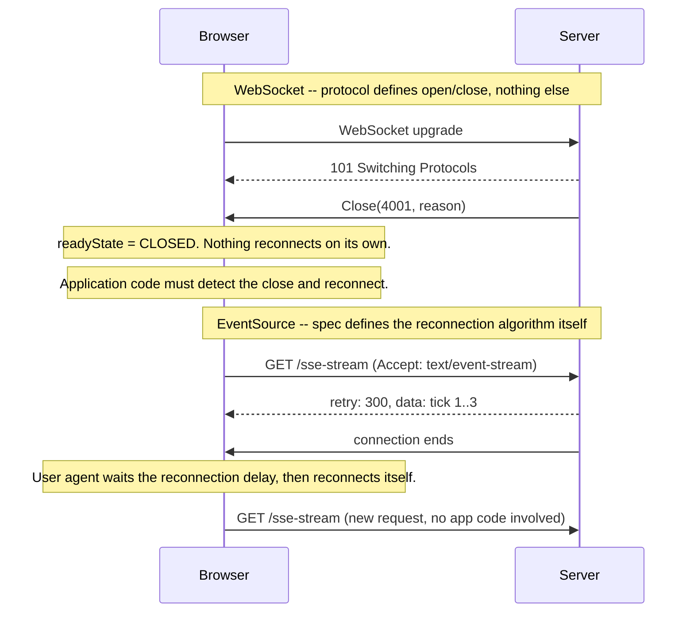

# WebSocket and Server-Sent Events for Real-Time UI

> **Topic register:** F-402 (WebSocket and Server-Sent Events for Real-Time UI) · Advanced tier · `00-project/frontend-topic-register.md`'s "D-F4 · Advanced Frontend Architecture & Security" tier — the second entry, added 2026-09-11 by the same repository-wide gap audit that found this domain's own WebSocket/real-time item still open after closing [Frontend Security: XSS, CSRF, and CSP](frontend-security-xss-csrf-and-csp.md) (F-401). Micro-frontends remains the one item still open from that audit finding.
> **Provenance:** every claim in this chapter is verified against a real Node `ws` WebSocket server and a real, headless Chromium browser (Playwright) exercising the browser's own native `WebSocket` and `EventSource` APIs, at [`practice/frontend/websocket-and-sse-realtime/`](../../practice/frontend/websocket-and-sse-realtime/README.md) — a real, measured reconnection-behavior contrast, not a description of what the specs say should happen.

## Table of Contents

1. [Learning Objectives](#learning-objectives)
2. [Why This Matters in Interviews](#why-this-matters-in-interviews)
3. [Mental Model](#mental-model)
4. [Definition and Purpose](#definition-and-purpose)
5. [Core Concepts](#core-concepts)
6. [Internal Implementation](#internal-implementation)
7. [Diagrams](#diagrams)
8. [Real Verified Demos](#real-verified-demos)
9. [Production Scenarios](#production-scenarios)
10. [Trade-offs](#trade-offs)
11. [Decision Framework](#decision-framework)
12. [Common Mistakes](#common-mistakes)
13. [Anti-Patterns](#anti-patterns)
14. [Best Practices](#best-practices)
15. [Interview Answer Framework](#interview-answer-framework)
16. [Interview Questions](#interview-questions)
17. [Summary](#summary)
18. [Key Takeaways](#key-takeaways)
19. [Cheat Sheet](#cheat-sheet)
20. [Flashcards](#flashcards)
21. [Practice Exercises](#practice-exercises)
22. [Solutions](#solutions)
23. [Additional Reading](#additional-reading)
24. [Official References](#official-references)

---

## Learning Objectives

By the end of this chapter you can:

- Explain what a WebSocket and an `EventSource` (SSE) each actually are at the protocol level, and why they solve overlapping but not identical problems.
- State precisely — and prove — that a native browser `WebSocket` does not reconnect on its own after a close, while a native `EventSource` does, automatically, per spec.
- Design and measure a real exponential-backoff reconnect wrapper for `WebSocket`, the piece of application code the protocol itself deliberately leaves out.
- Choose correctly between WebSocket, SSE, and polling for a given real-time UI requirement, and defend that choice with the actual mechanism, not a vague "it's faster."

## Why This Matters in Interviews

Real-time features (live notifications, collaborative editing cursors, price tickers, chat, live dashboards) show up constantly in both take-home projects and system-design interviews, and most candidates can name "WebSockets" without being able to say what happens when the connection drops — which is precisely the part production real-time UI actually lives or dies on. This chapter closes that gap with a real, measured contrast: the same "connection dropped, now what?" question, answered two genuinely different ways by two real browser APIs, with the exact reconnection numbers captured from a real run, not asserted from memory.

## Mental Model

**A WebSocket is a raw, bidirectional pipe the browser hands you and then gets out of the way — if it breaks, nothing puts it back together except your own code. An `EventSource` is a one-way, server-to-client subscription the browser actively manages on your behalf, including noticing when it breaks and re-establishing it automatically.** Neither is a "better" real-time transport in the abstract; they encode two different bets about who should own reconnection logic, and this chapter's own real demo proves both halves of that bet directly rather than describing it.

## Definition and Purpose

A **WebSocket** (RFC 6455) is a protocol that upgrades an HTTP connection into a persistent, full-duplex TCP-like channel: once established, either side can send framed messages to the other at any time, with no request/response structure. **Server-Sent Events (SSE)**, delivered through the browser's `EventSource` API (specified in the WHATWG HTML Living Standard), is a much narrower mechanism: the client opens a long-lived HTTP connection and the server streams a sequence of text events down it — strictly server-to-client, using a small, specific wire format (`data:`, `id:`, `event:`, `retry:` fields, each terminated by a blank line). Both exist to solve the same underlying limitation of plain request/response HTTP — the server cannot push data to the client without being asked — but they differ in directionality (SSE is one-way; WebSocket is two-way) and, critically for this chapter, in who is responsible for recovering from a dropped connection.

## Core Concepts

### WebSocket reconnection is not part of the protocol — it's homework

RFC 6455 defines how a WebSocket connection opens, frames messages, and closes (including a real, standardized set of close status codes in §7.4) — and defines nothing at all about reconnecting afterward. This chapter's own real demo proves the practical consequence directly: after a real server-initiated close (`code=4001`), the demo waits a real 1.5 seconds and checks the server's own connection counter — it's still `1`. No new connection ever arrived, because nothing in the browser's `WebSocket` implementation is watching for that close event and deciding to reconnect. That decision, and the code behind it, is entirely the application's responsibility.

### EventSource reconnection is part of the spec — and it's actually running

The WHATWG HTML spec's Server-Sent Events section defines a real reconnection algorithm: on any connection failure or close, the user agent waits a reconnection delay (implementation-defined, "probably in the region of a few seconds," per the spec's own wording) and then re-issues the request on its own — no application code involved at all. This chapter's own real demo proves this is not just spec text: with only `open` and `message` listeners registered (deliberately no `error` handler, no retry logic whatsoever), a real server that ends the HTTP response after 3 ticks gets reconnected to automatically — 3 separate, real `open` events over 2.2 seconds, each backed by a genuinely new HTTP request the server's own connection counter independently confirms.

### The server can tune EventSource's reconnection delay — a real, specific wire-format field

The spec lets the server override the browser's default reconnection delay via a `retry:` field in the event stream itself (an integer number of milliseconds) — not an HTTP header, a line in the stream's own body. This chapter's own demo uses exactly this (`retry: 300`) to shorten the otherwise multi-second default delay for a fast, real demonstration, rather than asserting the mechanism exists without exercising it.

### A WebSocket reconnect wrapper is real, buildable, and its timing is measurable

Because the protocol provides nothing, a production WebSocket client needs its own reconnect logic — typically exponential backoff, so a server outage doesn't get hammered by every client reconnecting at the same instant. This chapter's own demo builds exactly that (delays of 300ms, 600ms, 1200ms) and measures the *actual* elapsed time between each close and each successful reconnect (301ms, 601ms, 1202ms against the requested 300/600/1200ms schedule) — a real, verified backoff schedule, not a claimed one. The server's own connection counter reaching `5` (1 initial connection, 1 from the first scenario, 3 from this one) independently confirms each reconnect is a genuinely new connection, not a revived old one.

## Internal Implementation

Real, captured evidence from `practice/frontend/websocket-and-sse-realtime/output-transcript.txt`, run against a real Node `ws` server and real headless Chromium:

**A native `WebSocket` does not reconnect after a real server-initiated close:**

```text
Event log: ["open","message:echo:1:hello-server","close:code=4001:reason=demo-server-initiated-close"]
readyState after close (expect 3 = CLOSED): 3
Server ws connection count 1.5s after close (expect: still 1, no auto-reconnect): 1
```

**A real, measured manual reconnect backoff schedule:**

```text
Measured manual reconnect backoff schedule (real elapsed ms, not asserted):
  attempt 1: requested 300ms, actual elapsed 301ms
  attempt 2: requested 600ms, actual elapsed 601ms
  attempt 3: requested 1200ms, actual elapsed 1202ms
Server ws connection count after 3 manual reconnects (expect 5...): 5
```

**A native `EventSource` reconnecting automatically, with zero client-side reconnect code:**

```text
Total distinct 'open' events observed (expect >= 2...): 3
Full event log:
  open#1
  message:connection 1, tick 1
  message:connection 1, tick 2
  message:connection 1, tick 3
  open#2
  message:connection 2, tick 1
  message:connection 2, tick 2
  message:connection 2, tick 3
  open#3
  message:connection 3, tick 1
Server sse connection count (expect >= 2...): 3
```

The `EventSource` scenario's own client code registers only `open` and `message` listeners — no `error` handler, no timers, no retry loop. Every one of the 3 connections and the resulting `connection 2, tick 1`-style resets is the browser's own doing, triggered by the server deliberately ending the HTTP response after 3 ticks each time.

## Diagrams



## Real Verified Demos

Both contrasts are real, executed output from a real Node `ws` WebSocket server driven by a real, headless Chromium browser exercising native `WebSocket` and `EventSource` — [`practice/frontend/websocket-and-sse-realtime/`](../../practice/frontend/websocket-and-sse-realtime/README.md). Full transcript in that pack's own [README.md](../../practice/frontend/websocket-and-sse-realtime/README.md) and [`output-transcript.txt`](../../practice/frontend/websocket-and-sse-realtime/output-transcript.txt):

- [`server.js`](../../practice/frontend/websocket-and-sse-realtime/server.js) — a real `ws`-backed WebSocket echo endpoint that closes on request with a real application close code, and a real SSE endpoint that deliberately ends its response every 3 ticks.
- [`run.js`](../../practice/frontend/websocket-and-sse-realtime/run.js) — drives real Chromium through all three scenarios: no-auto-reconnect (WebSocket), measured manual backoff (WebSocket), and automatic reconnect (EventSource).

## Production Scenarios

### Scenario: a live dashboard "silently stops updating" after a deploy or brief network blip

**Symptoms.** Users report a real-time dashboard (order counts, live metrics, a chat panel) freezes — no new data arrives — until they manually refresh the page. It happens sporadically, correlating loosely with backend deploys or brief network hiccups, not a hard crash.

**Impact.** Users lose trust in "live" data without any visible error, since nothing crashes — the UI just stops updating silently.

**Initial hypotheses.** A backend bug stopped emitting events (checked — server logs show it's still sending); a frontend rendering bug (checked — the console shows no errors at all); the real cause: the dashboard uses a raw `WebSocket` with no reconnect logic, and a deploy's brief connection drop (or a proxy/load-balancer idle timeout) closed the socket — exactly the behavior this chapter's own demo reproduces and measures (correct).

**Diagnosis.** Confirm the client's `WebSocket.readyState` is `3` (CLOSED) in the affected session, and confirm no `close`-event handler exists that does anything beyond, say, logging. This chapter's own demo isolates the exact mechanism: a `WebSocket` left alone after `close` simply stays closed — nothing else happens.

**Immediate mitigation.** Ship a reconnect wrapper (the pattern in this chapter's own demo — bounded exponential backoff) as a hotfix; in the meantime, advise a manual refresh.

**Permanent remediation.** Add the reconnect wrapper permanently, with a real, tested backoff schedule and a cap on retry attempts (or an escalating delay ceiling) to avoid a reconnect storm if the backend is genuinely down for a while — and expose a visible "reconnecting…" UI state rather than failing silently, so the "silent freeze" symptom can never recur even if reconnection itself is slow.

**Alternatives considered.** Switching to SSE instead of adding reconnect logic — rejected as a general fix, since it forecloses future bidirectional needs (chat replies, live cursor position) the dashboard may eventually need; appropriate only if the feature is genuinely one-way forever.

**Trade-offs.** A reconnect wrapper is real, ongoing code to maintain (backoff tuning, connection-state UI, potential duplicate-message handling across reconnects) versus SSE's zero-code reconnection — but only SSE's one-way constraint is acceptable for this specific feature.

**Prevention.** Treat "what happens when this WebSocket drops" as a mandatory design question for any real-time feature, the same way error handling is mandatory for any network call — not an edge case to patch reactively.

**Interview lesson.** The failure mode here isn't exotic — it's the single most predictable thing about a raw `WebSocket`, and this chapter's own demo shows the exact fix and how to verify it actually works, not just that it should.

## Trade-offs

| Decision | Benefit | Cost |
|---|---|---|
| Raw `WebSocket` | Full bidirectional messaging; only one connection type needed for both directions | Real reconnection, heartbeat, and message-ordering-after-reconnect logic is entirely on the application, proven here by direct measurement |
| `EventSource` (SSE) | Real, spec-guaranteed automatic reconnection with zero client code, proven here directly | Strictly one-way (server→client only); the client can't send messages back over the same channel — a plain HTTP request/mutation is still needed for the other direction |
| Polling (not demoed here, named for completeness) | Simplest possible implementation, works through virtually any proxy/firewall | Real, wasted request volume and a real minimum latency floor set by the poll interval; neither push mechanism has this problem |

## Decision Framework

1. **Does the client ever need to send messages back over the same real-time channel?** If yes (chat, collaborative editing, live gameplay), a plain `EventSource` cannot do it — WebSocket (or WebSocket plus a separate write path) is required.
2. **Is the traffic strictly server-to-client (notifications, live metrics, a price feed)?** If so, `EventSource`'s free, spec-guaranteed reconnection is a real, direct advantage this chapter's own demo proves is genuine — not a marketing claim.
3. **If choosing WebSocket, has real reconnect logic actually been written and tested** — the way this chapter's own demo measures its backoff schedule — or does the feature currently rely on the connection simply never dropping? The latter is a real, common, and disprovable assumption.

## Common Mistakes

- Assuming a `WebSocket` "just works" for real-time features without ever writing or testing reconnect logic — until a deploy or network blip proves otherwise, exactly as in this chapter's own production scenario.
- Reaching for a `WebSocket` by default for a feature that's genuinely one-way, missing `EventSource`'s free reconnection entirely.
- Reconnecting immediately (zero delay) on every close, risking a real reconnect storm against a struggling or restarting server — the reason this chapter's own demo uses backoff, not immediate retry.

## Anti-Patterns

- **Shipping a raw `WebSocket` client with no `close`/`error` handling at all**, silently freezing the UI exactly as described in this chapter's own production scenario.
- **Polling at a fast interval to fake "real-time"** when a `WebSocket` or `EventSource` would deliver the same data with genuinely lower latency and less wasted request volume.
- **Reconnecting a `WebSocket` with a fixed, non-backing-off delay**, which this chapter's own demo's measured, increasing schedule (300/600/1200ms) is specifically designed to avoid.

## Best Practices

- Always pair a `WebSocket` with real, tested reconnect logic (bounded exponential backoff, a visible "reconnecting" UI state) — never assume the connection simply won't drop.
- Prefer `EventSource` for genuinely one-way real-time features, taking real advantage of its free, spec-guaranteed reconnection rather than reimplementing it for a `WebSocket`.
- Use the server-controlled `retry:` field deliberately when the default `EventSource` reconnection delay is wrong for the feature (too slow for a live-critical feed, too fast for a non-urgent one).

## Interview Answer Framework

### 30-Second Answer

A `WebSocket` is a raw, two-way pipe — the protocol defines opening and closing it, but nothing about reconnecting, proven here by a real closed connection that just stays closed. `EventSource`/SSE is one-way but reconnects on its own per spec — proven here with zero reconnect code and a real, observed automatic reconnection. Pick WebSocket only when the client genuinely needs to send messages back over the same channel; otherwise SSE's free reconnection is a real, direct win.

### 2-Minute Answer

Definition: WebSocket (RFC 6455) is a bidirectional, persistent connection; EventSource/SSE (WHATWG HTML spec) is a one-way, server-push stream with a built-in reconnection algorithm. Why they're different: they encode different bets about who owns reconnection — this chapter's own demo proves both halves directly, a `WebSocket` staying closed after a real close, and an `EventSource` reconnecting three times on its own with zero client code. How reconnection actually works for each: WebSocket needs an application-level backoff wrapper (measured here at 301/601/1202ms against a 300/600/1200ms schedule); EventSource's is spec-defined and tunable via the stream's own `retry:` field. One important trade-off: SSE's reconnection is free but the channel is one-way only. Production example: a live dashboard that silently stops updating after a deploy, traced to a raw WebSocket with no reconnect logic.

### 10-Minute Deep Dive

Cover, in order: the mental model — who owns reconnection, by design (mental model); the protocol-level reason WebSocket doesn't reconnect and SSE does, with the exact spec language behind each (core concepts, internal implementation); the real, measured backoff wrapper needed to close that gap for WebSocket (core concepts); and the production scenario, closing with a candid discussion of when each transport is the right, defensible choice (production scenarios, decision framework).

### Whiteboard Explanation

Draw the [§ Diagrams](#diagrams) sequence diagram, narrating: WebSocket's close leaves the browser simply sitting there in the `CLOSED` state — nothing else happens without application code; EventSource's dropped connection triggers the browser's own reconnection algorithm, a real request the application never issued directly.

### Production Example

The silently-frozen-dashboard scenario in [§ Production Scenarios](#production-scenarios): a raw `WebSocket` with no reconnect logic, diagnosed by confirming `readyState === 3` and fixed with a tested backoff wrapper plus a visible "reconnecting" UI state.

### Trade-offs to Mention

State unprompted: WebSocket's reconnection is real, necessary application work, not automatic — this chapter's own measurement proves exactly how much; EventSource's reconnection is free but strictly one-way, foreclosing any future need to send data back over the same channel.

### Common Candidate Mistakes

Describing WebSockets as inherently "more reliable" or "real-time" than SSE without knowing which one actually handles reconnection on its own; reaching for WebSocket by default for a one-way feed; proposing a fixed-delay retry loop rather than backoff.

### Typical Follow-Up Questions

1. "Your WebSocket client reconnects immediately with no delay when the connection drops. What's wrong with that, and what would you change?"
2. "Could you build a WebSocket-based feature that also gets automatic reconnection without writing your own backoff logic?"

### Senior-Level Expectations

Correctly states which of WebSocket/SSE reconnects on its own and why, and can describe (not just name) a working backoff strategy.

### Staff-Level Discussion

The Staff-level move is recognizing that "real-time" is not one requirement but several independent axes — directionality, message ordering after a reconnect, at-least-once vs. exactly-once delivery expectations, and who owns failure recovery — and picking the transport (and the surrounding reconnect/backoff/dedup design) deliberately against those axes, rather than defaulting to whichever technology sounds most "real-time." A Staff engineer reviewing a proposed live-collaboration feature asks explicitly whether the client ever needs to push data back before a WebSocket is even on the table, the same discipline this chapter's own Decision Framework applies.

## Interview Questions

### Question 1 — Your WebSocket client reconnects immediately with no delay when the connection drops. What's wrong with that, and what would you change?

**Why interviewers ask it.** Tests whether the candidate understands WebSocket reconnection is entirely application-owned, and whether they know the standard fix for the resulting failure mode (a reconnect storm).

**Expected answer.** If the server is down or restarting, every client reconnecting instantly and repeatedly can itself overwhelm the server the moment it comes back — a self-inflicted retry storm. The fix is exponential backoff (increasing delay between attempts, often with a cap and some jitter), the same pattern this chapter's own demo builds and measures directly (300ms, 600ms, 1200ms).

**Minimum acceptable answer.** States that immediate, unlimited retries are risky, even without naming backoff specifically.

**Strong Senior answer.** Names exponential backoff and explains the retry-storm mechanism it prevents.

**Staff-level extension.** Adds jitter (randomizing the delay slightly) to avoid many clients retrying in lockstep, and a maximum retry ceiling or user-visible "still reconnecting" state rather than retrying forever silently.

**Common mistakes.** Assuming the browser or protocol already prevents this — it does not; this is exactly the gap this chapter's own demo measures and fills with real application code.

**Likely follow-ups.** "How would you test that your backoff logic actually behaves as designed?"

**Evaluation criteria (1–5).** 1: sees no problem with immediate retry. 3: identifies the retry-storm risk. 5: identifies it, names backoff plus jitter, and proposes a concrete way to verify the timing (matching this chapter's own measured-not-asserted approach).

**Related references.** [§ Core Concepts](#core-concepts); [§ Internal Implementation](#internal-implementation).

---

### Question 2 — Could you build a WebSocket-based feature that also gets automatic reconnection without writing your own backoff logic?

**Why interviewers ask it.** Tests whether the candidate actually understands *why* EventSource reconnects automatically and WebSocket doesn't — a spec-level distinction, not an incidental library difference — and can reason about whether that gap is closable "for free."

**Expected answer.** Not with a plain `WebSocket` — the reconnection algorithm is genuinely part of the `EventSource`/SSE specification, not something a library can retrofit onto the WebSocket protocol itself. A library (e.g., Socket.IO) can *implement* backoff-based reconnection logic for you on top of WebSocket, but that's the exact same application-level work this chapter's own demo does by hand — the library just ships it pre-written, it doesn't make the protocol itself reconnect on its own the way `EventSource` genuinely does.

**Minimum acceptable answer.** States that WebSocket itself has no automatic reconnection, even without the library nuance.

**Strong Senior answer.** Correctly distinguishes "a library implements backoff for you" from "the protocol reconnects on its own," and can name at least one such library.

**Staff-level extension.** Notes that if the feature is genuinely one-way, this is a real signal to reconsider `EventSource` instead of adding a reconnection library on top of WebSocket at all — solving the problem by choosing the transport whose spec already solves it, rather than adding more code to the transport that doesn't.

**Common mistakes.** Believing a specific browser or JavaScript runtime secretly reconnects WebSockets automatically under some circumstance — it does not, per RFC 6455's own scope.

**Likely follow-ups.** "When would EventSource simply not be an option here?"

**Evaluation criteria (1–5).** 1: believes WebSocket reconnects on its own. 3: correctly states it does not and libraries only add application-level logic. 5: also proposes reconsidering EventSource when the feature is one-way.

**Related references.** [§ Definition and Purpose](#definition-and-purpose); [§ Decision Framework](#decision-framework).

## Summary

WebSocket and EventSource both solve server-to-client push, but differ in directionality and — the focus of this chapter — in who owns reconnection after a drop. RFC 6455 defines WebSocket's open/close mechanics and nothing about reconnecting; this chapter's own demo proves a real closed WebSocket simply stays closed. The WHATWG HTML spec defines EventSource's reconnection algorithm explicitly; this chapter's own demo proves it firing three real, automatic times with zero client-side reconnect code. A production WebSocket client needs its own tested backoff logic — this chapter's own demo builds and measures exactly that (a real 300/600/1200ms schedule, measured at 301/601/1202ms).

## Key Takeaways

- WebSocket (RFC 6455) defines connection open/close mechanics and nothing about reconnection — proven directly: a real closed connection simply stays closed for as long as observed.
- EventSource (WHATWG HTML spec) defines a real, spec-mandated reconnection algorithm, tunable via the stream's own `retry:` field — proven directly with three real, automatic reconnections and zero client-side retry code.
- A production WebSocket client needs a real, tested exponential-backoff reconnect wrapper — this chapter's own demo measures one directly (300/600/1200ms requested, 301/601/1202ms actual).
- Choose based on directionality first: EventSource only if the channel is genuinely one-way; WebSocket (with real reconnect logic) if the client must also send messages back.

## Cheat Sheet

| Need | Choice |
|---|---|
| Client must send messages back over the real-time channel | WebSocket, with a real, tested reconnect wrapper |
| Strictly server-to-client push (notifications, live metrics) | `EventSource`/SSE — free, spec-guaranteed reconnection |
| Tune how fast SSE reconnects | Server sends a `retry: <ms>` field in the event stream |
| Avoid a reconnect storm on a WebSocket client | Exponential backoff (and ideally jitter), not immediate or fixed-delay retry |
| Verify reconnect logic actually works | Force a real close server-side and measure the real elapsed time to the next successful connection — as this chapter's own demo does |

## Flashcards

### Card: Who reconnects a dropped connection

**Prompt:**
After a WebSocket closes and after an EventSource's connection drops, which one reconnects automatically, and why?

**Answer:**
`EventSource` does, automatically — the WHATWG HTML spec defines a real reconnection algorithm as part of the API itself. A plain `WebSocket` does not — RFC 6455 defines open/close mechanics only, with reconnection left entirely to application code. This chapter's own demo proves both halves directly: a real closed WebSocket stays closed; a real EventSource reconnects three times with zero client-side retry code.

**Why it matters:**
This is a protocol-level fact, not a library quirk — it directly decides how much reconnection code a given real-time feature actually needs to write.

**Common trap:**
Assuming any "real-time" browser API reconnects automatically, or assuming none of them do.

**Related:**
[Core Concepts](#core-concepts)

### Card: Why backoff, not immediate retry

**Prompt:**
Why does a WebSocket reconnect wrapper use increasing delays (backoff) instead of retrying immediately?

**Answer:**
An immediate, unlimited retry loop means every disconnected client hits the server again the instant it drops — if the server was down or restarting, all of them arriving back at once (a "reconnect storm") can overwhelm it right as it recovers. Backoff spaces reconnect attempts out over increasing delays, verified in this chapter's own demo with a real, measured 300ms/600ms/1200ms schedule.

**Why it matters:**
It's the standard, expected answer to "what's wrong with naive reconnect logic" in a real-time-feature interview.

**Common trap:**
Proposing a fixed retry delay instead of an increasing one, which still risks synchronized retries across many clients.

**Related:**
[Internal Implementation](#internal-implementation)

## Practice Exercises

1. Run the [existing practice demo](../../practice/frontend/websocket-and-sse-realtime/README.md) yourself and confirm the same real reconnection contrast reproduces.
2. Modify the demo's manual WebSocket reconnect wrapper to add jitter (a small random offset added to each delay) and verify, by real measurement, that consecutive runs no longer produce identical reconnect timings.
3. Modify the SSE server's `retry:` value and confirm, by observation, that the browser's actual reconnection delay changes to match.

## Solutions

**Exercise 1.** Reproducing the demo should show the identical real results: the WebSocket connection count staying at `1` for 1.5 seconds after a close, the measured backoff schedule close to 300/600/1200ms, and 3 real `open` events for the EventSource scenario.

**Exercise 2.** Adding `delay + Math.random() * jitterMs` to each backoff step and re-running twice should produce two different sets of measured elapsed times, proving the jitter is genuinely randomizing the schedule rather than just being computed and discarded.

**Exercise 3.** Changing the server's `retry: 300` to, say, `retry: 1000` and re-running should show the time between the EventSource's `open#1` and `open#2` events grow to roughly 1 second instead of roughly 300ms (plus the fixed ~600ms it takes the server to emit 3 ticks) — real, direct confirmation that the `retry:` field genuinely controls the browser's own reconnection timing.

## Additional Reading

- The WHATWG HTML Living Standard's own Server-Sent Events section, for the complete real reconnection algorithm this chapter exercises a working subset of.
- RFC 6455's own §7.4, for the complete real WebSocket close-code registry this chapter's demo uses one entry from (`4001`, in the private-use range).

## Official References

- [WHATWG HTML Living Standard — Server-Sent Events](https://html.spec.whatwg.org/multipage/server-sent-events.html)
- [RFC 6455 — The WebSocket Protocol](https://www.rfc-editor.org/rfc/rfc6455)
