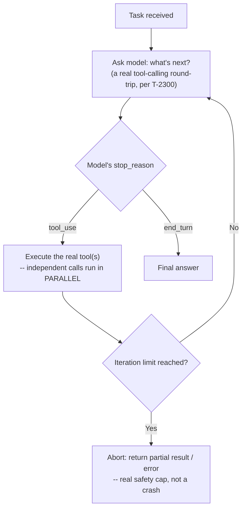

# Agentic Workflows and Tool Orchestration

> **Topic register.** T-2304, fifth assignment in the reserved `T-2300`–`T-2399` range for `syllabus/22-ai-llm-engineering/`. [LLM API Integration Fundamentals](llm-api-integration-fundamentals.md) (T-2300) covered one tool call's real two-round protocol; this chapter is what happens when a task needs several tool calls chained together, with real orchestration and safety concerns neither previous chapter addressed.
> **Provenance.** No live LLM call anywhere in this chapter. The "agent's" next-action decisions are real, deterministic Java logic standing in for what a real model's `tool_use` decision would look like at each step — what's real and measured is the loop mechanics themselves: multi-step chaining, termination safety, and a real, measured wall-clock difference between sequential and parallel tool execution. Reproducible source: [`practice/java/agentic-workflows-and-tool-orchestration/`](../../practice/java/agentic-workflows-and-tool-orchestration/).

## Table of Contents

1. [Why This Matters](#1-why-this-matters)
2. [Prerequisites](#2-prerequisites)
3. [Foundation (L1)](#3-foundation-l1)
4. [Core Concepts (L2)](#4-core-concepts-l2)
5. [How It Works Internally (L3)](#5-how-it-works-internally-l3)
6. [Practical Usage](#6-practical-usage)
7. [Examples](#7-examples)
8. [Common Mistakes](#8-common-mistakes)
9. [Edge Cases](#9-edge-cases)
10. [Performance Implications](#10-performance-implications)
11. [Trade-offs](#11-trade-offs)
12. [Senior-Level Considerations (L3)](#12-senior-level-considerations-l3)
13. [Staff/System-Level Considerations (L4)](#13-staffsystem-level-considerations-l4)
14. [Production Scenarios](#14-production-scenarios)
15. [Interview Questions](#15-interview-questions)
16. [Coding/Practice Exercises](#16-codingpractice-exercises)
17. [Debugging Exercises](#17-debugging-exercises)
18. [Design Exercises](#18-design-exercises)
19. [Further Reading](#19-further-reading)
20. [Mastery Checklist](#20-mastery-checklist)

## 1. Why This Matters

A single tool call answers a single, simple question. A real task — "book a flight that fits my calendar and budget," "diagnose why this deployment failed" — usually needs several tool calls, where later calls depend on earlier results, and the system has to know when to stop. This is an **agentic workflow**: a loop, not a single round trip, and every real loop needs real, deliberate termination logic or it can run forever, burning real API cost with each iteration. An interviewer asking about "building an AI agent" is testing exactly this — not whether you know tool calling exists (T-2300 already covers that), but whether you can reason about a multi-step loop's control flow, safety, and cost.

## 2. Prerequisites

[LLM API Integration Fundamentals](llm-api-integration-fundamentals.md) — this chapter's loop is built entirely from repeated instances of that chapter's own tool-calling round-trip; you need to already know what one round-trip looks like before chaining several.

## 3. Foundation (L1)

**An agentic workflow is a loop: ask the model what to do next, do it, tell the model what happened, and repeat — until the model says it's done, or a safety limit stops it.** Each pass through the loop is one real API round-trip; each `tool_use` response is one real decision point. This chapter's demo runs exactly this loop for a real, multi-step task:

```
=== 1. Multi-step tool chain: each step's input depends on the previous step's real output ===
task: What's the weather in the capital of France?
iteration 1: agent decides -> call getCapital("France")
  real tool result: "Paris"
iteration 2: agent decides -> call getWeather("Paris")  [input depends on the PREVIOUS step's real output]
  real tool result: "18C, cloudy"
iteration 3: agent decides -> enough info, produce final answer
final answer: The weather in Paris (the capital of France) is 18C, cloudy.
```

Three real iterations — the second tool call's real argument (`"Paris"`) only exists because the first tool call already ran. This dependency is the entire reason this is an *orchestration* problem, not just "call a few tools": the second call's input isn't known until the first call's real output arrives.

## 4. Core Concepts (L2)

**Termination is a real safety concern, not an afterthought.** A loop with no iteration limit, driven by a task the model (or, in a bug, your own orchestration code) can never resolve, will keep calling tools — and keep paying for tokens — forever. This chapter's demo proves the fix directly: a task deliberately built so the tool never returns a resolvable answer, capped by a real `maxIterations` limit:

```
=== 2. Runaway-loop safety: a real max-iteration cap stops a task that never resolves ===
...
>>> real max-iteration cap (5) reached without resolution -- aborting instead of looping forever.
>>> real iterations actually run: 5
```

**Sequential versus parallel tool calls is a real, measurable performance choice, not just an API detail.** When two tool calls have no data dependency between them (neither needs the other's result), running them concurrently is real, available wall-clock savings — this chapter's demo measures it directly, not theoretically:

```
sequential: Paris=18C, cloudy, Tokyo=24C, clear -- real elapsed: 408ms
parallel:   Paris=18C, cloudy, Tokyo=24C, clear -- real elapsed: 207ms
>>> real, measured speedup: 2.0x
```

Real tool-calling APIs support a model requesting *multiple* `tool_use` blocks in a single response specifically so a client can recognize "these are independent" and execute them concurrently — the API surface exists because this real speedup exists.

## 5. How It Works Internally (L3)



Every loop pass is a real, full tool-calling round-trip (T-2300's own two-message exchange), which means every pass costs real input/output tokens — an agentic loop's real cost is the round-trip cost multiplied by however many iterations it actually takes, which is exactly why the iteration cap in [Core Concepts](#4-core-concepts-l2) is a real cost-control mechanism, not just a hang-prevention one.

## 6. Practical Usage

Always set a real, explicit maximum iteration count on any agentic loop before it ships — this chapter's demo proves what happens without one: a real, unresolvable task loops until something external stops it. Default to sequential tool execution when a later call's input depends on an earlier call's result (the only correct choice, since the input doesn't exist yet); default to parallel execution when the model requests multiple independent tool calls in one turn, since [Core Concepts](#4-core-concepts-l2)'s real measured 2x speedup is free performance for zero-dependency work.

## 7. Examples

All output below is real, from this chapter's demo — [`practice/java/agentic-workflows-and-tool-orchestration/`](../../practice/java/agentic-workflows-and-tool-orchestration/), full transcript in `output-transcript.txt`. No live model call anywhere in it.

```
=== 1. Multi-step tool chain: each step's input depends on the previous step's real output ===
task: What's the weather in the capital of France?
iteration 1: agent decides -> call getCapital("France")
  real tool result: "Paris"
iteration 2: agent decides -> call getWeather("Paris")  [input depends on the PREVIOUS step's real output]
  real tool result: "18C, cloudy"
iteration 3: agent decides -> enough info, produce final answer
final answer: The weather in Paris (the capital of France) is 18C, cloudy.
>>> real total iterations: 3

=== 3. Sequential vs. parallel tool execution: real, measured wall-clock difference ===
sequential: Paris=18C, cloudy, Tokyo=24C, clear -- real elapsed: 408ms
parallel:   Paris=18C, cloudy, Tokyo=24C, clear -- real elapsed: 207ms
>>> real, measured speedup: 2.0x (two independent tool calls, no data dependency between them)
```

## 8. Common Mistakes

- **Shipping an agentic loop with no iteration cap** — Section 4's real demo of what happens without one: a task that never resolves runs forever, each iteration a real, billed round-trip.
- **Running independent tool calls sequentially out of habit** — Section 4's real, measured 2x cost in wall-clock time for zero benefit.
- **Running dependent tool calls in parallel** — the second call's input genuinely doesn't exist until the first call's real result arrives; this isn't a performance choice, it's a correctness bug.
- **Treating a tool's arguments (chosen by the model) as trusted input** — the same real concern [LLM API Integration Fundamentals](llm-api-integration-fundamentals.md)'s Section 9 already names; an agentic loop with more tools and more steps only has more of this real surface area, not less.

## 9. Edge Cases

- **A tool call that fails or times out mid-loop** needs a real, deliberate decision: retry, ask the model to try a different approach with the error as new information, or abort — silently treating a tool failure as "no result" can send the loop down an incorrect path with no signal anything went wrong.
- **A task that's genuinely ambiguous, not just under-specified** may correctly never resolve to a single tool-derived answer — the [Core Concepts](#4-core-concepts-l2) iteration cap should distinguish "the model needs one more clarifying step" from "this will never resolve," where possible, rather than treating every capped-out loop identically.
- **Two tool calls that look independent but share a hidden resource conflict** (e.g., both writing to the same record) are not actually safe to parallelize even though neither's *input* depends on the other's *output* — data independence and side-effect independence are different properties, and only the second one makes parallel execution genuinely safe.

## 10. Performance Implications

Total agentic-loop latency is the sum of every iteration's real round-trip time (T-2300's own API latency) plus every tool's own real execution time — and, per [Core Concepts](#4-core-concepts-l2), independent tool calls within one iteration can run in parallel for a real, measured wall-clock reduction, while dependent ones cannot. Total cost scales with iteration count directly: an agentic task that takes 5 real round-trips costs roughly 5x what a single round-trip costs, which is why the iteration cap in Section 4 is as much a cost-control lever as a safety one.

## 11. Trade-offs

| Approach | Benefit | Cost |
|---|---|---|
| No iteration cap | Simpler code | Real, measured risk of an unbounded, unboundedly-expensive loop |
| Iteration cap | Real, bounded cost and latency | May abort a genuinely-solvable task that just needed one more step |
| Sequential tool execution | Always correct, regardless of dependencies | Real, measured cost in wall-clock time when calls are actually independent |
| Parallel tool execution | Real, measured ~2x speedup for independent calls | Only safe when there's no data or side-effect dependency between calls |

## 12. Senior-Level Considerations (L3)

A Senior engineer building an agentic loop states the iteration cap and the reasoning behind its specific value explicitly, rather than picking an arbitrary number, and correctly distinguishes data-independent tool calls (safe to parallelize) from dependent ones (must stay sequential) for every pair of calls the loop might make — not just the happy-path case demonstrated here.

## 13. Staff/System-Level Considerations (L4)

At Staff scope, an agentic system's real operational risk is cost and blast radius at scale, not just individual-loop correctness — a subtle bug that occasionally sends a loop to its iteration cap on 1% of requests is a real, ongoing cost multiplier once traffic is high enough, the agentic-system equivalent of [Distributed Systems Failure Modes](../10-distributed-systems/distributed-systems-failure-modes.md)'s retry-amplification concern. A Staff engineer also owns the real security boundary question directly: every tool an agentic system can call is a real action it might take autonomously across several steps, not a single, human-reviewed action — which means tool permissions, argument validation, and a real audit trail of what the loop actually did (not just what it was asked to do) become organizational requirements, not nice-to-haves, once an agentic system has access to anything with real side effects (sending an email, making a purchase, modifying a record).

## 14. Production Scenarios

No existing `production-cookbook/` entry has an agentic-loop-specific root cause yet.

> Planned reference: a future `production-cookbook/` entry covering a real incident where an agentic loop with no iteration cap (or a cap set too high) ran far longer than expected on a class of ambiguous inputs, producing a real, measurable cost spike traced back to round-trip count rather than any single expensive call, would be a natural, non-duplicative addition connecting this chapter's Section 4/10 cost mechanics to a real, worked incident.

## 15. Interview Questions

**Q1 (Mid): "What's the difference between a single tool call and an agentic workflow?"**
Expected answer: a single tool call is one request/response round trip; an agentic workflow is a loop of several such round trips, where the model decides what to do next based on the real results of previous steps, continuing until it has enough information or a safety limit stops it.

**Q2 (Mid/Senior): "Why does an agentic loop need a maximum iteration count?"**
Expected answer: without one, a task the model can never resolve (or a bug in the orchestration logic) causes the loop to run indefinitely, with each iteration a real, billed API round-trip — a real, unbounded cost and latency risk, not just a theoretical one.

**Q3 (Senior): "When is it safe to execute two tool calls in parallel, and when is it not?"**
Expected answer: safe when neither call's input depends on the other's output AND there's no shared side effect between them; unsafe if either condition is violated — data independence alone isn't sufficient if the calls have a side-effect conflict.

**Q4 (Senior/Staff): "How would you estimate the cost of an agentic feature before shipping it?"**
Expected answer: cost scales with the real number of round-trips a typical task takes, multiplied by each round-trip's real token cost (T-2300) — worth measuring the real iteration-count distribution across representative tasks, not just the cost of a single call, since the loop can silently multiply cost far beyond a single-call estimate.

**Q5 (Staff): "An agentic system has tool access to real actions (sending emails, modifying records). What's the real organizational concern beyond correctness?"**
Expected answer: every tool call is a real, potentially autonomous action across a multi-step loop, not a single human-reviewed step — tool permissions, argument validation, and a real audit trail of what actually happened become required, not optional, once the loop has access to anything with genuine side effects.

## 16. Coding/Practice Exercises

1. Reproduce this chapter's three real scenarios yourself: [`practice/java/agentic-workflows-and-tool-orchestration/`](../../practice/java/agentic-workflows-and-tool-orchestration/).
2. Extend [`AgenticWorkflowDemo`](../../practice/java/agentic-workflows-and-tool-orchestration/src/demo/AgenticWorkflowDemo.java)'s multi-step chain to a real 3-tool chain (e.g., capital -> weather -> a "should I bring an umbrella" decision tool) and confirm the real iteration count increases accordingly.
3. Modify the runaway-loop demo so the tool succeeds on a random, real iteration (using a real seeded `Random`) rather than never — confirm the loop correctly exits early exactly when it resolves, rather than always running to the cap.

## 17. Debugging Exercises

Given this real demo behavior, predict the output before checking Section 7's transcript:

```
Two tool calls, each with real ~200ms latency, NO data dependency between them.
Run sequentially -> real elapsed time = ?
Run in parallel (2-thread pool) -> real elapsed time = ?
```

Real answer: sequential is the real *sum* of both calls' latency (~408ms measured); parallel is real approximately the *slower* of the two, not the sum (~207ms measured) — a candidate predicting parallel execution would only save a small, fixed overhead rather than roughly half the total time is missing that truly independent work overlaps almost completely, not partially.

## 18. Design Exercises

Design the agentic loop for a customer-support system that must: (1) look up an order status, then (2) check a shipping-carrier API for its real-time location, then (3) draft a response — where step 2 depends on step 1's result but nothing else does. State explicitly which steps must stay sequential and which (if any) could run in parallel, what iteration cap you'd set and why, and what your plan is for a tool call that fails partway through the loop, per [Section 9](#9-edge-cases).

## 19. Further Reading

- [Anthropic Tool Use Guide](https://docs.anthropic.com/en/docs/build-with-claude/tool-use) — the real, documented single-call protocol this chapter's loop is built from repeated instances of.
- [Anthropic: Implementing Tool Use](https://docs.anthropic.com/en/docs/agents-and-tools/tool-use/implement-tool-use) — real, documented guidance on multi-step and parallel tool use.

## 20. Mastery Checklist

- [ ] Can explain what an agentic workflow is, as a loop of real tool-calling round-trips, not a single call.
- [ ] Can state, with this chapter's real numbers, why an agentic loop needs an explicit maximum iteration count.
- [ ] Can correctly distinguish which tool-call pairs are safe to parallelize and which must stay sequential.
- [ ] Can correctly predict the Section 17 debugging exercise's real outcome before checking it.
- [ ] Can explain why an agentic loop's real cost scales with iteration count, not just per-call cost.
- [ ] Can name the real organizational concern (tool permissions, argument validation, audit trail) that applies once an agentic system has access to real side effects.
