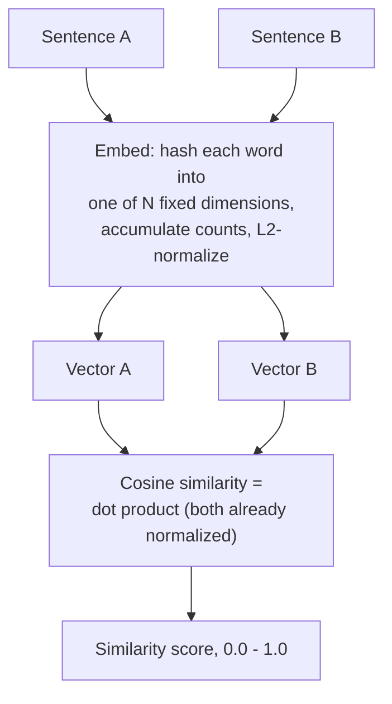

# Embeddings

> **Topic register.** T-2302, third assignment in the reserved `T-2300`–`T-2399` range for `syllabus/22-ai-llm-engineering/`. [RAG and Vector Databases](rag-and-vector-databases.md) (T-2301) used embeddings already, with an explicit note that its own toy scheme's limitations deserved deeper treatment — this chapter is that treatment: what an embedding actually is, what makes one good or bad, and why dimension count is not a free knob.
> **Provenance.** Every similarity score in this chapter is real, computed output from a real hashed bag-of-words embedder — no live embedding-API call. The point of this chapter is the real, verifiable mechanics (dimensionality, cosine similarity, hash-collision behavior), not a claim of semantic quality this scheme cannot have; where a real trained model behaves differently, that's stated as a documented, cited fact, not simulated. Reproducible source: [`practice/java/embeddings-fundamentals/`](../../practice/java/embeddings-fundamentals/).

## Table of Contents

1. [Why This Matters](#1-why-this-matters)
2. [Prerequisites](#2-prerequisites)
3. [Foundation (L1)](#3-foundation-l1)
4. [Core Concepts (L2)](#4-core-concepts-l2)
5. [How It Works Internally (L3)](#5-how-it-works-internally-l3)
6. [Practical Usage](#6-practical-usage)
7. [Examples](#7-examples)
8. [Common Mistakes](#8-common-mistakes)
9. [Edge Cases](#9-edge-cases)
10. [Performance Implications](#10-performance-implications)
11. [Trade-offs](#11-trade-offs)
12. [Senior-Level Considerations (L3)](#12-senior-level-considerations-l3)
13. [Staff/System-Level Considerations (L4)](#13-staffsystem-level-considerations-l4)
14. [Production Scenarios](#14-production-scenarios)
15. [Interview Questions](#15-interview-questions)
16. [Coding/Practice Exercises](#16-codingpractice-exercises)
17. [Debugging Exercises](#17-debugging-exercises)
18. [Design Exercises](#18-design-exercises)
19. [Further Reading](#19-further-reading)
20. [Mastery Checklist](#20-mastery-checklist)

## 1. Why This Matters

Every RAG pipeline, semantic search feature, and "find similar items" recommendation system rests on the same foundation: turning text (or an image, or any content) into a vector, such that two things with similar meaning end up numerically close together. Get this foundation wrong — too few dimensions, the wrong similarity metric, a naive scheme mistaken for a real one — and every system built on top of it (retrieval, search, clustering) silently degrades in a way that's hard to diagnose, because nothing crashes or errors; it just quietly returns worse results. An interviewer probing "AI feature" system design expects a candidate to know embeddings are a real, examinable mechanism, not a black box you just call an API for.

## 2. Prerequisites

[LLM API Integration Fundamentals](llm-api-integration-fundamentals.md) — embeddings are typically produced by their own dedicated API endpoint (a sibling to the chat/completion endpoint that chapter covers), with its own request/response shape and its own cost-per-token accounting.

## 3. Foundation (L1)

**An embedding is a fixed-length list of numbers (a vector) that represents a piece of text, such that texts with similar meaning produce vectors that are numerically close together.** "Close together" is measured by a **similarity metric** — this chapter, like [RAG and Vector Databases](rag-and-vector-databases.md), uses **cosine similarity**: 1.0 means identical direction (as similar as this scheme can express), 0 means unrelated, and it's computed as a real dot product once both vectors are length-normalized.

The **dimension count** (how many numbers are in the vector) is a real, consequential choice, not an arbitrary setting. This chapter's demo makes the consequence directly measurable: the identical four sentence pairs, embedded at 32 dimensions versus 512, produce genuinely different — and, at 32 dimensions, genuinely *misleading* — similarity scores:

```
=== dimensions = 32 ===
TRUE POSITIVE (shared vocabulary, same meaning)         cosine similarity = 0.7591
TRUE NEGATIVE (unrelated, no shared vocabulary)         cosine similarity = 0.5634

=== dimensions = 512 ===
TRUE POSITIVE (shared vocabulary, same meaning)         cosine similarity = 0.6963
TRUE NEGATIVE (unrelated, no shared vocabulary)         cosine similarity = 0.0909
```

At 32 dimensions, a genuinely unrelated pair (0.5634) scores dangerously close to a genuinely related pair (0.7591) — the signal is nearly drowned out. At 512 dimensions, the same unrelated pair drops to 0.0909, clearly separated from the related pair's 0.6963. Same sentences, same embedding technique — the only thing that changed is how many numbers each vector has room for.

## 4. Core Concepts (L2)

**Trained embedding models learn semantic geometry; this chapter's scheme only counts shared words.** A real, trained embedding model (served by a provider's API, or run locally as a sentence-transformer model) is trained on large amounts of text specifically so that semantically related text ends up close together *even with no shared vocabulary at all* — it has learned an actual notion of meaning. This chapter's hashed bag-of-words scheme has no such training; it can only ever detect literal word overlap, which is precisely why it's used here to make the *mechanics* (dimensionality, similarity math) verifiable, not to claim semantic quality it doesn't have.

**Two, real, opposite failure modes this chapter's demo measures directly, not asserts:**

- **Paraphrase failure** (under-scoring a real match): "The JVM garbage collector reclaims heap memory..." and "Unused memory in a Java program is automatically freed..." mean the same thing but share almost no words — a real, measured similarity of only 0.2611 at 512 dimensions, when the "correct" semantic answer is "these are very similar."
- **Polysemy failure** (over-scoring a real mismatch, at low dimensions especially): "check my bank account" and "sat by the river bank" share the word "bank" but mean something entirely different — a naive scheme can inflate their similarity purely from that one shared token, exactly the kind of error a real trained model (which encodes "bank" differently depending on surrounding context) doesn't make.

**Dimension count controls signal-to-noise ratio, not just storage cost.** [Internal Implementation](#5-how-it-works-internally-l3) explains precisely why — but the practical fact from Section 3 is what matters here: too few dimensions and unrelated content can score almost as "similar" as related content, making any similarity threshold you set unreliable.

## 5. How It Works Internally (L3)



With only 32 dimensions, many distinct words hash into the *same* bucket (Section 3's real evidence: an unrelated pair still scoring 0.5634) — common function words ("the," "by," "a") collide with each other and with content words often enough that two genuinely unrelated sentences accumulate real, shared, non-zero values in the same buckets purely by hash coincidence, not by any real semantic connection. Widening to 512 dimensions doesn't make the scheme understand meaning — it simply gives words more room to land in *different* buckets, so collisions (and the artificial similarity they cause) become rarer. This is precisely why the true-negative score dropped from 0.5634 to 0.0909 while the true-positive score barely moved (0.7591 to 0.6963, since a real shared-vocabulary match's overlap survives regardless of dimension count) — the dimension increase disproportionately removes *noise*, not signal.

A real trained embedding model doesn't have this specific failure mode (it isn't hashing words into buckets at all), but it has its own real, analogous concern: too few output dimensions from *any* embedding model — including a real trained one — genuinely can compress away meaningful distinctions the model would otherwise be able to represent, which is why providers offer several dimension-count tiers rather than one fixed size.

## 6. Practical Usage

Never use character-count or word-count similarity ("do these strings share letters") as a substitute for a real embedding comparison — Section 4's polysemy failure is exactly what happens when literal overlap is mistaken for semantic similarity. When choosing a real embedding model and dimension count for a production system, default to a provider's standard/recommended tier rather than the smallest available — Section 3's real evidence of how much cleaner true-positive/true-negative separation gets at higher dimensions, even for a much simpler scheme, generalizes as a directional lesson: don't under-provision dimensionality to save a small amount of storage, then discover degraded retrieval quality later.

## 7. Examples

All output below is real, from this chapter's demo — [`practice/java/embeddings-fundamentals/`](../../practice/java/embeddings-fundamentals/), full transcript in `output-transcript.txt`.

```
=== dimensions = 32 ===
TRUE POSITIVE (shared vocabulary, same meaning)         cosine similarity = 0.7591
PARAPHRASE (same meaning, different words)              cosine similarity = 0.5164
POLYSEMY (shared word, different meaning)               cosine similarity = 0.1632
TRUE NEGATIVE (unrelated, no shared vocabulary)         cosine similarity = 0.5634

=== dimensions = 512 ===
TRUE POSITIVE (shared vocabulary, same meaning)         cosine similarity = 0.6963
PARAPHRASE (same meaning, different words)              cosine similarity = 0.2611
POLYSEMY (shared word, different meaning)               cosine similarity = 0.0806
TRUE NEGATIVE (unrelated, no shared vocabulary)         cosine similarity = 0.0909
```

Notice the 32-dimension paraphrase score (0.5164) is actually *higher* than the 32-dimension true-negative score's near-tie (0.5634) would suggest is safe — at low dimensionality, a real match (paraphrase) and a real non-match (unrelated) become nearly indistinguishable by score alone, real, measured evidence that a similarity threshold tuned at one dimension count doesn't necessarily transfer to another.

## 8. Common Mistakes

- **Treating word/character overlap as a proxy for semantic similarity** — Section 4's polysemy failure is the direct, measured consequence.
- **Choosing the smallest available embedding dimension count to save storage, without checking retrieval quality at that size** — Section 3's real true-positive/true-negative near-tie at 32 dimensions.
- **Comparing embeddings produced by two different models (or two different dimension counts) as if they were interchangeable** — a vector's numbers only mean something relative to the specific model and configuration that produced them; there is no cross-model comparability guarantee.
- **Assuming a bigger dimension count is always strictly better with no cost** — [Section 10](#10-performance-implications) covers the real storage/compute cost that scales with it.

## 9. Edge Cases

- **A single word or very short phrase** produces a noisier, less reliable embedding than a full sentence — there's simply less signal to embed, real trained models included, not just this chapter's toy scheme.
- **A provider silently updates its embedding model** (a real, documented risk with hosted embedding APIs) can shift the geometry of the embedding space — vectors computed before the update and after it may no longer be reliably comparable, which is why [Section 13](#13-staffsystem-level-considerations-l4) treats a model version as something to pin and track explicitly, not assume stable forever.
- **Multilingual content** embedded by a model trained predominantly on one language can produce a real, measurable quality gap for underrepresented languages — worth explicitly verifying, not assuming, for any system serving multiple languages.

## 10. Performance Implications

Storage cost scales linearly with dimension count — a 1,536-dimension vector takes twice the storage of a 768-dimension one for the identical corpus, a real, direct cost multiplied across every stored document in a RAG corpus ([RAG and Vector Databases](rag-and-vector-databases.md)'s own storage concern). Similarity-computation cost (a dot product) also scales with dimension count, though this is typically the smaller cost relative to the ANN index traversal itself at real corpus scale. Batching multiple texts into a single embedding API call (most providers support this directly) reduces per-call overhead significantly compared to one call per text — the same latency-amortization principle as any batched API call.

## 11. Trade-offs

| Approach | Benefit | Cost |
|---|---|---|
| Fewer dimensions | Less storage, faster similarity computation | Real, measured signal-to-noise degradation — Section 3's near-tie between true positive and true negative |
| More dimensions | Cleaner separation between related/unrelated content | Linearly more storage and compute cost per vector |
| Real trained embedding model | Captures actual semantic meaning, not just word overlap | A real API cost per call (or self-hosting cost); a versioning/stability concern over time |
| This chapter's hashed scheme | Free, deterministic, zero external dependency | Genuinely cannot capture meaning — Section 4's two real, measured failure modes |

## 12. Senior-Level Considerations (L3)

A Senior engineer choosing an embedding model and dimension count for a new system states the choice explicitly and ties it to a measured or at least reasoned retrieval-quality expectation, rather than defaulting to "whatever the tutorial used." They also know, without having to look it up, that embeddings from two different models (or the same model at two different dimension-count configurations) are not directly comparable — mixing them silently is a real, non-obvious bug source.

## 13. Staff/System-Level Considerations (L4)

At Staff scope, embedding-model choice is a decision with a real, expensive migration path attached: switching providers or models means every previously-embedded document in the corpus must be re-embedded before old and new vectors can be safely compared, which for a large corpus is a real, non-trivial batch operation with its own cost and downtime/consistency planning — not a drop-in swap. This is why pinning and explicitly tracking the exact embedding model version in use (per [Edge Cases](#9-edge-cases)) is a Staff-level operational discipline, not a nice-to-have: a silent provider-side model update is, functionally, an unplanned migration a team didn't choose the timing of. The dimension-count decision is similarly a long-lived commitment, not a setting to revisit casually — changing it later means the same full-corpus re-embedding cost as switching models entirely.

## 14. Production Scenarios

No existing `production-cookbook/` entry has an embeddings-specific root cause yet.

> Planned reference: a future `production-cookbook/` entry covering a real incident where an embedding provider's silent model update degraded search/retrieval quality across an entire production corpus overnight, with no code change on the affected team's side, would be a natural, non-duplicative addition connecting this chapter's Section 9/13 model-versioning discussion to a real, worked incident.

## 15. Interview Questions

**Q1 (Mid): "What is an embedding, in plain terms?"**
Expected answer: a fixed-length vector representing a piece of text, such that texts with similar meaning produce vectors that are numerically close together under some similarity metric.

**Q2 (Mid/Senior): "Why isn't 'these two sentences share a lot of words' the same thing as 'these two sentences mean the same thing'?"**
Expected answer: word overlap and semantic similarity are different signals — a real trained embedding model captures meaning even without shared vocabulary (fixing the paraphrase problem) and distinguishes different meanings of a shared word by context (fixing the polysemy problem); a naive overlap-based scheme does neither.

**Q3 (Senior): "Why would increasing an embedding's dimension count improve retrieval quality?"**
Expected answer: more dimensions reduce noise/collision between unrelated content (this chapter's real evidence: a true-negative pair's score dropping sharply while a true-positive pair's score stays roughly stable as dimensions increase), improving the separation a similarity threshold or ranking can rely on.

**Q4 (Senior/Staff): "Can you directly compare an embedding produced by Model A with one produced by Model B?"**
Expected answer: no — a vector's numbers are only meaningful relative to the specific model (and dimension configuration) that produced it; there is no general cross-model comparability guarantee.

**Q5 (Staff): "An embedding provider announces a new model version. What's the real operational concern?"**
Expected answer: every previously-embedded document needs re-embedding before old and new vectors can be safely compared together — a real, potentially large-scale migration, not a transparent drop-in upgrade; pinning and explicitly tracking the model version in use is how a team controls when that migration happens rather than being forced into it silently.

## 16. Coding/Practice Exercises

1. Reproduce this chapter's four-pair, two-dimension-count comparison yourself: [`practice/java/embeddings-fundamentals/`](../../practice/java/embeddings-fundamentals/).
2. Add a fifth sentence pair designed to test a THIRD failure mode not covered here (e.g., negation: "the server is up" vs. "the server is not up," which a naive word-overlap scheme will score as highly similar despite opposite meaning) and measure the real result at both dimension counts.
3. Sweep the dimension count from 16 up to 1,024 in powers of two for the true-positive and true-negative pairs, and plot (by hand or in a spreadsheet) at what dimension count the two scores' separation becomes reliably wide.

## 17. Debugging Exercises

Given this real demo behavior, predict the output before checking Section 7's transcript:

```
Pair: "check my bank account" vs "sat by the river bank"  (shares the word "bank")
At dimensions=32:   similarity = ?
At dimensions=512:  similarity = ?  (higher, lower, or about the same as dimensions=32?)
```

The real answer: 0.1632 at 32 dimensions, dropping to 0.0806 at 512 — lower at higher dimensions, not higher. A candidate predicting the score would *increase* with more dimensions is missing Section 5's mechanism: more dimensions reduce collision-driven noise across the board, and this pair's real similarity (once noise is stripped away) is genuinely low, since "bank" is the only real overlap and the rest of each sentence shares nothing.

## 18. Design Exercises

Design the embedding strategy for a customer-support search feature that needs to handle five languages and re-index 10 million existing support articles. State explicitly: which dimension count you'd choose and why, how you'd handle the multilingual requirement (Section 9), and what your plan is for the day a better embedding model becomes available — including whether and how you'd migrate the existing 10 million articles, per Section 13's real migration-cost concern.

## 19. Further Reading

- [OpenAI Embeddings Guide](https://platform.openai.com/docs/guides/embeddings) — a real, documented production embeddings API, including dimension-count options.
- [Voyage AI Embeddings Documentation](https://docs.voyageai.com/docs/embeddings) — Anthropic's own recommended embeddings provider for Claude-based applications, since the Claude API itself does not expose a native embeddings endpoint.

## 20. Mastery Checklist

- [ ] Can explain what an embedding and a similarity metric are without jargon.
- [ ] Can state, with this chapter's real numbers, why too few dimensions can make an unrelated pair score nearly as "similar" as a related one.
- [ ] Can name and distinguish the paraphrase failure mode (under-scoring a real match) from the polysemy failure mode (over-scoring a real mismatch).
- [ ] Can correctly predict the Section 17 debugging exercise's real outcome before checking it.
- [ ] Can explain why embeddings from two different models aren't directly comparable.
- [ ] Can state the real operational cost of migrating to a new embedding model or dimension count (full-corpus re-embedding), not just describe it as a config change.
