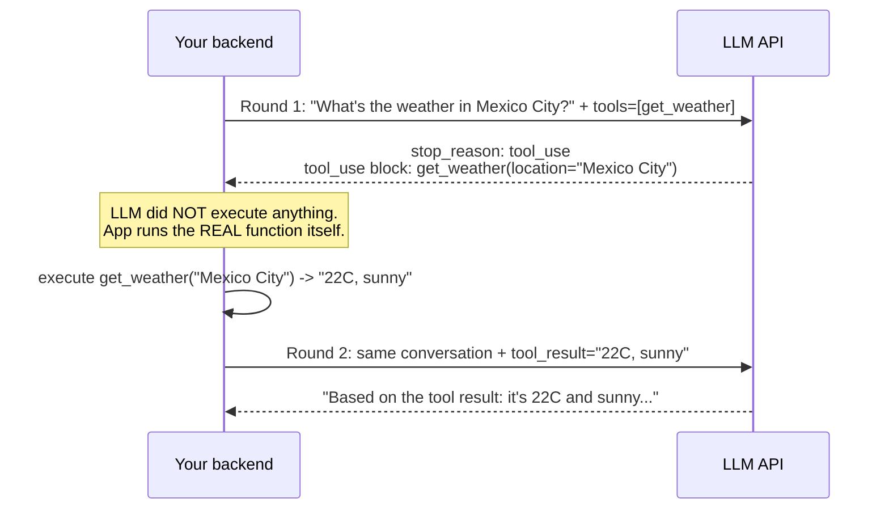

# LLM API Integration Fundamentals

> **Topic register.** T-2300, first assignment in the reserved `T-2300`–`T-2399` range for `syllabus/22-ai-llm-engineering/` — a new backend domain, added 2026-09-09 during the same gap audit that produced `07-api-design`'s T-917/T-918 (GraphQL, gRPC). See `00-project/syllabus-transformation-plan.md`'s matching extension note for why this became its own domain rather than a subsection of `17-architecture` or `11-system-design`.
> **Provenance.** Every request, response, token count, and retry in this chapter is real, executed output from a real Java HTTP client and a real local server implementing the actual documented Anthropic Messages API wire contract — not a call to the live API, and not fabricated output. Reproducible source: [`practice/java/llm-api-integration-fundamentals/`](../../practice/java/llm-api-integration-fundamentals/).

## Table of Contents

1. [Why This Matters](#1-why-this-matters)
2. [Prerequisites](#2-prerequisites)
3. [Foundation (L1)](#3-foundation-l1)
4. [Core Concepts (L2)](#4-core-concepts-l2)
5. [How It Works Internally (L3)](#5-how-it-works-internally-l3)
6. [Practical Usage](#6-practical-usage)
7. [Examples](#7-examples)
8. [Common Mistakes](#8-common-mistakes)
9. [Edge Cases](#9-edge-cases)
10. [Performance Implications](#10-performance-implications)
11. [Trade-offs](#11-trade-offs)
12. [Senior-Level Considerations (L3)](#12-senior-level-considerations-l3)
13. [Staff/System-Level Considerations (L4)](#13-staffsystem-level-considerations-l4)
14. [Production Scenarios](#14-production-scenarios)
15. [Interview Questions](#15-interview-questions)
16. [Coding/Practice Exercises](#16-codingpractice-exercises)
17. [Debugging Exercises](#17-debugging-exercises)
18. [Design Exercises](#18-design-exercises)
19. [Further Reading](#19-further-reading)
20. [Mastery Checklist](#20-mastery-checklist)

## 1. Why This Matters

Integrating an LLM API from a backend service is now a common, real interview and on-the-job task — not a data-science specialty. It has its own genuinely new failure modes a REST-only background doesn't prepare you for: the API is stateless and the client resends the *entire* conversation on every call; a naive integration silently pays for and re-sends a growing transcript on every turn; streaming responses require handling an open connection that delivers partial output over time, not one blocking call; and the model itself can decide to call a function you defined, requiring your code to execute it and hand the result back in a second, still-real HTTP round trip. A candidate who has only ever called `GET`/`POST` REST endpoints will misjudge cost, misjudge latency, and mishandle the tool-calling protocol unless these mechanics are learned deliberately — exactly what this chapter and its real demo exist to do.

## 2. Prerequisites

[REST API Fundamentals](../07-api-design/rest-api-fundamentals.md) — an LLM API is, mechanically, a REST-shaped JSON-over-HTTP API; this chapter assumes you already know what a status code and a request/response body are and builds the LLM-specific concepts (messages, streaming, tool use, token accounting) on top of that base.

## 3. Foundation (L1)

Calling an LLM API is fundamentally different from calling a typical CRUD REST endpoint in one specific way: **there is no server-side conversation state.** Every single request must include the *entire* conversation so far — every prior user message and every prior model reply — because the model itself has no memory between calls. If your backend wants a multi-turn conversation, *your backend* is the thing remembering it, not the API.

A request has three essential parts: a **model** name (which specific model to run), a list of **messages** (each with a `role` — `user` or `assistant` — and `content`), and a **`max_tokens`** limit (the most output the model is allowed to generate). This chapter's demo sends exactly this shape:

```json
{
  "model": "claude-demo-model",
  "max_tokens": 256,
  "messages": [
    { "role": "user", "content": "What's the capital of France?" }
  ]
}
```

And gets back a response whose most important fields are the reply text and a **`usage`** block reporting exactly how many tokens the call consumed — real output from this chapter's demo:

```
reply: You said: "What's the capital of France?". This is a real, locally-served response.
usage: input_tokens=7 output_tokens=20
```

A **token** is the unit the model actually reads and writes in — roughly, but not exactly, a word fragment (this chapter's demo uses a stated, deliberately approximate "about 4 characters per token" estimate for its own local server, not a claim of any provider's real tokenizer). Every provider bills by token count, separately for input and output, which is exactly why `usage` is reported back on every single call — see [Section 4](#4-core-concepts-l2) for why this is the whole basis of cost control.

## 4. Core Concepts (L2)

**Statelessness and conversation growth.** Because the API has no memory, a multi-turn chat's *n*-th request re-sends every message from turns `1` through `n-1`, plus the new one — meaning a growing conversation's **input token count, and therefore its cost, grows with every turn**, even if the user's new message is short. This is the single most consequential fact for anyone budgeting an LLM-backed feature, and it has no equivalent in a typical stateless REST resource lookup, where each request's cost doesn't depend on how many requests came before it.

**Streaming.** A non-streaming call blocks until the *entire* response is generated, which can be many seconds for a long reply — bad for a chat UI's perceived latency. A streaming call instead opens one HTTP connection and receives the reply as a sequence of incremental events over that same connection (Server-Sent Events, in Anthropic's real API): `message_start`, then a `content_block_delta` event per chunk of generated text, then `message_stop`. This chapter's demo reads a real stream this way, printing each chunk with its real, measured arrival time:

```
[+0ms] chunk 1: "Streaming"
[+34ms] chunk 2: "a"
[+70ms] chunk 3: "real"
...
```

The response is assembled by concatenating every `content_block_delta`'s text piece, in order, as it arrives — not by waiting for one final payload.

**Function/tool calling.** A request can declare a set of **tools** (named functions with a description) the model may choose to invoke instead of replying directly. If the model decides a tool is needed, the response's `stop_reason` is `"tool_use"` and its content includes a `tool_use` block naming the tool and the arguments the model wants to call it with — the model does **not** execute anything itself; your backend must run the real function and send the result back as a `tool_result` message in a *second* request, continuing the same conversation. This chapter's demo proves the full two-round protocol:



Real output from this exact exchange:

```
round 1 stop_reason: tool_use
model requested tool: get_weather with input {"location":"Mexico City"}
round 2 final reply: Based on the tool result: it's 22C and sunny in Mexico City right now.
```

**Rate limits and retries.** Providers cap requests (and tokens) per minute per account/tier; exceeding it returns an HTTP `429` with a `retry-after` header, not a generic server error. A correct client backs off for at least that long before retrying — this chapter's demo proves a real request genuinely fails twice with `429` and succeeds on the third attempt, once the required backoff has actually elapsed:

```
attempt 1: HTTP 429 rate_limit_error, retry-after=1s -> backing off
attempt 2: HTTP 429 rate_limit_error, retry-after=1s -> backing off
attempt 3: HTTP 200 -- succeeded after backoff
```

## 5. How It Works Internally (L3)

None of the mechanics above are enforced by HTTP itself, the same way REST's conventions aren't ([REST API Fundamentals](../07-api-design/rest-api-fundamentals.md), Section 5) — they're the documented contract of this specific API, implemented by the code on both ends. This chapter's own [`FakeMessagesApiServer`](../../practice/java/llm-api-integration-fundamentals/src/demo/FakeMessagesApiServer.java) makes every one of these mechanics explicit as real, inspectable code rather than an opaque provider behavior: it decides `stop_reason: "tool_use"` by checking whether the request declared tools *and* the user's text matches a trigger; it decides to rate-limit by literally counting requests in an `AtomicInteger`; and its streaming path writes real, individually-flushed `event: ...\ndata: ...\n\n` lines to the response body — [`respondStreaming`](../../practice/java/llm-api-integration-fundamentals/src/demo/FakeMessagesApiServer.java) — which is the actual Server-Sent-Events wire format a real provider also uses, not an abstraction this demo invented.

On the client side, [`LlmApiClientDemo.streaming()`](../../practice/java/llm-api-integration-fundamentals/src/demo/LlmApiClientDemo.java) reads that same stream line-by-line with a plain `BufferedReader` over `HttpResponse.BodyHandlers.ofInputStream()` — there is no special "streaming client" type; streaming is just reading a normal HTTP response body incrementally instead of buffering it whole, which is exactly why `HttpClient`'s ordinary `ofInputStream()` handler is sufficient.

## 6. Practical Usage

Always read `usage.input_tokens`/`usage.output_tokens` from every response and multiply by your provider's current per-token price — never estimate cost from message *length* alone, since token count and character count diverge (this chapter's own demo states its token-estimation function is a deliberate approximation, precisely because real tokenization is provider- and model-specific and should never be hand-rolled in production). Use streaming for anything user-facing where perceived latency matters, and non-streaming for backend-to-backend calls where you need the complete result before proceeding anyway. Always implement `429` backoff using the response's own `retry-after` value, never a hardcoded guess. For any tool your API exposes to the model, treat the model's chosen arguments as untrusted input to that tool, exactly as you would treat a REST client's request body — see [Section 9](#9-edge-cases).

## 7. Examples

All output below is real, from this chapter's demo — [`practice/java/llm-api-integration-fundamentals/`](../../practice/java/llm-api-integration-fundamentals/), full transcript in `output-transcript.txt`. A real Java `HttpClient` talking to a real local `HttpServer` that implements the real Messages API wire contract (not the live provider — see the pack's own README for why that distinction matters and how it stays fully real regardless).

**Non-streaming call, with real token/cost accounting:**
```
=== 1. Non-streaming request + real token/cost accounting ===
reply: You said: "What's the capital of France?". This is a real, locally-served response.
usage: input_tokens=7 output_tokens=20
>>> real computed cost for this call: $0.000321
```

**Streaming call, 15 real, separately-received chunks:**
```
=== 2. Streaming request: real incremental SSE chunks ===
  [+0ms] chunk 1: "Streaming"
  [+34ms] chunk 2: "a"
  ...
  [+472ms] chunk 15: "Java."
>>> assembled full text from 15 real, separately-received chunks:
    "Streaming a real reply, one chunk at a time, for: Tell me something about Java."
```

**Function calling, full two-round protocol:**
```
=== 3. Function calling: tool_use round-trip ===
round 1 stop_reason: tool_use
model requested tool: get_weather with input {"location":"Mexico City"}
round 2 final reply: Based on the tool result: it's 22C and sunny in Mexico City right now.
```

**Rate limiting, real backoff:**
```
=== 4. Rate limiting: real 429 + exponential backoff retry ===
attempt 1: HTTP 429 rate_limit_error, retry-after=1s -> backing off
attempt 2: HTTP 429 rate_limit_error, retry-after=1s -> backing off
attempt 3: HTTP 200 -- succeeded after backoff
```

## 8. Common Mistakes

- **Re-sending a growing conversation without realizing cost grows with it** — every turn re-bills every prior turn's tokens, not just the new message.
- **Buffering an entire streaming response before showing anything to the user** — defeats the entire latency benefit streaming exists to provide.
- **Treating a `tool_use` response as if the model already ran the function** — the model only *requested* the call; your backend must execute it and send a `tool_result` back.
- **Retrying a `429` immediately, or with a hardcoded delay**, instead of reading and honoring the real `retry-after` header.
- **Estimating cost from character or word count** instead of reading the response's own real `usage` block.

## 9. Edge Cases

- **A tool's arguments come from the model, not a trusted client** — even though the model is "your own" integration, its tool-call arguments should be validated exactly like any other untrusted input ([Injection, Input Validation, and Output Encoding](../12-security/injection-input-validation-output-encoding.md)) before being used to, say, construct a file path or a SQL query; a model that hallucinates or is prompt-injected into requesting `get_weather` with a malicious `location` string is a real, documented risk category (prompt injection), not a hypothetical.
- **A streaming call that's cancelled mid-stream** (the user navigates away) still consumed real output tokens up to the cancellation point on the provider's side in most real APIs — a client needs to decide whether to bill/log the partial usage or treat a cancelled stream as a no-op, and both are defensible depending on the product's billing model.
- **`max_tokens` cutting a reply off mid-sentence** is a real, distinct outcome from the model naturally finishing (`stop_reason: "end_turn"` versus a length-limited stop) — production code should check `stop_reason` explicitly rather than assuming every response completed naturally.

## 10. Performance Implications

The dominant "performance" concern for an LLM integration is **latency to first token** (how long before streaming output starts appearing) rather than total request time, since total generation time scales with output length regardless of implementation quality on the client side. The second dominant concern is **prompt size**, since a larger input (a long conversation history, or a large retrieved-document context — see the domain's later RAG topics) costs more input tokens and, on most providers, adds to processing latency before the first output token even starts. Both are why [Section 12](#12-senior-level-considerations-l3)'s cost-control techniques matter for performance, not just billing.

## 11. Trade-offs

| Approach | Benefit | Cost |
|---|---|---|
| Non-streaming | Simpler client code; full result available before proceeding | Higher perceived latency for long replies |
| Streaming | Immediate, incremental output — much better perceived latency | More complex client code; must handle a partial, in-progress response |
| Sending full conversation history every turn | Simple, stateless, matches the API's real contract | Cost and input-token count grow with every turn, unbounded without a deliberate strategy |
| Tool calling | Lets the model trigger real backend logic/data it doesn't otherwise have | A full extra round trip's latency; the model's chosen arguments are untrusted input |

## 12. Senior-Level Considerations (L3)

A Senior engineer integrating an LLM API states, explicitly, how conversation growth will be bounded before it becomes a cost or context-window problem — truncating older turns, summarizing them, or capping conversation length — rather than discovering the growth curve in a production cost report. They also treat `stop_reason` as a value to branch on (`end_turn` vs. `max_tokens` vs. `tool_use`), not an implementation detail to ignore, since each one requires genuinely different handling in real code.

## 13. Staff/System-Level Considerations (L4)

At Staff scope, LLM API cost is a first-class system-design input, not an afterthought: input tokens dominate cost in most conversational use cases specifically because of the resend-the-whole-history mechanic in [Section 4](#4-core-concepts-l2), which makes prompt-size discipline (truncation, summarization, retrieval instead of full-history resend — this domain's later RAG topic) a direct cost-engineering lever, the LLM-integration equivalent of [caching strategy](../11-system-design/caching-strategies-and-invalidation.md) for a traditional backend. A Staff engineer also owns the organizational question of model selection and tiering — routing cheap, simple requests to a smaller/cheaper model and reserving an expensive model for requests that genuinely need it — and the security posture around tool calling, since every tool exposed to a model is effectively a new, model-triggerable API surface that needs the same input-validation discipline as a public endpoint (see [Section 9](#9-edge-cases)), not an implicitly-trusted internal call just because "your own" integration triggered it.

## 14. Production Scenarios

No existing `production-cookbook/` entry has an LLM-integration-specific root cause yet — this is a genuinely new domain.

> Planned reference: a future `production-cookbook/` entry covering a real incident caused by unbounded conversation-history growth in a chat feature — cost scaling far beyond projections as users had long-running conversations — would be a natural, non-duplicative addition connecting this chapter's Section 4/13 cost mechanics to a real, worked incident.

## 15. Interview Questions

**Q1 (Junior/Mid): "Why does a multi-turn chat feature's cost grow with conversation length, even if each new message is short?"**
Expected answer: the API is stateless — every request resends the entire conversation so far, so input token count (and cost) grows with every turn, not just with new-message length.

**Q2 (Mid): "What's the practical benefit of streaming a response instead of waiting for the whole thing?"**
Expected answer: dramatically better perceived latency for a user-facing feature — output starts appearing immediately instead of after the full generation completes, even though total generation time is the same either way.

**Q3 (Mid/Senior): "Walk through what happens, step by step, when a model decides to call a tool."**
Expected answer: the response comes back with `stop_reason: "tool_use"` and a tool-use block naming the function and arguments; the model has not executed anything; the backend must run the real function itself and send the result back as a `tool_result` message in a second request to get the model's final answer.

**Q4 (Senior): "Your API returns a 429. What does a correct client do?"**
Expected answer: read the real `retry-after` header and wait at least that long before retrying, rather than retrying immediately or using a hardcoded/guessed delay.

**Q5 (Senior/Staff): "A chat feature's LLM costs are 5x the original projection. Where do you look first?"**
Expected answer: Section 4/13's mechanic — check whether conversation history is growing unbounded and being resent in full on every turn; propose truncation, summarization, or a retrieval-based approach instead of ever-growing full-history resend.

## 16. Coding/Practice Exercises

1. Modify [`LlmApiClientDemo`](../../practice/java/llm-api-integration-fundamentals/src/demo/LlmApiClientDemo.java) to send a second user turn in the non-streaming scenario, re-sending the full prior conversation, and print how the `input_tokens` count changes between turn 1 and turn 2.
2. Add a `max_tokens: 5` request to [`FakeMessagesApiServer`](../../practice/java/llm-api-integration-fundamentals/src/demo/FakeMessagesApiServer.java)'s non-streaming path that truncates the reply and returns `stop_reason: "max_tokens"` instead of `"end_turn"`, and update the client to branch on that value explicitly.
3. Add a second tool to the function-calling demo (e.g., `get_time`) and have the server choose between the two tools based on the user's message content.

## 17. Debugging Exercises

Given this real API behavior, predict the output before checking Section 7's transcript:

```
Turn 1: user sends "Hi" (short message)                    -> input_tokens = ?
Turn 2: user sends "Hi" again, full history resent          -> input_tokens = ?  (bigger or same as Turn 1?)
```

Turn 2's `input_tokens` is **larger** than Turn 1's, even though the new message is the identical short "Hi" — because Turn 2's request body contains Turn 1's user message *and* Turn 1's full assistant reply, in addition to the new message. A candidate predicting the same token count both times is missing the statelessness mechanic Section 4 exists to correct.

## 18. Design Exercises

Design the request/response flow for a customer-support chat feature that needs to: (1) answer general questions directly, (2) look up a real order status via an internal API when asked "where's my order," and (3) stay within a fixed per-conversation cost budget. State explicitly which of this chapter's four mechanics (streaming, tool calling, conversation-growth management, rate-limit handling) each requirement maps to, and where in the request/response cycle each one is implemented.

## 19. Further Reading

- [Anthropic Messages API Reference](https://docs.anthropic.com/en/api/messages) — the real, documented request/response contract this chapter's demo implements locally.
- [Anthropic Streaming Guide](https://docs.anthropic.com/en/docs/build-with-claude/streaming) — the real SSE event sequence.
- [Anthropic Tool Use Guide](https://docs.anthropic.com/en/docs/build-with-claude/tool-use) — the real function-calling protocol.

## 20. Mastery Checklist

- [ ] Can explain why a multi-turn conversation's cost grows with every turn, not just with new-message length.
- [ ] Can describe what a streaming response actually delivers over the wire, and why it improves perceived latency without reducing total generation time.
- [ ] Can walk through the full two-round tool-calling protocol without skipping the "backend executes the real function" step.
- [ ] Can state what a correct client does on receiving a `429`, using the response's own data rather than a guess.
- [ ] Can correctly predict the Section 17 debugging exercise's real output before checking it.
- [ ] Can name at least one concrete cost-control technique (truncation, summarization, model tiering) for unbounded conversation growth.
