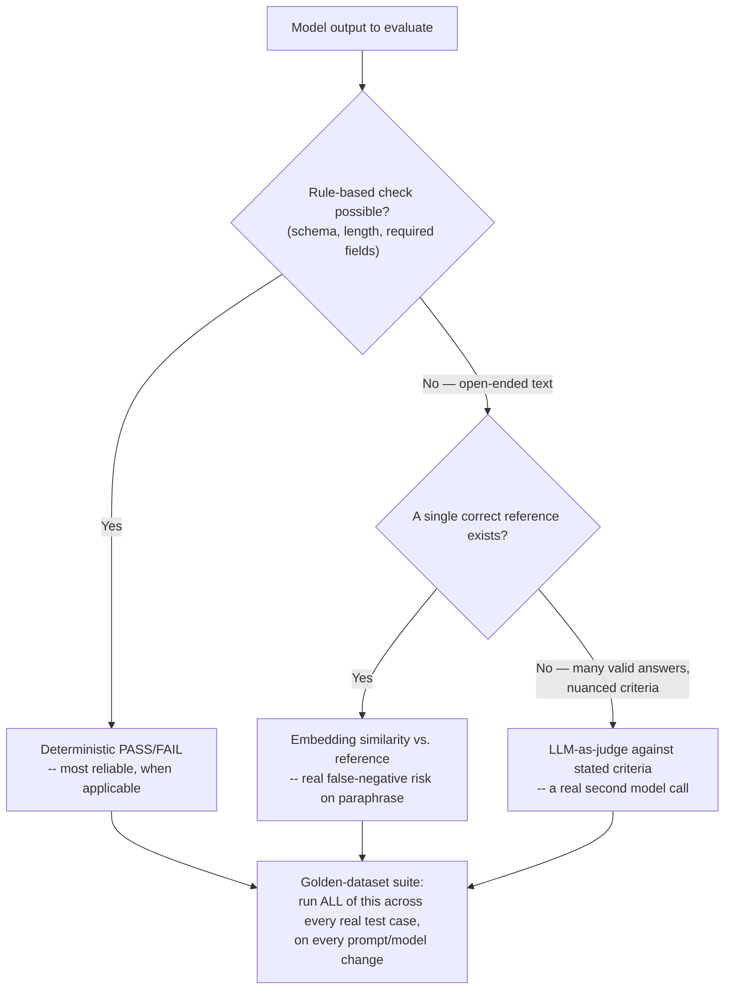

# LLM Evaluation and Testing

> **Topic register.** T-2305, sixth and final currently-planned assignment in the reserved `T-2300`–`T-2399` range for `syllabus/22-ai-llm-engineering/`. [Prompt Engineering Patterns](prompt-engineering-patterns.md) (T-2303) named the real risk directly: a prompt change is a real behavior change with no test suite unless one exists. This chapter is that test suite's real design.
> **Provenance.** No live LLM call anywhere in this chapter. Every evaluation result is real, computed output from real, fixed candidate strings standing in for real model outputs — chosen specifically to expose where each real evaluation strategy succeeds and where it genuinely fails, including one honest false negative this chapter measures rather than hides. Reproducible source: [`practice/java/llm-evaluation-and-testing/`](../../practice/java/llm-evaluation-and-testing/).

## Table of Contents

1. [Why This Matters](#1-why-this-matters)
2. [Prerequisites](#2-prerequisites)
3. [Foundation (L1)](#3-foundation-l1)
4. [Core Concepts (L2)](#4-core-concepts-l2)
5. [How It Works Internally (L3)](#5-how-it-works-internally-l3)
6. [Practical Usage](#6-practical-usage)
7. [Examples](#7-examples)
8. [Common Mistakes](#8-common-mistakes)
9. [Edge Cases](#9-edge-cases)
10. [Performance Implications](#10-performance-implications)
11. [Trade-offs](#11-trade-offs)
12. [Senior-Level Considerations (L3)](#12-senior-level-considerations-l3)
13. [Staff/System-Level Considerations (L4)](#13-staffsystem-level-considerations-l4)
14. [Production Scenarios](#14-production-scenarios)
15. [Interview Questions](#15-interview-questions)
16. [Coding/Practice Exercises](#16-codingpractice-exercises)
17. [Debugging Exercises](#17-debugging-exercises)
18. [Design Exercises](#18-design-exercises)
19. [Further Reading](#19-further-reading)
20. [Mastery Checklist](#20-mastery-checklist)

## 1. Why This Matters

[Unit Testing Fundamentals](../08-testing/unit-testing-fundamentals-with-junit.md)'s `assertEquals(expected, actual)` assumes a deterministic function with one correct output. An LLM call routinely produces several *different, equally correct* outputs for the identical input — this chapter's own demo proves that directly: two genuinely correct answers to the same question, real `String.equals()` returns `false`. Every LLM-backed feature still needs the thing testing exists to provide — confidence that a change didn't break something — but it needs a genuinely different mechanism to get there. An interviewer asking "how do you know your AI feature works" is testing whether a candidate reaches for a real, appropriate mechanism, not `assertEquals`.

## 2. Prerequisites

[LLM API Integration Fundamentals](llm-api-integration-fundamentals.md) — you're evaluating the output of exactly the kind of call that chapter covers. [Embeddings](embeddings.md) — this chapter's semantic-similarity evaluation strategy is a direct, real application of that chapter's cosine-similarity mechanics, including its real, measured limitations.

## 3. Foundation (L1)

**Four real, distinct evaluation strategies, each with a real, different reliability profile:**

1. **Exact match** — compare output to a single expected string. Simple, but this chapter's own demo shows it fails a genuinely correct answer purely from wording:

```
reference:  "Paris is the capital of France."
candidate:  "The capital of France is Paris."  (also correct, different wording)
real reference.equals(candidate): false
```

2. **Rule-based / structured checks** — verify concrete, checkable properties (valid JSON, a required field present, output length within bounds) rather than the full text. Real and 100% reliable *for what it checks*, proven directly:

```
"{"answer": "Paris"}"                         validJson=true  hasAnswerField=true
"{"result": "Paris"}"                         validJson=true  hasAnswerField=false
```

3. **Semantic-similarity scoring** — embed both the reference and the candidate ([Embeddings](embeddings.md)), compare via cosine similarity, pass above a threshold. Catches *some* wording variation that exact match misses, but — this chapter proves directly, not hypothetically — can also produce a real false negative.

4. **Golden-dataset regression testing** — run a fixed, curated set of real test cases against every prompt or model change, and diff the results. This is the mechanism that catches what spot-checking a couple of examples misses.

## 4. Core Concepts (L2)

**Semantic-similarity scoring trades exact-match's false negatives for a different, real false-negative risk of its own — it doesn't eliminate the problem, it relocates it.** This chapter's demo proves this directly, reusing [Embeddings](embeddings.md)' own hashed embedding scheme:

```
[correct, literal overlap] similarity=0.9091 threshold=0.30 -> PASS
[correct, real paraphrase] similarity=0.2860 threshold=0.30 -> FAIL
[wrong, unrelated]         similarity=0.0909 threshold=0.30 -> FAIL
```

The paraphrase is a genuinely correct answer, and this real evaluation strategy fails it — the exact same real limitation T-2302 measured for retrieval now shows up as a false negative in evaluation. **A real trained embedding model reduces this risk substantially** (it captures meaning, not just word overlap — T-2302's own point), but the *structural* risk — any single automated metric can disagree with a human's correct judgment on some real fraction of cases — never fully disappears, which is exactly why a Staff-level eval strategy ([Section 13](#13-staffsystem-level-considerations-l4)) combines multiple signals rather than trusting one metric alone.

**A golden-dataset regression suite catches changes a couple of spot-checked examples cannot.** This chapter's demo runs 5 real test cases against two simulated model/prompt versions and finds both a real regression and a real improvement *in the same run*:

```
capital of Japan          true       false      REGRESSION
largest planet            false      true       IMPROVEMENT
```

A team that only manually re-checked "capital of France" and "2+2" after this change would have shipped it confidently — both of those still pass — and missed the real regression entirely.

**LLM-as-judge** is a real, documented pattern this chapter doesn't code (it would require a second live model call) but is worth naming precisely: use a second LLM call to grade the first's output against stated criteria, when the criteria are too nuanced for a rule-based check and a reference-based similarity score isn't a good fit (open-ended writing quality, tone, whether an explanation is genuinely helpful). It's real and widely used, and it inherits its own real risk — the judge model can be wrong or inconsistent too, which is why it's typically combined with, not substituted for, the other three strategies.

## 5. How It Works Internally (L3)



Each evaluation strategy answers a genuinely different question, which is why a real eval suite runs several of them together rather than picking one: rule-based checks answer "is the output well-formed," similarity scoring answers "is the output close to a known-good reference," and LLM-as-judge answers "does the output satisfy criteria too nuanced to check mechanically" — none of the three substitutes for the others.

## 6. Practical Usage

Use rule-based checks for anything with a checkable, objective property (valid JSON, required fields, length bounds) — they're the cheapest and most reliable signal available, use them whenever the task has one. Reserve semantic-similarity scoring for tasks with a real reference answer, and set the threshold empirically against real known-correct and known-incorrect examples, not a guessed number — Section 4's real 0.30 threshold is this chapter's own choice, not a universal constant. Build a real golden dataset (a real, curated set of representative test cases with known-correct properties) before making any prompt or model change, and run it on every change from then on — Section 4's real regression-plus-improvement result is exactly what that catches.

## 7. Examples

All output below is real, from this chapter's demo — [`practice/java/llm-evaluation-and-testing/`](../../practice/java/llm-evaluation-and-testing/), full transcript in `output-transcript.txt`. No live model call anywhere in it.

```
=== 1. Exact-match brittleness: two CORRECT answers, real string comparison ===
real reference.equals(candidate): false

=== 3. Semantic-similarity scoring: catches one real gap, creates another ===
  [correct, literal overlap] similarity=0.9091 threshold=0.30 -> PASS
  [correct, real paraphrase] similarity=0.2860 threshold=0.30 -> FAIL
  [wrong, unrelated] similarity=0.0909 threshold=0.30 -> FAIL

=== 4. Golden-dataset regression matrix: two simulated model versions ===
test case                 v1         v2         result
capital of Japan          true       false      REGRESSION
largest planet            false      true       IMPROVEMENT
>>> real counts: 1 regression(s), 1 improvement(s) from v1 to v2.
```

## 8. Common Mistakes

- **Using `assertEquals` against a single expected string for open-ended LLM output** — Section 3's real, direct proof this fails correct answers.
- **Trusting a single evaluation metric for every kind of task** — Section 4's real false negative on the paraphrase case; no single metric here is universally sufficient.
- **Spot-checking 2-3 examples after a prompt change instead of running a full golden-dataset suite** — Section 4's real, simultaneous regression-and-improvement result that spot-checking the wrong two cases would have missed entirely.
- **Setting a similarity threshold by guessing rather than validating it against real known-correct and known-incorrect examples.**

## 9. Edge Cases

- **A task with no single correct answer at all** (open-ended writing, brainstorming) genuinely can't use exact-match or reference-similarity scoring meaningfully — LLM-as-judge against stated criteria, or a rule-based check of structural properties only (length, required sections), are the realistic options.
- **A golden dataset that goes stale** (the product requirements changed, but the test cases weren't updated) can pass every case while testing the wrong thing entirely — a real, easy-to-miss failure mode of a regression suite that's otherwise doing its job correctly.
- **A regression that only shows up on inputs the golden dataset doesn't cover** — a golden dataset's real coverage is only as good as its real construction; this is a genuine, permanent limitation, not a bug to fix once.

## 10. Performance Implications

Rule-based and reference-similarity checks are cheap and fast — no additional model call required beyond the one being evaluated. LLM-as-judge doubles real API cost and latency for every evaluated case (a second real model call per test case), which is why it's typically reserved for cases the cheaper strategies genuinely can't handle, run on a curated golden dataset rather than on every single production request.

## 11. Trade-offs

| Approach | Benefit | Cost |
|---|---|---|
| Exact match | Simplest, zero ambiguity when it applies | Real, measured brittleness against valid wording variation |
| Rule-based / structured | Real, 100% reliable for the specific property checked | Only covers checkable, objective properties |
| Embedding similarity | Real tolerance for wording variation | Real false-negative risk on genuine paraphrases (Section 4) |
| LLM-as-judge | Handles nuanced, non-mechanical criteria | Real, doubled per-case API cost; the judge itself can be wrong |
| Golden-dataset suite | Catches regressions spot-checking misses (Section 4's real proof) | Only as good as its real, curated coverage |

## 12. Senior-Level Considerations (L3)

A Senior engineer picks the evaluation strategy per task property (checkable structure -> rule-based; reference answer exists -> similarity; open-ended -> judge), rather than reaching for one strategy everywhere, and validates any similarity threshold against real known-correct and known-incorrect examples before trusting it in a suite.

## 13. Staff/System-Level Considerations (L4)

At Staff scope, evaluation is the organizational mechanism that makes prompt and model changes safe to ship at all — without a real golden-dataset suite, [Prompt Engineering Patterns](prompt-engineering-patterns.md)'s own Staff-level warning (a prompt change is a real behavior change) has no real enforcement, and every change ships on faith. A Staff engineer typically combines multiple evaluation signals deliberately (rule-based checks for structure, similarity or judge-based scoring for content) rather than picking one, precisely because Section 4 shows no single signal is failure-proof — and owns the real, ongoing cost of keeping the golden dataset itself current as product requirements evolve, since a stale dataset (Section 9) can pass every case while silently testing the wrong thing.

## 14. Production Scenarios

No existing `production-cookbook/` entry has an LLM-evaluation-specific root cause yet.

> Planned reference: a future `production-cookbook/` entry covering a real incident where a prompt change shipped after passing a small, manually spot-checked set of examples, then caused a real regression on a class of inputs the spot check didn't cover — discovered only after real user complaints — would be a natural, non-duplicative addition connecting this chapter's Section 4/8 golden-dataset argument to a real, worked incident.

## 15. Interview Questions

**Q1 (Mid): "Why doesn't a normal `assertEquals`-style unit test work well for LLM output?"**
Expected answer: an LLM call can produce several different, equally correct outputs for the same input — exact-match testing fails correct answers purely from wording variation, a real, direct consequence of non-determinism and multiple valid phrasings.

**Q2 (Mid/Senior): "What's a real alternative to exact-match for evaluating free-text LLM output?"**
Expected answer: rule-based/structured checks for checkable properties, embedding-based semantic-similarity scoring against a reference answer, or LLM-as-judge for nuanced, non-mechanical criteria — chosen based on which is applicable to the specific task.

**Q3 (Senior): "Does semantic-similarity scoring fully solve the exact-match brittleness problem?"**
Expected answer: no — it reduces it but introduces its own real false-negative risk (a real paraphrase with low word overlap can score below threshold even though it's correct), a structural limitation, not a bug to patch away entirely.

**Q4 (Senior/Staff): "Your team wants to ship a prompt change. What do you actually check before approving it?"**
Expected answer: run a real, curated golden-dataset suite covering representative cases, not just a couple of spot-checked examples — the real risk is a change that improves some cases while regressing others, which spot-checking the wrong cases will miss entirely.

**Q5 (Staff): "How do you know your golden dataset itself is still testing the right thing?"**
Expected answer: a golden dataset needs to be actively maintained as product requirements evolve — a stale dataset can pass every case while no longer reflecting what "correct" actually means for the current product, a real, permanent maintenance obligation, not a one-time setup cost.

## 16. Coding/Practice Exercises

1. Reproduce this chapter's four real scenarios yourself: [`practice/java/llm-evaluation-and-testing/`](../../practice/java/llm-evaluation-and-testing/).
2. Add a sixth test case to the golden-dataset demo where both v1 and v2 fail, and confirm it's correctly reported as "still fail," not miscounted as a regression.
3. Tune the semantic-similarity threshold in [`EvaluationDemo`](../../practice/java/llm-evaluation-and-testing/src/demo/EvaluationDemo.java) to a value that would make the real paraphrase case pass — then check what real unrelated-pair similarity score it would also need to tolerate, using T-2302's own dimension-count findings.

## 17. Debugging Exercises

Given this real demo behavior, predict the output before checking Section 7's transcript:

```
A golden-dataset suite has 5 test cases. Model v1 passes 4, fails 1.
Model v2 passes a DIFFERENT 4 (fixes v1's failure, breaks a previously-passing case).
Total pass count for v1: 4. Total pass count for v2: ?
Does the SAME total pass count mean v2 is a safe, neutral change?
```

Real answer from this chapter's exact scenario: v2's total pass count is also 4 (one regression, one improvement, net even) — but this does **not** mean the change is safe or neutral: a real, different test case now fails. A candidate who checks only the aggregate pass count, not the per-case diff, would approve a change that silently broke something.

## 18. Design Exercises

Design the evaluation suite for a customer-support ticket classifier being upgraded from one model to another. State explicitly: which evaluation strategy (rule-based, similarity, judge) applies to which part of its output, how large and how representative your golden dataset needs to be, and what your process is for deciding the new model is safe to ship versus a genuine regression per [Section 13](#13-staffsystem-level-considerations-l4)'s combined-signal approach.

## 19. Further Reading

- [Anthropic: Developing Test Cases](https://docs.anthropic.com/en/docs/build-with-claude/develop-tests) — real, documented guidance on building evaluation suites for Claude-based applications.
- [OpenAI Evals Guide](https://platform.openai.com/docs/guides/evals) — a real, documented evaluation framework and methodology.

## 20. Mastery Checklist

- [ ] Can explain, with this chapter's real proof, why `assertEquals`-style testing fails for open-ended LLM output.
- [ ] Can name and distinguish all four real evaluation strategies (exact match, rule-based, similarity, LLM-as-judge) and when each applies.
- [ ] Can state, with this chapter's real numbers, why semantic-similarity scoring has its own real false-negative risk, not just exact-match's.
- [ ] Can correctly predict the Section 17 debugging exercise's real outcome before checking it.
- [ ] Can explain why aggregate pass-count alone can hide a real regression.
- [ ] Can state the real, ongoing maintenance obligation a golden dataset carries as product requirements evolve.
