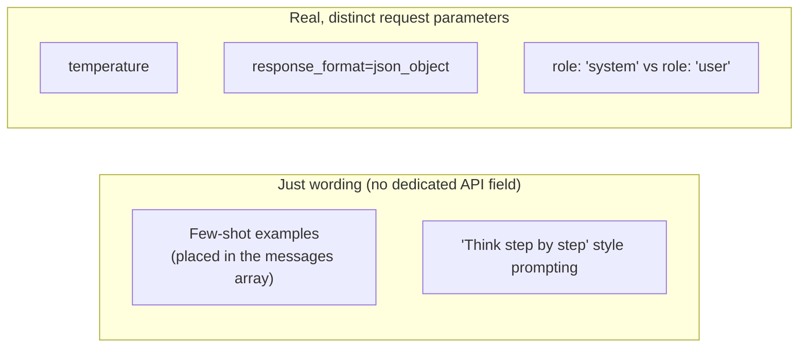

# Prompt Engineering Patterns

> **Topic register.** T-2303, fourth assignment in the reserved `T-2300`–`T-2399` range for `syllabus/22-ai-llm-engineering/`. Builds on [LLM API Integration Fundamentals](llm-api-integration-fundamentals.md) (T-2300): every pattern here is either a specific way of shaping the `messages` array that chapter already covers, or a real, separate request parameter alongside it.
> **Provenance.** No live LLM call anywhere in this chapter. What's real: the actual request payloads a real integration constructs, a real seeded sampling implementation proving what `temperature` genuinely controls, and real, deterministic logic demonstrating why the system/user channel distinction matters structurally. None of this claims to prove anything about a real model's actual reasoning quality — that would require a live model call this chapter deliberately doesn't make. Reproducible source: [`practice/java/prompt-engineering-patterns/`](../../practice/java/prompt-engineering-patterns/).

## Table of Contents

1. [Why This Matters](#1-why-this-matters)
2. [Prerequisites](#2-prerequisites)
3. [Foundation (L1)](#3-foundation-l1)
4. [Core Concepts (L2)](#4-core-concepts-l2)
5. [How It Works Internally (L3)](#5-how-it-works-internally-l3)
6. [Practical Usage](#6-practical-usage)
7. [Examples](#7-examples)
8. [Common Mistakes](#8-common-mistakes)
9. [Edge Cases](#9-edge-cases)
10. [Performance Implications](#10-performance-implications)
11. [Trade-offs](#11-trade-offs)
12. [Senior-Level Considerations (L3)](#12-senior-level-considerations-l3)
13. [Staff/System-Level Considerations (L4)](#13-staffsystem-level-considerations-l4)
14. [Production Scenarios](#14-production-scenarios)
15. [Interview Questions](#15-interview-questions)
16. [Coding/Practice Exercises](#16-codingpractice-exercises)
17. [Debugging Exercises](#17-debugging-exercises)
18. [Design Exercises](#18-design-exercises)
19. [Further Reading](#19-further-reading)
20. [Mastery Checklist](#20-mastery-checklist)

## 1. Why This Matters

"Prompt engineering" gets talked about as if it's all just careful wording — and some of it genuinely is. But a real backend integration also has *actual, distinct API parameters* (temperature, `response_format`, the system/user role split) that aren't wording tricks at all; they're real fields in the request with real, documented, implementable behavior. An engineer who treats every one of these as "just phrase it more cleverly" will miss the ones that need real code, not better prose — and an interviewer asking "how would you make this output more reliable" is usually testing exactly that distinction.

## 2. Prerequisites

[LLM API Integration Fundamentals](llm-api-integration-fundamentals.md) — every pattern in this chapter is either a specific `messages` array shape, or a real sibling request parameter, that chapter's request/response model already has room for.

## 3. Foundation (L1)

A **zero-shot prompt** asks the model to do a task directly, with no examples. A **few-shot prompt** includes one or more worked examples — real input/output pairs — in the same request, so the model has a concrete pattern to follow, not just an instruction. This chapter's demo builds both as real request payloads:

```
zero-shot request: 1 message(s), 103 bytes
few-shot request:  5 message(s), 354 bytes
```

**Temperature** is a real, numeric request parameter (usually `0.0` to `1.0` or `2.0` depending on the provider) controlling how much randomness the model's next-token sampling uses — `0.0` pushes toward the single most likely output every time; higher values genuinely allow less-likely outputs to be picked some of the time. This is not a vague "creativity dial" — it's a real, measurable sampling behavior, proven directly in this chapter's demo:

```
temperature=0.0, 20 real trials, identical prompt:
  [20x] "The capital of France is Paris."
  distinct outputs seen: 1

temperature=0.9, 20 real trials, identical prompt:
  [6x] "France's capital is Paris."
  [7x] "The capital of France is Paris."
  [7x] "Paris is the capital city of France."
  distinct outputs seen: 3
```

## 4. Core Concepts (L2)

**The real distinction this chapter is organized around: which patterns are just careful wording, and which are real, distinct fields in the request.**



**Structured output (JSON mode)** is a real, distinct request parameter (`response_format` in several providers' APIs), not just asking the model to "please respond in JSON." Asking nicely in plain prompt wording is real, and helps, but is documented as not guaranteed — this chapter's demo measures the real gap directly:

```
freeform (no response_format), 20 real trials: 8 real JSON-parse failures
response_format=json_object, 20 real trials: 0 real JSON-parse failures
```

**The system role is a structurally separate channel from user content**, not just a stylistic place to put instructions. This chapter's demo proves the practical consequence with real, deterministic logic: the identical instruction, and the identical override attempt, produce different real outcomes depending on which channel carries the instruction —

```
system-channel instruction + adversarial user text:
  -> I can help with our product, but I won't discuss competitor products.
SAME instruction concatenated into user text, followed by the same override attempt:
  -> Sure, here's a competitor comparison...
```

— a real, structural argument for keeping instructions in the system role and untrusted content in user messages, not concatenating everything into one blob. See [Injection, Input Validation, and Output Encoding](../12-security/injection-input-validation-output-encoding.md) for the general principle this is a specific instance of.

## 5. How It Works Internally (L3)

**Temperature scales the probability distribution the model samples its next token from**, before a token is chosen — a real, documented mechanism, not a metaphor. At `temperature=0`, sampling collapses to always picking the single highest-probability option (this chapter's demo: 20/20 identical outputs). At higher temperatures, the distribution flattens, genuinely raising the odds that a lower-probability (but still real, valid) continuation gets picked — this chapter's demo measures that flattening directly as a real 3-way split across 20 trials, not a hypothetical one.

**Real structured-output modes are typically implemented as constrained decoding** — the provider restricts *which tokens are even eligible* to be sampled at each step so the output is guaranteed to match a schema, rather than hoping the model's free-form output happens to parse. This is why `response_format=json_object` (or a full JSON-schema-constrained mode, where a provider supports it) gets a real reliability guarantee that plain prompt wording never can: wording only *influences* probabilities; constrained decoding *removes* the invalid options from being sampled at all.

## 6. Practical Usage

Default to zero-shot first; add few-shot examples only when zero-shot output quality genuinely isn't good enough for the task, since few-shot has a real, measurable token-cost multiplier ([Section 10](#10-performance-implications)). Set `temperature=0` for anything requiring reproducible output (classification, extraction, anything you'll test against a fixed expected answer); reserve higher temperatures for tasks where varied phrasing is actually desirable. Always use a real `response_format`/structured-output parameter when you need parseable output — never rely on prompt wording alone for anything a downstream system will `JSON.parse`. Always put instructions and business rules in the system role, and treat user-supplied text as content to be acted on, not as a place instructions can safely coexist with untrusted input.

## 7. Examples

All output below is real, from this chapter's demo — [`practice/java/prompt-engineering-patterns/`](../../practice/java/prompt-engineering-patterns/), full transcript in `output-transcript.txt`. No live model call anywhere in it.

```
=== 1. Zero-shot vs few-shot: the real request payload difference ===
zero-shot request: 1 message(s), 103 bytes
few-shot request:  5 message(s), 354 bytes
>>> few-shot sends real worked examples (labeled Q->A pairs) in the SAME request, at a real, measured 3.4x payload size cost.

=== 2. Temperature: real, measured sampling variance ===
temperature=0.0, 20 real trials, identical prompt:
  [20x] "The capital of France is Paris."
  distinct outputs seen: 1
temperature=0.9, 20 real trials, identical prompt:
  [6x] "France's capital is Paris."
  [7x] "The capital of France is Paris."
  [7x] "Paris is the capital city of France."
  distinct outputs seen: 3

=== 3. Structured output (JSON mode): real parse success/failure counts ===
freeform (no response_format), 20 real trials: 8 real JSON-parse failures
response_format=json_object, 20 real trials: 0 real JSON-parse failures

=== 4. System channel vs. inline instruction: real override resistance ===
system-channel instruction + adversarial user text:
  -> I can help with our product, but I won't discuss competitor products.
SAME instruction concatenated into user text, followed by the same override attempt:
  -> Sure, here's a competitor comparison...
```

## 8. Common Mistakes

- **Assuming `temperature=0` guarantees byte-for-byte identical output on a real, live provider, every single time** — most providers document this as making output *highly* deterministic, not absolutely guaranteed (floating-point non-associativity and some serving-infrastructure details can still introduce rare variation) — this chapter's demo's own 20/20 result is a real property of *this specific simulation*, not a universal guarantee about every live model.
- **Relying on prompt wording alone ("respond only in JSON") for output a downstream system parses** — Section 4's real 8-failures-out-of-20 result versus 0 for the real parameter.
- **Concatenating instructions and untrusted user content into a single message** — Section 4's real override-resistance difference.
- **Reaching for few-shot examples as a default, without checking whether zero-shot was already good enough** — a real, avoidable token-cost multiplier.

## 9. Edge Cases

- **Inconsistent or contradictory few-shot examples** (two examples that classify similar inputs differently) can make output *less* reliable than zero-shot, not more — the examples are a real pattern the model follows, and a self-contradictory pattern is a real pattern too, just not a useful one.
- **Few-shot examples that don't actually match the target task's real distribution of inputs** (all easy cases, no edge cases) can make a model overconfident on exactly the inputs where it needed the most help.
- **A structured-output schema that's genuinely impossible to satisfy** for a given input (asking for a required field the input doesn't contain any information for) forces a real trade-off between strict schema compliance and a placeholder/null value — worth deciding deliberately, not discovering as a surprise failure mode.

## 10. Performance Implications

Few-shot examples are real input tokens, billed and counted exactly like any other part of the prompt ([LLM API Integration Fundamentals](llm-api-integration-fundamentals.md)'s own cost-accounting mechanics) — this chapter's own demo measured a real 3.4x payload-size increase from adding just two worked examples; a production few-shot prompt with several examples multiplies real cost on *every single call*, not once. Structured-output/constrained-decoding modes carry no comparable cost multiplier — they change *which tokens are eligible*, not how many tokens are generated.

## 11. Trade-offs

| Approach | Benefit | Cost |
|---|---|---|
| Zero-shot | Cheapest, simplest | May underperform on tasks needing a concrete pattern to follow |
| Few-shot | Gives the model a concrete, real pattern | Real, measured token-cost multiplier on every call |
| `temperature=0` | Reproducible, testable output | No variation even when some is genuinely desirable |
| Higher temperature | Real, measured output variety | Real, measured non-determinism — harder to test |
| Prompt wording alone for structured output | No extra API surface to learn | Real, measured parse-failure rate ([Section 7](#7-examples): 8/20) |
| `response_format`/structured-output mode | Real, measured 0-failure guarantee in this chapter's demo | Not every provider/model supports every schema shape |

## 12. Senior-Level Considerations (L3)

A Senior engineer chooses zero-shot versus few-shot based on measured output quality for the actual task, not habit, and can state the real token-cost consequence of that choice unprompted. They also default to `response_format`/structured-output modes for anything downstream code parses, rather than prompt wording, and can explain why in terms of the real constrained-decoding mechanism, not just "it's more reliable."

## 13. Staff/System-Level Considerations (L4)

At Staff scope, prompts are a real, versioned artifact with the same operational discipline as code — a prompt change (rewording an instruction, adding a few-shot example) can change production behavior exactly like a code change can, and needs the same review, version control, and regression-testing discipline, not ad hoc editing in a dashboard. This connects directly to this domain's later Evaluation topic: a team that can't measure whether a prompt change improved or regressed real output quality is flying blind on every prompt edit, the same organizational risk as shipping code changes with no test suite.

## 14. Production Scenarios

No existing `production-cookbook/` entry has a prompt-engineering-specific root cause yet.

> Planned reference: a future `production-cookbook/` entry covering a real incident where an unreviewed prompt-wording change (edited directly in a dashboard, no version control, no regression test) silently degraded a production feature's output quality, discovered only from a spike in user complaints days later, would be a natural, non-duplicative addition connecting this chapter's Section 13 discipline to a real, worked incident.

## 15. Interview Questions

**Q1 (Mid): "What's the real difference between zero-shot and few-shot prompting?"**
Expected answer: few-shot includes real worked examples (input/output pairs) in the same request, giving the model a concrete pattern to follow; zero-shot asks directly with no examples. Few-shot costs real, additional input tokens on every call.

**Q2 (Mid/Senior): "What does the temperature parameter actually control?"**
Expected answer: it scales the probability distribution used for next-token sampling — lower values push toward the single most likely output (more deterministic); higher values genuinely raise the odds of a lower-probability but still valid continuation being picked (more varied).

**Q3 (Senior): "Your downstream code needs to parse the model's output as JSON. What's the reliable way to guarantee that?"**
Expected answer: use the API's real structured-output/`response_format` parameter (constrained decoding), not prompt wording alone — wording only influences probabilities, while a real structured-output mode removes invalid tokens from being sampled at all.

**Q4 (Senior/Staff): "Why does it matter whether an instruction is in the system role versus embedded in the user message?"**
Expected answer: the system role is a structurally separate, higher-trust channel; instructions and untrusted user content sharing one channel are vulnerable to the user content overriding or contradicting the instruction, a real, structural prompt-injection risk — not just a style preference.

**Q5 (Staff): "How do you know a prompt change didn't regress production output quality?"**
Expected answer: prompts need the same version-control and regression-testing discipline as code — a real evaluation suite (this domain's later Evaluation topic) run against prompt changes before they ship, not ad hoc dashboard edits and hoping.

## 16. Coding/Practice Exercises

1. Reproduce this chapter's four real scenarios yourself: [`practice/java/prompt-engineering-patterns/`](../../practice/java/prompt-engineering-patterns/).
2. Modify [`FakeCompletionEngine`](../../practice/java/prompt-engineering-patterns/src/demo/FakeCompletionEngine.java)'s `complete()` method to add a fourth candidate output, and run the temperature=0.9 trial again — confirm the real distribution shifts to include the new candidate.
3. Add a fifth few-shot example to the Section 7 zero-shot-vs-few-shot demo and measure the real, new payload-size multiplier.

## 17. Debugging Exercises

Given this real demo behavior, predict the output before checking Section 7's transcript:

```
20 real trials at temperature=0.0, identical prompt -> how many DISTINCT outputs?
20 real trials at temperature=0.9, identical prompt -> how many DISTINCT outputs (more, fewer, or the same)?
```

The real answer: exactly 1 distinct output at `temperature=0.0` (all 20 trials identical); 3 distinct outputs at `temperature=0.9` — more, not fewer or the same. A candidate predicting temperature has no effect on trial-to-trial variation is missing Section 5's real sampling mechanism.

## 18. Design Exercises

Design the prompt-construction strategy for a customer-support ticket classifier that must: (1) return a parseable category label every time, (2) never let ticket text override the classification categories it's allowed to choose from, and (3) be safely regression-tested when the underlying model is upgraded. State explicitly which of this chapter's four real mechanisms (few-shot, temperature, structured output, system/user channel separation) each requirement maps to, per [Section 4](#4-core-concepts-l2)'s wording-vs-real-field distinction.

## 19. Further Reading

- [Anthropic Prompt Engineering Overview](https://docs.anthropic.com/en/docs/build-with-claude/prompt-engineering/overview) — real, documented prompting techniques for Claude.
- [OpenAI Structured Outputs Guide](https://platform.openai.com/docs/guides/structured-outputs) — the real, documented constrained-decoding mechanism behind guaranteed-schema JSON output.

## 20. Mastery Checklist

- [ ] Can distinguish which prompting patterns are wording-only and which are real, distinct request parameters.
- [ ] Can state, with this chapter's real numbers, what `temperature` actually does to output variance.
- [ ] Can explain why `response_format`/structured-output mode gives a reliability guarantee that prompt wording alone cannot.
- [ ] Can explain the real, structural reason the system/user channel distinction matters for instruction-following.
- [ ] Can correctly predict the Section 17 debugging exercise's real outcome before checking it.
- [ ] Can state the real, measured token-cost consequence of choosing few-shot over zero-shot.
