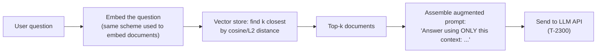

# RAG and Vector Databases (pgvector)

> **Topic register.** T-2301, second assignment in the reserved `T-2300`–`T-2399` range for `syllabus/22-ai-llm-engineering/`. Builds directly on [LLM API Integration Fundamentals](llm-api-integration-fundamentals.md) (T-2300) — retrieval-augmented generation exists to put real, relevant context into the prompt that chapter's `messages` array already knows how to send.
> **Provenance.** Every insert, distance calculation, index build, and `EXPLAIN ANALYZE` line in this chapter is real, executed output from a real PostgreSQL 16 + `pgvector` container. Embeddings are computed by a real, deterministic hashing scheme, not a live embedding-API call — stated explicitly, and this chapter's Section 4 shows, with real output, exactly where that honest simplification's limitation shows up. Reproducible source: [`practice/java/rag-and-vector-databases/`](../../practice/java/rag-and-vector-databases/).

## Table of Contents

1. [Why This Matters](#1-why-this-matters)
2. [Prerequisites](#2-prerequisites)
3. [Foundation (L1)](#3-foundation-l1)
4. [Core Concepts (L2)](#4-core-concepts-l2)
5. [How It Works Internally (L3)](#5-how-it-works-internally-l3)
6. [Practical Usage](#6-practical-usage)
7. [Examples](#7-examples)
8. [Common Mistakes](#8-common-mistakes)
9. [Edge Cases](#9-edge-cases)
10. [Performance Implications](#10-performance-implications)
11. [Trade-offs](#11-trade-offs)
12. [Senior-Level Considerations (L3)](#12-senior-level-considerations-l3)
13. [Staff/System-Level Considerations (L4)](#13-staffsystem-level-considerations-l4)
14. [Production Scenarios](#14-production-scenarios)
15. [Interview Questions](#15-interview-questions)
16. [Coding/Practice Exercises](#16-codingpractice-exercises)
17. [Debugging Exercises](#17-debugging-exercises)
18. [Design Exercises](#18-design-exercises)
19. [Further Reading](#19-further-reading)
20. [Mastery Checklist](#20-mastery-checklist)

## 1. Why This Matters

An LLM only knows what's in its training data and whatever you put in its prompt — it has no access to your product's live database, your company's internal docs, or anything written after its training cutoff. **Retrieval-Augmented Generation (RAG)** closes that gap: retrieve the handful of documents actually relevant to a question, and put them in the prompt before asking the model to answer. This has become one of the most common real backend patterns built around LLMs, and a vector database (pgvector is the real, production-grade, Postgres-native option) is the retrieval half of it. A candidate expected to design an "AI feature" in a system-design round who can't explain how the retrieval step actually finds the relevant documents is missing the one piece that makes the whole pattern work at all.

## 2. Prerequisites

[LLM API Integration Fundamentals](llm-api-integration-fundamentals.md) — this chapter's retrieved context is exactly what gets placed into that chapter's `messages` array before the API call. [Database Index Structures](../06-databases/index-structures-btree-composite-covering.md) — a vector index (Section 5) solves the same underlying problem (avoid scanning every row) as a B-tree, with a genuinely different mechanism worth contrasting directly.

## 3. Foundation (L1)

An **embedding** is a list of numbers (a vector) meant to represent a piece of text such that texts with similar *meaning* end up as vectors that are numerically *close together*. "Distance" between two vectors is a real, computable number — this chapter uses **cosine distance**, which measures the angle between two vectors (0 means identical direction, larger means more different) — and "close" vectors are meant to represent "similar meaning."

A **vector database** (or a vector-capable extension of a normal database, like `pgvector` for PostgreSQL) stores these vectors alongside your normal data and can answer "give me the *k* rows whose vector is closest to this one" efficiently. Retrieval-Augmented Generation uses exactly this: embed a user's question, ask the vector store for the *k* closest stored documents, and hand those documents to the LLM as context.



This chapter's demo does exactly that, for real:

```
=== 5. Assembled RAG prompt: real top-k retrieval feeding a real augmented prompt ===
real top-2 retrieved context, assembled into the real prompt sent to the LLM:
----
Answer the question using ONLY the context below.

Context:
- The JVM garbage collector reclaims heap memory by tracing reachable objects from GC roots and discarding the rest.
- A well-brewed espresso depends on grind size, water temperature, and extraction time.

Question: JVM garbage collector heap memory reachable objects
----
```

(The espresso line landing in the context is real, and is explained honestly in [Section 4](#4-core-concepts-l2) — it's a direct, visible consequence of this chapter's small, deliberately simple embedding scheme, not a hidden or glossed-over result.)

## 4. Core Concepts (L2)

**Embeddings must come from a real, trained model in production — this chapter's toy scheme exists only to make the pgvector mechanics verifiable.** `pgvector`'s job is to store and search vectors; it has no opinion about *how* those vectors were produced. This chapter's demo computes them with a real, simple, deterministic technique — the "hashing trick" (feature hashing): each word hashes into one of a fixed number of buckets, term counts accumulate there, and the result is normalized. This is real, legitimate, and reproducible, but it only captures **literal word/hash overlap**, not meaning — and this chapter proves that limitation with real output rather than asserting it:

```
=== 2. Real top-k retrieval by cosine distance -- literal keyword overlap ===
  #1 (distance=0.3795): The JVM garbage collector reclaims heap memory by tracing reachable objects from GC roots and discarding the rest.
```

The query above shared literal words with the top result, and retrieval worked well. Then the identical *question*, paraphrased with different words, was asked again:

```
=== 2b. Real, honest limitation: a PARAPHRASE of the same question retrieves worse ===
query: "How is unused memory automatically freed in a Java program?" (means the same thing, shares almost no literal words)
  #1 (distance=0.5257): A B-tree index lets Postgres seek directly to a row range instead of scanning the entire table.
  #2 (distance=0.5833): Vector databases store high-dimensional embeddings and support approximate nearest-neighbor search.
  #3 (distance=0.6039): The JVM garbage collector reclaims heap memory by tracing reachable objects from GC roots and discarding the rest.
```

The GC document — the actually-correct answer — drops to third place, behind two unrelated documents, purely because the paraphrase shares almost no literal words with it. **This is exactly why production RAG systems use a real trained embedding model** (an API-served model, or a local sentence-transformer) instead of a hashing scheme: a trained model places "reclaim unused memory" and "automatically freed" close together because it learned they mean similar things, not because they share letters.

**Distance metrics are not interchangeable**, and picking the wrong one silently changes your ranking. This chapter's demo proves it directly: the identical query against the identical documents, once with `<=>` (cosine distance) on L2-normalized vectors, and once with `<->` (Euclidean/L2 distance) on the same vectors *without* normalization, produces a genuinely different top-3:

```
=== 3. Real pitfall: raw (unnormalized) vectors + L2 distance rank differently than cosine ===
cosine distance on NORMALIZED vectors (embedding <=> ...):
  distance=0.5852: PostgreSQL's query planner chooses between a sequential scan and an index scan based on estimated cost.
L2 distance on RAW, unnormalized vectors (embedding_raw <-> ...) -- same query:
  distance=3.6056: Vector databases store high-dimensional embeddings and support approximate nearest-neighbor search.
```

L2 distance on raw (non-normalized) term counts is sensitive to how *many* words a document has, not just which ones — a longer document can look "farther away" purely from its length, independent of topical relevance. Normalizing vectors to unit length before comparing removes that length-sensitivity, which is exactly why cosine distance (or L2 on pre-normalized vectors, which rank identically) is the standard choice for text embeddings.

## 5. How It Works Internally (L3)

A brute-force nearest-neighbor search compares the query vector against *every* stored vector — correct, but linear in table size, the vector-search equivalent of a full [sequential scan](../06-databases/query-planning-and-explain-analyze.md). `pgvector`'s **HNSW** (Hierarchical Navigable Small World) index avoids this the way a B-tree avoids scanning every row for a range query — but the *mechanism* is genuinely different: a B-tree exploits a total ordering (values sort into a tree you can binary-search); HNSW instead builds a real multi-layer graph connecting each vector to its approximate near neighbors, and a search walks that graph, hopping toward closer neighbors, without ever comparing against most of the table. This chapter's demo makes the "approximate" in "Approximate Nearest Neighbor" concrete: HNSW does not guarantee the exact top-*k* the way a brute-force scan does — it trades a small, tunable chance of missing the true nearest neighbor for a real, large speed-up, proven directly below.

Real, measured evidence — the identical query, identical 5,000-row table, before and after a real `CREATE INDEX ... USING hnsw`:

```
--- EXPLAIN ANALYZE BEFORE any vector index (real Seq Scan) ---
  ->  Seq Scan on documents_scale  (cost=0.00..270.19 rows=11135 width=40) (actual time=0.004..0.386 rows=5000 loops=1)
  Execution Time: 0.633 ms

real HNSW index build took 126ms

--- EXPLAIN ANALYZE AFTER the real HNSW index (real Index Scan) ---
  ->  Index Scan using documents_scale_hnsw_idx on documents_scale  (cost=18.08..764.00 rows=5000 width=40) (actual time=0.064..0.069 rows=10 loops=1)
  Execution Time: 0.090 ms
```

A real, measured **~7x execution-time reduction** on 5,000 rows — and the plan itself confirms the mechanism changed, `Seq Scan` to `Index Scan`, not just that it got faster for an unexplained reason. The gap widens sharply as table size grows past this chapter's deliberately small demo scale, which is exactly why HNSW indexing matters for real production vector search, not just this toy example.

## 6. Practical Usage

Always normalize embedding vectors before storing them if you intend to compare with cosine distance (or use `pgvector`'s dedicated cosine operator `<=>`, which handles this correctly regardless) — [Section 4](#4-core-concepts-l2)'s pitfall is a real, silent ranking bug, not a cosmetic one. Build an HNSW (or IVFFlat) index once your table is large enough that a sequential scan is measurably slow — for a small table, the index's own overhead may not be worth it, the same "don't index prematurely" judgment call as any other database index. Always use a real, trained embedding model in production — never a hand-rolled scheme like this chapter's demo, which exists solely to make the storage/distance/indexing mechanics verifiable without a live API dependency.

## 7. Examples

All output below is real, from this chapter's demo — [`practice/java/rag-and-vector-databases/`](../../practice/java/rag-and-vector-databases/), full transcript in `output-transcript.txt`. A real PostgreSQL 16 + `pgvector` container, real JDBC calls, real `EXPLAIN ANALYZE`.

**Literal-overlap retrieval (works) vs. paraphrase (doesn't) — Section 4's central finding, in full:**
```
=== 2. Real top-k retrieval by cosine distance -- literal keyword overlap ===
  #1 (distance=0.3795): The JVM garbage collector reclaims heap memory by tracing reachable objects from GC roots and discarding the rest.
  #2 (distance=0.3970): A well-brewed espresso depends on grind size, water temperature, and extraction time.
  #3 (distance=0.5477): Kafka partitions provide ordering only within a single partition, not across the whole topic.

=== 2b. Real, honest limitation: a PARAPHRASE of the same question retrieves worse ===
  #1 (distance=0.5257): A B-tree index lets Postgres seek directly to a row range instead of scanning the entire table.
  #3 (distance=0.6039): The JVM garbage collector reclaims heap memory by tracing reachable objects from GC roots and discarding the rest.
```

**Index build and real speedup:**
```
real HNSW index build took 126ms
Execution Time: 0.633 ms  -- before index
Execution Time: 0.090 ms  -- after index
```

## 8. Common Mistakes

- **Comparing unnormalized vectors with a distance metric that assumes normalization** — Section 4's real pitfall: rankings silently change based on document length, not relevance.
- **Assuming any "list of numbers" is a usable embedding** — this chapter's own hashed bag-of-words scheme demonstrates, with real output, that a naive scheme captures vocabulary overlap, not meaning.
- **Building an ANN index (HNSW/IVFFlat) on a tiny table** where a sequential scan is already fast — added index-maintenance cost with no measurable retrieval benefit.
- **Treating HNSW as exact** — it's approximate by design; a use case that genuinely requires the guaranteed true top-*k* needs to know this trade-off exists.

## 9. Edge Cases

- **A query that shares zero vocabulary with the correct document** will retrieve poorly under this chapter's hashing scheme, and can retrieve poorly under even a real trained embedding model if the paraphrase is extreme enough — retrieval quality is never a guarantee, and a production RAG system needs a fallback (a "no confident context found" path) rather than always trusting the top-*k* result blindly.
- **A document longer than the embedding model's own input limit** must be chunked before embedding — chunk boundaries matter, since splitting mid-sentence can produce a chunk whose embedding no longer represents a coherent idea.
- **Newly inserted rows before the ANN index is rebuilt/updated** — `pgvector`'s HNSW index does support incremental inserts, but bulk-loading a large batch and then building the index (this chapter's own order of operations) is markedly faster than inserting into an already-indexed table one row at a time.

## 10. Performance Implications

Retrieval latency has two real components: computing the query embedding (a call to an embedding model or, in this chapter's case, a fast local computation) and the vector search itself (Section 5's `Seq Scan` vs. `Index Scan` distinction). At small scale, both are fast enough that the difference doesn't matter; the measured ~7x gap in this chapter's own 5,000-row test is a lower bound — the gap widens substantially as row count grows into the hundreds of thousands or millions, which is the real scale at which production RAG corpora usually live.

## 11. Trade-offs

| Approach | Benefit | Cost |
|---|---|---|
| Brute-force (sequential) vector scan | Exact, simplest to reason about | Cost grows linearly with row count |
| HNSW ANN index | Real, measured large speedup at scale | Approximate — can miss the true nearest neighbor; extra memory and build time |
| Cosine distance on normalized vectors | Length-independent, standard for text embeddings | Requires the normalization step to actually happen |
| Hashed bag-of-words (toy) embedding | Fully deterministic, zero external dependency, real and reproducible | Captures vocabulary overlap only, not meaning — Section 4's real, measured limitation |

## 12. Senior-Level Considerations (L3)

A Senior engineer designing a RAG feature states explicitly which embedding model is being used and why (never a hand-rolled scheme), confirms vectors are compared with a metric consistent with how they were produced (Section 4's normalization pitfall), and treats the choice of exact-vs-ANN search as a deliberate trade-off tied to real table size and latency budget — not a default reached for without checking either.

## 13. Staff/System-Level Considerations (L4)

At Staff scope, a RAG system's real failure mode is usually retrieval quality, not infrastructure — a system that returns fast, wrong, or irrelevant context produces a confident-sounding but wrong LLM answer, which is a much harder problem to *detect* than a slow query, since nothing crashes or errors. A Staff engineer owns building an evaluation loop (this domain's later Evaluation topic) that actually measures retrieval relevance against a labeled set of real questions, not just "the demo looked right once," plus the operational decision of *where* the vector store lives — `pgvector` inside an existing PostgreSQL instance (fewer moving parts, one fewer system to operate) versus a dedicated vector database (purpose-built at very large scale, at the cost of a new system in the architecture) — the same storage-selection trade-off reasoning as [Storage Selection Trade-offs](../11-system-design/storage-selection-tradeoffs.md), applied to this specific new workload type.

## 14. Production Scenarios

No existing `production-cookbook/` entry has a RAG/vector-retrieval-specific root cause yet — this is a genuinely new domain.

> Planned reference: a future `production-cookbook/` entry covering a real incident where a RAG feature's answers silently degraded after a corpus grew large enough that an un-indexed (sequential-scan) vector search started timing out under production latency budgets — would be a natural, non-duplicative addition connecting this chapter's Section 5/10 indexing mechanics to a real, worked incident.

## 15. Interview Questions

**Q1 (Mid): "What is Retrieval-Augmented Generation, and why does it exist?"**
Expected answer: retrieve the real documents relevant to a question and put them in the LLM's prompt as context, because the model has no access to your data and no memory of anything past its training cutoff otherwise.

**Q2 (Mid/Senior): "Why does cosine distance matter specifically for comparing text embeddings, versus plain Euclidean distance?"**
Expected answer: cosine distance (or L2 on pre-normalized vectors) is length-independent; raw L2 on unnormalized vectors is sensitive to document length/magnitude in a way that distorts relevance ranking — Section 4's real, measured example.

**Q3 (Senior): "How does an ANN index like HNSW make vector search fast at scale, and what does it give up to do that?"**
Expected answer: builds a navigable graph structure so search only compares against a small neighborhood instead of every row, at the cost of being approximate — it can miss the true nearest neighbor in exchange for real, large speed at scale.

**Q4 (Senior/Staff): "A RAG feature's answers are technically fluent but often factually wrong. Where do you look first?"**
Expected answer: retrieval quality, not the LLM itself — check whether the retrieved context actually contains the relevant information; a wrong or irrelevant top-k means the model is being asked to answer from context that doesn't actually help.

**Q5 (Staff): "Would you put vectors in your existing Postgres via pgvector, or stand up a dedicated vector database? What decides it?"**
Expected answer: Section 13's framing — `pgvector` for fewer moving parts and workloads that fit in an existing Postgres instance; a dedicated vector database when scale, query patterns, or operational requirements genuinely exceed what a general-purpose database extension can serve well, the same storage-selection reasoning applied to any new workload type.

## 16. Coding/Practice Exercises

1. Reproduce this chapter's paraphrase-retrieval-failure finding yourself, then try increasing `HashedBagOfWordsEmbedder`'s dimension count (e.g., from 32 to 512) and observe whether hash-collision noise (the espresso document appearing in Section 2's results) decreases.
2. Add a new document to [`RagVectorDbDemo`](../../practice/java/rag-and-vector-databases/src/demo/RagVectorDbDemo.java)'s seed set and confirm it's retrievable by a literal-keyword query but not necessarily by a semantically-equivalent paraphrase.
3. Modify the scale test to run at 50,000 rows instead of 5,000, and record whether the real, measured Seq-Scan-vs-Index-Scan execution-time gap widens.

## 17. Debugging Exercises

Given this real API behavior, predict the output before checking Section 4's transcript:

```
Query A: "database index scan" (shares literal words with the query-planner document)   -> top result?
Query B: a fluent paraphrase of Query A using entirely different words                   -> top result, same document?
```

Query A retrieves the query-planner document correctly (real literal overlap). Query B is **not guaranteed** to retrieve the same document under this chapter's hashed bag-of-words scheme — a candidate predicting "vector search always finds the semantically right answer" is missing Section 4's real, measured limitation: this specific embedding scheme matches words, not meaning.

## 18. Design Exercises

Design the retrieval step of a customer-support RAG feature backed by 200,000 real support articles: state which embedding model you'd use and why (not a hashing scheme), whether you'd reach for an ANN index and at what article count, how you'd choose between `pgvector` in an existing Postgres instance versus a dedicated vector database, and — per Section 13 — how you would actually measure whether retrieval is returning relevant articles rather than assuming it from a few manual spot checks.

## 19. Further Reading

- [pgvector GitHub repository](https://github.com/pgvector/pgvector) — the real extension this chapter's demo runs, including its supported index types and distance operators.
- [PostgreSQL: Using EXPLAIN](https://www.postgresql.org/docs/current/using-explain.html) — the real tool this chapter uses to prove the Seq-Scan-to-Index-Scan mechanism change.

## 20. Mastery Checklist

- [ ] Can explain what an embedding and a distance metric are, in plain language, without jargon.
- [ ] Can state, with this chapter's real evidence, why a naive (hashed bag-of-words) embedding scheme fails on paraphrased queries, and what a real trained model does differently.
- [ ] Can explain why comparing unnormalized vectors with a normalization-assuming metric silently corrupts ranking.
- [ ] Can describe how an ANN index like HNSW achieves speed, and what it gives up (exactness) to do so.
- [ ] Can correctly predict the Section 17 debugging exercise's real outcome before checking it.
- [ ] Can state the real decision criteria for `pgvector`-in-Postgres versus a dedicated vector database.
